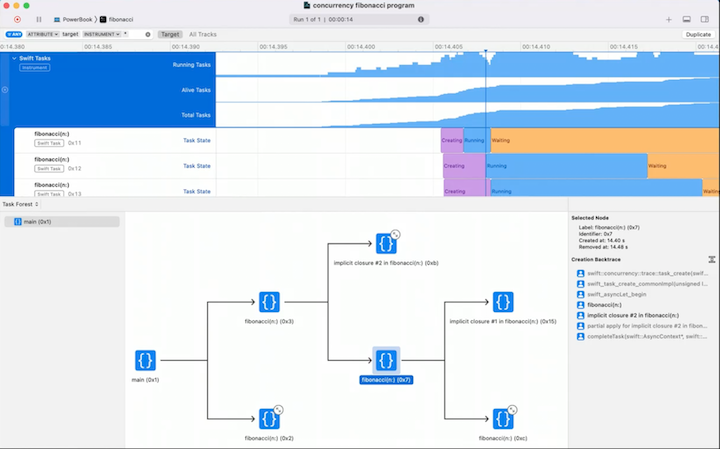
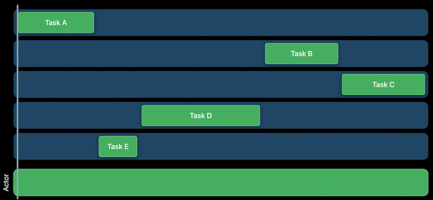

# **Visualize and optimize Swift concurrency**

### **Swift Concurrency Recap**

* Async/await
	* Allow you to create and call functions that can suspend their work in the middle of execution, then resume that work later, without blocking an execution thread.
* Tasks
	* Execute concurrent code and manage its state and associated data.
	* Contain local variables, handle cancellation, and begin and suspend execution of async code
* Structured concurrency
	* Makes it easy to spawn child tasks to run in parallel and wait for them to complete
	* The language provides syntax which keeps the work grouped together and ensures that tasks are awaited or automatically canceled if not used
* Actors
	* Coordinate multiple tasks that need to access shared data
	* Isolate data from the outside, and allow only one task at a time to manipulate their internal state, avoiding data races from concurrent mutation

Xcode 14 Instruments introduces a new set of instruments that can capture and visualize concurrency activity in an app.

---

### **Concurrency Optimization**

Common problems:

* Main actor blocking
* Actor contention
* Thread pool exhaustion
* Continuation misuse

**Main actor blocking**

* Occurs when a long-running task runs on the main Actor - a special Actor which executes all of its work on the main thread
	* UI work must be done on the main thread, and the main Actor allows you to integrate UI code into Swift Concurrency
* Because the main thread is so important for UI, it needs to be available and can't be occupied by a long-running unit of work. When this happens, your app appears to lock up and becomes unresponsive
* Code running on the main Actor must finish quickly, and either complete its work or move computation off of the main Actor and into the background
	* Work can be moved into the background by putting it in a normal Actor or in a detached task.
	* Small units of work can be executed on the main Actor to update UI or perform other tasks that must be done on the main thread
* Use the Swift Concurrency Template to investigate main actor blocking
	* When attempting to reduce your application  memory footprint, take a look at the sum of the Alive and Total task statistics
	* The Task Forest (on the bottom half of the window) provides a graphical representation of the parent-child relationships between Tasks in structured concurrency code
	* The Task Summary view shows how much time each Task spends in different states
		* You can right click on a task to pin it - allowing you to quickly find and learn about Tasks of interest that may be running for a very long time or stuck waiting to get access to an Actor
		* Pinning gives you four key features:
			* The track that shows you what state your Swift Task is in
			* The Task creation backtrace in the extended detail view
			* The narrative view that provides more context about the state a Swift Task is in
			* You have access to the same pinned action in the narrative view as you did in the summary view, so you can pin a child Task, a thread, or a Swift Actor to the timeline



The following code has a few problems:

* The `compressFile` method (and, subsequently, the `compressAllFiles` method) does a lot of heavy lifting - so running it on the main thread will cause hangs as its workload grows
* The class itself is a `MainActor`, so it is required to run everything on the main thread. But, because of the `@Published var files` property, we need this class to run on the main thread
* We cannot change `class` to `actor`, if we try, we get a compiler error. This is essentially because we should be saying that the shared mutable state needs to be protected by two different actors
	* The `files` property needs to be isolated to the MainActor because it is observed by SwiftUI
	* The `logs` property still needs to be protected from concurrent access, but which thread accesses it doesn't matter

```
@MainActor
class CompressionState: ObservableObject {
    @Published var files: [FileStatus] = []
    var logs: [String] = []
    
    func update(url: URL, progress: Double) {
        if let loc = files.firstIndex(where: {$0.url == url}) {
            files[loc].progress = progress
        }
    }
    
    func update(url: URL, uncompressedSize: Int) {
        if let loc = files.firstIndex(where: {$0.url == url}) {
            files[loc].uncompressedSize = uncompressedSize
        }
    }
    
    func update(url: URL, compressedSize: Int) {
        if let loc = files.firstIndex(where: {$0.url == url}) {
            files[loc].compressedSize = compressedSize
        }
    }
    
    func compressAllFiles() {
        for file in files {
            Task {
                let compressedData = compressFile(url: file.url)
                await save(compressedData, to: file.url)
            }
        }
    }
    
    func compressFile(url: URL) -> Data {
        log(update: "Starting for \(url)")
        let compressedData = CompressionUtils.compressDataInFile(at: url) { uncompressedSize in
            update(url: url, uncompressedSize: uncompressedSize)
        } progressNotification: { progress in
            update(url: url, progress: progress)
            log(update: "Progress for \(url): \(progress)")
        } finalNotificaton: { compressedSize in
            update(url: url, compressedSize: compressedSize)
        }
        log(update: "Ending for \(url)")
        return compressedData
    }
    
    func log(update: String) {
        logs.append(update)
    }
```

We can thus resolve this code by creating a second actor

```
actor ParallelCompressor {
    var logs: [String] = []
    unowned let status: CompressionState
    
    init(status: CompressionState) {
        self.status = status
    }
    
    func compressFile(url: URL) -> Data {
        log(update: "Starting for \(url)")
        let compressedData = CompressionUtils.compressDataInFile(at: url) { uncompressedSize in
            Task { @MainActor in
                status.update(url: url, uncompressedSize: uncompressedSize)
            }
        } progressNotification: { progress in
            Task { @MainActor in
                status.update(url: url, progress: progress)
                await log(update: "Progress for \(url): \(progress)")
            }
        } finalNotificaton: { compressedSize in
            Task { @MainActor in
                status.update(url: url, compressedSize: compressedSize)
            }
        }
        log(update: "Ending for \(url)")
        return compressedData
    }
    
    func log(update: String) {
        logs.append(update)
    }
}

@MainActor
class CompressionState: ObservableObject {
    @Published var files: [FileStatus] = []
    var compressor: ParallelCompressor!
    
    init() {
        self.compressor = ParallelCompressor(status: self)
    }
    
    func update(url: URL, progress: Double) {
        if let loc = files.firstIndex(where: {$0.url == url}) {
            files[loc].progress = progress
        }
    }
    
    func update(url: URL, uncompressedSize: Int) {
        if let loc = files.firstIndex(where: {$0.url == url}) {
            files[loc].uncompressedSize = uncompressedSize
        }
    }
    
    func update(url: URL, compressedSize: Int) {
        if let loc = files.firstIndex(where: {$0.url == url}) {
            files[loc].compressedSize = compressedSize
        }
    }
    
    func compressAllFiles() {
        for file in files {
            Task {
                let compressedData = await compressor.compressFile(url: file.url)
                await save(compressedData, to: file.url)
            }
        }
    }
}
```

**Actor contention**

We have resolved the hang so far, but we are not seeing the speed improvements we would expect

* Actors serialize access to shared state
	* Only one task at a time is allowed to occupy the Actor, and other tasks that need to use it will wait
* Swift concurrency allows for parallel computation using unstructured tasks, task groups, and async let
	* Ideally, these constructs can use many CPU cores simultaneously
	* When using Actors for these tasks, though, the Actor serializes execution of the tasks, and we lose the benefits of parallel computation
* We need to make sure that we only run on the Actor when we really need exclusive access to the Actor's data, everything else should run outside of the actor
	* Divide the task into chunks, allowing the non-Actor isolated chunks to be executed in parallel



When we use instruments, we can see that our tasks spends a lot of time in the Enqueued state

* We can see that the task waits to get into the ParallelCompressor Actor
* Pinning the Actor to the timeline shows that its getting blocked by long running tasks
* The Task narrative shows us that the Task runs in closure number one in `compressAllFiles`
	* We need to pull this function out of the actor and into a detached task
		* This allows the function to be executed freely, on any thread, until it needs to access Actor--protected state
		* By not being constrained, all the tasks running these functions can run in parallel - constrained only by the number of CPU cores


To perform the changes we need:

* We start by marking `compressFile` as `non isolated`
	* Tells the compiler that we don't need access to the shared state of the Actor, which isn't quite true (we call the `log` function, which does need isolation), so we get compiler errors
* We make the function `async`, and mark calls to `log` with the `await` keyword
* Finally, in the `CompressionState` class, we need to change `Task {` to `Task.detached`
	* Ensures the task does not inherit the actor context that it was created in
	* Also need to explicitly capture `self` in the Task's context

```
actor ParallelCompressor {
    var logs: [String] = []
    unowned let status: CompressionState
    
    init(status: CompressionState) {
        self.status = status
    }
    
    nonisolated func compressFile(url: URL) async -> Data {
        await log(update: "Starting for \(url)")
        let compressedData = CompressionUtils.compressDataInFile(at: url) { uncompressedSize in
            Task { @MainActor in
                status.update(url: url, uncompressedSize: uncompressedSize)
            }
        } progressNotification: { progress in
            Task { @MainActor in
                status.update(url: url, progress: progress)
                await log(update: "Progress for \(url): \(progress)")
            }
        } finalNotificaton: { compressedSize in
            Task { @MainActor in
                status.update(url: url, compressedSize: compressedSize)
            }
        }
        await log(update: "Ending for \(url)")
        return compressedData
    }
    
    func log(update: String) {
        logs.append(update)
    }
}

@MainActor
class CompressionState: ObservableObject {
    @Published var files: [FileStatus] = []
    var compressor: ParallelCompressor!
    
    init() {
        self.compressor = ParallelCompressor(status: self)
    }
    
    func update(url: URL, progress: Double) {
        if let loc = files.firstIndex(where: {$0.url == url}) {
            files[loc].progress = progress
        }
    }
    
    func update(url: URL, uncompressedSize: Int) {
        if let loc = files.firstIndex(where: {$0.url == url}) {
            files[loc].uncompressedSize = uncompressedSize
        }
    }
    
    func update(url: URL, compressedSize: Int) {
        if let loc = files.firstIndex(where: {$0.url == url}) {
            files[loc].compressedSize = compressedSize
        }
    }
    
    func compressAllFiles() {
        for file in files {
            Task.detached {
                let compressedData = await self.compressor.compressFile(url: file.url)
                await save(compressedData, to: file.url)
            }
        }
    }
}
```

---

### **Thread Pool Exhaustion**

Can hurt performance or deadlock an application

* Swift concurrency requires tasks to make forward progress when they're running. When a task waits for something, it normally does so by suspending. 
* However, it's possible for code within a task to perform a blocking call, such as blocking file or network IO, or acquiring locks, without suspending
	* When this happens, the task continues to occupy the thread where it's executing, but isn't actually using a CPU core
	* Because threads are limited and some are blocked, the concurrency runtime cannot fully utilize all CPU cores, reducing amount of parallel computation that can be done
	* In extreme situations, when the entire thread pool is occupied by blocked tasks, and they are waiting on something that requires a new task to run on the thread pool, the runtime can deadlock.
* Avoid blocking calls in task
* Avoid eating on condition variable and semaphores
* Use Async APIs for blocking operations
	* Especially file/network IO
* Make blocking calls outside of Swift Concurrency

---

### **Continuation Misuse**

Continuations are the bridge between Swift concurrency and other forms of async code

* A continuation suspends the current task and provides a callback which resumes the task when called
	* Can then be used with callback-based APIs
* Continuation callbacks have a strict requirement - they must be called exactly once
	* If the callback is called twice, the app will misbehave or crash
	* If it's never called, the task will leak
* Two types of continuation - checked and unsafe
	* Always use the `withCheckedContinuation` API for continuations unless performance is absolutely critical
	* Checked continuations automatically detect misuse and flag an error
	* When a checked continuation is called twice, the continuation traps
	* When the continuation is never called at all, a message is printed to the console when the continuation is destroyed warning you that the continuation leaked

```
// Proper continuation use
await withCheckedContinuation { continuation in
	externalCallbackBasedAPI) { value in
		continuation.resume (returning: value)
	}
}

// Possibly never calling continuation
await withCheckedContinuation { continuation in
	externalCallbackBasedAPI) { value in
		if value.success {
			continuation.resume (returning: value)
		}
	}
}

// Calling continuation too many times
await withCheckedContinuation { continuation in
	externalCallbackBasedAPI) { value in
		continuation.resume (returning: value)
		continuation.resume (returning: value)
	}
}
```

* **Eliminate data races using swift Concurrency** #session
* **Swift Concurrency: Behind the scenes** #session from WWDC 2021


