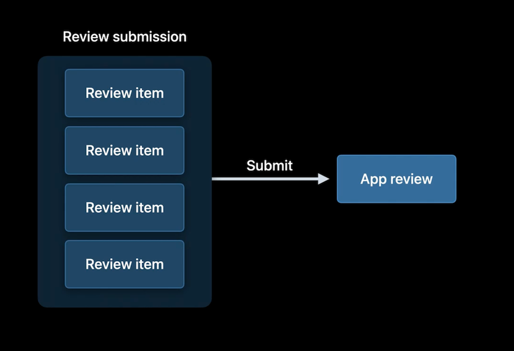
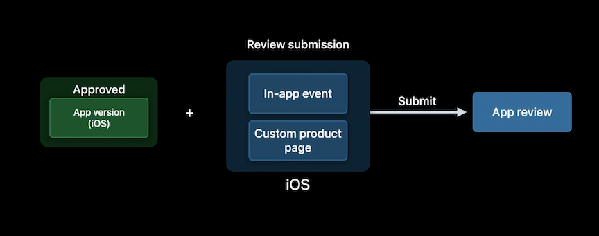
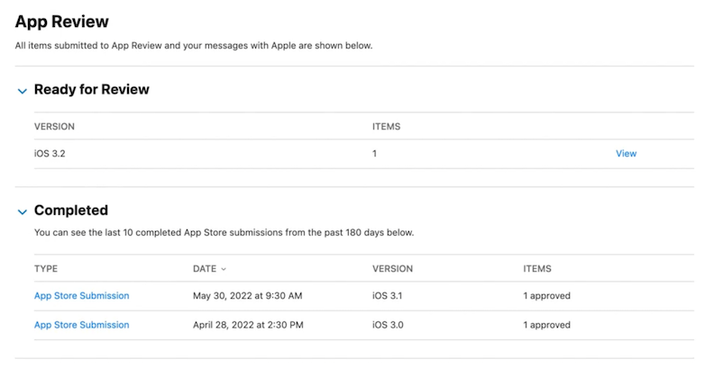

# [**What's new in App Store Connect**](https://developer.apple.com/videos/play/wwdc2022-10043)

### **Recent Updates**

* Made TestFlight build management with groups simpler
* You can now transfer apps that use Apple Wallet
* Enhanced App Store Submission experience
	* In-app events
	* Custom product pages
	* Product page optimization

**Enhanced submission experience**

* Multiple items in one submission
	* Package multiple items together
	* Unresolved issues can be edited or removed
		* Removed items will need to be part of a new submission before they can be approved
	* Review is not complete until all items are approved
	* Review submission items can be
		* App versions
		* In-app events
		* Custom product pages
		* Product page optimization tests

	
* Submit without needing a new app version
	* Must have a previously reviewed version of the app

* Dedicated app review submission page
	* On the app's page on App Store Connect, on the left side (General -> App Review)
	* Added to the App Store Connect app

### **App Store Connect API**

This summer, adding new functionality:
* In-app purchases and subscriptions
	* New subscription resource
	* Create, edit, and delete
	* Manage pricing
	* Submit for review
	* Create offers and promo codes
* Customer reviews and developer responses
* App hang diagnostics
	*  Analyze and eliminate app hangs
	*  View diagnostic signatures
	*  Downlaod detailed logs
	*  [**Identify trends with Power and Performance API**](https://developer.apple.com/videos/play/wwdc2020/10057/) session from WWDC 2020
	*  [**Track down hangs with Xcode and on-device detection**](./Track%20down%20hangs%20with%20Xcode%20and%20on-device%20detection.md) session

XML feed being decommissioned - fully adopted REST

