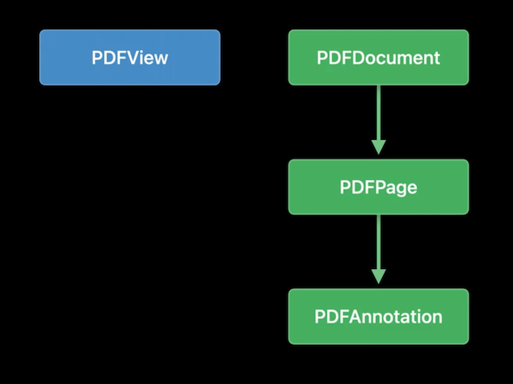

# **What's new in PDFKit**

### **PDFKit review**

* View, edit and write PDF files
* Available on iOS, macOS, and Mac Catalyst
* Can use in SwiftUI using UIViewRepresentable

PDFKit framework has four core classes



* PDFView - the widget that you include in your layout using SwiftUI or Interface Builder
	* It displays the content of a PDF document and lets people navigate, set zoom level, and copy text to the Pasteboard
* PDFDocument - represents a PDF file
	* Not common to subclass PDFDocument, but you will always use one
	* The root of the PDF object graph
* PDFPage = each document will have one or more
	* Render content and share resources like fonts and images that are unique to the page
* PDFAnnotations
	* Optional
	* Interactive by nature and often editable (unlike the content of a PDFPage, which is not intended to be edited)

---

### **Live text and forms**

PDFKit now supports Live Text

* Can now select/search text in a PDF document
* Does it on demand as you interact with each page
* Processed in place (no need to make a copy of the document)
* You can save text for the whole document

Form Handling

* Supports documents without built-in text fields
* Tab through text fields and enter text

### **Create PDFs from images**

New API - `public convenience init(image: CGImage, andOptions options: [PDFPageInitWithImageOption : Any] = [:])

* App supplies images using CGImage
* Encoded by PDFKit with high-quality JPEG encoding 
* Options
	* `public static let mediaBox: PDFPageInitWithImageOption`
		* specifies the size of the page. You can choose to fit the image exactly, or choose a paper size, like Letter
	* `public static let rotation: PDFPageInitWithImageOption`
		* specify portrait or landscape orientation
	* `public static let upscaleIfSmaller: PDFPageInitWithImageOption`
		* By default, if the image is larger than the MediaBox, the image is downscaled to fit
		* If UpscaleIfSmaller is specified, that still applies; but if the image is small, it will be upscaled to fill the page

### **Overlay views**

Use an overlay view to draw on PDFs using PencilKit

* Now possible in iOS 16/macOS Venture
* Create live, fully interactive views that appear on top of PDF pages
* Three things to know
	* Use a new protocol to install your overlay view on a PDF page - PDFPageOverlayViewProvider
	* When saving, you incorporate your content in the PDF
	* Best practices when saving a PDF document
* PDFs can contain a large number of pages
	* PDFKit requests your overlay views at the right time
	* App just needs to respond to the requests made through the protocol for a new overlay

**PDFPageOverlayViewProvider**

* must provide implementation of `overlayViewFor`
	* Provide an instance of your view, and PDFKit will size it by applying the appropriate constraints
	* PDFKit will also rotate it if the page has a non-zero rotation
* `willDisplayOverlayView` is optional
	* Use to install your own gesture handlers
	* Set up failure relationships with those of PDFKit
* `willEndDisplayingOverlayView`
	* Called when PDFKit is done with your view, likely because the page scrolled out of view
	* Can release your view here
	* Assuming your view has some data to represent what it's drawing, you can use this method to get that data and set it aside (e.g. with PencilKit)
		* Won't need to implement this if your view data lives somewhere else

```
public protocol PDFPageOverlayViewProvider : NSObjectProtocol {
	func pdfView(_ view: PDFView, overlayViewFor page: PDFPage) -› PDFKitPlatformView?

	optional func pdfView(_ pdfView: PDFView, willDisplayOverlayView overlayView: PDFKitPlatformView, for page: PDFPage)

	optional func pdfView(_ pdfView: PDFView, willEndDisplayingOverlayView overlayView: PDFKitPlatformView, for page: PDFPage)
```

Example:

* `overlayViewForPage` checks its pageToView map to see if it's already made a view for the given page
	* If not, it creates a new view
	* In either case, we get the drawing from the page and set that on the canvas view
	* Subclassing PDFPage to add a "drawing" property
* `willEndDisplayingOverlayView` gets the drawing from the view and stores it on our custom page class

```
class Coordinator: NSObject, PDFPageOverlayViewProvider {

    var pageToViewMapping = [PDFPage: UIView]()
   
    func pdfView(_ view: PDFView, overlayViewFor page: PDFPage) -> UIView? {
        var resultView: PKCanvasView? = nil
        
        if let overlayView = pageToViewMapping[page] {
            resultView = overlayView
        } else {
            let canvasView = PKCanvasView(frame: .zero)
            canvasView.drawingPolicy = .anyInput
            canvasView.tool = PKInkingTool(.pen, color: .systemYellow, width: 20)
            canvasView.backgroundColor = UIColor.clear
            pageToViewMapping[page] = canvasView
            resultView = canvasView
        }
        
        // If we have stored a drawing on the page, set it on the canvas
        let page = page as! MyPDFPage
        if let drawing = page.drawing {
            resultView?.drawing = drawing;
        }
        return resultView
    }

    func pdfView(_ pdfView: PDFView, willEndDisplayingOverlayView
        overlayView: UIView, for page: PDFPage) {
        let overlayView = overlayView as! PKCanvasView
        let page = page as! MyPDFPage
        page.drawing = overlayView.drawing
        pageToViewMapping.removeValue(forKey: page)
    }
}
```

**Saving your work**

* Use PDF Annotations as the model
	* Want too match the onscreen appearance with high fidelity
	* Want to dog round-trip editing
* PDF Annotations can have an "Appearance Stream"
	* A stream of pdf drawing commands
	* Nearly anything that you can draw using Quartz2D can be recorded in an appearance stream
	* Anything else can be rendered into an image, and that can be recorded (when using Metal)
	* Will look identical in Adobe reader, chrome, etc.
* Since they are dictionaries, we can store custom data too

```
// Implement a subclass with a drawing override
class MyPDFAnnotation: PDFAnnotation {
    
    override func draw(with box: PDFDisplayBox, in context: CGContext) {
        UIGraphicsPushContext(context)
        context.saveGState()
        
        let page = self.page as! MyPDFPage
        if let drawing = page.drawing {
            let image = drawing.image(from: drawing.bounds, scale: 1)
            image.draw(in: drawing.bounds)
        }
        
        context.restoreGState()
        UIGraphicsPopContext()
    }
}
```

To save the data, we override `UIDocument`'s `contents` method

* Can return the results as data representations (option 1 below)
* Can also burn in annotations to the document (option 2 below)

```
override func contents(forType typeName: String) throws -> Any {
    if let pdfDocument = pdfDocument {
      
        // Go through all pages in the document
        for i in 0...pdfDocument.pageCount-1 {
            if let page = pdfDocument.page(at: i) {                       
                if let drawing = (page as! MyPDFPage).drawing {
                        
                    // Create an annotation of our custom subclass
                    let newAnnotation = MyPDFAnnotation(bounds: drawing.bounds,
                                                        forType: .stamp, withProperties: nil)
                        
                    // Add our custom data
                    let codedData = try! NSKeyedArchiver.archivedData(withRootObject: drawing,
                                                                      requiringSecureCoding: true)
                    newAnnotation.setValue(codedData,
                                           forAnnotationKey: PDFAnnotationKey(rawValue: "drawingData"))
                        
                    // Add our annotation to the page
                    page.addAnnotation(newAnnotation)
                }
            }
        }

        // -- Option #1: Save the document to a data representation
        if let resultData = pdfDocument.dataRepresentation() {
            return resultData
        }
      
        // -- Option #2: Save the document to a data representation and "burn in" annotations
        let options = [PDFDocumentWriteOption.burnInAnnotationsOption: true]
        if let resultData = pdfDocument.dataRepresentation(options: options) {
            return resultData
        }
    }
                
    // Fall through to returning empty data
    return Data()
}
```

**Best practices**

* Images are saved by default at full resolution, with lossless compression
	* Use `PDFDocumentWriteOption.saveAllImagesAsJPEG` to save the images with JPEG encoding
	* Use `PDFDocumentWriteOption.optimizeImagesForScreen` to downsample images to a maximum HiDPI screen resolution
	* Can use both those options together
* `PDFDocumentWriteOption.createLinearizedPDF` creates a special kind of PDF that's optimized for the internet
	* A normal PDF is read from the end of the file - so the entire file needs to be downloaded before anything is displayed
	* A linear PDF has everything needed to display the first page at the beginning of the file, so a web browser can show that while the rest is loaded
* The options can be passed to `PDFDocument`'s `dataRepresentation` or `writeToURL` methods

```
let options = [PDFDocumentWriteOption.saveAllImagesAsJPEG: true]
pdfDocument.dataRepresentation(options: options)
```