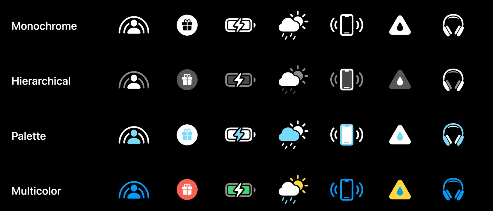
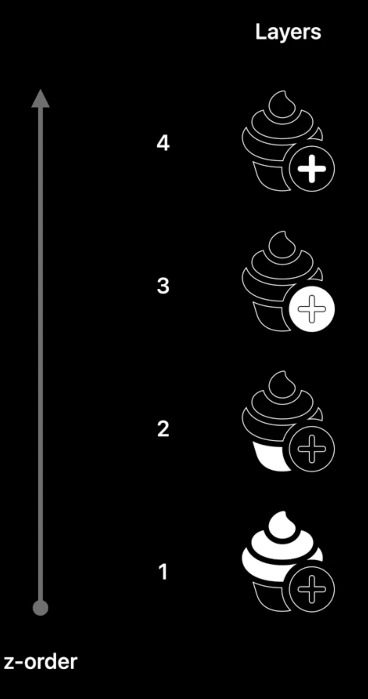
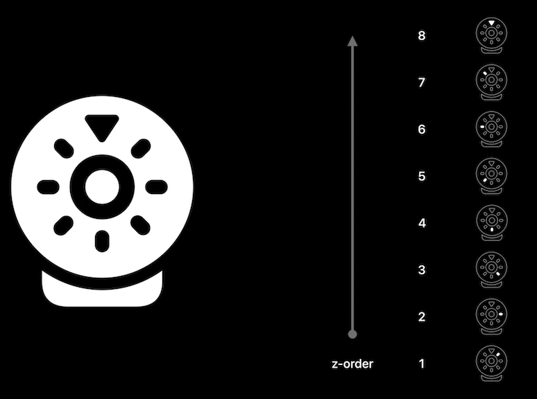

# **What's new in SF Symbols 4**

### **New Symbols**
* New additions
	* home, furniture, appliances, and health
	* fitness figures are now available
	* expanded currency symbols
	* many new objects
	* more localizations
* New categories in SF Symbols
	* Camera & Photos
	* Accessibility
	* Privacy & Security
	* Home
	* Fitness

---

### **Rendering modes**
* Four rendering modes
	* monochrome - uniform and consistent look
	* Hierarchical - provides a subtle emphasis while having a single color hue drive the overall aesthetic
	* Palette - uses two or more contrasting colors
	* Multicolor - represents intrinsic or native colors of a symbol. Used emphasize meaning of the symbol.

* Previously, if you did not explicitly specify a rendering mode, monochrome was automatically chosen
	* Now, Automatic Rendering will choose the mode best suited for the symbol
	* You can override automatic rendering by specifying a specific mode

---

### **Variable Color**
* Paths of symbol are arranged into layers, in sequential order, to allow levels of strength or sequence over time
* Differing behaviors depending on the symbol
	* Some symbols have all paths participate in the sequence
	* Others have only some paths participate
	* Symbol layers are ordered and grouped differently depending on the symbol
		* Example: the sound volume symbol - speaker is not in the sequence, but sound waves are 
* Not meant to create depth, but instead highlight a sequence of steps or stages that the symbol can represent
* Opacity based, and available in all rendering modes

---

### **Unified annotations**
* layers must be ordered in z-order
* Draw and erase:
	* draw mode will, draw option will draw the path contained in the layer (layers 1 - 3 below)
	* erase mode will, draw option will erase the path contained in the layer on other layers (layer 4 below)

* For variable color layers, define each layer in sequence, do not group them

* Adopt Variable Color in SF Symbols #session