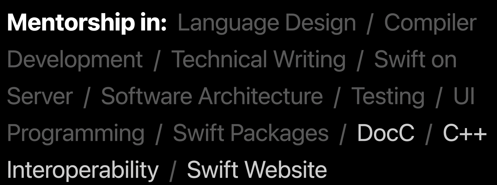
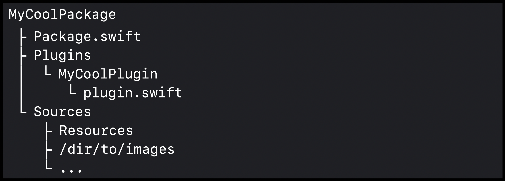
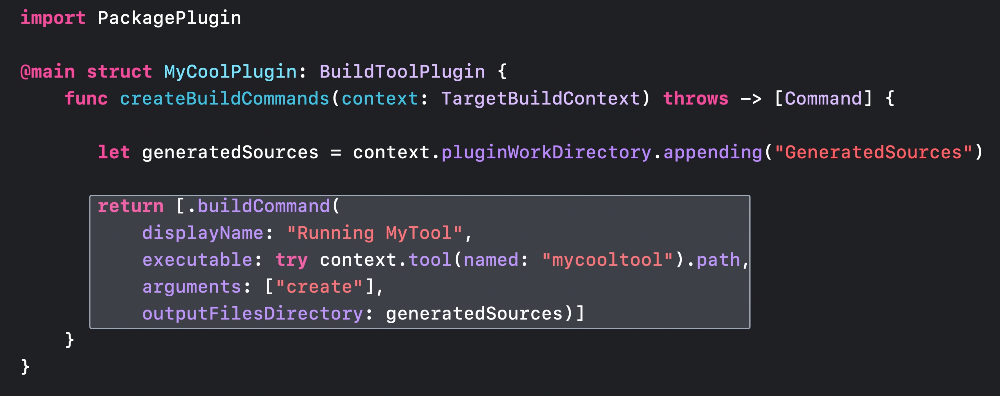
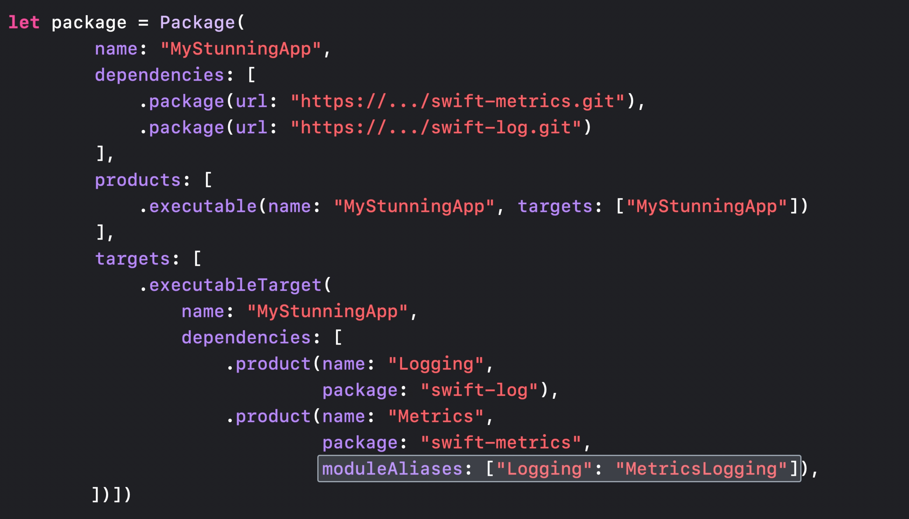
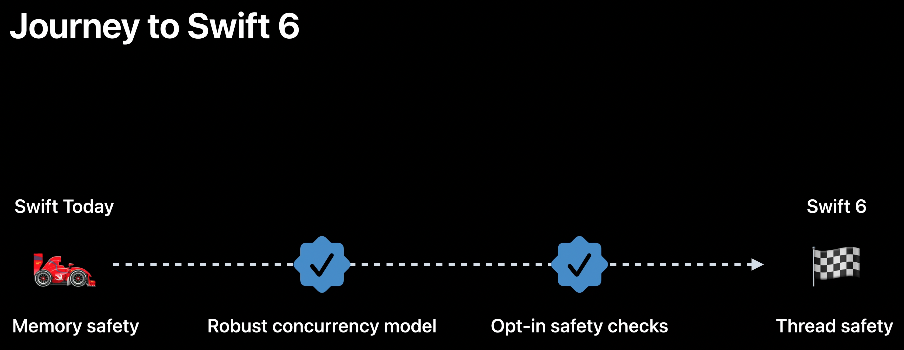
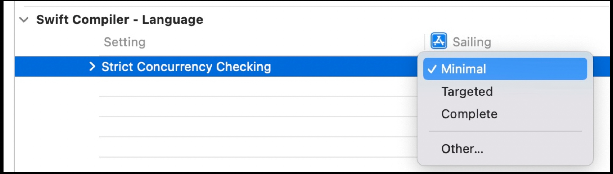
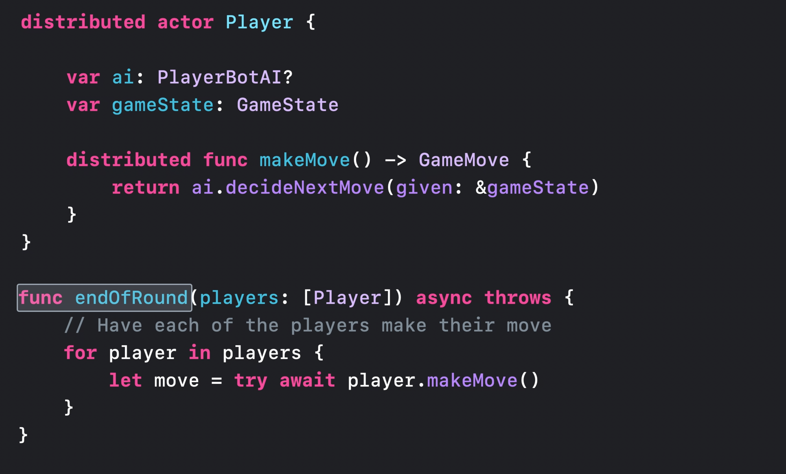
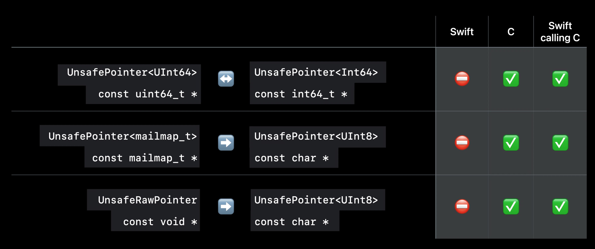
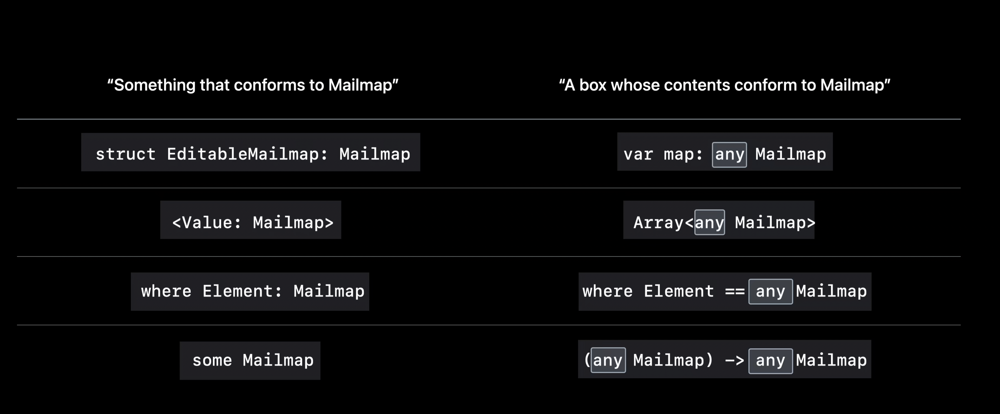
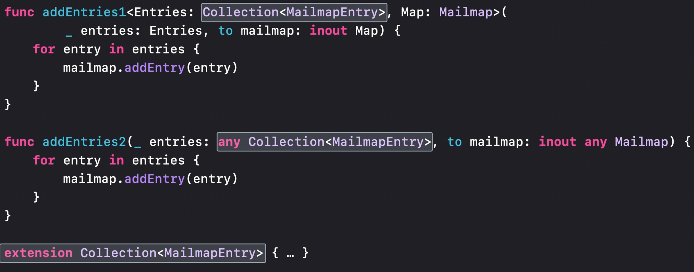

# [**What's new in Swift**](https://developer.apple.com/videos/play/wwdc2022-110354)

### **Community update**

* DocC and Swift.org open sourced
* Workgroup support for
	* Swift on Server
	* Diversity in Swift
	* Swift website
	* C++ Interoperability
* Mentorships available
* Standard library smaller, dropped dependency on third party unicode library, replaced with native library



---

### **Swift Packaging**

* SPM has added "trust on first use" (TOFU) for downloading package for increased security
* Package Plugins
	* Command plugins
		* documentation generation
		* reformat source code 
		* generate test reports
	* DocC adds Obj-C and C support
	* Build tool plugins
		* provide scalable way for packages to define plugins that can implement additional build steps
		* examples - source code generation, resource processing




---
	
### **Performance Improvements**

* Module disambiguation
	* allows you to rename modules from outside the packages that define them. 



* Swift driver settings
	* Integrated compiler
	* Eager compilation
	* Eager linking
	* [**Demystify parallelization in Xcode builds**](https://developer.apple.com/videos/play/wwdc2022-110364) session
* Build-time improvements
	* New swift driver settings
	* Faster type checking of generics
* Runtime improvements
	* Optimized protocol conformance checking
* [**Improve app size and runtime performance**](Improve app size and runtime performance.md) session

---

### **Concurrency**

* Improvements to the concurrency model
	* Back deployed to iOS 13
* Extensions to the model
	* Data race avoidance
		* [**Eliminate data races using Swift concurrency**](Eliminate data races using Swift Concurrency.md) session




* Distributed actors
	* actors for code that can be between processes or even devices
	* Distrubuted Actors package
		* Makes distributed systems in Swift easier to write
		* Integrated networking solution
		* Integrated consensus protocol
	* [**Meet distributed actors in Swift**](Meet distributed actors in Swift.md) session



* Async Algorithms package
	* Seamless integration with async/await
	* Home for time-based algorithms using `AsyncSequence`
	* Support on Apple platforms, Linux, and Windows
	* [**Meet Swift Async Algorithms**](Meet Swift Async Algorithms.md) session
* Concurrency optimizations
	* Actor prioritization
	* Priority-inversion avoidance
* Swift concurrency instruments
	* Visualize and optimize Swift security

---

### **Expressive Swift**

* Unwrapping optionals - old code vs. new code below
	* works with guard and while as well

```
if let workingDirectoryMailmapURL = workingDirectoryMailmapURL {
	mailmapLines = try String(contentsOf: workingDirectoryMailmapURL).split(separator:
}

if let workingDirectoryMailmapURL {
	mailmapLines = try String(contentsOf: workingDirectoryMailmapURL).split(separator:
}
```
	
* Closure type inference
	* Have to define your closure result type less often now - `type in -> [String]` becomes `type in`
	* Permitted pointer conversions


	
* String parsing
	* Regex literals: old code vs. new code:

```
// Old way
let line = "Becca Royal-Gordon <beccarg@apple.com>          # Comment"

func parseLine(_ line: Substring) throws -> MailmapEntry {
	func trim(_ str: Substring) -> Substring {
		String(str).trimmingCharacters(in: .whitespacesAndNewlines)[...]
	}
	
	let activeLine = trim(line[..<(line.firstIndex(of: "#") ?? line.endIndex)])
	guard let nameEnd = activeLine.firstIndex(of:"<"),
			let emailEd = activeLine[nameEnd...].firstIndex(of: ">"),
			trim(activeLine[activeLine.index(after: emailEnd)...]).isEmpty else {
		throw MailmapError.badLine
	}
	let name = nameEnd == activeLine.startIndex ? nil : trim(activeLine[..<nameEnd])
	let email = activeLine[activeLine.index(after:nameEnd)..<emailEnd]

	return MailmapEntry(name: name, email: email)
}

// New way
func parseLine( line: Substring) throws -> MailmapEntry {
	let regex = (Ah*([<#]+?)??\h*<([*>#]+)>\h*(?:#|\Z)/
	guard let match = line.prefixMatch(of: regex) else {
		throw MailmapError.badLine
	}
	
	return MailmapEntry(name: match.1, email: match.2)
}
```

* Or, even more readable - use RegexBuilder
	* You can turn a regex into a reusable regex component (similar to turning a SwiftUI hierarchy into a view)
	* Support dropping string literals right into a builder without special characters
	* Can use regex literals in the middle of a builder
	* Types like dates can integrate custom parsing logic with regex builders, and even convert the data to a richer type before capturing it
	* Swift Regex is an open source custom engine
		* Literal dialect based on UTS #18 with extensions
		* iOS 16 only

```
import RegexBuilder

let regex = Regex {
	ZeroOrMore(.horizontalWhitespace)
	Optionally {
		Capture (OneOrMore(.noneOf("<#")))
	}
	.repetitionBehavior(.reluctant)
	
	ZeroOrMore(.horizontalWhitespace)
	"<"
	Capture (OneOrMore(.noneOf(">#")))
	">"
	ZeroOrMore(.horizontalWhitespace)
	Choiceof {
		"#"
		Anchor.endofSubjectBeforeNewline
	}
}
```

**Generic code clarity**

* `any` keyword to make code more readable and define conformance

```
/// Used in the commit list UI
struct HashedMailmap {
	var replacementNames: [String:String] = [:]
}

/// Used in the mailmap editor UI
struct OrderedMailmap {
	var entries: [MailmapEntrv] = []
}
protocol Mailmap {
	mutating func addEntry(_ entry: MailmapEntry)
}

extension HashedMailmap: Mailmap { ... }
extension OrderedMailmap: Mailmap { .}


func addEntries1<Map: Mailmap>(entries: Array<MailmapEntry›, to mailmap: inout Map) {
	for entry in entries {
		mailmap.addEntry(entry)
	}
}

func addEntries2(_ entries: Array<MailmapEntry>, to mailmap: inout any Mailmap) {
	for entry in entries {
		mailmap.addEntry(entry)
	}
}
```



* Primary associated types
	* can put the element type of any collection in angle brackets using the `any` keyword


	
* Improvements to any types
	* The `any` keyword
	* Pass to generic arguments
	* Supports `Self` and associated types
	* Primary associated types
	* **but** you still shouldn't use them when generics will work
		* to make generic code easier to write, you can now use the `some` keyword: old code vs. new code

```
// Old Code
func addEntries1<Entries: Collection<MailmapEntry>, Map: Mailmap>(_ entries: Entries, to mailmap: inout Map) {
	for entry in entries {
		mailmap.addEntry(entry)
	}
}

func addEntries2(_ entries: any Collection<MailmapEntry>, to mailmap: inout any Mailmap) {
	for entry in entries {
		mailmap.addEntry(entry)
	}
}

// New Code
func addEntries1(entries: some Collection<MailmapEntry>, to mailmap: inout some Mailmap) {
	for entry in entries {
		mailmap.addEntry(entry)
	}
}

func addEntries2( entries: any Collection<MailmapEntry>, to mailmap: inout any Mailmap) {
	for entry in entries {
		mailmap.addEntry(entry)
	}
}
```
		
* [**Embrace Swift generics**](Embrace Swift generics.md) session
* [**Design protocol interfaces in Swift**](Design protocol interfaces in Swift.md) session