# **What's new in Swift**

**Community update**

* DocC and Swift.org open sourced
* Workgroup support for
	* Swift on Server
	* Diversity in Swift
	* Swift website
	* C++ Interopability
* Mentorships available
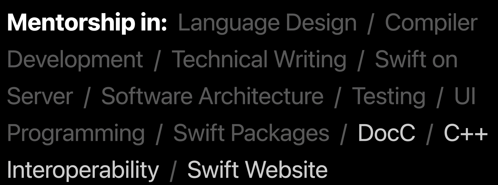
* Standard library smaller, dropped dependency on third party unicode library, replaced with native library

**Swift Packaging**

* SPM has added "trust on first use" (TOFU) for downloading package for increased security
* Package Plugins
	* Command plugins
		* documentation generation
		* reformat source code 
		* generate test reports
	* DocC adds Obj-C and C support
	* Build tool plugins
		* provide scalable way for packages to define plugins that can implement additional build steps
		* examples - source code generation, resource processing
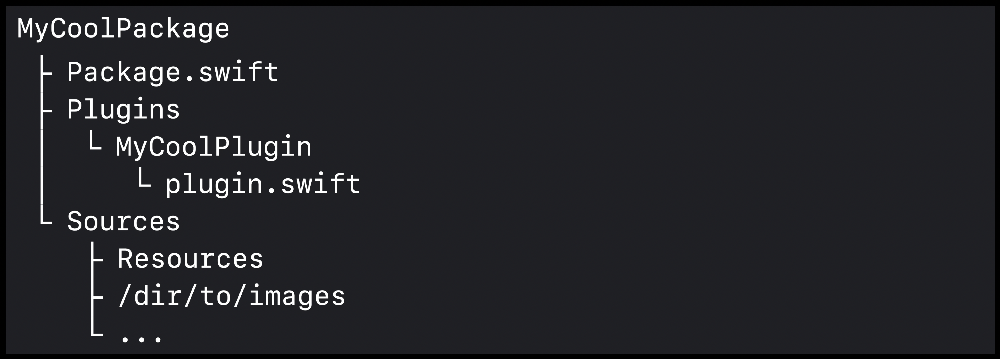
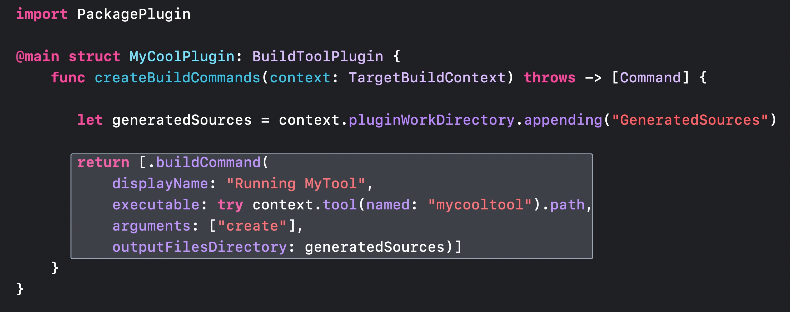
	
**Performance Improvements**

* Module disambiguation
	* allows you to rename modules from outside the packages that define them. 
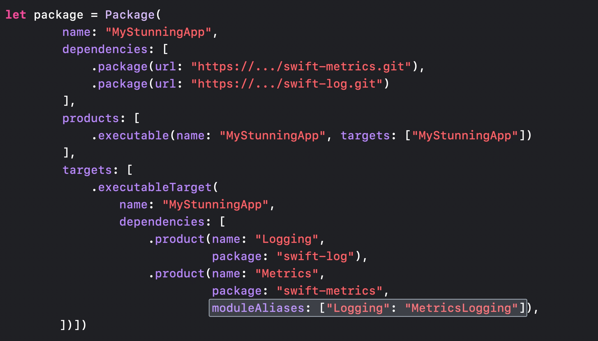
* Swift driver settings
	* Integrated compiler
	* Eager compilation
	* Eager linking
	* Demystify parallelization in Xcode builds #session
* Build-time improvements
	* New swift driver settings
	* Faster type checking of generics
* Runtime improvements
	* Optimized protocol conformance checking
* Improve app size and runtime performance #session

**Concurrency**

* Improvements to the concurrency model
	* Back deployed to iOS 13
* Extensions to the model
	* Data race avoidance
		* Eliminate data races using Swift concurrency #session
	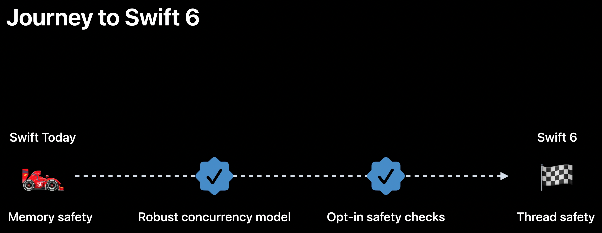
	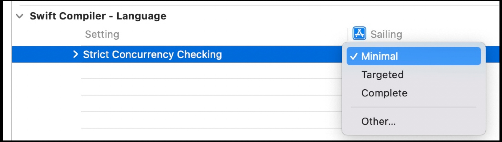
* Distributed actors
	* actors for code that can be between processes or even devices
	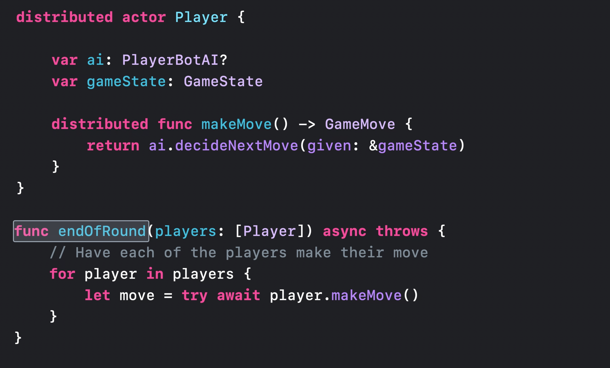
	* Distrubuted Actors package
		* Makes distributed systems in Swift easier to write
		* Integrated networking solution
		* Integrated consensus protocol
	* Meet distributed actors in Swift #session
* Async Algorithms package
	* Seamless integration with async/await
	* Home for time-based algorithms using `AsyncSequence`
	* Support on Apple platforms, Linux, and Windows
	* Meet Swift Async Algorithms #session
* Concurrency optimizations
	* Actor prioritization
	* Priority-inversion avoidance
* Swift concurrency instruments
	* Visualize and optimize Swift security

**Expressive Swift**

* Unwrapping optionals - old code vs. new code:
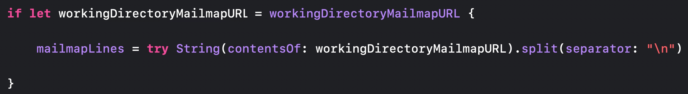
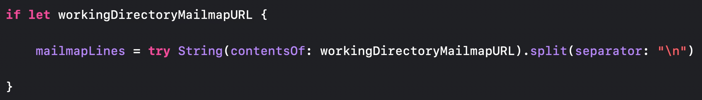
	* works with guard and while as well
* Closure type inference
	* Have to define your closure result type less often now - `type in -> [String]` becomes `type in`
	* Permitted pointer conversions
	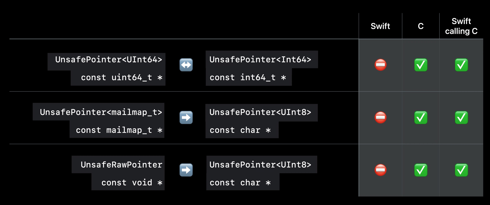
* String parsing
	* Regex literals: old code vs. new code:
	
	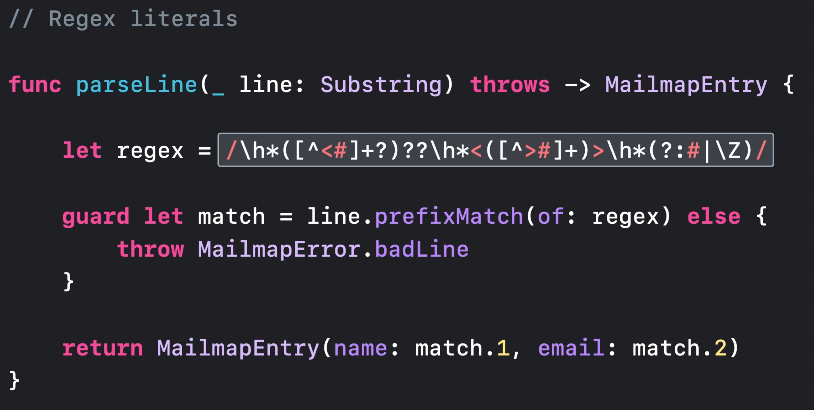
	* Or, even more readable - use RegexBuilder
	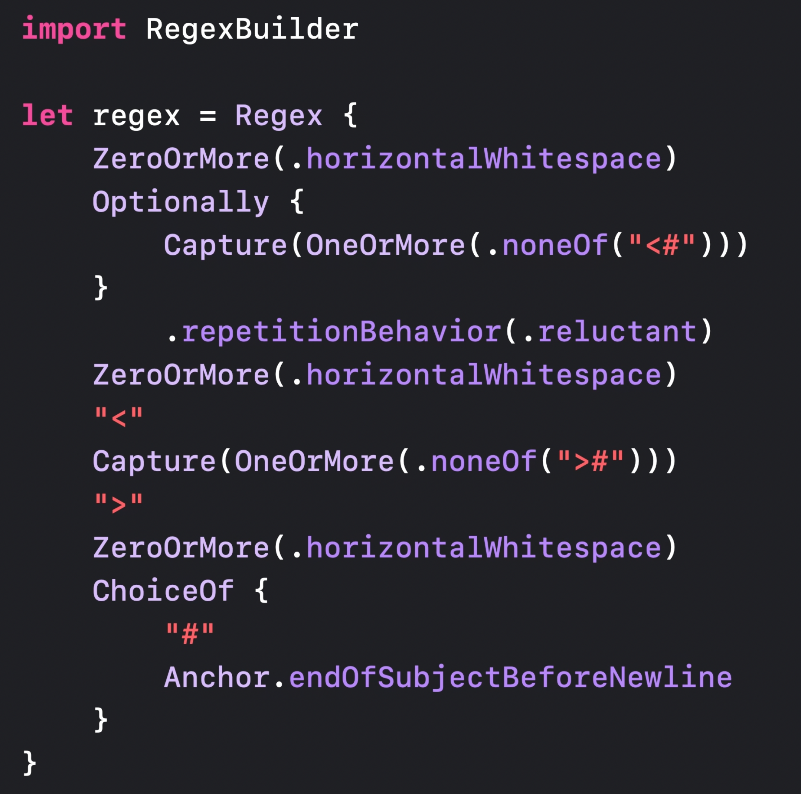
		* You can turn a regex into a reusable regex component (similar to turning a SwiftUI hierarchy into a view)
		* Support dropping string literals right into a builder without special characters
		* Can use regex literals in the middle of a builder
		* Types like dates can integrate custom parsing logic with regex builders, and even convert the data to a richer type before capturing it
		* Swift Regex is an open source custom engine
			* Literal dialect based on UTS #18 with extensions
			* iOS 16 only
* Generic code clarity
	* `any` keyword to make code more readable and define conformance
	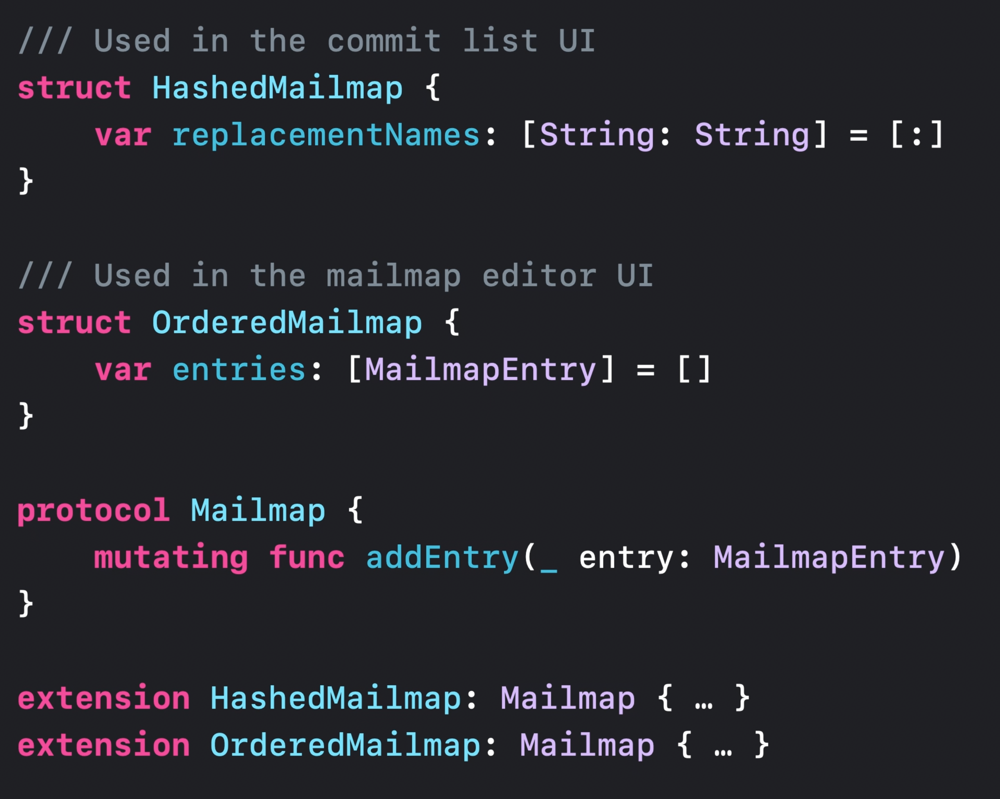
	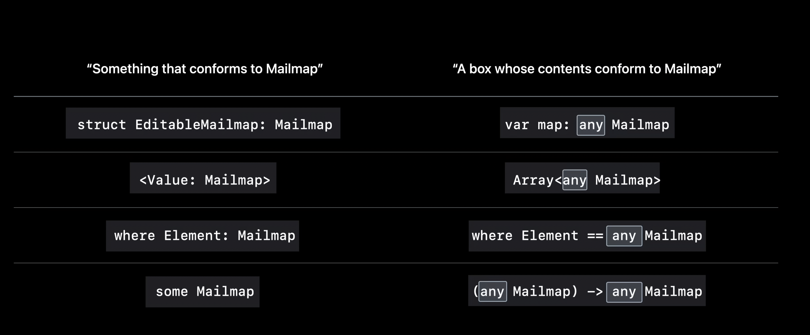
	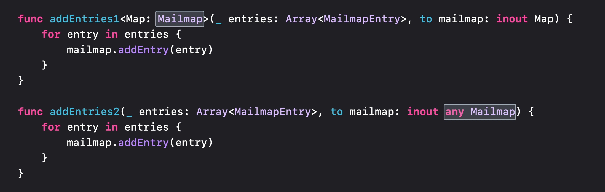
	* Primary associated types
		* can put the element type of any collection in angle brackets using the `any` keyword
	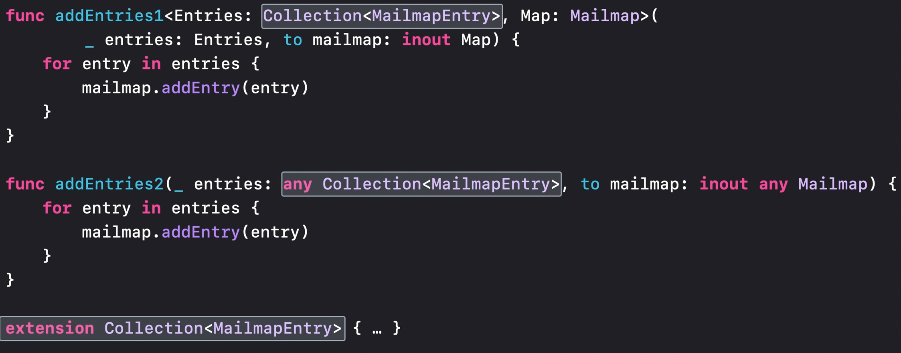
	* Improvements to any types
		* The `any` keyword
		* Pass to generic arguments
		* Supports `Self` and associated types
		* Primary associated types
		* **but** you still shouldn't use them when generics will work
			* to make generic code easier to write, you can now use the `some` keyword: old code vs. new code
			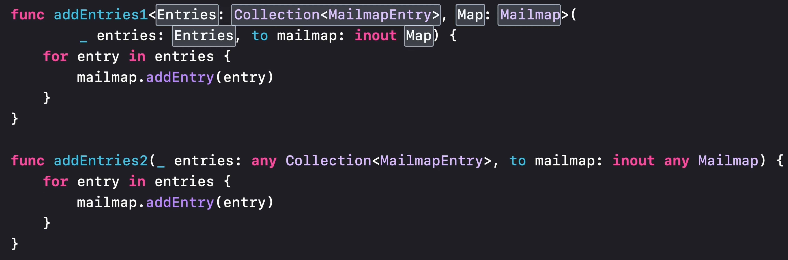
			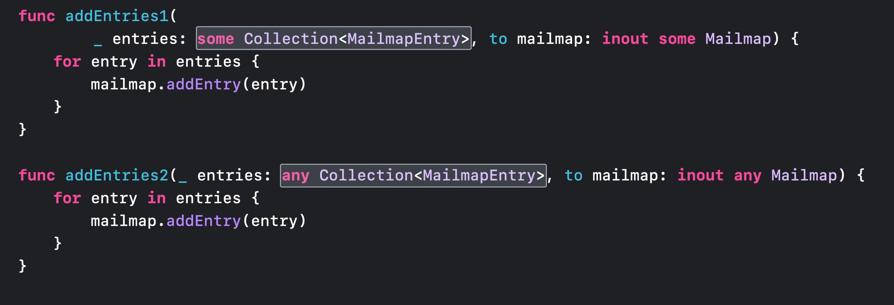
	* Embrace Swift generics #session
	* Design protocol interfaces in Swift #session	