# [**What's new in SwiftUI**](https://developer.apple.com/videos/play/wwdc2022-10052)

### **Swift Charts**

* Charts build very similar to things like `List`

* Like `List`, you can also put a `ForEach` inside your chart to show more views, like a `RuleMark`

* Handle localization, dark mode, and dynamic type automatically
* [**Hello Swift Charts**](Hello Swift Charts.md) session
* [**Swift Charts: Raise the bar**](Swift Charts - Raise the bar.md) session

---

### **Navigation and windows**

**Stacks**

* New `NavigationStack` container view
	* push/pop style navigation
	* works with `NavigationLink` and `.navigationTitle`
* can now write better data-driven navigation with `.navigationDestination`
	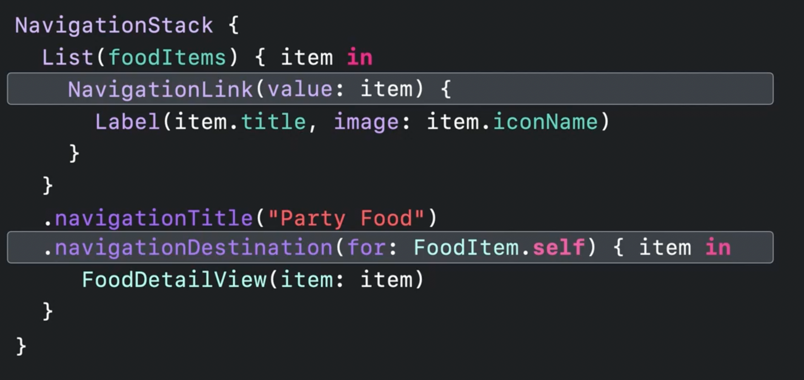
*  You can also represent the current navigation stack as explicit state, and jump back to a specific view in the stack
	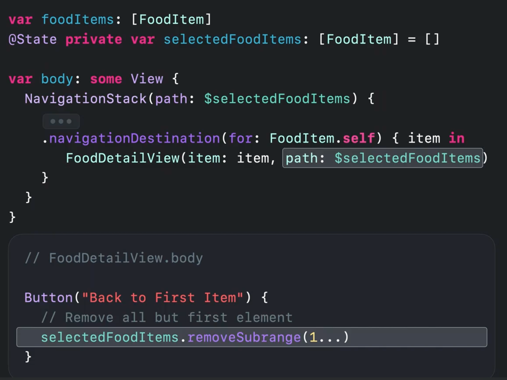

**`NavigationSplitView`**

* Declares two/three column layouts
* Will automatically collapse into a stack on smaller size classes

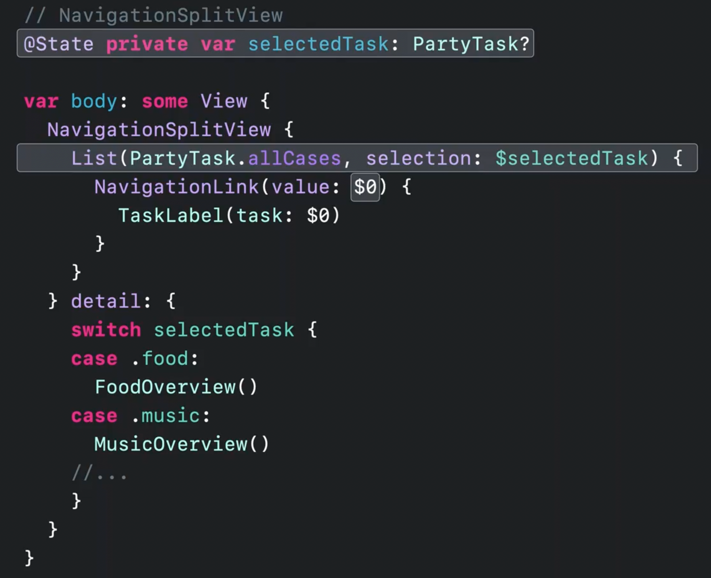

* `NavigationSplitView` was designed to work with `NavigationStack`

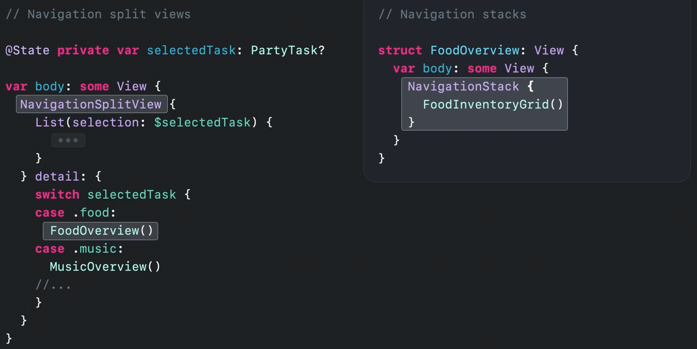

* Updates allow for:
	* Heterogenous navigation paths
	* Advanced deep-linking
	* State restoration
	* Migrating from `NavigationView`
* [The SwiftUI cookbook for navigation](The SwiftUI cookbook for navigation.md) session

**Scenes**

* New `Window` keyword
	* Declares a single unique window for the app
	* Can assign it a keyboard shortcut
	* `@Environment(.openWindow)` to programmatically open new windows
	* modifiers for default size, position. resizability, and more
		* changing these values are remembered across app launches
* `presentationDetents` modifier for sheets
	* can define multiple states

* [**What's new in Xcode**](What's new in Xcode.md) session
* [**Use Xcode to develop a multiplatform app**](https://developer.apple.com/videos/play/wwdc2022-110371) session
* Menubar extras (for macOS) can be built entirely in SwiftUI
* [**Bring multiple windows to your SwiftUI app**](Bring multiple windows to your SwiftUI app.md) session

---

### **Advanced controls**

**Forms**

* New `.grouped` formStyle for macOS
* `LabeledContent` View automatically adjust styling and allows selection of text
	* Can wrap any kind of view

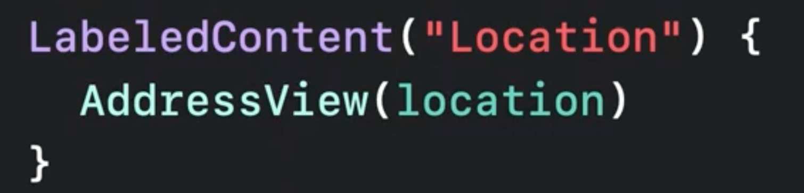

* `Toggle` (and other SwiftUI form views) now automatically takes multiple pieces of text and use them as titles and subtitles

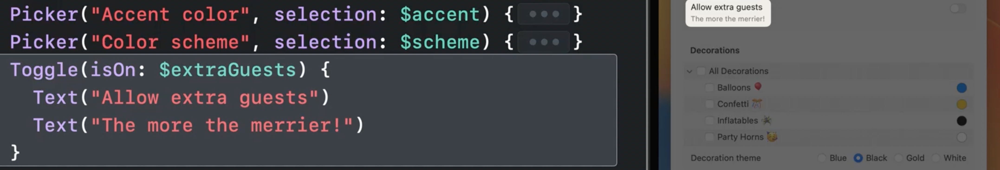

**Controls**

* `TextField` can now be configured to expand using the new `axis` parameter
	* `.lineLimit` now takes a range, like `.lineLimit(5...10)`
* `MultiDatePicker` allows for non-contiguous date selection
* Mixed-state controls
	* Allow for groups that each have individual bindings, but a parent that takes a collection of targets
	* Pickers can work the same way

what
	
* Steppers now allow providing a format for its values with the `format` parameter
* watchOS now has `.accessibilityQuickActions` that define what functions accessibility actions perform

**Tables**

* Tables are now supported on iPadOS
	* use same API as macOS
	
	* will also render on compact sizes, like on iPhone (showing just the primary column)
* iPad toolbars can now support user customization and reordering
	* implement explicit identifiers for each toolbar item
	* not all toolbar items allow customization
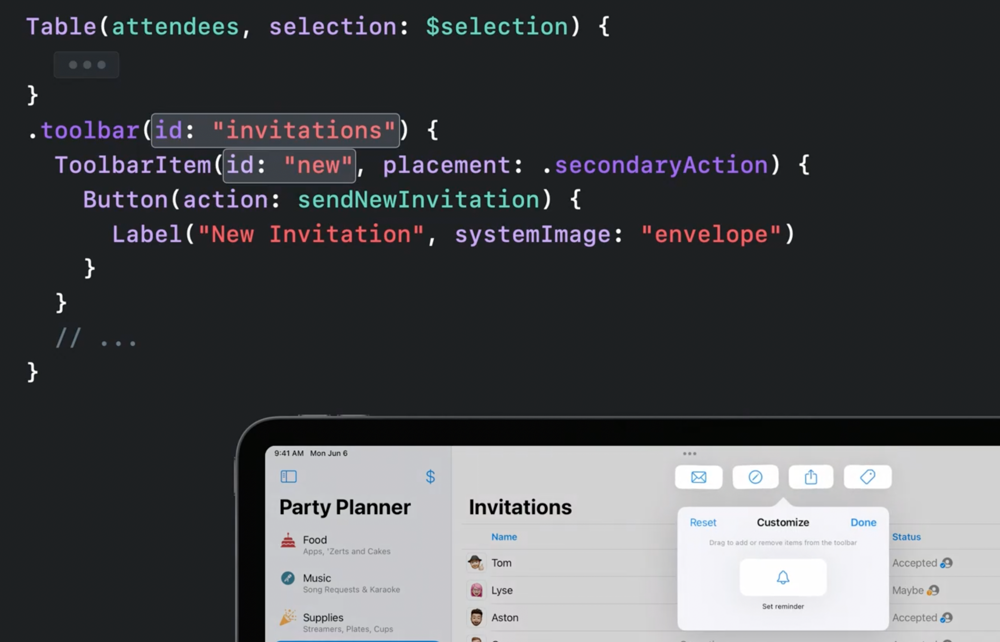
* Search fields can now support tokenized inputs and suggestions to help build more structured search queries
	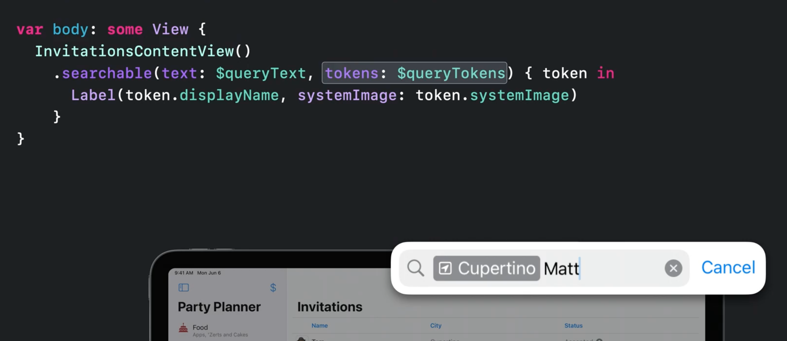
* Search scopes are now supported for filtering results
	* appear as scope bar beneath toolbar on macos
	* as a segmented control beneath the search bar on iOS
	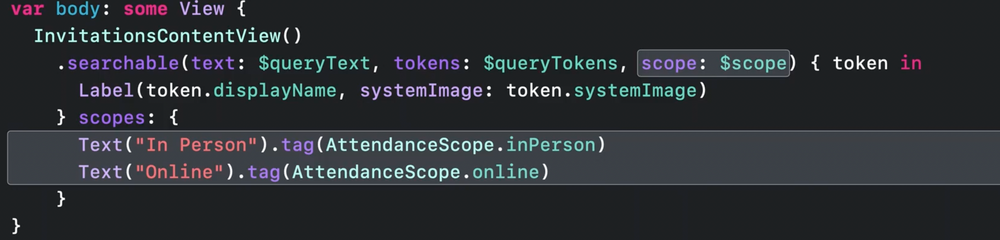

**More sessions:**

* [**SwiftUI on iPad: Organize your interface**](SwiftUI on iPad - Organize your interface.md)
* [**SwiftUI on iPad: Add toolbars, and documents, and more**](SwiftUI on iPad - Add toolbars, titles, and more copy.md)
* [**What's new in iPad app design**](What's new in iPad app design.md)
* [**SwiftUI on the Mac: Build the fundamentals**](https://developer.apple.com/videos/play/wwdc2021/10062/) from WWDC 2021

---

### **Sharing**

**Photos**
* `PhotosPicker` view
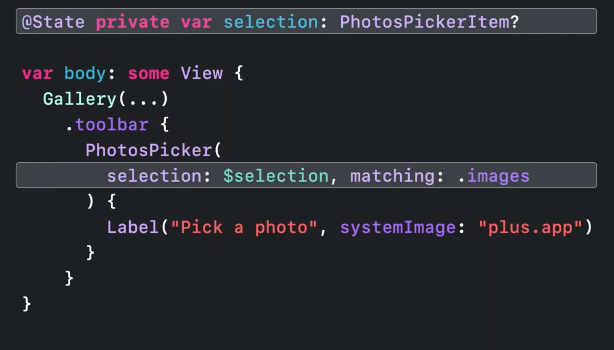
	
**Sharing**
* `ShareLink` view
	* use in a context menu or toolbar, and it auto creates a standard share button
	* adapt to the context/platform they apply to
	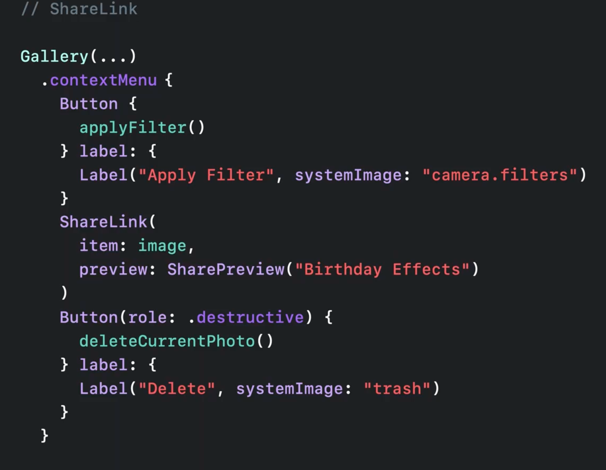
	
**Transferable**
* Utilized by PhotosPicker and ShareLink
* Defines how types are transferred across applications
* Powers drag and drop
	* `.dropDestination` API
	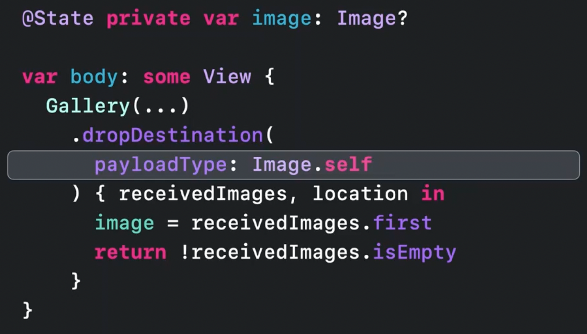
	* many standard types already conform to Transferable:
		* String
		* Data
		* URL
		* Attributed String
		* Image
		* More...
* Can be declared for your own custom types

* [**Meet Transferable**](Meet Transferable.md) session

---

### **Graphics and layout**

**Shape Styles**
* `Color` has a new `.gradient` property that defines a subtle gradient from the color
* `ShapeStyle` got a new `.shadow` modifier
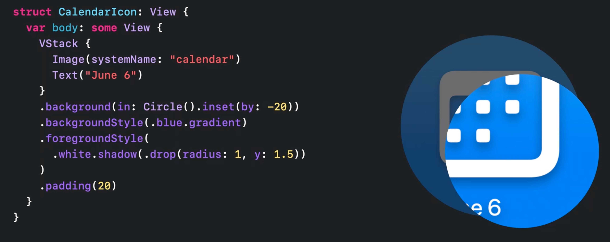
* SwiftUI preview variants allow you to view multiple views/orientations/modes without writing any configuration code
* Previews now run in live mode by default
* Text can now be animated between weights, styles, and even layouts using `withAnimation`

**Layout**
* `Grid` is a new container view
	* Arranges views in 2D grid
	* Measures subviews up front to enable cells that expand multiple columns, and allow automatic alignment across rows and columns
	* Can be built using `Grid`, `GridRow`, and `.gridCellColumns` you can build a grid
	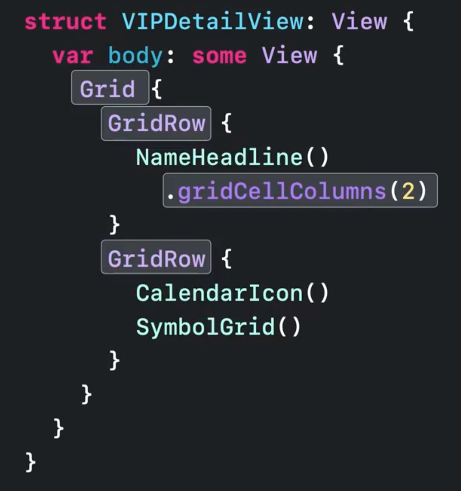
* `AnyLayout` protocol allows creation of custom, reusable layouts
	* [**Compose custom layouts with SwiftUI**](Compose custom layouts with SwiftUI.md) session
	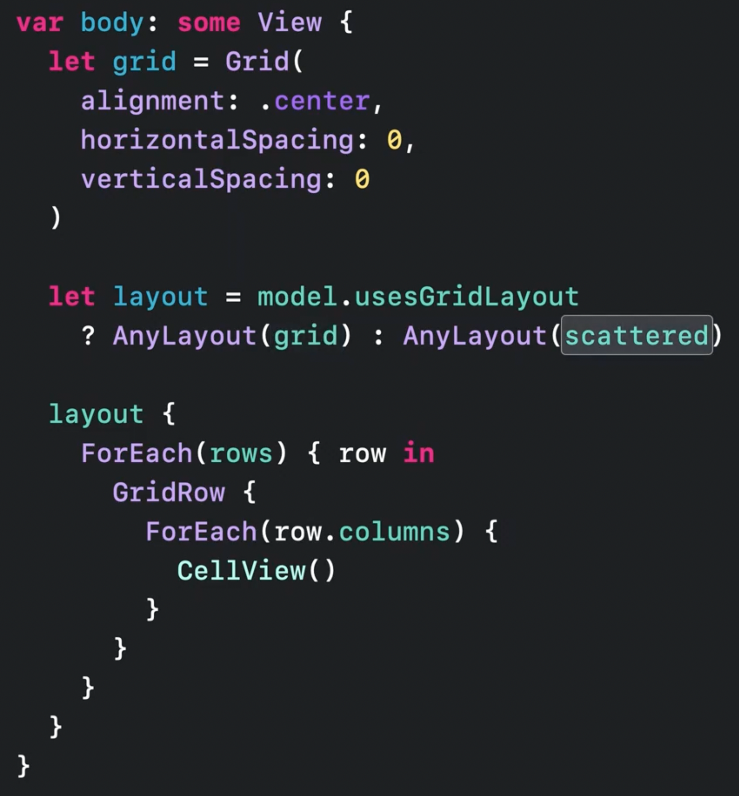
		

