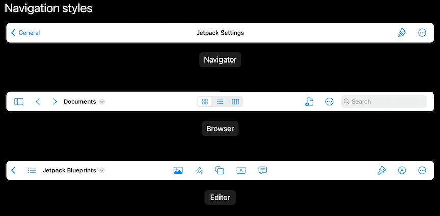
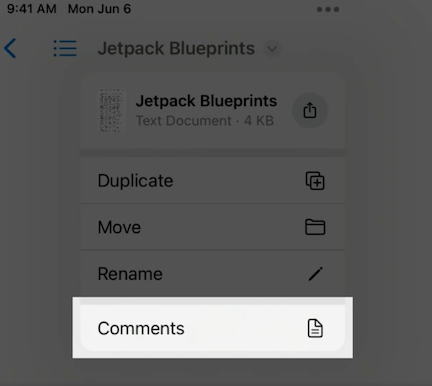
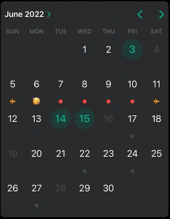
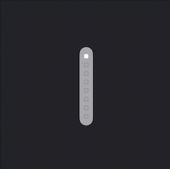
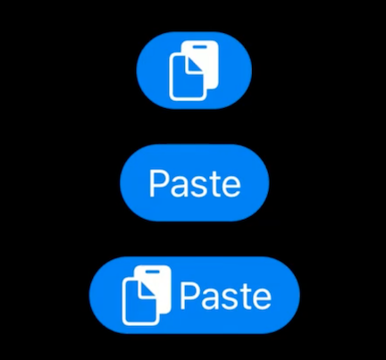
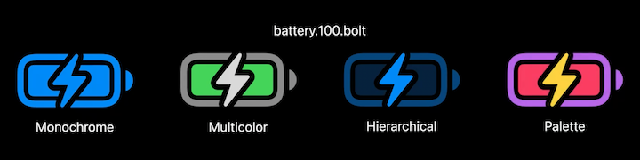
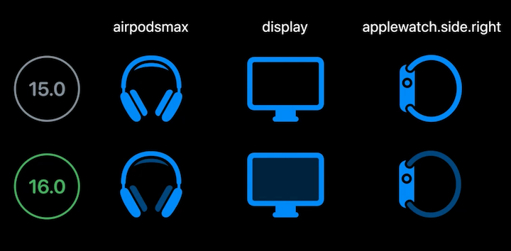
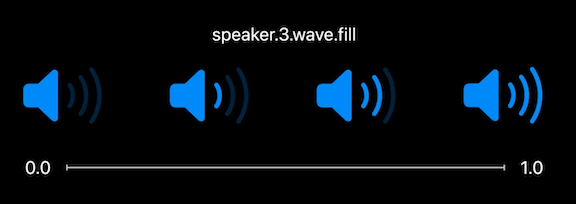
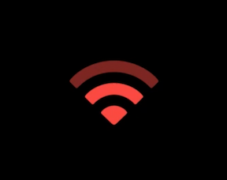

# **What's new in UIKit**

### **Productivity improvements**

* Improved navigation bars
* Title menu
* Find and replace
* Editing interactions

**Navigation bars**



* Added two new styles: Browser and editor
	* Browser designed for apps that use history or folder structure for navigation, like web and document browsers.
	* Editor is intended for interfaces centered around editing documents.
* Center items added to iPadOS
	* Items can be customized
	* Accounts for size class changes, using an overflow menu

**Title menu**



* Works with new navigation files
* Supports standard functions: duplicate, move, rename, export, and print
* You can add custom functions to the menu as well
* Catalyst apps integrate NSToolbar with no additional code required

**Find and replace**

* System find panel
* Find interaction
	* UITextView, WKWebView, PDFView

**Edit menu**

* Alternate presentations depending on input
	* different based on touch and pointer input
* Customizable, bridges nicely with Mac Catalyst
* new `UIEditMenuInteraction` API
* See the **Adopt desktop class editing interactions** #session

**Materials in Sidebar**

* In iOS 16, the sidebar in slide over mode automatically becomes vibrant without any additional code
* ON by default in overlay sidebar mode
* UIKit manages a set of private views to achieve this

Related sessions

* [**Meet desktop class iPad**](Meet desktop-class iPad.md)
* **Build a desktop class iPad app** #session

---

### **Control enhancements**

**UICalendarView**

* The inline calendar style of UIDatePicker is now available as a standalone fully-featured component, in the form of UICalendarView
* Configure with different types of selection behaviors
* Disable individual dates form selection
* Annotate dates with decorations
* UICalendarView represents dates as `NSDateComponents` rather than `NSDate`
* `NSCalendar.currentCalendar` may not be Gregorian
* Be explicit about which calendar to use

```
// Configuring a calendar view with multi-date selection

let calendarView = UICalendarView()
calendarView.delegate = self
calendarView.calendar = Calendar(identifier: .gregorian)
view.addSubview(calendarView)

let multiDateSelection = UICalendarSelectionMultiDate(delegate: self)
multiDateSelection.selectedDates = myDatabase.selectedDates()
calendarView.selectionBehavior = multiDateSelection

func multiDateSelection(
    _ selection: UICalendarSelectionMultiDate,
    canSelectDate dateComponents: DateComponents
) -> Bool {
    return myDatabase.hasAvailabilities(for: dateComponents)
}
```

```
// Configuring Decorations
func calendarView(
    _ calendarView: UICalendarView, 
    decorationFor dateComponents: DateComponents
) -> UICalendarView.Decoration? {
    switch myDatabase.eventType(on: dateComponents) {
    case .none:
        return nil
    case .busy:
        return .default()
    case .travel:
        return .image(airplaneImage, color: .systemOrange)
    case .party:
        return .customView {
            MyPartyEmojiLabel()
        }
    }
}
```



**UIPageControl**

* Can choose different images depending on selection state
* Control layout direction and orientation

```
// Vertical page control with custom indicators

pageControl.direction = .topToBottom
pageControl.preferredIndicatorImage = UIImage(systemNamed: "square")
pageControl.preferredCurrentIndicatorImage = UIImage(systemNamed: "square.fill")
```



**Pasteboard changes**

* Pasteboard access will change in iOS 16 from showing a banner to showing an alert with `Allow/Don't Allow` buttons
* System paste interfaces that the users interact with provide implicit access to the pasteboard and will avoid the alert
* If you have custom paste controls, you can replace them with the new `UIPasteControl` that looks and behaves like a filled UIButton
	* Based on the filled `UIButton` style
	* Enabled when pasteboard is content compatible
	* Avoids the paste notification



---

### **API refinements**

iOS 16 adds support for custom detents, so you can make sheets of any size

```
// Create a custom detent
sheet.detents = [
    .large(),
    .custom { _ in
        200.0
    }
]

// Create a custom detent
sheet.detents = [
    .large(),
    .custom { context in
        0.3 * context.maximumDetentValue
    }
]
```

You can also give your custom detent an identifier if you need to refer to it from other APIs

* Works for both floating and edge-attached sheets

```
// Define a custom identifier
extension UISheetPresentationController.Detent.Identifier {
    static let small = UISheetPresentationController.Detent.Identifier("small")
}

// Assign identifier to custom detent
sheet.detents = [
    .large(),
    .custom (identifier: .small) { context in
        0.3 * context.maximumDetentValue
    }
]

// Disable dimming above the custom detent
sheet.largestUndimmedDetentIdentifier = .small
```

**More on customizing sheets**

* System detents
* Other appearance options
* Updated sample code in **Customize and resize sheets in UIKit** #session from WWDC 2021

**Symbol images**



* For rendering modes: monochrome, multicolor, hierarchical, palette
* UIKit previously used monochrome rendering by default unless
* In iOS 16, UIKit may render individual symbols with a mode other than monochrome if no rendering mode is specified
	* Can still explicitly request monochrome with `UIImage.SymbolConfiguration.preferringMonochrome()`




Variable symbols added - symbols reflecting a value from 0 to 1



```
UIImage(systemName: "wifi",
		variableValue: 0.6,
		configuration: redPaletteConfiguration)
```



* Updated system symbols
* Support for custom variable symbols
* **Adopt variable color in SF Symbols** #session
* [**What's new in SF Symbols 4**](What's new in SF Symbols 4.md) session

**Swift Concurrency and Sendable**

Modernized UIKit to work with new Swift Concurrency features - immutable types conform to Sendable

* UIImage, UIColor, UIFont, UITraitCollection
* You can send them between the MainActor and custom actors without compiler warning
* For example, the code below has a custom actor called Processor, and a view controller called ImageViewer which is bound to the MainActor.
	* In the method sendImageForProcessing, the ImageViewer sends an image to the Processor actor for processing
	* This is safe because UIImage is immutable, so Processor has to make a new copy to edit/process the image
	* Any code that has a reference to the original image doesn't show these modifications, and a shared state is not unsafely mutated
	* Contrast this with UIBezierPath, which is not Sendable because it is mutable

```
// Sendable

actor Processor { ... }

// Implicitly @MainActor
class ImageViewer: UIViewController {
	let processor = Processor()

	func sendImageForProcessing(_ image: UIImage) async {
		let fancyImage = await processor.process (image)
		// Display fancyImage
	}
}
```

More on Swift Concurrency and Sendable

* **Eliminate data races using Swift Concurrency** #session
* **Visualize and optimize Swift Concurrency** #session

**Stage Manager**

* No code required to work with Stage Manager with some exceptions
	* `UIScreen.main` and `UIScreen` lifecycle notifications are deprecated
	* You can no longer assume your app is on the main screen
	* Defer to TraitCollection and UIScene APIs to get the information you need

**Self-resizing cells**

* Enabled by default for UICollectionView and UITableView
* Cells automatically resized when their content changes
* Automatic invalidation when using `UIListContentConfiguration`
* Use `invalidateIntrinsicContentSize()` to manually invalidate
* Wrap in `UIView.performWithoutAnimation {...}` to resize without animation
* If using auto layout:
	* Opt-in to an even more comprehensive behavior `selfSizingInvalidation = .enabledIncludingConstraints`
	* Automatic invalidation for Auto Layout changes in `contentView`

```
class UICollectionView {
	// Default is .enabled
	var selfSizingInvalidation: SelfSizingInvalidation
}
```

---

### **UIKit and SwiftUI**

**UIHostingConfiguration**

* Build custom cells using SwiftUI
* Works with UICollectionView and UITableView
* **Use SwiftUI with UIKit** #session

```
cell.contentConfiguration = UIHostingConfiguration {
    VStack {
        Image(systemName: "wand.and.stars")
            .font(.title)
        Text("Like magic!")
            .font(.title2).bold()
    }
    .foregroundStyle(Color.purple)
}
```

**UIDevice deprecations**

* `UIDevice.name` reports model name instead of user's custom device name
	* Using the customized name now requires getting an entitlement
* `UIDevice.orientation` not supported
	* Use `PreferredInterfaceOrientation` instead