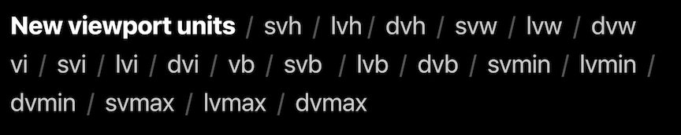
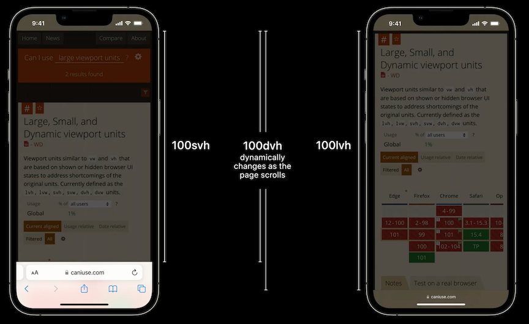

# **What's new in WKWebView**

* Use SFSafariViewController for in-app web experiences where you don't need customization
* UIWebView will be removed in a future release
* WKWebView is what to use for interacting with web content
	* CSS based UI
	* Writing some of the app in JavaScript
	* Interacting with your own web content
	* Writing your own web browser

### **Web content interaction**

Three new ways to interact with web content in iOS 16

* Fullscreen support
	* Javascript can request full screen, user or Javascript can request exiting

```
webView.configuration.preferences.isElementFullscreenEnabled = true

webView.loadHTMLString("""
<script>
    button.addEventListener('click', () => {
        canvas.webkitRequestFullscreen()
    }, false);
</script>
…
""", baseURL:nil)

let observation = webView.observe(\.fullscreenState, options: [.new]) { object, change in
    print("fullscreenState: \(object.fullscreenState)")
}
```
	
* CSS viewport units
	* Allows web content to layout according to dynamic viewport sizes





```
let minimum = UIEdgeInsets(top: 0, left: 0, bottom: 30, right: 0)
let maximum = UIEdgeInsets(top: 0, left: 0, bottom: 200, right: 0)
webView.setMinimumViewportInset(minimum, maximumViewportInset: maximum)
```

* Find interactions
	*  Allows searching using native UI (and shortcuts like Command-F) to search the text on the open page

```
webView.findInteractionEnabled = true

if let interaction = webView.findInteraction {
  interaction.presentFindNavigator(showingReplace:false)
}
```

---

### **Content blocking**

Can now run regular expressions on the url of the current frame/specific urls

```
let json = """
[{
    "action":{"type":"block"},
    "trigger":{
        "resource-type":["image"],
        "url-filter":".*",
        "if-frame-url":["https?://([^/]*\\\\.)wikipedia.org/"]
    }
}]
"""

WKContentRuleListStore.default().compileContentRuleList(forIdentifier: "example_blocker",
    encodedContentRuleList: json) { list, error in
    guard let list = list else { return }
    let configuration = WKWebViewConfiguration()
    configuration.userContentController.add(list)
}
```

* What's new in Safari Web Extensions #session

---

### **Encrypted media**

Can now use content that uses the Encrypted Media Extensions and Media Source Extensions APIs, you can now use it in your apps on iPadOS

* If you have premium content like AppleTV+, it will work on iPadOS like it has in macOS

---

### **Remote Web Inspector**

If your app has the web-browser entitlement, then Remote Web Inspector will just work with your production app like it has on Safari on iOS

* No need to add or change any code
* To enable in 3rd party browsers, turn on `Web Inspector` in Safari settings on iOS Device
* Enable the `Develop` menu in Advanced Settings in Safari on the mac
* Attach iOS device and look for it in the macOS `Develop` menu

