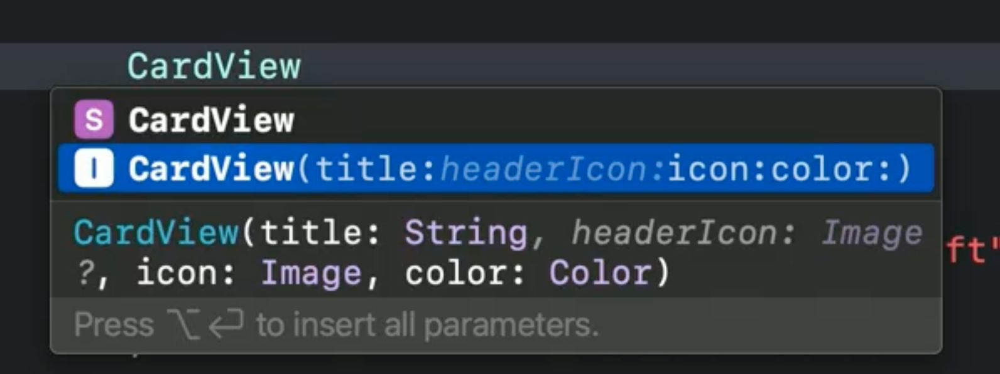
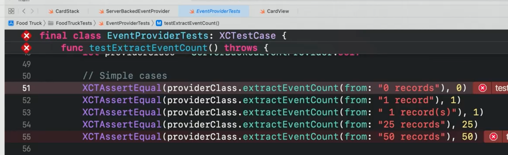
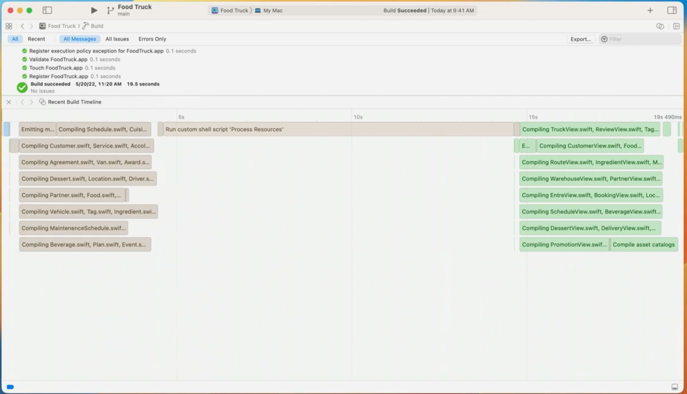
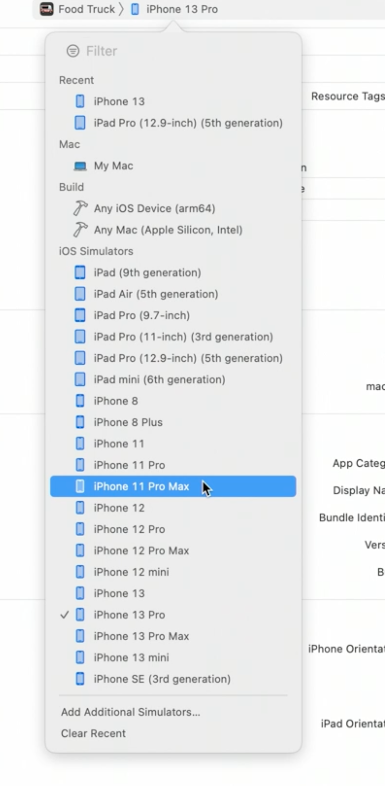
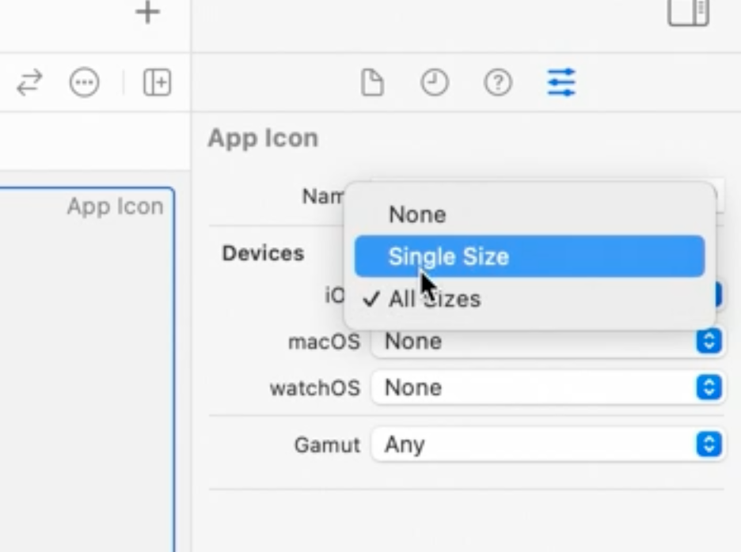

# [**What's new in Xcode**](https://developer.apple.com/videos/play/wwdc2022/110427/)

Xcode 14 is 30% Smaller - only iOS 16 and macOS 13 sdks are included by default
* other sdks can be downloaded on demand, or the first time you try to use them

Preview canvas is interactive by default
* new controls to show additional variants without configuration code
	* dynamic type sizes
	* orientations
	* colors

Xcode offers to autocomplete memberwise initializers now 🙌

* codable too

Library now contains SF symbols

Initializers now appear in autocomplete lists when you start to type in the name of a View

* Can also just include specific params better (like `maxwidth` for `.frame`)

*Jump to definition* list has been redesigned, and now shows what is different about each result

* *Callers* list shows the different files/functions that call this function, along with a preview of each

When fixing a compilation error now, the red banners across the code will dim to grey to show that Xcode is re-evaluating that code now. Banners will disappear when errors are confirmed as resolved.

Xcode 14 shows definitions containing visible code, even when they are scrolled out of view

Build performance improvements

* improves parallelism by eagerly producing Swift modules
* Linker is up to 2x faster
* 25% faster build (machines with more cores have larger improvements)

New **Build Timeline** for any build log or result bundle to view any long build times and bottlenecks

* [**Demystify parallelization in Xcode builds**](https://developer.apple.com/videos/play/wwdc2022-110364) session
* [**Link fast: Improve build and launch**](Link fast - Improve build and launch times.md) session

30% faster testing using same build improvements

* [**Author fast and reliable tests for Xcode Cloud**](Author fast and reliable tests for Xcode Cloud.md) session

Interface builder performance improvements

* 50% faster loading documents
* 30% faster switching between devices

Can have multiple platforms in a single target

* reduces need to keep settings, etc. in sync
* [**Use Xcode to build a multiplatform app**](https://developer.apple.com/videos/play/wwdc2022-110371) session

Memory Debugger now shows all reference paths into and out of an object

Can extend Xcode with Swift Package plugins

* run linters
* [**Meet Swift Package plugins**](Meet Swift Package Plugins.md) session
* [**Create Swift Package plugins**](Create Swift Package plugins.md) session

Can localize package resources just like applications

* [**Building global apps: localization by example**](Build global apps - Localization by example.md) session

Updated run destination chooser

* Prioritizes recent choices
* Filter via a search filter
* Same features are available in the scheme chooser as well
* 

Organizer

* Feedback organizer shows all TestFlight feedback directly in Xcode
	* shows screenshots and other details
	* can email tester directly from feedback
* Hangs report shows highest impact hangs from App Store users
	* ordered by severity
	* shows backtrace, and specific device occurences
	* [**Track down hangs with Xcode and on-device detection**](Track down hangs with Xcode and on-device detection.md) session

App Icon

* You can now double click on an icon in the Asset Catalog to select a replacement
*  Select `Single Size` in the inspector to only include a 1024x1024 icon and have the rest of the sizes auto-generated

