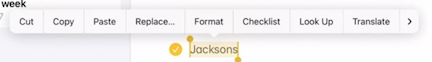
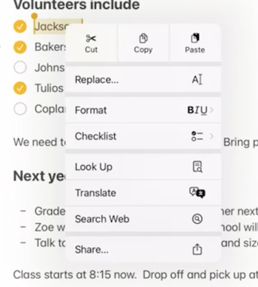
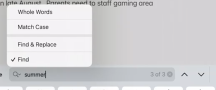
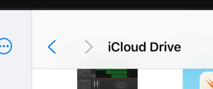
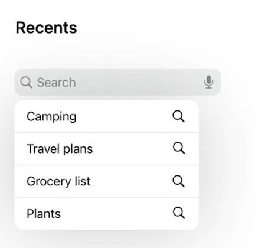
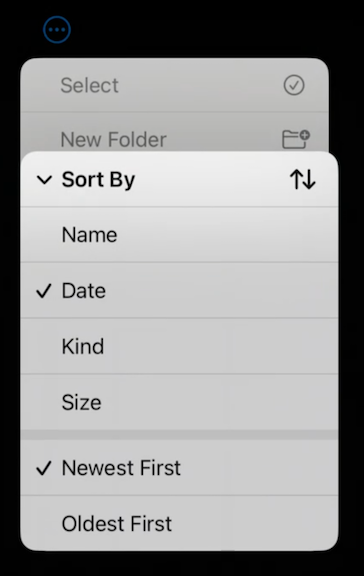
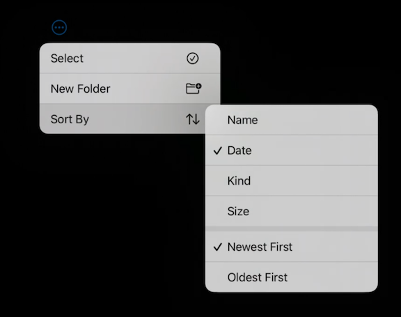
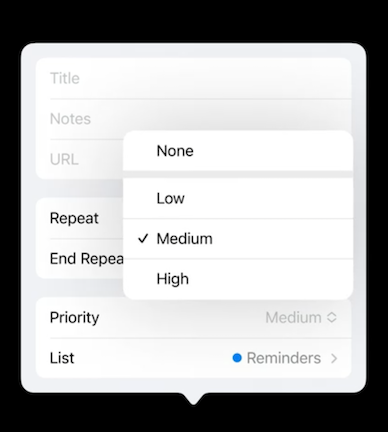
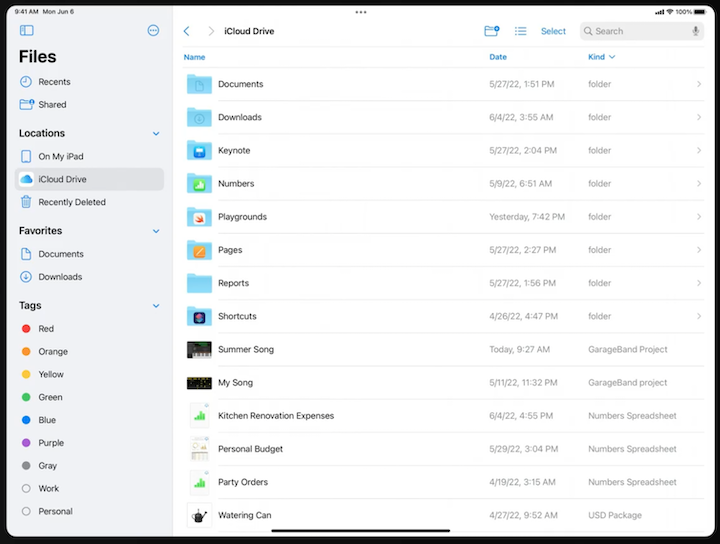

# [**What's new in iPad app design**](https://developer.apple.com/videos/play/wwdc2022-10009)

### **Toolbars**

* iOS 16 has a new toolbar layout that aligns titles to the left side and allows apps to offer more toolbar items in the center
* Leading section:
	* Should contain items that help people navigate within and outside of the document, like the back and sidebar buttons
	* Displays the new document title and menu
* Apps can elevate commonly used workflows in the center
	* Consider where users can benefit from one-tap access
	* Toolbars can be made customizable
	* Toolbar items can be grouped or collapsed
	* Actions collapse into a `+` when there is not enough room in the toolbar
* Trailing section:
	* Any button that invokes nearby inspectors
	* Important items that should stay visible at any window size
	* An optional overflow button for people to access hidden items as well as toolbar customization.
		* When users resize your app, the toolbar items in the center will automatically hide into an overflow menu when there's not enough room.
* Document menu
	* Tapping on the title invokes the menu
	* For actions that affect the document as a whole
		* e.g. Duplicate, Rename, Move, Export, Print
	* Not for everything:
		* Actions that take content outside of your app should be placed under share
		* Actions that directly affect content inside a document should support toolbar customization and appear in Edit Menus where appropriate 

---

### **Edit menus**

Touch | Pointer
----- | -------
 | 

* Appear over selected text and contain edit options such as Copy and Paste.
* In iPadOS 16, edit menus have a new look and are optimized for touch and pointer
	* Appears horizontal when activated by touch
	* Shows a more comprehensive list of options in a vertical layout when activated by pointer
* Don't remove standard options like Cut, Copy, and Paste
* Organize custom actions close to related system actions

---

### **Find and replace**

* Find and replace added into the system keyboard
	* Supports advanced use cases like matching specific parts of a phrase or replacing all matches with a different word.
	* When iPad is attached to a hardware keyboard, the find and replace interface sits above the app in a compact appearance
* To make find and replace easy to access, consider adding an item inside the overflow menu as well as the system keyboard shortcuts

---

### **Navigation**

New browser style navigation

* Back and forward buttons
* Works well for apps like a file browser or a web browser

Search goes in the top right of the navigation bar

* Supports suggestions right off the search field

---

### **Selection and menus**

Band selection

* iPadOS 15 introduced band selection (using the pointer to select multiple nodes at once)
* iPadOS 16 no longer enters edit mode automatically
* Can use keyboard shortcuts like `Command` and `Shift` to select/deselect (also without entering editing mode)
* Secondary click acts on entire selection
	* Can long press with touch for the same actions
* These interactions also work with items in a list

iPadOS also supports context menus in empty areas 

* Can be used to create something new, like a new folder in Files, or paste a copied event in Calendar

**Submenus**

* On iPhone, submenus open vertically
* On iPadOS 16, submenus open horizontally
* iPadOS 16 also adds a new control for pop-up buttons in a list
	* Show a menu to let you choose an option
	* Used to have to push into a detail view, then pop back out - can now make a change right in place
	* Use a pop-up button if your options fit nicely into a menu
		* If you only sometimes need more controls, add a Custom option into the menu. When someone chooses Custom, reveal the extra controls without getting in the way of the other choices

iPhone | iPad | Pop-up button
------ | ---- | -------------
 |  | 

---

### **Tables**

* Show multiple columns of information
* Sortable by tapping a header
* Can swap columns in and out by choosing different sort options
* Support all of the selection options mentioned earlier
* Meant to show more content, not data
* Switch to single column lists when shown in a compact list
	* Some of that content can be moved to a secondary label
	* Use a toolbar option for sorting

Check out **Designed for iPad** #session from WWDC 2020