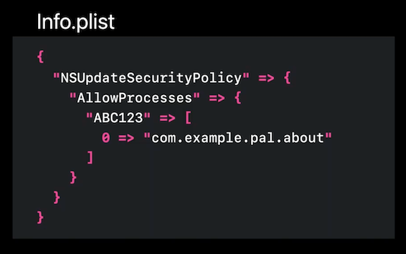
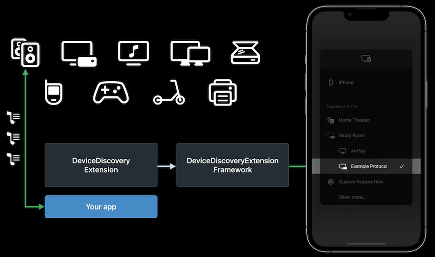
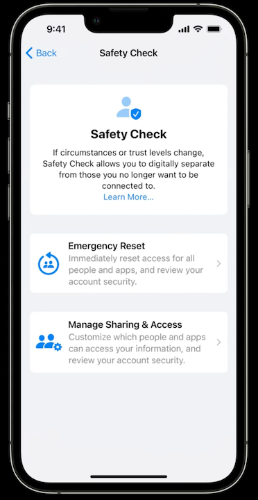

# **What's new in privacy**

Privacy pillars

* Data minimization
* On-device processing
* Transparency and control
* Security protections

### **Platform updates**

**Device name entitlement**

* To make it easier to identify devices, the user's name from their Apple ID account is included by default as part of the device name on iOS
* Before iOS 16, the UIDevice API allowed apps to access the user-assigned device name
* The UIDevice.name API will now return the *model* of the device rather than the user-assigned name, regardless of how people customize it.
* New Device name entitlement
	* Multi-device feature
	* Device name visible to user
	* `com.apple.develoepr.device-information.user-assigned-device-name`
	* Even with this entitlement, sharing the device name with third parties other than cloud-hosting service providers is not permitted

**Location attribution**

* When apps use location, iOS displays an arrow in the status bar
* In iOS 16, swiping down from the Control Center indicates which app is using location 

**Gatekeeper improvements**

* Starting with macOS Ventura, if your notarized app is no longer validly signed, it will be blocked by Gatekeeper on first launch
* Apps validly signed by the same developer account or team will continue to be able to update each other
* To allow another development team to update your app or restrict updates to only your updater, you can update your info-plist
* Add the `NSUpdateSecurityPolicy` that you want to allow to Info.plist
	* Add `AllowProcess`, a dictionary mapping team identifiers to an array of signing identifiers
* macOS will block modifications by apps not listed in the policy
* Users can allow apps to update/modify other apps in System Settings

**Launching Mac apps at login**

* In macOS Ventura, there is a new single API to launch app, launchAgent, or Daemon at login.
* Your app will be allowed to launch at login by default, and users will be notified
* If your app requires a daemon with elevated permissions, it will require admin approval to enable
* Clicking on the notification opens the Login Items pane in System Settings, where people can manage apps that launch on their system
	* Controls different ways apps can run at login, including agents, daemons, SMLoginItems, and apps that add themselves to open at login
* `SMAppService` API
	* Launch at login from app logic
	* No need for installers
	* No need for complex cleanup
	* Works in Mac App Store apps

**Pasteboard access**

* Previously, a passive notice let users know when apps accessed the pasteboard when the user had not pressed paste
* In iOS 16, the system confirms intent for all access to pasteboard items written by other apps
* If your app continues to access values for pasteboard items using the UIPasteboard API, the system will display a modal prompt
* Three ways to Paste without prompts:
	* Edit options
	* Keyboard shortcut
	* Adopt UIKit paste control (see next section for more info)

---

### **Features to adopt**

**UIKit paste controls**

* The system confirms intent by insuring the button was visible and tapped
* Customizable to change the color of the text, icon, or background

**Media device discovery**

* Apps used a variety of streaming protocols and custom discovery/communication logic to discover devices. This has required permission for local network and Bluetooth.
	* This gives access to more information than is necessary and poses a fingerprinting risk
* DeviceDiscovery extensions allow apps to stream to selected devices without having to present network/Bluetooth alert access prompts
	* Streaming devices appear in the same picker as AirPlay
	* Apps only see the device picked to stream to
	* This extension can search for local network and Bluetooth devices but is sandboxed separately from the app, so it can't send scan results back
* Streaming protocol providers
	* Create extension with `DevicesDiscoveryExtension`
	* Extend `AVRoutePickerView` entry point
	* Use selected devices in media protocol
	* Download sample extension and app
* Application developers
	* Adopt streaming provider's media device discovery enabled SDK

**PHPicker expansion**

* Provides permission to access only the photos needed without prompts
* PHPicker from iOS now added to macOS and watchOS

**Private Access Tokens**

* Replace CAPTCHAs
* Apple doesn't learn servers visited
* Device identities remain private
* Privacy Pass IETF standard
* **Replace CAPTCHAs with Private Access Tokens** #session

**Passkeys**

* Use the same UI style and biometric information as password autofill
* Eliminate server password compromises
* Prevent phishing
* Sync across your devices
* **Meet Passkeys** #session

---

### **Safety Check**

* Stop sharing data with people
	* Turns off location sharing in FindMy and stopping sharing in Photos, Notes and Calendar
* Stop sharing data with apps
	* Resetting system privacy permission for all third-party apps
* Signs user out of FaceTime and iMessage on your other iCloud devices to ensure Messages and calls are sent only to the device in your hand
* Walks you through signing out of other iCloud devices
	* Ensure other devices can't receive updates on location from FindMy, Photos, calendars, etc
* Helps you change passwords for both the device and iCloud account
* Review trusted phone numbers for iCloud two-factor auth
* Helps you manage emergency contacts to make any changes as needed

Two ways to use safety check:

* Emergency Reset - for crisis situations when you need to immediately reset access across people and apps
	* Lets you quickly take action across all people and all apps
	* Disables access to FaceTime and iMessage on your other devices
	* Then you are walked through securing your iCloud account to the device in your hand and reviewing your emergency contacts and trusted devices
* Manage Sharing & Access - allows more fine-grained controls over each capability of Safety Check
	* Lets you review person by person and app by app to review who you're sharing with
	* You can sort this by name or the type of information you're sharing
	* Great for understanding and controlling your sharing with a particular person
	* Can help you find an app with sensitive permissions installed by someone with access to your device

* Quick Exit is available in all Safety Check flows and quickly lets people exit the flow if they're concerned someone might see what they're doing
	* Pressing it returns them to the home screen
	* The next time they enter settings, they'll be back on the main settings page, not in Safety Check
