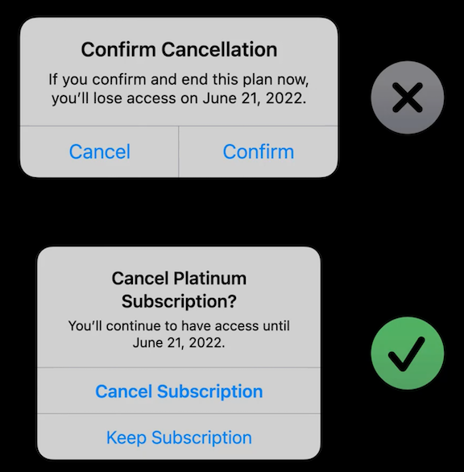

# **Writing for interfaces**

### **Purpose**

* Consider information hierarchy
	* How you order information on the screen
	* Make sure headers and button are clear
* Know what to leave out
	* When you know the purpose of a screen, you can make choices about what to keep in, what to take out, and what can move someplace else
* Have a purpose for every screen
	* When there are multiple steps in a flow, define the purpose of the entire flow, as well as each screen within it
	* Can help keep screens brief and reduce unnecessary steps.

---

### **Anticipation**

* Think of a conversation
	* A dialog happens between the app and the user
* Develop your voice and vary your tone
	* Develop a voice for the app, and then vary the tone where it fits
	* Who is your app talking to?
	* In what situation are you addressing the user?
* Know what comes next
	* Anticipating the next question a user might have or action they might do helps to know what your app should say next

---

### **Context**

* Think outside the app
	* Where might a user use the app: When driving? At an airport? Outside?
	* If the user might use it in a busy situation, less text is better
* Write helpful alerts
	* By context, they are interruptions
	* For destructive actions, be very clear about what that action would mean
	* Be careful how you use the word "cancel"
		* The buttons themselves should be specific about what action they should take
	* Alerts should reference what they refer to
		* Both what action/event let to the alert, and clearly defining what the options are the user has at that point

* Create useful empty states
	* When a user has completed a list, or has not started one, don't just leave the screen empty
	* Inform user properly how they can add things to a screen, or what resulted in the screen having no content

---

### **Empathy**

* Write for everyone
	* The app might have a specific audience, and you should speak to them - but you also don't want to leave anyone out
* Be responsive to localization
	* Account for languages that are more verbose, require more vertical space, and read right-to-left
* Design for accessibility
	* App will possibly be used by people who are blind or with low vision - they might set their device to show bold or larger text
	* The language you use for labeling the elements in your app, they will be some people's entire experience using it, and you want that experience to be well designed.
	* Avoid unnecessary references to specific genders

