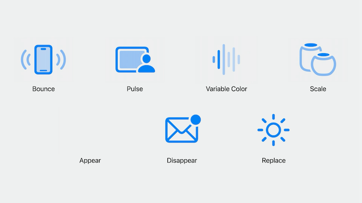
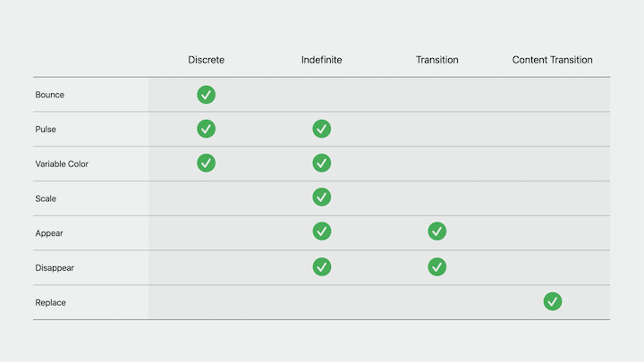

# [**Animate symbols in your app**](https://developer.apple.com/videos/play/wwdc2023/10258/)

---

### **Symbol effects**

New, universal animations that can be applied ot any symbol image, even custom symbols



[**What's new in SF Symbols 5**](./What's%20new%20in%20SF%20Symbols%205.md) session

* Animations are called "symbol effects"
    * New symbols framework available in SwiftUI, AppKit, or UIKit
* Each effect has a dot-separated name (e.g. `.bounce`, `.bounce.up`, `.bounce.down`)
* Some effects have many configuration options (e.g. Variable Color has three different settings)
* Effects can be chained together to configure other effects - `.variableColor.iterative.hideInactiveLayers.nonreversing`
* Xcode will autocomplete each part of the name, and errors will be shown at compile time
* New animation tab added to SF Symbols app
* Each effect encompasses a small set of behaviors
    * Bounce plays a one-off animation on the symbol - this is considered discrete behavior
    * Adding a Scale effect changes the symbol's scale level and keeps it there indefinitely
        * This is called an indefinite behavior - indefinite effects only end when explicitly removed
    * Appear and Disappear support transition behavior
    * Replace is a content transition, it animates from one symbol to another
* Each behavior corresponds to a protocol:
    * Discrete -> DiscreteSymbolEffect
    * Indefinite -> IndefiniteSymbolEffect
    * Transition -> TransitionSymbolEffect
    * Content -> ContentTransitionSymbolEffect
* An effect's behavior determines which UI framework APIs can work with them



### **UI framework APIs**

* New `symbolEffect` modifier in SwiftUI
* Use the `addSymbolEffect` method in AppKit and UIKit
* Configure the variable color effect using the dot syntax
* Can combine multiple effects
* Great way to add indefinite effects to symbol images

```swift
// Symbol effects in SwiftUI
Image(systemName: "wifi.router")
    .symbolEffect(.variableColor.iterative.reversing)
    .symbolEffect(.scale.up)


// Symbol effects in AppKit and UIKit
let imageView: NSImageView = ...

imageView.addSymbolEffect(.variableColor.iterative.reversing)
imageView.addSymbolEffect(.scale.up)
```

* Also need a way to control when an animation effect is active
    * Can add the `isActive` parameter to define this
    * In AppKit/UIKit, use the `removeSymbolEffect` method to end indefinite effects

```swift
// SwiftUI
struct ContentView: View {
    @State var isConnectingToInternet: Bool = true
    
    var body: some View {
        Image(systemName: "wifi.router")
            .symbolEffect(
                .variableColor.iterative.reversing,
                isActive: isConnectingToInternet
            )
    }
}


// AppKit/UIKit
let imageView: NSImageView = ...

imageView.addSymbolEffect(.variableColor.iterative.reversing)

// Later, remove the effect
imageView.removeSymbolEffect(ofType: .variableColor)
```

* Discrete effects can use the same `symbolEffect` modifier in SwiftUI
    * Must also provide a value parameter - when the value changes, SwiftUI applies the effect
* In AppKit and UIKit, you can just add a Bounce effect to the image view
    * Because Bounce only supports discrete behavior, then adding the effect performs a single bounce
    * No need to remove the effect afterwards
* To make a discrete animation happen more than once, you can add the `options` parameter on all three platforms and specify a preferred `.repeat` count
* Pulse and Variable Color support both discrete and indefinite behavior

```swift
// SwiftUI
struct ContentView: View {
    @State var bounceValue: Int = 0
    
    var body: some View {
        VStack {
            Image(systemName: "antenna.radiowaves.left.and.right")
                .symbolEffect(
                    .bounce,
                    options: .repeat(2),
                    value: bounceValue
                )
            
            Button("Animate") {
                bounceValue += 1
            }
        }
    }
}


// AppKit/UIKit
let imageView: NSImageView = ...

// Bounce
imageView.addSymbolEffect(.bounce, options: .repeat(2))
```

#### Content tranistion effects

* The Replace effect, which animates between two different symbol images, is the main example of this
* SwiftUI has a new `contentTransition` type called `symbolEffect`, which can be used with Replace
    * The change between symbols is animated
* In AppKit and UIKit, you can use the new `setSymbolImage` method to change the image using a symbol content transition

```swift
// SwiftUI
struct ContentView: View {
    @State var isPaused: Bool = false
    
    var body: some View {
        Button {
            isPaused.toggle()
        } label: {
            Image(systemName: isPaused ? "pause.fill" : "play.fill")
                .contentTransition(.symbolEffect(.replace.offUp))
        }
    }
}


// AppKit/UIKit
let imageView: UIImageView = ...
imageView.image = UIImage(systemName: "play.fill")

// Change the image with a Replace effect
let pauseImage = UIImage(systemName: "pause.fill")!
imageView.setSymbolImage(pauseImage, contentTransition: .replace.offUp)
```

#### Appear and Disappear

* Show and hide symbols with unique animations
* Uniquely classified as transition effects
* When used as indefinite effect, the symbol appears/disappears, but the layout does not change
    * Use the `.symbolEffect` modifier in SwiftUI
    * Use `.addSymbolEffect` in AppKit/UIKit

```swift
// SwiftUI
struct ContentView: View {
    @State var isMoonHidden: Bool = false
    
    var body: some View {
        HStack {
            RoundedRectangle(cornerRadius: 5)

            Image(systemName: "moon.stars")
               .symbolEffect(.disappear, isActive: isMoonHidden)

            Circle()
        }
    }
}


// AppKit/UIKit
let imageView: UIImageView = ...
imageView.image = UIImage(systemName: "moon.stars")

imageView.addSymbolEffect(.disappear)
// Re-appear the symbol
imageView.addSymbolEffect(.appear)
```

* When Appear and Disappear are used as a transition effect, the layout changes based on whether the symbol is visible or not
    * An invisible symbol takes up no space in the UI
    * Uses SwiftUI's built-in `transition(.symbolEffect(...))` modifier, which animates a view's insertion or removal from the view hierarchy
        * The `.automatic` transition effect will perform the most appropriate transition animation for the symbol
    * In AppKit/UIKit, you need to manually add/remove the image view from the hierarchy
        * UIKit features a completion handler for effects which can help - add  a Disappear effect, and when the effect finishes, remove the image view from the hierarchy

```swift
// SwiftUI
struct ContentView: View {
    @State var isMoonHidden: Bool = false
    
    var body: some View {
        HStack {
            RoundedRectangle(cornerRadius: 5)

            if !isMoonHidden {
                Image(systemName: "moon.stars")
                    .transition(.symbolEffect(.disappear.down))
            }

            Circle()
        }
    }
}


// AppKit/UIKit
let imageView: UIImageView = ...
imageView.image = UIImage(systemName: "moon.stars")

imageView.addSymbolEffect(.disappear) { context in
    if let imageView = context.sender as? UIImageView, context.isFinished {
        imageView.removeFromSuperview()
    } 
}
```

### **Adoption tips**

* The new UIKit methods on `UIImageView` are also available on `UIBarButtonItem`
* Some UIKit controls also have built-in symbol animations on iOS 17
    * UISlider bounces its images as the thumb reaches the ends of the track
    * You can control whether these animations play with the new `isSymbolAnimationEnabled` property on `UIControl` and `UIBarButtonItem`

#### SwiftUI Symbol effect propagation

* The `symbolEffect` modifier propagates through the view hierarchy
    * This means effects can be applied to multiple images by adding the modifier on a parent view
    * Use the `symbolEffectsRemoved(...)` modifier to prevent a view from inheriting symbol effects

```swift
VStack {
    Image(systemName: "figure.walk")
        .symbolEffectsRemoved()
    Image(systemName: "car")
    Image(systemName: "tram")
}
.symbolEffect(.pulse)
```

* Some symbol effects, like Appear, Disappear, and Scale, change the symbol's appearance with animation
* You may want to have a symbol be initially scaled up, or initially disappeared, without animation
    * In SwiftUI, you can do this using a transaction with animations disabled
    * In AppKit and UIKit, use the `animated` parameter on `addSymbolEffect` to apply the effect without animation.

```swift
// SwiftUI
struct ContentView: View {
    @State var isScaledUp: Bool = false
    
    var body: some View {
        Image(systemName: "iphone.radiowaves.left.and.right")
            .symbolEffect(.scale.up, isActive: isScaledUp)
            .onAppear {
                var transaction = Transaction()
                transaction.disablesAnimations = true
                withTransaction(transaction) {
                    isScaledUp = true
                }
            }
    }
}


// Effects without animation in AppKit and UIKit
let imageView: UIImageView = ...
imageView.image = UIImage(systemName: "iphone.radiowaves.left.and.right")

imageView.addSymbolEffect(.disappear, animated: false)
```

#### Variable value

* iOS 16 and macOS Ventura introduced variable value as another dimension for symbols, representing concepts like volume levels and signal strengths
* In iOS 17 and macOS Sonoma, it's easy to cross-fade between arbitrary variable values
* SwiftUI handles this for you, no need to do anything
* In AppKit and UIKit, use the `.automatic` symbol `contentTransition`

```swift
// SwiftUI
struct ContentView: View {
    @State var signalLevel: Double = 0.5
    
    var body: some View {
        Image(systemName: "wifi", variableValue: signalLevel)
    }
}


// AppKit and UIKit
let imageView: UIImageView = ...
imageView.image = UIImage(systemName: "wifi", variableValue: 1.0)

// Animate to a different Wi-Fi level
let currentSignalImage = UIImage(
    systemName: "wifi",
    variableValue: signalLevel
)!
imageView.setSymbolImage(currentSignalImage, contentTransition: .automatic)
```

* [**What's new in SF Symbols 5**](What's%20new%20in%20SF%20Symbols%205.md) session
* [**Create Animated Symbols**](Create%20animated%20symbols.md) session
