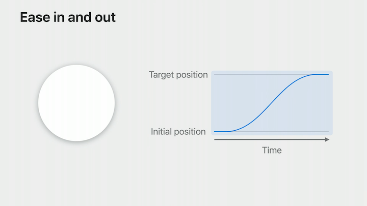
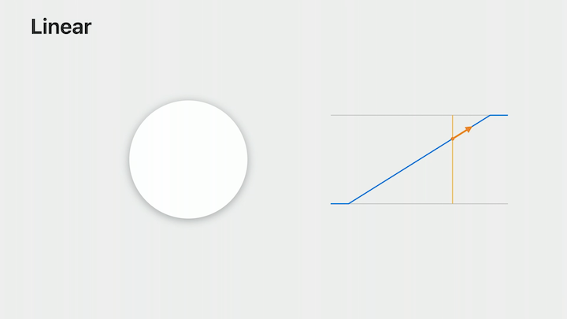
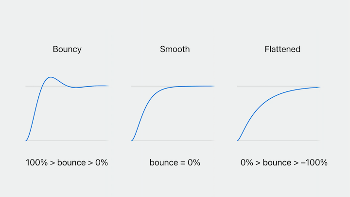
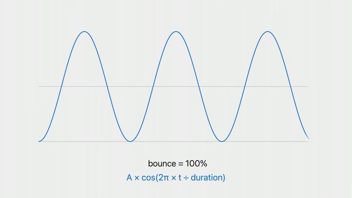
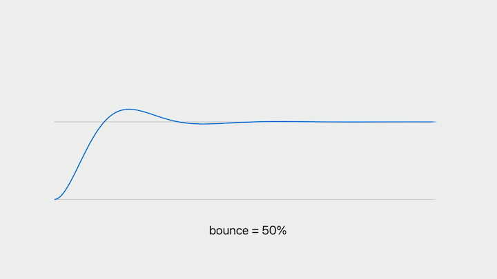
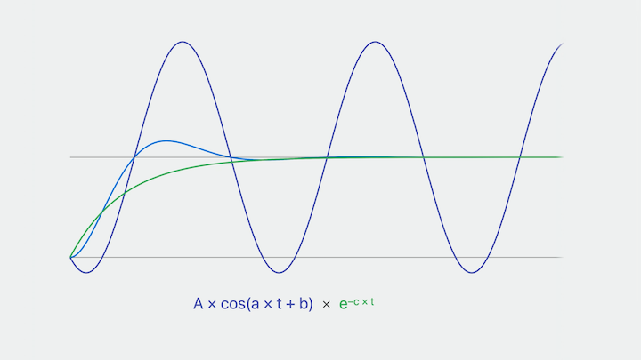
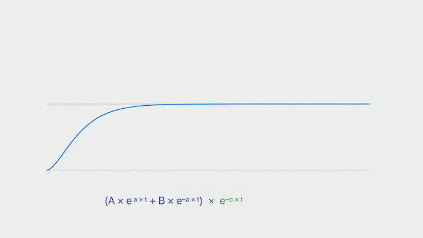
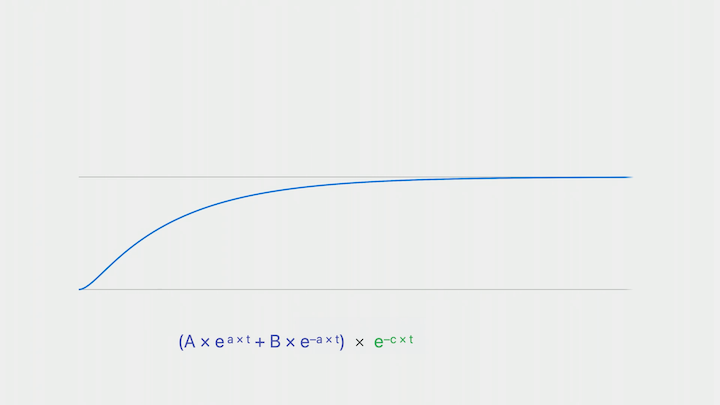
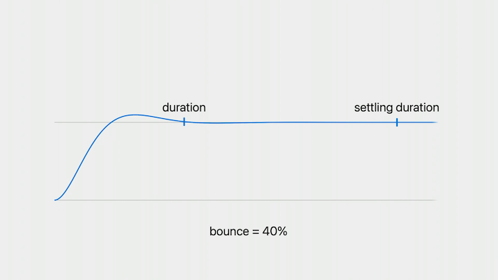

# [**Animate with springs**](https://developer.apple.com/videos/play/wwdc2023/10158/)

---

#### **Why springs**

* One of the most important reasons to use animations is that they give us a better sense of continuity
    * It feels much more natural if we see the object move from one place to the next.
    * It's not just about the position - if an object's velocity suddenly changes, that also feels unnatural

#### Animation Types

* Start by looking at EaseInOut
    * A type of Bezier curve animation, which means that its motion is defined by a combination of a curve and a duration
    * The curve in the chart doesn't have any jumps, that means that its position is continuous
    * The velocity is continuous as well



* Linear animation
    * There's a sharp corner and a jump in velocity as the animation starts and ends
    * Linear animations can be useful as a specialized tool in some places, like a repeating spinning indicator
    * Not as useful for movement, where it has this non-physical behavior that generally feels out of place



* Spring animation
    * Has continuous position and velocity as well, like `easeInOut`

#### Combining gestures and animations

* What happens if we "throw" an item from one end of the animation to another by dragging and letting go between the start and end:
    * With an `easeInOut` animation, it does animate to the end, but its motion jerks to a halt as the gesture ends
        * This type of animation is just a pre-specified curve, so there's no way to represent an initial velocity. This gets even worse if we also allow our knob to be dragged to any position in 2 dimensions
    * A spring can start with any initial velocity, so we get a natural feeling where our animation picks up right where the gesture ends
        * Works great for 2 dimensional drags as well
    * SwiftUI will now automatically track velocities any time a gesture is changing properties
    * Springs are the only type of animation that maintains continuity both for static cases and cases with an initial velocity

#### Spring motion

* Springs can have bounce, but that is not necessary
* Used in animations all over iOS
* The motion very slowly and gradually comes to rest, without a single point where it's abruptly finished

#### **How springs work**

* Three properties define the motion of the spring:
    * The object's mass
    * The spring's stiffness
    * The damping of the system - a measure of how much friction is applied to the object by its surroundings
* Uses the initial position of the animation as the initial position of the object, and the target position of the animation to define the resting position of the spring, where the object will get pulled towards
* These three properties are not very intuitive, though, and can be difficult to use to properly change the animation curve
* There is a new way to configure springs using two parameters: duration and bounce
    * Increasing the duration makes the animation take longer
    * Increasing the bounce adds bounce to the animation
    * All Apple frameworks that support springs will use this new configuration option



* A spring with a bouncy curve overshoots with an oscillation
* Making the bounce exactly 100% would make it oscillate forever in a cosine curve



* As we decrease bounce, that's physically equivalent to adding friction or damping to the spring, which slows it down as it goes
    * We still have those oscillations - in fact, the cosine curve from before is still there



* In the original curve, the size of the oscillations is getting smaller, or decaying, over time. And that's the piece that's missing. This additional curve is an exponential decay curve. And it's the last piece of our motion, the part that gives us the gradual feeling of coming to rest.
    * The curve is just the product of these two components, which is called a damped cosine or sine wave
    * Springs are able to match any initial velocity by using different shifts and scales in the cosine curve to give our animation the proper start
        * The initial velocity can come from the velocity of a gesture as it ends and hands off to an animation, or because an animation is ongoing when the new animation is started



* If we decrease our bounce, the oscillations get farther and farther apart, until when bounce gets all the way to 0, the oscillations are completely gone and we just have a straight line going down and away that's getting multiplied by our decay
    * These equations are even simpler. We just need the basic equation of a line, and then we multiply that by the same exponential, giving us our resulting curve



* Flattened curves, which are springs with negative bounce, work very similarly
    * Use two exponential functions added together instead of a line
    * Useful for representing decaying velocity, like with a scroll view



* The amount of time until a spring animation (which would technically go on forever) no longer makes a noticeable difference to our UI is called the `settling duration`
    * This is different from the `duration` parameter for configuring a spring
    * The `duration` parameter is a perceptual duration that is chosen to be predictable and not move around, even as the other parameters of a spring change
    * Because of its unpredictable nature, you shouldn't wait for the `settling duration` for user-facing changes
    * If you want to make a UI change when a spring is mostly done, you can use the new completion handler support in SwiftUI, which uses a perceptual duration instead of a settling duration



#### **How to use springs**

* `withAnimation` now defaults to a spring animation
    * `.smooth`, `.snappy`, and `.bouncy` are presets
    * Presets can also be used with a `duration` or `extraBounce` parameter

```swift
withAnimation(.snappy) {
  // Changes
}

withAnimation(.snappy(duration: 0.4)) {
  // Changes
}

withAnimation(.snappy(extraBounce: 0.1)) {
  // Changes
}
```

* Can also make a completely custom spring with the `.spring` animation
    * Can fully specify duration and bounce
        * Bounce values have a range from -1.0 to 1.0
    * Can be used in SwiftUI, UIKit, and Core Animation

```swift
withAnimation(.spring(duration: 0.6, bounce: 0.2)) {
  // Changes
}

// UIKit
UIView.animate(duration: 0.6, bounce: 0.2) {
  // Changes
}

// Core Animation
let animation = CASpringAnimation(perceptualDuration: 0.6, bounce: 0.2)
```

* A `Spring` model type has also been added to SwiftUI that lets you create a representation of a spring, including its parameters
    * Lets you programmatically convert parameters between the different ways to specify them
* You can also create a spring model with a set of parameters, like mass, stiffness, and damping, and then use it as a spring animation directly

```swift
let mySpring = Spring(duration: 0.5, bounce: 0.2)
let (mass, stiffness, damping) = (mySpring.mass, mySpring.stiffness, mySpring.damping)


let otherSpring = Spring(mass: 1, stiffness: 100, damping: 10)
withAnimation(.spring(otherSpring)) {
    // Changes
}
```

* If you _really_ want to do a conversion yourself, use these equations:

```lang-tex
mass = 1

stiffness = (2π ÷ duration)^2

damping = 1 - 4π × bounce ÷ duration, bounce ≥ 0
          4π ÷ (duration + 4π × bounce), bounce < 0
```

* You can call methods on the spring to get the built in spring evaluation math for yourself
* You can call value to get the position of the spring
    * You just pass in a target, which is what the spring is moving towards, and the time you want to evaluate it at
* You can also use the same inputs on a velocity method to evaluate the spring's velocity over time

```swift
let mySpring = Spring(duration: 0.4, bounce: 0.2)
let value = mySpring.value(target: 1, time: time)
let velocity = mySpring.velocity(target: 1, time: time)
```

* You can build your own custom animations by calling into the spring model and modifying the inputs/outputs to apply customization to a spring animation
    * [**Explore SwiftUI animation**](Explore SwiftUI animation.md) session

```swift
func animate<V: VectorArithmetic>(
    value: V, time: Double, context: inout AnimationContext<V>
) -> V? {
    spring.value(
        target: value, initialVelocity: context.initialVelocity,
        time: effectiveTime(time: time, context: context))
}
```

#### Choosing animation values

* Generally best to start by finding a duration value that gives a pacing that you like
* Once you have that, adjust the amount of bounce
    * A bounce of `0` feels like a smooth, gradual change
    * A small bounce, like around `15%`, doesn't feel very bouncy yet, but the long tail feels a little more brisk
    * For larger bounce values like `30%`, you do start to feel some noticeable bounciness
    * Be cautious about using values higher than around 0.4, since they may feel too exaggerated for a UI element

```swift
withAnimation(.spring(duration: 0.5)) {
    isActive.toggle()
}


withAnimation(.spring(duration: 0.5, bounce: 0.15)) {
    isActive.toggle()
}


withAnimation(.spring(duration: 0.5, bounce: 0.3)) {
    isActive.toggle()
}
```

* When you're not sure, use a spring with bounce 0, which is also what you get if you don't specify the bounce
    * Gives a great general purpose spring that's the most versatile
    * If you want your animation to feel a little more playful, start to add some bounce
        * Bounce can also make sense when you want an animation to feel more physical, like if it's going to be used at the end of a gesture
    * Keep in mind is consistency - what kind of app do you have? Serious/playful/relaxed/fast-paced? Be consistant through the app.
