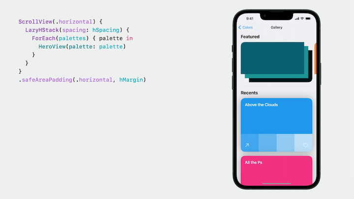
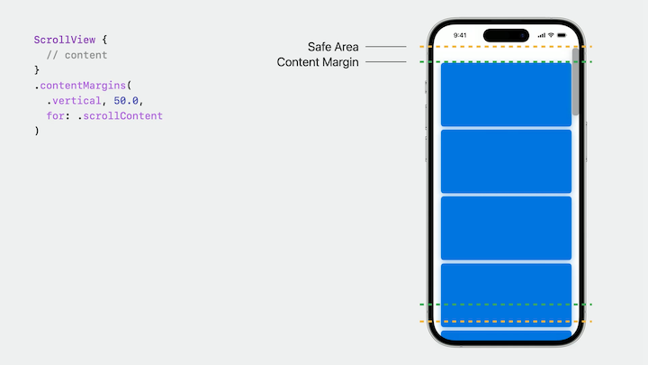
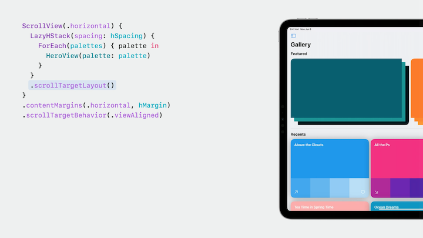
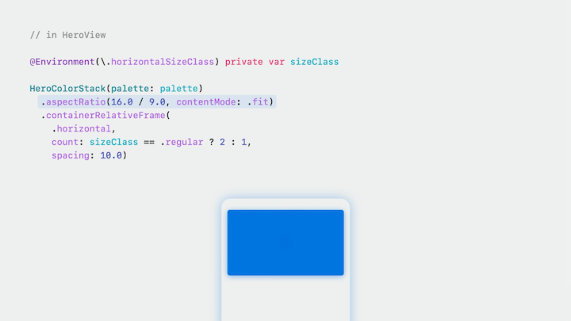
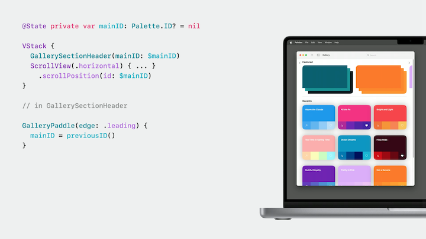
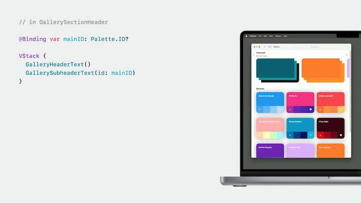
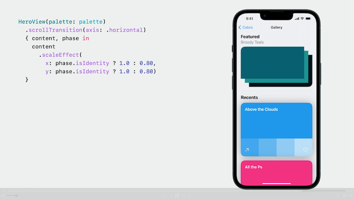

# [**Beyond Scroll views**](https://developer.apple.com/videos/play/wwdc2023/10159/)

---

* ScrollViews ensure that the content is placed within the safe area by resolving the safe area into margins outsetting its content
* A ScrollView evaluates its content eagerly by default
    * You can change this behavior by using a lazy stack
* The exact position of where the ScrollView is scrolled within the content is called the content offset
    * SwiftUI has offered the ScrollViewReader API as a way to control the content offset
    * This year, SwiftUI is introducing more ways to both influence and react to the content offset managed by a ScrollView

### **Margins and safe area**

* When adding a margin to a scrollview, the content will be split
    * The new `.safeAreaPadding(...)` modifier adds padding to the safe area, so content will not be clipped



* Safe areas most commonly come from the device your app is running on
    * They can also come from APIs like the `.safeAreaPadding` or `.safeAreaInset` modifier
    * A ScrollView resolves the safe area into the margins it applies to its content
        * This includes content you are responsible for, but also additional content that the ScrollView is responsible for like scroll indicators
        * This means it's not possible to configure different insets for different kinds of content by modifying the safe area
* To apply different insets, use the new content margins API
    * Allows you to inset the content of the ScrollView separately from the scroll indicators



### **Targets and positions**

* By default, a ScrollView uses a standard deceleration rate along with the velocity of the scroll to calculate the target content offset the scroll should end at
    * It does not take into account things like the size of the ScrollView or its content
    * You can change how a ScrollView calculates this target content offset with the `.scrollTargetBehavior` modifier
        * Takes a type conforming to the `ScrollTargetBehavior` protocol
        * The paging behavior has a custom deceleration rate and chooses where to scroll based on the containing size of the ScrollView itself


* The `viewAligned` behavior aligns the ScrollView to views
    * The ScrollView needs to know which views it should consider for alignment
        * These views are called scroll targets, and there's a new family of modifiers to specify which views are scroll targets
        * You can mark scroll target layout modifier to have each view in the lazy stack be considered a scroll target
            * You can also mark individual views as targets using the `.scrollTargetModifier`
            * When using lazy stacks, it's important to use the `.scrollTargetLayoutModifier`
                * Views outside the visible region have not yet been created - the layout knows about which views it will create, so it can make sure the ScrollView scrolls to the right place



* The paging and view aligned behaviors are built off of the new `ScrollTargetBehavior` protocol
    * SwiftUI provides common behaviors for you
    * You can conform your own types to this protocol and implement your own custom behavior
        * One required method: `updateTarget(_ target:, context)`
        * SwiftUI calls this method when calculating where a scroll should end, but also in other contexts like when the ScrollView changes size

```swift
struct GalleryScrollTargetBehavior: ScrollTargetBehavior {
    func updateTarget (_ target: inout ScrollTarget, context: TargetContext) {
        if target.rect.minY < (context.containerSize.height / 3.0),  context.velocity.dy < 0.0 {
            target.rect.origin.y = 0.0
        }
    }
}
```

* For a scenario where we'd like to have a view in relation to the overall width of the device on iPhone, and on iPad, have two views fit evenly within the device's width:
    * Previously you would've had to use a GeometryReader to accomplish this
    * Now we can use a new API called the `.containerRelativeFrame` modifier.
        * Can just provide an axis, like `.horizontal`
        * Can also create a grid-like layout by providing a `count` and `spacing`
        * Can conditionalize based on size class (now available on all platforms)



#### Scroll Indicators

* Can still hide with the existing `.scrollIndicators(.hidden)` API
* On a Mac with a mouse, the indicators are still visible, and scrolling can be hard with a mouse swipe action
* The default behavior of the `scrollIndicators` modifier is to hide the indicators when using more flexible input devices, like trackpads, but to allow the indicators to show when a mouse is connected
    * You can provide use `.scrollIndicators(.never)` to always hide the indicators regardless of input device
    * When doing this, we'll want to provide a way for mouse users to scroll by using the `.scrollPosition(id:)` modifier
        * This associates a binding to a state wrapping an identifier, we can pass that to the scrollPosition modifier which the ScrollView will read from and to my header view
        * We can write to the binding like any other piece of state, and the scrollView will scroll to the view with that ID
        * This modifier also allows us to know the identity of the view currently scrolled to

| Scroll Position Modifier | Scrolled-To View |
| ------------------------ | ---------------- |
|  |  |

### **Scroll transitions**

New API called ScrollTransitions in SwiftUI

* A transition describes the changes a view should undergo when its appearing or disappearing
    * When a view has appeared, it's in its identity phase where no customizations should be applied
    * A `.scrollTransition` describes a similar set of changes as a transition but instead applies those as a view enters the visible region of a ScrollView and then leaves the visible region
    * By default, when the view is in the center of the visible region, it's in the identity phase of the `.scrollTransition`
    * The example below scales down the view a bit when it is near the edges of the ScrollView



* `.scrollTransition` works with a new protocol called `VisualEffect`
    * This protocol provides a set of customizations for view content that are safe to use as functions of layout like the content offset of a ScrollView
    * Can customize scale, rotation, offset
    * Cannot customize the font
    * Anything that will change the overall content size of the ScrollView cannot be used within a `.scrollTransition` modifier
