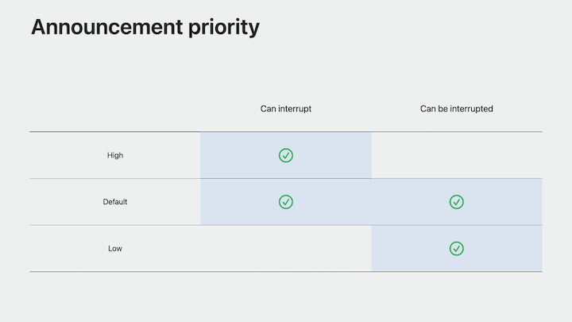
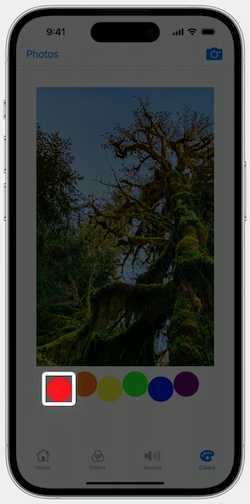
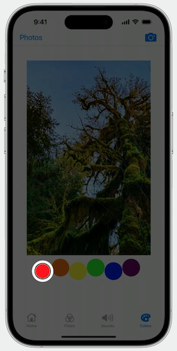

# [**Build accessible apps with SwiftUI and UIKit**](https://developer.apple.com/videos/play/wwdc2023/10036/)

---

### **Accessibility enhancements**

* The new `isToggle` accessibility trait provides the proper accessibility hint and "switch button" description
    * Available in SwiftUI and UIKit

```swift
import SwiftUI

struct FilterButton: View {
    @State var filter: Bool = false

    var body: some View {
        Button(action: { filter.toggle() }) {
            Text("Filter")
        }
        .background(filter ? darkGreen : lightGreen)
        .accessibilityAddTraits(.isToggle)
    }
}


import UIKit

class ViewController: UIViewController {
    override func viewDidLoad() {
        super.viewDidLoad()

        let filterButton = UIButton(type: .custom)

        setupButtonView()

        filterButton.accessibilityTraits = [.toggleButton]

        view.addSubview(filterButton)
    }
}
```

#### Accessibility Notifications

* Provide a unified, multi-platform way to create announcements to convey information to someone using an assistive technology in your app
* Available for apps running SwiftUI, UIKit, and AppKit
* Send `Announcement`, `LayoutChanged`, `ScreenChanged`, and `PageScrolled` notifications notifications in a way that is native to Swift
* Use `AccessibilityNotification.Announcement("Announcement Text").post()` to post the announcement

```swift
import SwiftUI

struct ContentView: View {
    var body: some View {
        NavigationView {
            PhotoFilterView
                .toolbar {
                    Button(action: {
                        AccessibilityNotification.Announcement("Loading Photos View")
                            .post()
                    }) {
                        Text("Photos")
                    }
                }
        }
    }
}
```

* When posting multiple announcements in succession, announcements will interrupt each other
* You can set an announcement's priority
    * Gives you more control over which announcements people need to hear, versus announcements that can be ignored if not spoken in time
    * High, Default, and Low Priorities



```swift
import SwiftUI

struct ZoomingImageView: View {
  
    var defaultPriorityAnnouncement = AttributedString("Opening Camera")

    var lowPriorityAnnouncement: AttributedString {
        var lowPriorityString = AttributedString("Camera Loading")
        lowPriorityString.accessibilitySpeechAnnouncementPriority = .low
        return lowPriorityString
    }
    
    var highPriorityAnnouncement: AttributedString {
        var highPriorityString = AttributedString("Camera Active")
        highPriorityString.accessibilitySpeechAnnouncementPriority = .high
        return highPriorityString
    }
  
    // ...
}

import SwiftUI

struct CameraButton: View {
    var body: some View {
        Button(action: {
            // Open Camera Code
            AccessibilityNotification.Announcement(defaultPriorityAnnouncement).post()
            // Camera Loading Code
            AccessibilityNotification.Announcement(lowPriorityAnnouncement).post()
            // Camera Loaded Code
            AccessibilityNotification.Announcement(highPriorityAnnouncement).post()
        }) {
            Image("Camera")
        }
    }
}
```

Same code as above, but for UIKit

```swift
class ViewController: UIViewController {
    let defaultAnnouncement = NSAttributedString(string: "Opening Camera", attributes: 
        [NSAttributedString.Key.UIAccessibilitySpeechAttributeAnnouncementPriority: 
        UIAccessibilityPriority.default]
    )

    let lowPriorityAnnouncement = NSAttributedString(string: "Camera Loading", attributes:   
        [NSAttributedString.Key.UIAccessibilitySpeechAttributeAnnouncementPriority:
        UIAccessibilityPriority.low]
    )

    let highPriorityAnnouncement = NSAttributedString(string: "Camera Active", attributes: 
        [NSAttributedString.Key.UIAccessibilitySpeechAttributeAnnouncementPriority:  
        UIAccessibilityPriority.high]
    )

    // ...
}
```

#### Accessibility Zoom

* Allows people to zoom in and out on UI elements when assistive technologies are enabled
* Add the `accessibilityZoomAction` on the image in the body of the `ZoomingImageView` struct
    * Based on the direction of the zoom action, zoom the content in or out and post an accessibility notification announcement

```swift
struct ZoomingImageView: View {
    @State private var zoomValue = 1.0
    @State var imageName: String?

    var body: some View {
        Image(imageName ?? "")
            .scaleEffect(zoomValue)
            .accessibilityZoomAction { action in
                let zoomQuantity = "\(Int(zoomValue)) x zoom"
                switch action.direction {
                case .zoomIn:
                    zoomValue += 1.0
                    AccessibilityNotification.Announcement(zoomQuantity).post()
                case .zoomOut:
                    zoomValue -= 1.0
                    AccessibilityNotification.Announcement(zoomQuantity).post()
                }
            }
    }
}
```

* Works with UIKit as well
    * Create a zoom view which will contain the image view
    * Add the `supportsZoom` trait to the zoom view alongside the image trait
    * Implement `accessibilityZoomInAtPoint` and `accessibilityZoomOutAtPoint`, each of which return a boolean to indicate zooming success or failure
    * In each of these methods, we update the zoom scale and post an announcement to indicate the zoom change

```swift
import UIKit

class ViewController: UIViewController {
    let zoomView = ZoomingImageView(frame: .zero)
    let imageView = UIImageView(image: UIImage(named: "tree"))

    override func viewDidLoad() {
        super.viewDidLoad()
        zoomView.isAccessibilityElement = true
        zoomView.accessibilityLabel = "Zooming Image View"
        zoomView.accessibilityTraits = [.image, .supportsZoom]

        zoomView.addSubview(imageView)
        view.addSubview(zoomView)
    }
}


import UIKit 

class ZoomingImageView: UIScrollView {
    override func accessibilityZoomIn(at point: CGPoint) -> Bool {
        zoomScale += 1.0

        let zoomQuantity = "\(Int(zoomValue)) x zoom"  
        UIAccessibility.post(notification: .announcement, argument: zoomQuantity)
        return true
    }

    override func accessibilityZoomOut(at point: CGPoint) -> Bool {
        zoomScale -= 1.0

        let zoomQuantity = "\(Int(zoomValue)) x zoom" 
        UIAccessibility.post(notification: .announcement, argument: zoomQuantity)             
        return true
    }
}
```

#### Direct touch

* Sometimes, it is not ideal for VoiceOver to activate every time an element is touched
    * Especially if the action performed plays audio of any sort
* In these scenarios, people need to directly interact with your app to use it properly, without extra speech and sounds
* The `allowsDirectInteraction` trait allows for this
* Specify a region of the screen where VoiceOver gestures pass directly through to the app
* In the default state, VoiceOver both speaks and activates the content of the direct touch element
    * Can be useful if VoiceOver would be silent when someone touches an element so they can immediately hear the audio without having to activate the element first
* In addition to the `allowsDirectInteraction` trait, there are now two new direct touch options that will be supported
    * `silentOnTouch` ensures VoiceOver is silent when touching the direct touch area
    * `requiresActivation` makes the direct touch area require VoiceOver to activate the element before touch passthrough happens

```swift
import SwiftUI

struct KeyboardKeyView: View {
    var soundFile: String
    var body: some View {
        Rectangle()
            .fill(.white)
            .frame(width: 35, height: 80)
            .onTapGesture(count: 1) {
                playSound(sound: soundFile, type: "mp3")
            }            
            .accessibilityDirectTouch(options: .silentOnTouch)
    }
}
```

* Also works in UIKit
    * Create the key button as a `UIButton`
    * Add the `allowsDirectInteraction` accessibility trait
        * Required when setting accessibility direct touch options in UIKit
    * Add the `silentOnTouch` option for `accessibilityDirectTouchOptions`

```swift
import UIKit

class ViewController: UIViewController {
    let waveformButton = UIButton(type: .custom)

    override func viewDidLoad() {
        super.viewDidLoad()
        
        waveformButton.accessibilityTraits = .allowsDirectInteraction
        waveformButton.accessibilityDirectTouchOptions = .silentOnTouch
        waveformButton.addTarget(self, action: #selector(playTone), for: .touchUpInside)
        
        view.addSubview(waveformButton)
    }
}
```

### **Improve accessibility visual**

#### Accessibility content shape

* This kind sets an accessibility element's path and controls the appearance of accessibility elements on the screen
* Previously, the interaction content shape kind changed the accessibility shape and hit testing shape
* Now there is an accessibility content shape kind which will not impact the hit testing shape and only impact the shape of accessibility content.
* When an element needs a custom shape, such as a circle, the computed accessibility cursor visuals may obstruct other items on the screen
* When the `.accessibility` `.contentShape(...)` kind is applied to a view, it will update the underlying accessibility geometry for the element with the shape provided by the modifier

```swift
import SwiftUI

struct ImageView: View {
    var body: some View {
        Image("circle-red")
            .resizable()
            .frame(width: 200, height: 200)
            .accessibilityLabel("Red")
            .contentShape(.accessibility, Circle())
    }
}
```

| Without Accessibility Content Shape | With Accessibility Content Shape |
| ----------------------------------- | -------------------------------- |
|  |  |

### **Keep state up-to-date**

#### Block based attribute setters

* A new way in UIKit to keep the underlying accessibility attributes for views always in line with the presented UI
* Keeps underlying accessibility attributes up-to-date with the `.accessibilityValueBlock` property of a view
* Provides a closure for attributes
    * Must return the correct type for the attribute, which is an optional string
    * Use a weak reference to self to avoid a retain cycle
* Evaluates the closure every time a view is referenced

```swift
import UIKit 

class ViewController: UIViewController {
    var isFiltered = false

    override func viewDidLoad() {
        super.viewDidLoad()
        // Set up views
        zoomView.accessibilityValueBlock = { [weak self] in
            guard let self else { return nil }
            return isFiltered ? "Filtered" : "Not Filtered"
        }
    }
}
```
