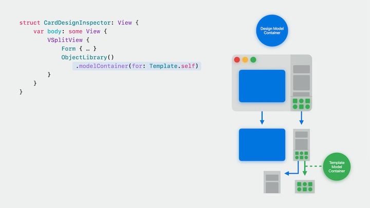
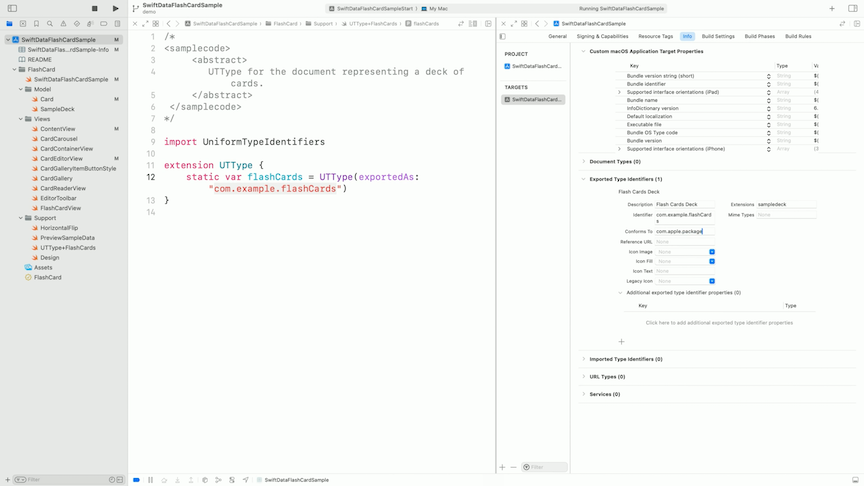
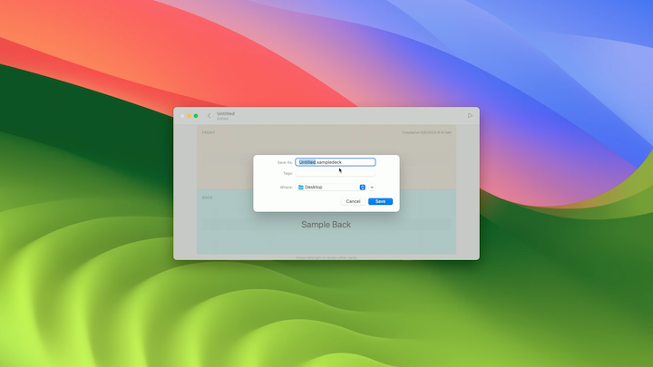

# [**Build an app with SwiftData**](https://developer.apple.com/videos/play/wwdc2023/10154/)

---

[**Meet SwiftData**](./Meet%20SwiftData.md) session

This session will focus on building a flashcard app that will work on all platforms. Highly suggested to follow along with the video, as it's a code-along.

Code downloads are available [here](https://docs-assets.developer.apple.com/published/a4a38c991c8a/BuildingADocumentBasedAppUsingSwiftData.zip)

### **Meet the app**

The app starts as a flash card app with the following features:

* A gallery view of all the cards
* A button to add a new card
* Tapping/Tapping on a card in the gallery takes you to a paging view where you can view a single card
    * Swiping left/right on a card transitions from one card to the next/previous
    * Tapping/Clicking on a card flips the card over to show the answer
* When the app closes, any added cards will not persist

### **SwiftData models**

* The code below defines our card class
    * Contains the text for both sides of the card, as well as the card's creation date
    * By adding `import SwiftData` and adding `@Model` to the class, we prepare the class to be used by SwiftData
    * By using `@Model`, the Card gets conformance to the `Observable` protocol
        * Because of this, we will remove `ObservableObject` and both `@Published`'s

```swift
// Original Code
final class Card: ObservableObject {
    @Published var front: String
    @Published var back: String
    var creationDate: Date

    init(front: String, back: String, creationDate: Date = .now) {
        self.front = front
        self.back = back
        self.creationDate = creationDate
    }
}


// Updated Code
import SwiftData

@Model
final class Card {
    var front: String
    var back: String
    var creationDate: Date

    init(front: String, back: String, creationDate: Date = .now) {
        self.front = front
        self.back = back
        self.creationDate = creationDate
    }
}
```

* In `CardEditorView.swift`, we previously used `@ObservedObject var card: Card` to edit the card in the UI
    * Now we can change that to `@Bindable var card: Card`
    * Watch the [**Discover Observation with SwiftUI**](./Discover%20Observation%20in%20SwiftUI.md) session to learn more about `@Observable`

### **Querying models to display in UI**

* We will query and show multiple cards in the UI  of `ContentView.swift`
* Previously this was done with `@State private var cards: [Card] = SampleDeck.contents`
    * Now this is done with `@Query private var cards: [Card]`

#### @Query

* Provides the view with data
* Triggers view update on every change of the models
* A view can have multiple `@Query` properties
* Offers lightweight syntax (e.g. `@Query(sort: \.created)`) to configure sorting, ordering, filtering, and even animating changes
* Uses `ModelContext` as the source of data

#### modelContainer

* New view modifier: `.modelContainer(for: Card.self)`
* Sets up the model container
* At least one model container must be setup to use SwiftData
* Creates the entire storage stack, including the context that `@Query` will use
* A view has a single model container, but an application can create an use as many as it needs
* Can also have a granular model container setup on the view level
    * Saving in one container will not affect another



* For this app, we open the `SwiftDataFlashCardSample.swift` file (with the `App` definition in it) and set the `.modelContainer(...)` modifier on the `WindowGroup`
    * Subviews can create, read, update, and delete only the model types listed in the view modifier

```swift
import SwiftData

@main
struct SwiftDataFlashCardSample: App {
    var body: some Scene {
        WindowGroup {
            ContentView()
        }
        .modelContainer(for: Card.self)
    }
}
```

* We can also provide previews with sample data
    * We will use the `PreviewSampleData.swift` file to define our preview data

```swift
#Preview {
    ContentView()
        .frame(minWidth: 500, minHeight: 500)
        .modelContainer(previewContainer)
}
```

### **Creating and updating**

* We use the model context of the view to track and save new cards, as well as edits to existing cards
* Done with the new `@Environment(\.modelContext) private var modelContext` Environment variable
    * Provides access to the model context
    * A view has a single model context
        * An application can has as many as it needs
    * Setting the model container automatically set our model context
* Saving a new card uses the following code:

```swift
@Environment(\.modelContext) private var modelContext

...

let newCard = Card(front: "Sample Front", back: "Sample Back")
modelContext.insert(object: newCard)
```

* No need to call `modelContext.save()`
    * SwiftData autosaves the model context
    * Autosaves are triggered by UI-related events and user input
    * Only a few cases when you want to make sure that all the changes are persisted immediately - e.g. before sharing the SwiftData storage or sending it over
        * In these cases, call `.save()` explicitly


### **Document-based apps**

* We want to open different flash card decks in different windows, essentially treating each deck like a document
* SwiftUI supports SwiftData-backed document apps
* We will create a separate app scene definition for iOS and macOS (where Document based apps exist)
* SwiftData Document-based apps need to declare custom content types
    * Each SwiftData document is built from a unique set of models and has a unique representation on disk
    * In the context of documents, it can be a binary file format, like JPEG
    * Another type of documents, a package, is a directory with a fixed structure on disk, like an Xcode project
    * When the user opens the deck, we need the operating system to associate the deck format and file extension with our app - that’s why we need to declare the content type

```swift
@main
struct SwiftDataFlashCardSample: App {
    var body: some Scene {
        #if os(iOS) || os(macOS)
        DocumentGroup(editing: Card.self, contentType: <#UTType#>) {
            <#code#>
        }
        #else
        WindowGroup {
            ContentView()
                .modelContainer(for: Card.self)
        }
        #endif
    }
}
```

* SwiftData documents are packages
    * If you mark some properties of a SwiftData model with the `externalStorage` attribute, all the externally stored items will be a part of the document package
* In `UTType+Flashcards.swift`, there is a definition of the new content type, so it can be used in code
    * We'll put the same definition in `Info.plist`




* Now that we have our content type, we can add `.flashCards` to our `DocumentGroup` initializer
    * We _do not_ setup the model container - the document infrastructure will set up one for each document

```swift
@main
struct SwiftDataFlashCardSample: App {
    var body: some Scene {
        #if os(iOS) || os(macOS)
        DocumentGroup(editing: Card.self, contentType: .flashCards) {
            ContentView()
        }
        #else
        WindowGroup {
            ContentView()
                .modelContainer(for: Card.self)
        }
        #endif
    }
}
```

* Now, when we create a new document, we can save it with the `.sampledeck` file extension
    * On the Mac/iPadOS, we can use `Command-S` to save a deck, `Command-N` to create a new one, and `Command-O` to open one


