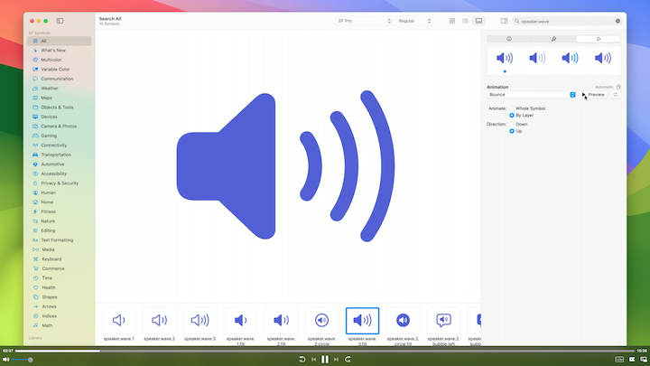
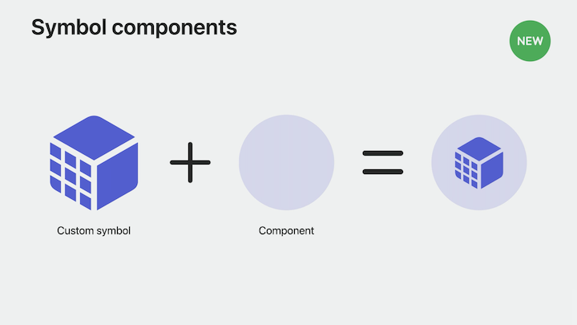
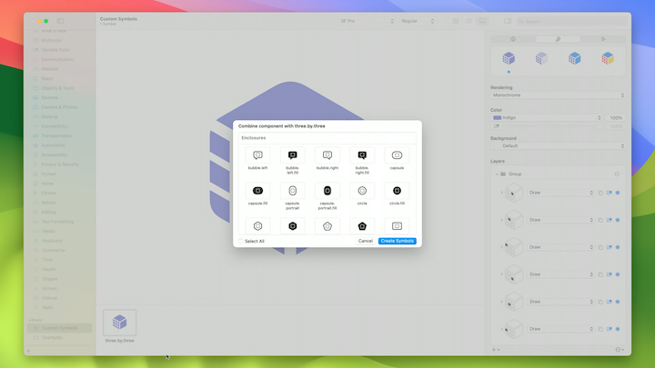
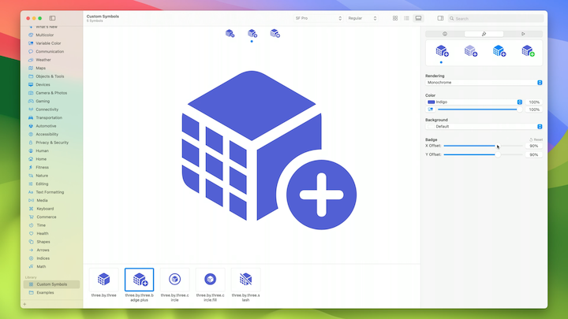
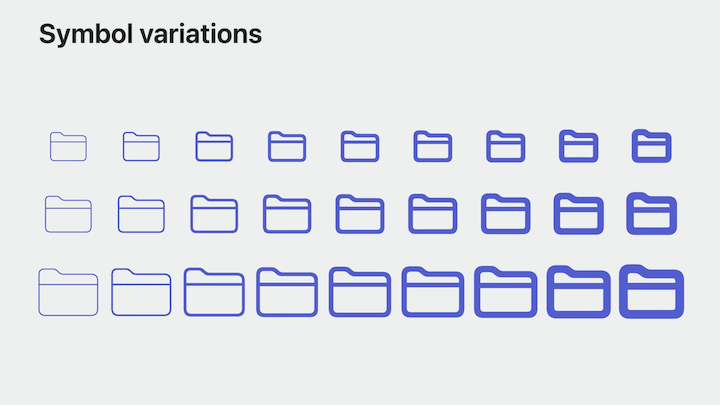
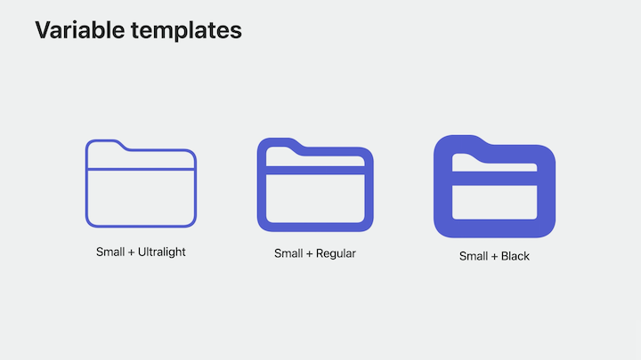
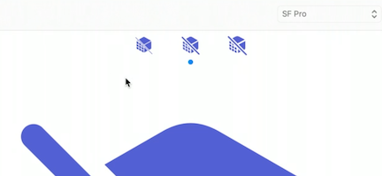
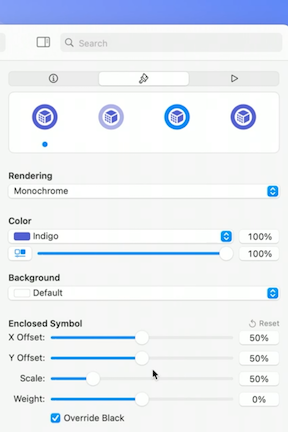

# [**Create animated symbols**](https://developer.apple.com/videos/play/wwdc2023/10257/)

---

Symbols are consistent, customizable, and expressive. With SF Symbols 5, they gain animation.

### **Previewing animations**

* New animation inspector added to the SF Symbols app
* Can select any of the new animations effects from a popup button
* If you hit the preview button, you can see that the animation playing in the main Gallery view
* The animation also plays in the symbol row below it and the preview area in the sidebar, so you can see it in all the different rendering modes
* Around the preview button, you'll see controls for configuring our animation
    * You can choose options like whether the symbol should bounce upwards or downwards, and whether you want the layers of the symbol to bounce separately or if you want the whole symbol to bounce at once
    * Changing these settings changes the label under the preview area from `Automatic` to `Modified`
        * Every animation type comes with default settings
        * When you launch the SF Symbols app, those default settings are pre-selected for you
        * When you switch to something other than the default, you'll see the word "Modified" here to let you know that you've changed the settings
        * You can click the reset button that appears here to get back to the defaults
    * Once you've found a configuration you like, click the `copy` button (to the right of the `Modified` label) to copy the name of the effect you will need

### **Animating custom symbols**

* Symbols that are built to support variable colors automatically get the variable color animation capability
* By default, the entire symbol will pulse with the pulse animation
    * There's a new control in the annotation list here that allows you to specify which layers should pulse when you're using the `By Layer` setting
    * If none of the layers in my symbol are marked, the whole symbol will pulse
    * By marking specific layers to pulse, then only those marked layers will pulse
* All of the other animations use motion
    * If you have symbols that were exported from version 4 or earlier of the SF Symbols app, or if they're exported to be compatible with Xcode 14, they won't include motion information, and they will always move as a whole symbol in your apps
    * When exporting from SF Symbols 5 for Xcode 15, by default, every layer in a symbol will move independently
        * You can now create groups of layers that can animate all of their sublayers together

### **Symbol components**

* When working with custom symbols that match the look of built-in symbols (e.g. putting a circular enclosure around a symbol), it's important to make the animations behave similarly as well
* Symbol components are the solution to doing this, rather than trying to take multiple steps to match several different animation styles
    * A symbol component provides artwork and behavior that looks and feels like a system-provided SF Symbol
    * Take one of your custom symbols, combine it with a symbol component, and you'll get a new symbol that, out-of-the-box, looks and feels like similar built-in symbols

To use symbol components:

* Right-click on the custom symbol and choose `Combine Symbol with Component` from the context menu
* In the sheet that shows up, you can choose from a variety of components, like enclosures, badges, and a slash component
* Can choose multiple components at once
* Click the `Create Symbols` button, and the new symbols will appear in your custom symbols library
* Get several default behaviors automatically:
    * The plus badge is colored correctly for multicolor
    * The slash animates separately
    * The `circle.fill` version is already set up to use a primary layer in hierarchical mode, but to erase through the circle behind it in monochrome
    * Also preserves variable color settings
* Can still make adjustments in the sidebar, where the animation controls normally are
    * Can nudge the position of a badge, change the length of the slash, and more

| Symbol Components List | Adjustments Sidebar |
| ---------------------- | ------------------- |
|  |  |

#### Scaling

* Also need to make sure your new symbol looks great in all of the different scales and weights that symbols support
* With three scales and nine weights, that's a total of 27 different variations...
* But variable templates take care of most of the work for you.
    * You only need to provide three drawings in the Small scale: one each for the Ultralight, Regular, and Black weights
    * As long at the bezier paths you used in each drawing are compatible, the system can mix your drawings together to create the remaining 24 possible variants

| Scales and Weights | Variable Templates |
| ------------------ | ------------------ |
|  |  |

* There's a set of previews at the top of the Gallery view so you can see your symbol in the three different weights and switch between them quickly
    * In many cases, you'll only need to make adjustments to the Regular weight and the changes will be carried over to Ultralight and Black
    * If you run into issues like overlaps in enclosures, or your symbol's shape needs different alignment, you can click the `Override` checkbox in the `Ultralight` or `Black` weights and make additional adjustments
    * The system will take these new adjustments into account when automatically creating in-between weights
    * The system is doing even more work behind the scenes for enclosures like this
        * As the base symbol is scaled down to fit in the enclosure, the system is using the base symbol's variable template to apply weight compensation, increasing the weight and thickness of the symbol as its size decreases
    * Can do additional fine-tuning to the enclosed symbol's weight to get the final visual result you want

| Preview Buttons | Override |
| --------------- | -------- |
|  |  |

### **Compatibility**

The experience within the SF Symbols app has been redesigned to help you make sure that your symbols will look and behave how you want them to on all the platforms that your app supports, even older ones

* When you export an editable template to modify a symbol's shape and structure, you'll now see a wireframe view, instead of the filled shapes that were previously shown in templates
    * This style in the template helps you focus on the shapes that make up your symbol during the drawing phase, and to wait until you're annotating your symbol in the app to mark which shapes draw color and which ones erase
* New compatibility picker when you export a template
    * By default, you get the newest symbols, many of which have been redrawn for motion
    * If you're targeting older platforms, the SF Symbols app will give you a template that better suits that platform
        * Only get the layer structures that are supported on all the platforms you are targeting
    * The same concepts apply to annotations
        * Will not be able to edit annotations that are not supported by all the platforms you are targeting
* When your symbol is ready to be exported for Xcode, all you need to do is tell the app what version of Xcode you'll be using
    * The app will choose the best file format to export, and help make sure that the file will work properly when compiled into an app that targets older platforms
