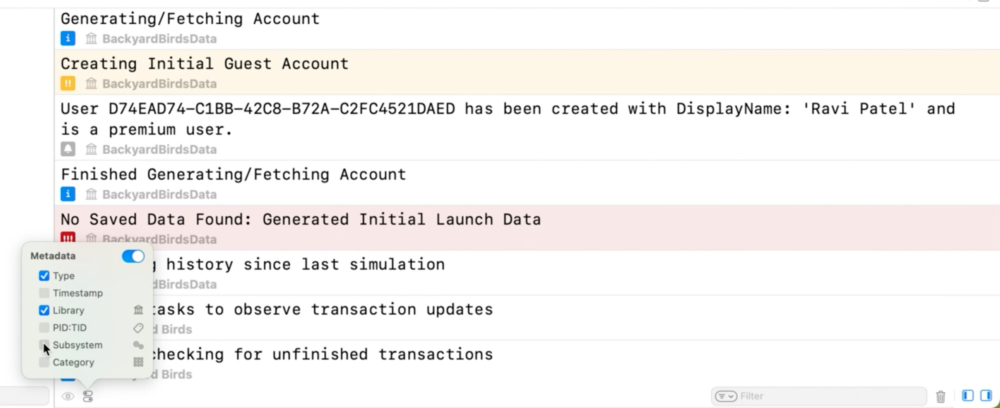
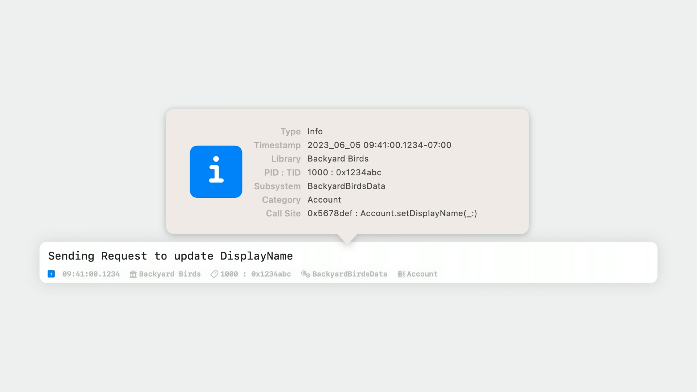
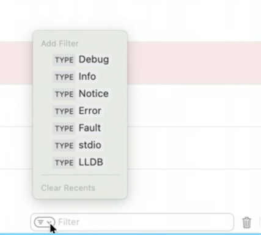
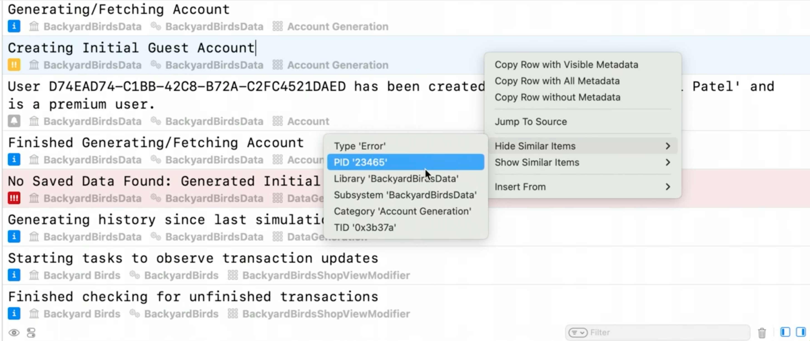
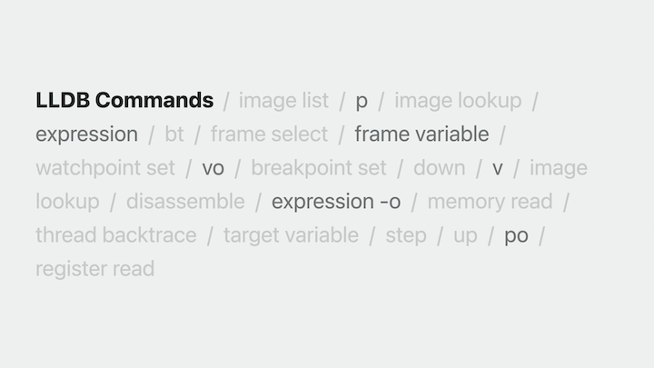
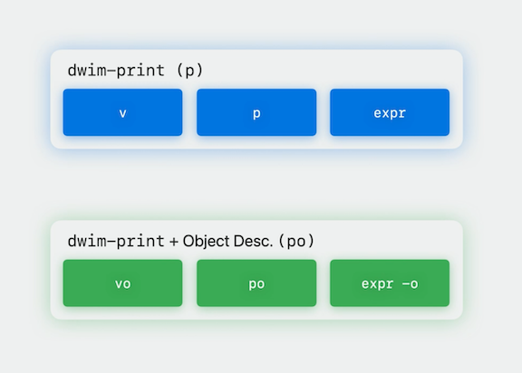

# [**Debug with structured logging**](https://developer.apple.com/videos/play/wwdc2023/10226/)

---

### **Tour Debug Console**

* The console is no longer prefixing each log with metadata
    * Instead, attention is focused on the underlying message the developer intended for viewing
    * Can still view the metadata by selecting the metadata options button in the lower left of the Debug Console and choosing the types best suited for the current need



* Some logs have a yellow or read background, indicating that these logs are of higher importance and represent an error and fault respectively
* The console allows me to inspect the metadata of a single log by selecting the log in question and then quick-looking it by pressing space
    * A pop-up window appears providing me with all available metadata. This even includes information like the call site where the name of the function that originally emitted the log is displayed



* The console can perform complex, tokenized filtering to easily locate logs that are most relevant to specific needs
* There are many different ways to create these filters
    * Can be entered directly in the filter bar
        * provides autocomplete for assistance in creating the filter
    * The filter menu provides quick access to filters for specific types of logs, allowing choosing the types to view
    * With a secondary click on a log, the console provides options to hide and show similar logs to quickly focus on or exclude a particular set of logs from the view

| Filter Menu | Secondary Click Options |
| ----------- | ----------------------- |
|  |  |

### **Live debugging**

* You can select auto-completed categories in the log filter menu
* If you hover over a log entry, you can see where in the source the logging is occurring
    * Clicking on this will jump to that location in the code
* Sometimes, `po` is not what you want to run if you have not declared a custom debug description for a class
    * In this case, you just want to run `p`

### **LLDB improvements**



* `dwim-print` has been added to simplify many of the common lldb expressions
    * You can use this single command to evaluate many different expressions while returning the result in the fastest possible way
    * `p` now redirects to `dwim-print` and can be used for the majority of use cases
    * When you do want to run `dwim-print` with an object description, `po` has been redirected to `dwim-print` with the custom object description



### **Tips for logging**

* `stdio` id for command-line UI, and `OSLog` is for debugging
    * `print` should rarely be used to log events in your program's execution
    * Far better to use `OSLog` to obtain structured logging from end users as well as retain structure in the Debug Console

#### Migration from print to OSLog example

* Original code, using print statements

```swift
func login(password: String) -> Error? {
    var error: Error? = nil
    print("Logging in user '\(username)'...")

    …

    if let error {
        print("User '\(username)' failed to log in. Error: \(error)")
    } else {
        loggedIn = true
        print("User '\(username)' logged in successfully.")
    }
    return error
}
```

* After adding a lot of logging, we start to add markers to the print commands to find where the output is coming from

```swift
func login(password: String) -> Error? {
    var error: Error? = nil
    print("🤖 Logging in user '\(username)'... (\(#file):\(#line))")

    //...

    if let error {
        print("🤖 User '\(username)' failed to log in. Error: \(error) (\(#file):\(#line))")
    } else {
        loggedIn = true
        print("🤖 User '\(username)' logged in successfully. (\(#file):\(#line))")
    }
    return error
}
```

* To use unified logging:
    * `import OSLog`
    * Create a log handle (`logger`)
        * Can add a subsystem and category here to help with log filtering - both can be any string
            * Common to use bundle id for subsystem and class/component name for category
    * Call the provided functions (e.g. `.info`, `.error`, `.notice`) to specify the level of log and provide a message to display

```swift
import OSLog

let logger = Logger(subsystem: "BackyardBirdsData", category: "Account")

func login(password: String) -> Error? {
    var error: Error? = nil
    logger.info("Logging in user '\(username)'...")

    //...

    if let error {
        logger.error("User '\(username)' failed to log in. Error: \(error)")
    } else {
        loggedIn = true
        logger.notice("User '\(username)' logged in successfully.")
    }
    return error
}
```

#### Get the most of ouf logging

* Create multiple log handles for different components of your application
    * Allows setting meaningful search terms on the underlying metadata to more quickly be able to locate logs most relevant to a section of your application
* Take advantage of OSLogStore to collect valuable diagnostics when issues occur with your application in the field
* OSLog is a tracing facility
    * Capable of providing you with complex performance analysis of your application using tools like Instruments
* [**Measuring Performance Using Logging**](https://developer.apple.com/videos/play/wwdc2018/405/) session from WWDC 2018
* [**Explore logging in Swift**](https://developer.apple.com/videos/play/wwdc2020/10168/) session from WWDC 2020
