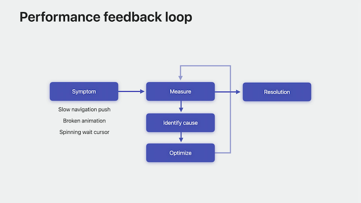
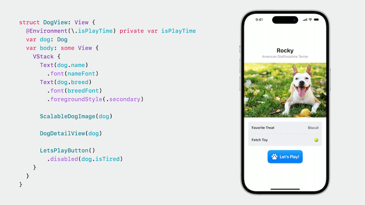
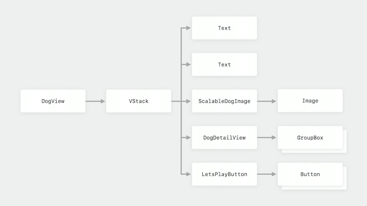
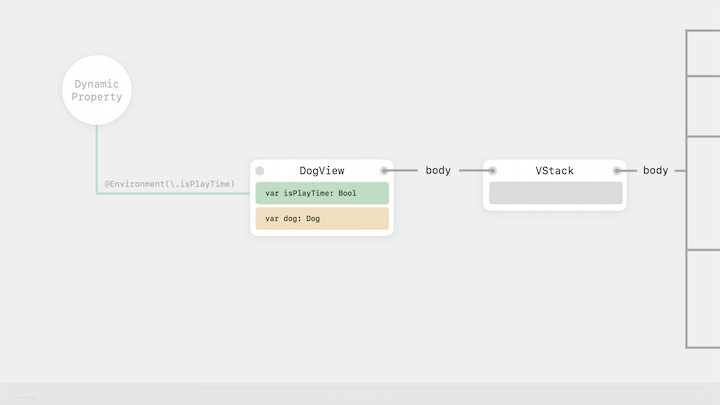
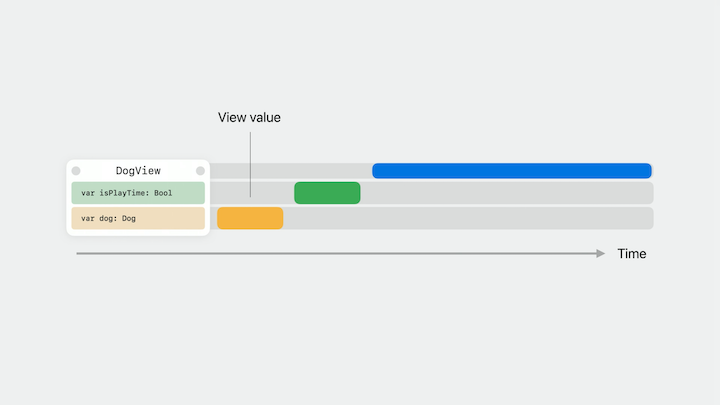
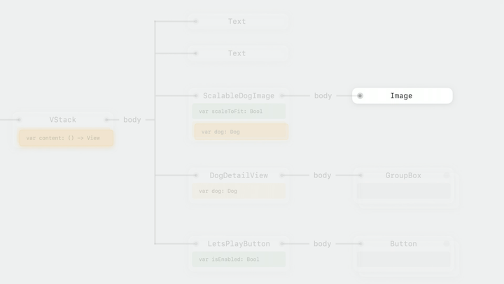
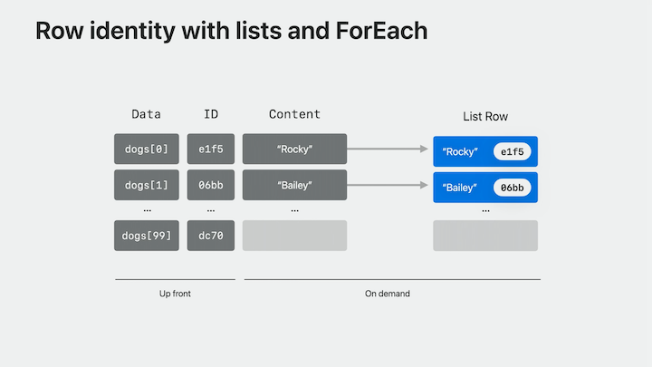
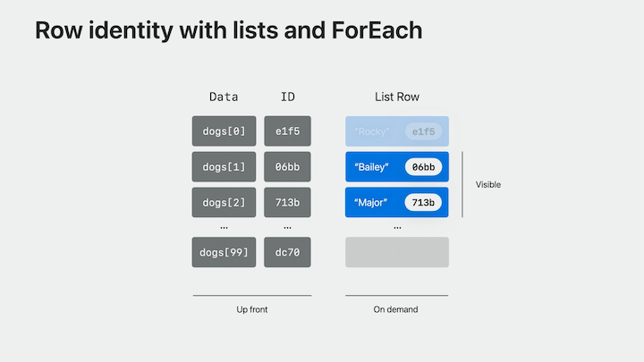
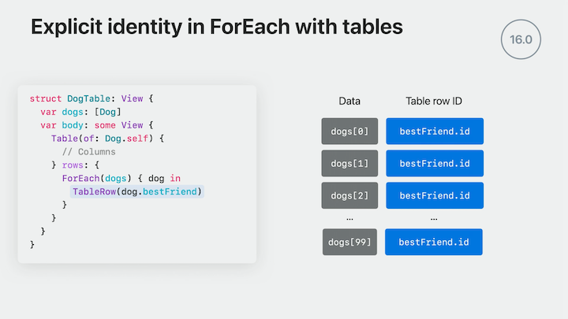

# [**Demystify SwiftUI performance**](https://developer.apple.com/videos/play/wwdc2023/10160/)

---



#### Prerequisites

* Cursory understanding of SwiftUI identity, including the difference between implicit and explicit identity
* Know the distinction between view lifetime and view identity
* [**2021 Demystify SwiftUI**](../2021/Demystify SwiftUI.md) session

### **Dependencies**

When looking at a view, it can be graphed to show dependencies

* In the view below, each arrow represents a view's body
    * The dog view produces a stack, and the stack has multiple children, like some text, the scalable dog image, the detail view, and the button
    * Each of those views has children, and the graph continues until it reaches a leaf view, like an image, text, or color
    * All views ultimately resolve to a leaf view

| Detail View | View Graph |
| ----------- | ---------- |
|  |  |

Looking more in depth at the view graph:

* Each child view is dependent on the view value that gets produced by its ancestor
* Dynamic properties are a common source of dependencies as well
    * The DogView reads whether it's play time from environment by using the `@Environment` property wrapper
    * It is dependent both on the value produced by its parent and the value from the environment



When the view updates, over time, the following happens

* The first step in the update process is to produce a new value for the view (yellow bar below)
    * This value encompasses all the stored properties of the view, like the dog value and the initial value of the dynamic property
* Next, SwiftUI updates all of the dynamic properties of the view, replacing their values with the current ones from the graph (green bar below)
* Finally, with the updated value, body runs to produce the view's children (blue bar below)
* This process recurses to update the interface, only updating those views that have new values or other changed dependencies
    * When a dog is marked as tired, we get a new `Dog` struct
    * This results in `DogView`producing new content for the stack, which updates the stack's children
    * This triggers `ScalableDogImage`to update, and in the end results in a new `Image`, which is a leaf view

| View Update Timeline | Recursive Dependency Graph |
| ----------- | ---------- |
|  |  |

#### Explore Dependencies

* It's important to reduce updates to only necessary ones
    * You can use `Self._printChanges` to print out why the SwiftUI graph evaluator called into a view's body (see code below)
    * Use for debugging only, this has a runtime impact. Never submit a call to this method to the App Store.
    * You can also use `expression Self._printChanges()` in the lldb console if you set a breakpoint

```swift
struct ScalableDogImage: View {
    @State private var scaleToFill = false
    var dog: Dog
    
    var body: some View {
    let _ = Self._printChanges()
        dog.image
            .resizable()
            .aspectRatio(
                contentMode: scaleToFill ? .fill : .fit)
            .frame(maxHeight: scaleToFill ? 500 : nil)
            .padding(.vertical, 16)
            .onTapGesture {
                withAnimation { scaleToFill.toggle() }
            }
    }
}

struct DogView: View {
    @Environment(\.isPlayTime) private var isPlayTime
    var dog: Dog
    var body: some View {
        VStack {
            Text(dog.name)
                .font(nameFont)
            Text(dog.breed)
                .font(breedFont)
                .foregroundStyle(.secondary)
        }

        ScalableDogImage(dog.image)

        DogDetailView(dog)

        LetsPlayButton()
            .disabled(dog.isTired)
    }
}
```

* Looking at the code above, the view is changing because the `Dog` value is changing
* The view only cares about the image, though - so we can eliminate the view reloading by only making the view dependent on the image
    * This reduces the dependencies to only those that matter
* We can also extract the header to its own view
    * This makes the code both easier to read and the dependencies of `DogHeader` are apparent at its use site

```swift
struct ScalableDogImage: View {
    @State private var scaleToFill = false
    var image: Image
    
    var body: some View {
    let _ = Self._printChanges()
        image
            .resizable()
            .aspectRatio(
                contentMode: scaleToFill ? .fill : .fit)
            .frame(maxHeight: scaleToFill ? 500 : nil)
            .padding(.vertical, 16)
            .onTapGesture {
                withAnimation { scaleToFill.toggle() }
            }
    }
}

struct DogView: View {
    @Environment(\.isPlayTime) private var isPlayTime
    var dog: Dog
    var body: some View {
        DogHeader(name: dog.name, breed: dog.breed)

        ScalableDogImage(dog.image)

        DogDetailView(dog)

        LetsPlayButton()
            .disabled(dog.isTired)
    }
}
```

#### View update tips

* Eliminate unnecessary dependencies
    * Fewer updates means better performance when data changes in an app
* Extract views if needed
* Explore using `Observable` to help with dependency scoping, as it automatically limits the dependencies to only those that are read
    * [**Discover Observation in SwiftUI**](Discover Observation in SwiftUI.md) session

### **Faster view updates**

Symptoms of slow updates

* Reduced responsiveness
* Hangs
    * A delay in responding to user input, like a view taking a long time to appear
    * [**Analyze Hangs in Instruments**](https://developer.apple.com/videos/play/wwdc2023/10248/) session
* Hitches
    * A user-perceivable animation issue, such as a pause during scrolling or skipped frames of an animation
    * Root causes of hangs and hitches, especially in SwiftUI, are often related
    * [**Explore UI animation hitches and the render loop**](https://developer.apple.com/videos/play/tech-talks/10855/) Tech Talk

#### Common sources of slow updates

* Both hangs and hitches in SwiftUI often originate from a slow update
    * Expensive dynamic property instantiation, such as allocating and initializing a state object or initializing state
    * Work done in body, such as expensive string interpolation or operations like data filtering and other work inside of body
        * Body should be as cheap as possible
    * Slow identification
        * e.g. a dynamic property could be computed from a view's body, making the view expensive to evaluate

* In the code below, `fetchDogs()` is called synchronously, and could take a long time. This can cause the view to be slow to appear.

```swift
struct DogRootView: View {
    @State private var model = FetchModel()
    
    var body: some View {
        DogList(model.dogs)
    }
}

@Observable class FetchModel {
    var dogs: [Dog]
    
    init() {
        fetchDogs()
    }
    
    func fetchDogs() {
        // Takes a long time
    }
}
```

* One way to fix this is to use the `.task` modifier, and make `fetchDogs()` async

```swift
struct DogRootView: View {
    @State private var model = FetchModel()
    
    var body: some View {
        DogList(model.dogs)
            .task { await model.fetchDogs() }
    }
}

@Observable class FetchModel {
    var dogs: [Dog]
    
    init() {}
    
    func fetchDogs() async {
        // Takes a long time
    }
}
```

#### Other hidden sources of work

* String interpolation can be expensive - cache any strings you need to frequently use
* Bundle lookup
* Heap allocations

### **Identify in List and Table**

Built-in improvements:

* macOS Sonoma and iOS 17 has added improvements for
    * Faster filtering
    * Reduced time to show large lists
    * Smoother scrolling
* These improvements require minimal effort, and in many cases, can result in drastically more responsive load and update times for bigger lists and tables

#### Lists and tables

* There are certain ways to construct lists and tables that result in better performance
* List and Table use identifiers to know what changes occurred to the data, and for consistency, all the IDs are gathered eagerly
* Row count is determined from content
    * Being able to quickly generate identifiers for your list and table contents directly translates to faster load and update times

#### Why identity matters

* Identity helps SwiftUI manage view lifetime, which is crucial for incremental updates to your hierarchy
    * A change to the identity means the view changed
    * This is important for animations and performance
    * [**Explore SwiftUI animation**](Explore SwiftUI animation.md) session
* Identification performance is important because identifiers are gathered often, especially for lists and tables
* The code example below is simple, but it's directly related to identity, and adding a `ForEach` in a `List` is an important time to evaluate performance
    * `ForEach` maps a collection of data onto a resulting sequence of views, producing explicit identity for each of its views
    * When you use `List`, SwiftUI needs to figure out how many rows to display, as well as what the identifier for each row is
        * It visits the data collection up front, determining each element's ID
    * The `content` closure of `ForEach` is used to produce each view
    * Rows are created on-demand. List uses a composite of the identity and the content to produce a list row
        * The rows created on-demand correlate to the visible region, plus some system-determined buffer for prefetching or accessibility

```swift
List {
    ForEach(dogs) {
        DogCell(dog: $0)
    }
}
```

| Row identity with lists and ForEach | Visible Rows |
| ----------------------------------- | ------------ |
|  |  |

* List needs to know all of its IDs up front, but it can only do this efficiently without visiting all the content if the content resolves to a constant number of rows
* If we want to want to filter our list, we _could_ use a conditional view, like the first code example below
    * This results in list needing to build all the views to retrieve the row identifiers because it doesn't know how many views each element resolves to
        * The same can be true if you use `AnyView` in our `ForEach`
* We also could use an inline filter like in the second code example below
    * This gives us a constant number of views per element, which is good
    * _But_, the inline filter is linear over the collection, so if the `.filter` operation becomes expensive, this could lead ot a slow update

```swift
List {
    ForEach(dogs) { dog in
        if dog.fetchToy == .ball {
            DogCell(dog)
        }
    }
}

List {
    ForEach(dogs.filter(...)) { dog in
        DogCell(dog)
    }
}
```

* What we want to do is move the filter out to the model, by creating a new observed `tennisBallDogs` object
    * This will cache the filter, so it won't run every time the list is constructed
    * The number of views per element is also constant

```swift
List {
    ForEach(tennisBallDogs) { dog in
        DogCell(dog)
    }
}
```

#### Tips for ensuring constant counts

* Avoid using `AnyView` in `ForEach`
* Use explicit stacks when appropriate
    * Note that certain modifiers like `listRowBackground` need to go after the stack and not within it
* Try to flatten nested ForEach constructions if you can

#### Sectioned Lists

* Dynamic sections are a good example of when using nested `ForEach` is recommended
    * `List` will need to retrieve all of the identifiers, but because we're using sections here, SwiftUI understands this construction and ensures the list is still fast to render
* The basic equation to think about is `row count = element count * views per element`
    * You need to ensure the number of views per element is a constant, or SwiftUI has to build the views in addition to the identifiers in order to identify the rows

```swift
// Sectioned example
struct DogsByToy: View {
    var model: DogModel
    var body: some View {
        List {
            ForEach(model.dogToys) { toy in
                Section(toy.name) {
                    ForEach(model.dogs(toy: toy)) { dog in
                        DogCell(dog)
                    }
                }
            }
        }
    }
}
```

#### Table identification

* The rules for `List` generally apply to `Table` as well
* `Table` uses `TableRow` instead of views, and `TableRow` always resolves to a single row
* Because TableRow is always a single row, the number of total rows here is just the number of elements in the dogs collection
    * This construction is so common that, new in iOS 17 and macOS Sonoma, SwiftUI provides a streamlined initializer that lets you simply write ForEach of your data collection and creates the table rows on your behalf
        * This initializer back deploys to all previous operating system versions where `Table` is available
        * Also enforces a constant number of rows for the ForEach content, which helps with identification performance

```swift
// Original Code
struct DogTable: View {
    var dogs: [Dog]
    var body: some View {
        Table(of: Dog.self) {
            // Columns
        } rows: {
            ForEach(dogs) { dog in
                TableRow(dog)
            }
        }
    }
}

// Streamlined code
struct DogTable: View {
    var dogs: [Dog]
    var body: some View {
        Table(of: Dog.self) {
            // Columns
        } rows: {
            ForEach(dogs)
        }
    }
}
```

* There is a semantic change I'd like to call out that's new:
    * Code like below could behave differently in the newest OS versions
    * We have a ForEach over dog, which also creates a row of dog; however the dogs here don't match - the values are the dog's best friend
        * In iOS 16, each row became identified by its value
        * In iOS 17, this behavior has changed to improve performance
    * Now we don't need to identify each table row by looking into the `ForEach`
        * So this example now has the IDs of each of the dogs, instead of the `TableRow`'s value
    * If you need to back deploy, you can get the old behavior by either mapping over your collection or by explicitly specifying an ID key path
* For table, the basic equation is slightly different: `row count = element count * TableRow per element`

| iOS 16 Table Identity | iOS 17 Table Identity |
| --------------------- | --------------------- |
|  |  |
