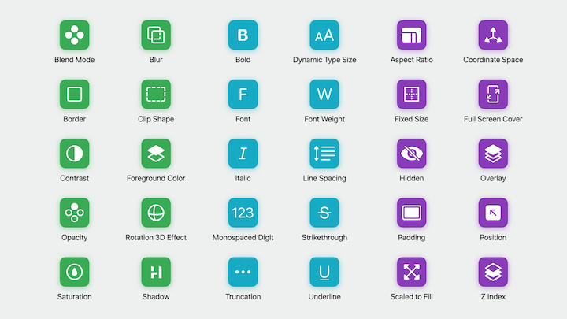
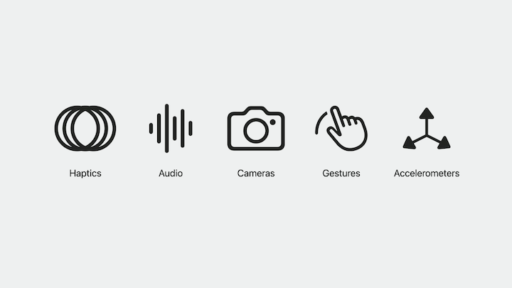
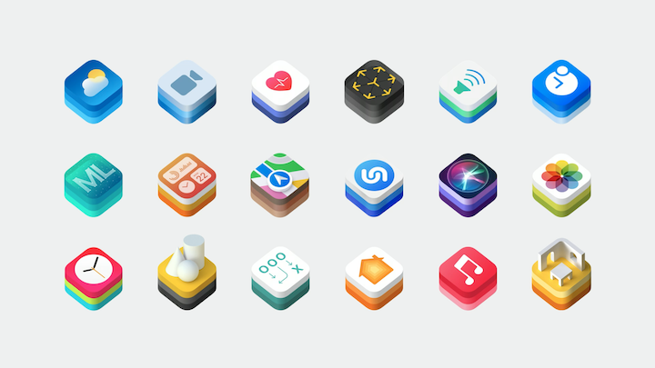
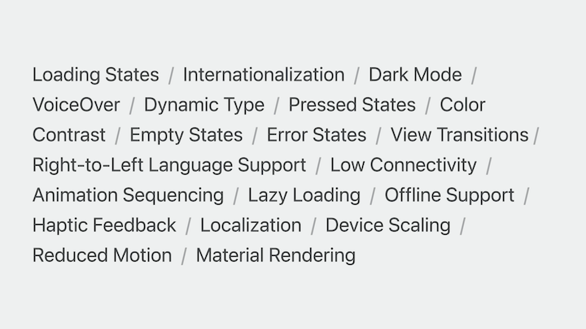

# [**Design with SwiftUI**](https://developer.apple.com/videos/play/wwdc2023/10115/)

---

### **SwiftUI as a design tool**

SwiftUI is built on the idea that common things should be easy and complex things should be possible

* Means you don't need to spend time recreating common UI elements
* At the same time, you won't feel limited when it's time to create something brand-new
* Visual canvas that allows you to view and interact with your designs in real time.
* SwiftUI provides you with Modifiers to change the appearance of things just as you would in any other design tool

* Built directly into the framework are easy access to system controls, like color pickers, and behaviors, like push transitions
* Using SwiftUI, it means you now have access to the unique capabilities of Apple hardware

* Can also take advantage of all the work that's gone into the dozens of Apple Frameworks
    * e.g. you can design with dynamic maps using MapKit, pull in live weather information from WeatherKit, or render objects in augmented reality using RealityKit

### **Getting the details right**

* SwiftUI helps by quickly surfacing all of those important details that need your attention

* You can easily go back and forth between separate prototypes and integrating them together into your app

### **Designing for interaction**

* Animations in SwiftUI are performant, easy to use, and fully interruptible
* Interactions give a sense of how designs feel, not just how they look

### **Testing your ideas**

* You can easily design and evaluate your work in real world scenarios
* For example, you can see how glare and sunlight impacts the readability of the cartography and interface
* Easy to use real data, such as movement/gps data in a mapping app
* Can easily create one-off design tools to change dynamic values (modifier values, etc.) on the fly to test designs quicker than with static tools

### **Presenting your work**

* Demos let designs explain themselves
* Make design reviews better, because they can be viewed, interacted with, etc., rather than explaining designs
