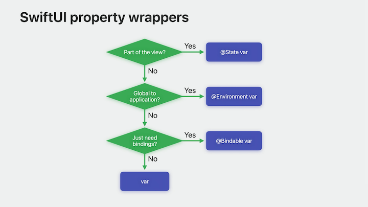

# [**Discover Observation in SwiftUI**](https://developer.apple.com/videos/play/wwdc2023/10149/)

---

### **What is Observation?**

* Swift feature for tracking changes to properties.
* It works with normal Swift types and transforms them with macros
* `@Observable` is all you need to make UI respond to changes in your data model
* Works with static or computed products
* The UI is only invalidated when a tracked value changes
* In the below code, if we removed `orderCount` and the `Section` that tracks it, if `orders` changed, the view would _not_ invalidate because the view wasn't tracking that parameter

```swift
@Observable class FoodTruckModel {
    var orders: [Order] = []
    var donuts = Donut.all
    var orderCount: Int { orders.count }
}

struct DonutMenu: View {
    let model: FoodTruckModel
        
    var body: some View {
        List {
            Section("Donuts") {
                ForEach(model.donuts) { donut in
                    Text(donut.name)
                }
                Button("Add new donut") {
                    model.addDonut()
                }
            }
            Section("Orders") {
                LabeledContent("Count", value: "\(model.orderCount)")
            }
        }
    }
}
```

* @Observable
    * Expands types using macros so they can support Observation
    * This lets SwiftUI track access to those properties and observe when the next property will change out of that Observations
    * This lets views recalculate their body only when specific properties change
    * [**Write Swift macros**](./Write%20Swift%20macros.md) session
    * [**Expand on Swift macros**](./Expand%20on%20Swift%20macros.md) session

### **SwiftUI property wrappers**

State, environment, and bindable are the three primary property wrappers for working with SwiftUI.

* When the view needs to have its own state stored in a model, use `@State`
    * In the below code, when the sheet is presented, the `donutToAdd` state variable is used to bind values to the editable fields
    * The `donutToAdd` property is managed by the lifetime of the view it's contained in

```swift
struct DonutListView: View {
    var donutList: DonutList
    @State private var donutToAdd: Donut?

    var body: some View {
        List(donutList.donuts) { DonutView(donut: $0) }
        Button("Add Donut") { donutToAdd = Donut() }
            .sheet(item: $donutToAdd) {
                TextField("Name", text: $donutToAdd.name)
                Button("Save") {
                    donutList.donuts.append(donutToAdd)
                    donutToAdd = nil
                }
                Button("Cancel") { donutToAdd = nil }
            }
    }
}
```

* `@Environment` lets values be propagated as globally accessible values
    * Lets things be shared in many places
    * `@Observable` types work great here since the updates created by them are based upon access
    * When invoking the body of the `FoodTruckMenuView` below, the property `userName` of the `Account` object is accessed. So when the `userName` will change, the menu view updates.

```swift
@Observable class Account {
    var userName: String?
}

struct FoodTruckMenuView : View {
    @Environment(Account.self) var account

    var body: some View {
        if let name = account.userName {
            HStack { Text(name); Button("Log out") { account.logOut() } }
        } else {
            Button("Login") { account.showLogin() }
        }
    }
}
```

* `@Bindable` is the newest property wrapper
    * Lightweight
    * Allows bindings to be created from a type
    * Connects references to the UI
    * Uses `$` syntax to create bindings
    * Reads from the binding to populate the value of a TextField, but it also writes back to the binding when the user changes the value

```swift
@Observable class Donut {
    var name: String
}

struct DonutView: View {
    @Bindable var donut: Donut

    var body: some View {
        TextField("Name", text: $donut.name)
    }
}
```




### **Advanced uses**

* So far, we've covered properties that start off in your model as stored.
* Because SwiftUI tracks access to fields per instance, it means that you can use arrays, optionals, or any type that contains your observable models.
* In the code below, when any of the names of those donuts change, SwiftUI detects the access to that property on that specific instance and tracks it to know when to invalidate the view
    * 

```swift
struct DonutList: View {
    var donuts: [Donut]
    var body: some View {
        List(donuts) { donut in
            HStack {
                Text(donut.name)
                Spacer()
                Button("Randomize") {
                    donut.name = randomName()
                }
            }
        }
    }
}
```

* Computed properties
    * if a computed property does not have any stored property it is comprised with, then two extra steps need to be taken to make it work with Observation
    * Need to rewrite the computed property with custom `get/set` methods so the non-observable location can be read and store the name (see code below)
    * Not needed normally, because most of the time properties of the models in question are composed from other stored properties
    * SwiftUI can identify changes in composition since it tracks observable types by access to those properties
    * So if a computed property is composed from other stored properties, then the Observation will just work
    * Can use Observation directly to manually add those calls to flag access and mutation

```swift
@Observable class Donut {
    var name: String {
        get {
            access(keyPath: \.name)
            return someNonObservableLocation.name 
        }
        set {
            withMutation(keyPath: \.name) {
                someNonObservableLocation.name = newValue
            }
        }
    } 
}
```

### **ObservableObject**

* When migrating from `@ObservableObject` to `@Observable`, you can:
    * Remove `@ObservableObject` conformance
    * Remove any `@Published` wrappers
    * Mark it with the `@Observable` macro

```swift
// Old Code
public class FoodTruckModel: ObservableObject {
    @Published public var truck = Truck()
    
    @Published public var orders: [Order] = []
    @Published public var donuts = Donut.all

    var dailyOrderSummaries: [City.ID: [OrderSummary]] = [:]
    var monthlyOrderSummaries: [City.ID: [OrderSummary]] = [:]
    ...
}

// New Code
@Observable public class FoodTruckModel {
    public var truck = Truck()

    public var orders: [Order] = []
    public var donuts = Donut.all

    var dailyOrderSummaries: [City.ID: [OrderSummary]] = [:]
    var monthlyOrderSummaries: [City.ID: [OrderSummary]] = [:]
    ...
}
```

* To migrate the views:
    * Remove the `@ObservedObject` wrapper
        * In some cases, you will need to replace `@ObservedObject` with `@Bindable` when you need to bind to an object in it
    * Change `@EnvironmentObject` to `@Environment`

```swift
// Old Code
struct AccountView: View {
    @ObservedObject var model: FoodTruckModel
    @EnvironmentObject private var accountStore: AccountStore
    @Environment(\.authorizationController) private var authorizationController

    @State private var isSignUpSheetPresented = false
    @State private var isSignOutAlertPresented = false
    ...
}

// New Code
struct AccountView: View {
    var model: FoodTruckModel

    @Environment(AccountStore.self) private var accountStore
    @Environment(AuthorizationController.self) private var authorizationController

    @State private var isSignUpSheetPresented = false
    @State private var isSignOutAlertPresented = false
    ...
}
```
