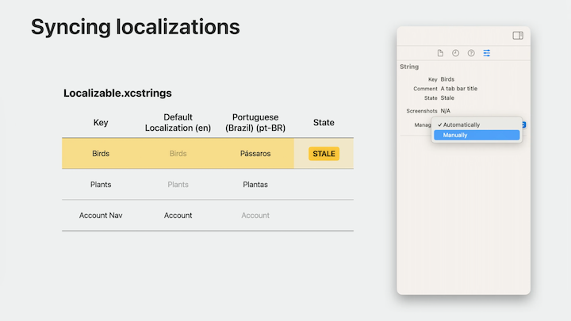

# [**Discover String Catalogs**](https://developer.apple.com/videos/play/wwdc2023/10155/)

---


* Previously, if you wanted to localize your app, you had to maintain strings and stringsdict files
    * This required you to manually keep all strings in sync with your code, and often times, you might miss localizing content.
* Xcode 15 introduces String Catalogs
    * Over time, this new format will supersede both strings and stringsdict files in Xcode
    * Strings are automatically extracted by Xcode into the String Catalog


* String Catalogs also come with powerful editing capabilities that allow complex operations to be done easily.
    * Can vary string by device (e.g. "click" on macOS, "tap" on iOS)

### **Extract**

* Localizable strings have 4 components:
    * Key (required) is a unique identifier for the string, often the string itself
    * Value (optional)
        * The default value can be specified explicitly if desired, but will otherwise fall back to the key in the default localization
    * Comment (recommended) provides a way to give the translator context about where and how the string is being used in the user interface
        * Useful to help resolve ambiguities for the translator
    * Table (optional, default: `Localizable`) corresponds to one or more files in which translations will be stored

* For an existing application using .strings files, a single string table actually contains .strings and possibly .stringsdict files within each supported language's lproj directory.
    * All of the files shown here make up the "Localizable" string table.
* A String Catalog contains an entire string table in a single file.
    * This includes all translations and extra metadata for each localizable string in that table.
    * You can organize your strings into multiple string tables by creating multiple String Catalogs.
        * Each Catalog holds the string keys belonging to that table, along with their translations in every language your app supports.
        * There is no requirement that keys be unique across tables.

| Strings Files | String Catalog |
| ------------- | -------------- |
|  |  |

Xcode finds localizable strings in the following places:


* Any time you specify a string literal within a view, that string is automatically considered localizable
    * Works for any parameter accepting a type of LocalizedStringKey
    * SwiftUI strings can use text views to specify comments, custom table names, or bundles for string lookup

```swift
// Localizable strings in SwiftUI

struct ContentView: View {
    var body: some View {
        VStack {
            // init(_ titleKey: LocalizedStringKey, systemImage name: String)
            // Text("Thanks for shopping with us!", comment: "Label above checkout button")
            Label("Thanks for shopping with us!", systemImage: "bag")
                .font(.title)

            HStack {
                Button("Clear Cart") { }

                Button("Checkout") { }
            }
        }
    }
}
```

* You can also define your own custom views that accept strings that should be considered localizable for clients
    * Use `LocalizedStringResource` as the `String` type
    * When Xcode sees a string literal being used to instantiate a LocalizedStringResource at the call site, it will know that string is localizable
    * LocalizedStringResource is the recommended type for representing and passing around localizable strings.
        * Supports initialization using a string literal, and can also be provided with a comment, table name, or even a default value that's different from the string key.

```swift
// Localizable strings in SwiftUI

struct CardView: View {
    let title: LocalizedStringResource
    let subtitle: LocalizedStringResource

    var body: some View {
        ZStack {
            RoundedRectangle(cornerRadius: 10.0)
            VStack {
                Text(title)
                Text(subtitle)
            }
            .padding()
        }
    }
}

CardView(title: "Recent Purchases", subtitle: "Items you’ve ordered in the past week.")
```

* In general Swift (not just SwiftUI)
    * You can use the `localized:` initializers on String and AttributedString to specify strings that you know will be displayed to the user at runtime
    * You can also use `LocalizedStringResource` directly anywhere you've imported Foundation
    * Make sure to enable the build setting `Use Compiler to Extract Swift Strings`

```swift
// Localizable strings in Swift

import Foundation

func stringsToPresent() -> (String, AttributedString) {
    let deferredString = LocalizedStringResource("Title")
  
    …
  
    return (
        String(localized: deferredString),
        AttributedString(localized: "**Attributed** _Subtitle_")
    )
}
```


* Strings can also be exported from Objective-C code
    * Any string literal embedded in an NSLocalizedString macro is automatically considered localizable
    * You can even define your own similar macros that can be detected as well

```Obj-C
// Localizable strings in Objective-C

#import <Foundation/Foundation.h>

- (NSString *)stringForDisplay {
    return NSLocalizedString(@"Recent Purchases", @"Button Title");
}

#define MyLocalizedString(key, comment) \
    [myBundle localizedStringForKey:key value:nil table:nil]
```

* Same concepts can also be used in C code using `CFCopyLocalizedString`
    * To specify any custom localized string macros in C or Objective-C, use the `Localized String Macro Names` build setting

```C
// Localizable strings in C

#include <CoreFoundation/CoreFoundation.h>

CFStringRef stringForDisplay(void) {
    return CFCopyLocalizedString(CFSTR("Recent Purchases"), CFSTR("Button Title"));
}

#define MyLocalizedString(key, comment) \
    CFBundleCopyLocalizedString(myBundle, key, NULL, NULL)
```


* Strings specified in Interface Builder are automatically treated as localizable.
    * Using the inspector, you can also specify a comment for these strings to provide the translator with context about where it will appear.
    * When a String Catalog is paired with a Storyboard or xib, all localizable strings from interface builder will be present in the Catalog.
    * Just like source code, Xcode updates the Catalog every time the project is built.
    * This process works similarly for Info.plist files
        * Add an `InfoPlist.xcstrings` file to your project, and add it to the desired target
            * Every time you build, Xcode will add a known set of localizable info plist keys to the Catalog.
            * More can be added manually if needed
* Xcode includes improvements this year to the way App Shortcut phrases are localized
    * [**Spotlight your app with App Shortcuts**](https://developer.apple.com/videos/play/wwdc2023/10102/) session

```swift
// App Shortcut phrases

struct FoodTruckShortcuts: AppShortcutsProvider {
    static var appShortcuts: [AppShortcut] {
        AppShortcut(
            intent: ShowTopDonutsIntent(),
            phrases: [
                "\(.applicationName) Trends for \(\.$timeframe)",
                "Show trending donuts for \(\.$timeframe) in \(.applicationName)",
                "Give me trends for \(\.$timeframe) in \(.applicationName)"
            ]
        )
    }
}
```

#### Syncing localizations

* Every time you build, Xcode will discover localizable strings in the current scheme and platform
    * Strings from source code act as the source of truth for localizable strings, while source strings in the String Catalog are kept in sync
    * When new strings are discovered in code, Xcode will add them to your String Catalog
    * At this point, strings are ready to be localized
    * If a default source value is set, the Catalog will be updated with any new value from code
    * Xcode can also discover when you've removed a string from code
        * If the string hasn't yet been translated, Xcode will remove it for you
        * If you've already provided translations for a string and then remove it, Xcode will instead leave it alone and mark it as Stale, indicating that the string cannot be found in code
    * You can use the inspector to tell Xcode that you'd like to manually manage that particular string
        * Manually-managed strings will never be updated or removed by Xcode when syncing localizations after a build
        * Useful for strings whose keys are either dynamically constructed in code or perhaps originate from a database



### **Edit**

* String Catalogs come with support for tracking states and translation progress as you localize your app
    * Stale - not found in code
    * New - untranslated
    * Needs Review - may require change
        * Choose `Mark as Reviewed` from the context menu to use the current value
        * Can also use this menu to mark a string for review
    * Green Checkmark - Translated, no further action required

#### String Pluralization

* Previously, solving this problem for a large number of languages would have required a stringsdict file
* Now, the String Catalog Editor includes built-in support for string variation workflows
    * By revealing the context menu on a string, I'm presented with options to vary the string
    * When varying the string in the default localization, translations will automatically be varied as well

| stringsdict file | String Catalog |
| ------------- | -------------- |
|  |  |

* Substitutions can help with scenarios where a string has multiple variables requiring pluralization
    * Each substitution, prefixed with an `@` sign, stores a dictionary of plural cases and their values

| Example | Substitutions |
| ------------- | -------------- |
|  |  |

* Substitutions usually correspond to arguments passed into the string, often using string interpolation
    * In the inspector, Xcode shows information about the position of the argument to use for the number, as well as the C-style format specifier of the type being passed


* The Strings Catalog Editor can be used to:
    * Filter strings containing a search string
    * Sort strings by state
    * Define manual strings that are not found in code
        * These will not be managed nor removed by Xcode
        * Set to automatically to let Xcode manage the string
    * Track a localization percentage
    * Add new languages to localize the app into
    * Manage pluralization
        * Different sets of pluralization cases will be set for each language by the Editor
        * You can choose one or multiple arguments to vary
        * You can accept default argument names (e.g. `@arg1`) or rename them for readability

### **Export**

* Xcode offers the `Export Localization` option
    * Generates one Localization Catalog for each language, which can be sent out for translation
    * A Localization Catalog is a package format that contains all the localizable content within a project or workspace
    * The inner `.xliff` file contains all the localizable strings and their translations
        * XLIFF is an industry-standard format for storing and transporting localizations


Some changes have been made in XLIFF files

* When strings are from a stringsdict file, the `trans-unit` identifiers shown here act as paths into the stringsdict plist format

```xml
// Stringsdict in XLIFF

<trans-unit id="/%lld Recent Visitors:dict/NSStringLocalizedFormatKey:dict/:string">
    <source>%#@recentVisitors@</source>
    <target>%#@recentVisitors@</target>
</trans-unit>

<trans-unit id="/%lld Recent Visitors:dict/recentVisitors:dict/one:dict/:string">
    <source>%lld Recent Visitor</source>
    <target>%lld Visitante Recente</target>
</trans-unit>

<trans-unit id="/%lld Recent Visitors:dict/recentVisitors:dict/other:dict/:string">
    <source>%lld Recent Visitors</source>
    <target>%lld Visitantes Recentes</target>
</trans-unit>
```

* When strings are from a String Catalog, they contain the string key, a separator sequence, and finally, a dot-separated configuration string
    * This configuration string could be a simple plural specifier, a device specifier, a chain of multiple conditions, or a path to a plural case inside a substitution

```xml
// String Catalog in XLIFF

<trans-unit id="%lld Recent Visitors|==|plural.one">
    <source>%lld Recent Visitor</source>
    <target>%lld Visitante Recente</target>
</trans-unit>

<trans-unit id="%lld Recent Visitors|==|plural.other">
    <source>%lld Recent Visitors</source>
    <target>%lld Visitantes Recentes</target>
</trans-unit>
```

* Translation tools are also able to vary a string that wasn't previously varied by replacing the translation units in the XLIFF with the desired variation structure

```swift
// Overriding variation in XLIFF

<trans-unit id="Bird Food Shop|==|device.applewatch">
    <source>Bird Food Shop</source>
    <target>Loja de Comida</target>
</trans-unit>

<trans-unit id="Bird Food Shop|==|device.other">
    <source>Bird Food Shop</source>
    <target>Loja de Comida de Passarinho</target>
</trans-unit>
```

* To ensure that XLIFF defaults to using the String Catalog format when exporting localizations, be sure to set Localization Prefers String Catalogs to Yes


* Once you receive a translated Localization Catalog from a translator, you can import that back into the project
    * For strings that came from String Catalogs, the translations specified in the imported files will be added to the appropriate String Catalog automatically


* In the scheme selector, you can choose Edit Scheme, then under the options, you can change the app language from system to another language

### **Build**

* String Catalogs are designed specifically for interaction within an Xcode project
    * As JSON files under the hood, they should also be diffable in source control
    * At build time, these files compile to .strings and .stringsdict files
    * Back-deployable to any OS, no need to change deployment target
    * Does not include source strings from code
        * Should save on disk space without affecting the strings displayed at runtime

### **Migrate**

* You can pick which strings files and targets to migrate when you start a migration
* String Catalogs can coexist with legacy formats
* To migrate, right-click on the file and choose `Migrate to String Catalog...`
    * Xcode includes a built-in Migration Assistant that lists all the migratable files in my project


* For a swift package:
    * Add a `defaultLocalization` to the package manifest
    * Ensure I'm using Swift Tools version 5.9
    * Add a new String Catalog to the package with the default table name `Localizable`
    * After building the project, I can see all of the strings from throughout my package

```swift
import PackageDescription

let package = Package (
    name: "FoodTruckKit",
    defaultLocalization: "en",
    platforms: [
        .macOS ("13.1"),
        .iOS ("16.2"),
        .macCatalyst("16.2")
    ],
    products: [
        .library(
            name: "FoodTruckKit",
            targets: ["FoodTruckKit"]
        )
    ],
    dependencies: [],
    targets: [
        .target (
            name: "FoodTruckKit",
            dependencies: [],
            path: "Sources"
        )
    ]
)
```
