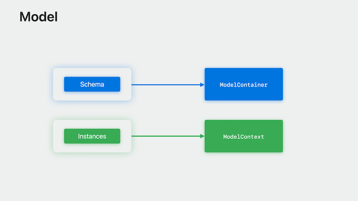
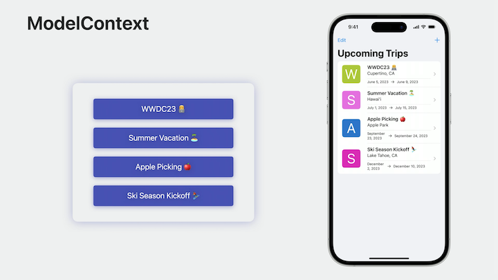

# [**Dive deeper into SwiftData**](https://developer.apple.com/videos/play/wwdc2023/10196/)

---

Watch the following first:

* [**Meet Swift Data**](./Meet%20SwiftData.md) session
* [**Model your Schema with SwiftData**](./Model%20your%20schema%20with%20SwiftData.md) session

Model

* Types you already use
    * `@Model` macro
    * Inferred or explicit structure
    * Deep customization
* `@Model` roles
    * Describe the schema
    * Instances used in code
* Model schema and instances
    * The Schema is applied to a class called the ModelContainer to describe how data should be persisted
    * The ModelContainer consumes the Schema to generate a database that can hold instances of the Model classes
    * When working with instances of a Model class in code, those instances are linked to a ModelContext which tracks and manages their state in memory



### **Configuring persistence**

`ModelContainer`

* Schema and persistence
* How objects are stored
* Evolution of models
    * Versioning
    * Migration
    * Graph separation

```swift
// ModelContainer initialized with just Trip
let container = try ModelContainer(for: Trip.self)

// SwiftData infers related model classes as well
let container = try ModelContainer(
    for: [
        Trip.self, 
        BucketListItem.self, 
        LivingAccommodation.self
    ]
)
```

`ModelConfiguration`

* Describes the persistence of a Schema
    * In memory or on disk
    * File location - can use a specific file URL or can generate one automatically using the entitlements of your application
    * Can describe that a persistence file be read only
    * Can specify CloudKit container identifier

```swift
let fullSchema = Schema([
    Trip.self,
    BucketListItem.self,
    LivingAccommodations.self,
    Person.self,
    Address.self
])

let trips = ModelConfiguration(
    schema: Schema([
        Trip.self,
        BucketListItem.self,
        LivingAccommodations.self
    ]),
    url: URL(filePath: "/path/to/trip.store"),
    cloudKitContainerIdentifier: "com.example.trips"
)

let people = ModelConfiguration(
    schema: Schema([Person.self, Address.self]),
    url: URL(filePath: "/path/to/people.store"),
    cloudKitContainerIdentifier: "com.example.people"
) 

let container = try ModelContainer(for: fullSchema, trips, people)
```

* The `.modelContainer` modifier can be added to any View or Scene in an application
* `ModelContainer` combines `Schema` with persistence
* Grows with an application as you build more features and object graphs

### **Track and persist changes**

* When we use the modelContainer modifier in view or scene code, it prepares the application's environment in a specific way
* The modifier binds the new modelContext key in the environment to the container's mainContext
    * The main context is a special MainActor-aligned model context intended for working with ModelObjects in scenes and views
    * View code has easy access to the context used by the Query so that it can perform actions (e.g. `delete` in the code below)

```swift
@main
struct TripsApp: App {
   var body: some Scene {
        WindowGroup {
            ContentView()
        }
        .modelContainer(for: Trip.self)
    }
}

struct ContentView: View {
    @Query var trips: [Trip]
    @Environment(\.modelContext) var modelContext
  
    var body: some View {
        NavigationStack (path: $path) {
            List(selection: $selection) {
                ForEach(trips) { trip in
                    TripListItem(trip: trip)
                        .swipeActions(edge: .trailing) {
                            Button(role: .destructive) {
                                modelContext.delete(trip)
                            } label: {
                                Label("Delete", systemImage: "trash")
                            }
                        }
                }
                .onDelete(perform: deleteTrips(at:))
            }
        }
    }
}
```

* In the SampleTrips app, when the upcoming trips view loads the data for the list, each trip object is fetched into the main context
* If a trip is edited, that change is recorded by the model context as a snapshot
* As other changes are made, the context tracks and maintains state about these changes until you call `context.save()`
    * Even though a deleted trip is no longer visible in the list, it still exists in the `ModelContext` until that delete is persisted by calling `save()`
* Once save is called, the context persists changes to the `ModelContainer` and clears its state
    * If you're still referencing the objects in the context, like displaying them in a list, they will exist in the context until you're finished with them



* The `ModelContext` works in coordination with the `ModelContainer` it is bound to
    * It tracks the objects you fetch in your views and then propagates any changes when save executes
* ModelContext also supports features like rollback or reset for clearing its cached state when needed
    * This makes it the ideal place to support platform features like undo and autosave

#### Undo with ModelContext

* The `modelContainer` modifier has this `isUndoEnabled` argument, which binds the window's undo manager to the container's `mainContext`
    * Works with system gestures (shake/three finger swipe)
    * `ModelContext` automatically registers undo and redo actions as changes are made to model objects
    * The modelContainer modifier uses the environment's undoManager which is usually provided by the system

```swift
@main
struct TripsApp: App {
   @Environment(\.undoManager) var undoManager
   var body: some Scene {
        WindowGroup {
            ContentView()
        }
        .modelContainer(for: Trip.self, isUndoEnabled: true)
    }
}
```

#### ModelContext Autosave

* When autosave is enabled the model context will save in response to system events like an application entering the foreground or background
* The main context will also periodically save as an application is used
* Autosave is enabled by default in applications and can be disabled if desired using the `modelContainer` modifier's `isAutosaveEnabled` argument
    * Autosave is disabled for model contexts created by hand

```swift
@main
struct TripsApp: App {
   var body: some Scene {
        WindowGroup {
            ContentView()
        }
        .modelContainer(for: Trip.self, isAutosaveEnabled: false)
    }
}
```

### **Modeling at scale**

* Model objects work with the following (frequently in sets or graphs):
    * Working with data on a background queue
    * Syncing with a remote server or other persistence mechanism
    * Batch processing
* Many of these tasks will begin by fetching a set of objects to work with via the fetch method on a ModelContext
* Below, the FetchDescriptor for the Trip model tells Swift that the trips array will be a collection of Trip objects

```swift
let context = self.newSwiftContext(from: Trip.self)
var trips = try context.fetch(FetchDescriptor<Trip>())
```

* The `#Predicate` macro helps define queries using your models and schema
    * Complicated queries that support subqueries and joins can all be written in pure Swift

```swift
let context = self.newSwiftContext(from: Trip.self)
let hotelNames = ["First", "Second", "Third"]

var predicate = #Predicate<Trip> { trip in
    trip.livingAccommodations.filter {
        hotelNames.contains($0.placeName)
    }.count > 0
}

var descriptor = FetchDescriptor(predicate: predicate)
var trips = try context.fetch(descriptor)


predicate = #Predicate<Trip> { trip in
    trip.livingAccommodations.filter {
        $0.hasReservation == false
    }.count > 0
}

descriptor = FetchDescriptor(predicate: predicate)
var trips = try context.fetch(descriptor)
```

#### FetchDescriptor

* Combines the power of the new Foundation Predicate macro with the Schema to bring compiler validated queries to persistence on Apple platforms
* Uses generics to form the result type and tell the compiler about the properties of the model you can use
* Additional parameters
    * Offset/limit
    * Faulting/prefetching
* Uses the new `enumerate` function on `ModelContext`
    * Automatically implements platform best practices for traversals like batching and mutation guards
        * Customizable to meet the needs of your specific use case
    * Includes mutation guard by default
        * `allowEscapingMutations` tells enumerate that this is intentional
            * When not set, enumerate will throw if it discovers that the `ModelContext` performing the enumeration is dirty, preventing it from freeing objects that were already traversed

```swift
let predicate = #Predicate<Trip> { trip in
    trip.bucketListItem.filter {
        $0.hasReservation == false
    }.count > 0
}

let descriptor = FetchDescriptor(predicate: predicate)
descriptor.sortBy = [SortDescriptor(\.start_date)]

context.enumerate(descriptor) { trip in
    // Remind me to make reservations for trip
}


// Customizable batch size and allowEscapingMutations
let predicate = #Predicate<Trip> { trip in
    trip.bucketListItem.filter {
        $0.hasReservation == false
    }.count > 0
}

let descriptor = FetchDescriptor(predicate: predicate)
descriptor.sortBy = [SortDescriptor(\.start_date)]

context.enumerate(
    descriptor,
    batchSize: 500,
    allowEscapingMutations: true
) { trip in
    // Remind me to make reservations for trip
}
```
