# [**Expand on Swift macros**](https://developer.apple.com/videos/play/wwdc2023/10167/)

---

### **Why macros?**

Swift allows writing of expressive code and APIs, like derived conformances and result builders, to avoid writing repetitive boilerplate.
    * Creating this code for you lets you use Codable without having to know exactly how it works and makes it so you don't have to decide if adding Codable support is worth writing a screenful of code

| Expressive code | Codable implementation |
| --------------- | ---------------------- |
| 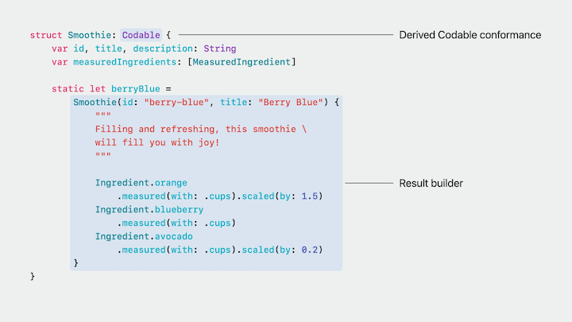 | 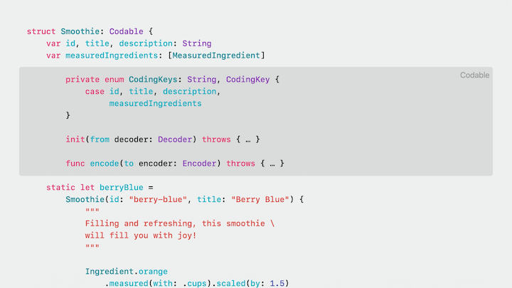 |

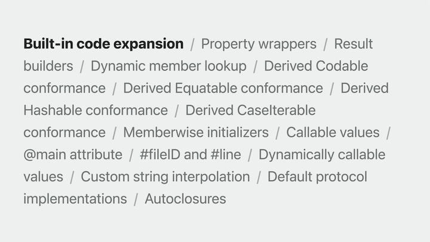

* But what if the existing features can't do what you want?
    * Could add a feature to the Swift compiler, but that's a lot of work, and involves discussions with Swift project leaders
    * This is where Swift macros come in

Macros - extending Swift without changing the compiler

* Eliminate boilerplate
* Make tedious things easy
* Share with other developers in packages

### **Design philosophy**

Design goals:

1. Distinctive use sites - obvious when you are using them. Two types of macros:
    * Freestanding macros
        * Take the place of an expression or declaration
        * Start with a `#` sign
        * `return #unwrap(icon, message: "should be in the app bundle")`
    * Attached macros
        * Attached to another declaration
        * Start with an `@` sign
        * `@AddCompletionHandler func sendRequest() async throws -> Response`
    * Swift already uses the `#` and `@` signs to indicate special compiler behavior, macros just make that extensible
        * If you don't see #’s or @’s, you can be confident that there aren't any macros involved
2. Complete, type-checked, and validated - both the code passed into a macro and the code sent back
    
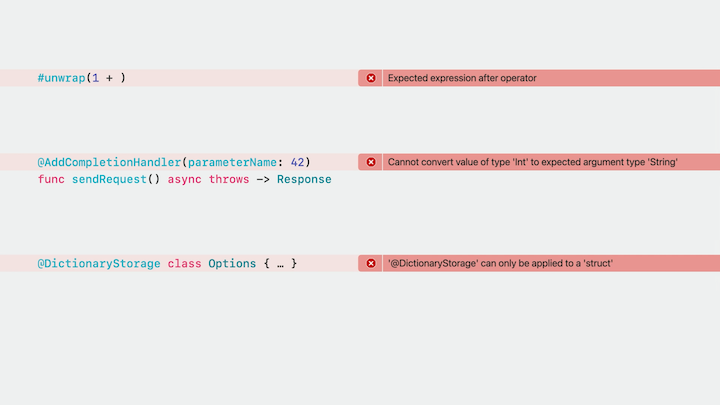

3. Inserted in predictable, additive ways
    * A macro can only add to the visible code in your program, it can't remove it or change it

4. Macros are not magic - they just add more code to your program
    * Right-click on a macro's use site and ask to see what it expands into
    * Set breakpoints in the expansion or step into it with the debugger

### **Translation model**

* When Swift sees you call a macro in your code, like the "stringify" macro from the Xcode macro package template, it extracts that use from the code and sends it to a special compiler plug-in that contains the implementation for that macro.
* The plug-in runs as a separate process in a secure sandbox, and it contains custom Swift code written by the macro's author.
* It processes the macro use and returns an "expansion," a new fragment of code created by the macro. 
* The Swift compiler then adds that expansion to your program and compiles your code and the expansion together.

```swift
func printAdd(_ a: Int, _ b: Int) {
    let (result, str) = #stringify(a + b)
  
        // Begin expansion for "#stringify"
        (a + b, "a + b")
        // End expansion for "#stringify"
  
    print("\(str) = \(result)")
}

printAdd(1, 2)    // prints "a + b = 3"
```

Swift knows that the `#stringify` macro exists because of a macro declaration

* A macro declaration provides the API for a macro
* You can write the declaration right in your own module, or you can import it from a library or framework
* It specifies the macro's name and signature, the number of parameters it takes, their labels and types, and the type of the result if the macro has one, just like a function declaration
* It also has one or more attributes that specify the macro's roles

```swift
/// Creates a tuple containing both the result of `expr` and its source code represented as a
/// `String`.
@freestanding(expression)
macro stringify<T>(_ expr: T) -> (T, String)
```

### **Macro roles**

A role is a set of rules for a macro:

* Where it can be used
* What types of code it expands into
* Where the expansions are inserted

#### Available macro roles

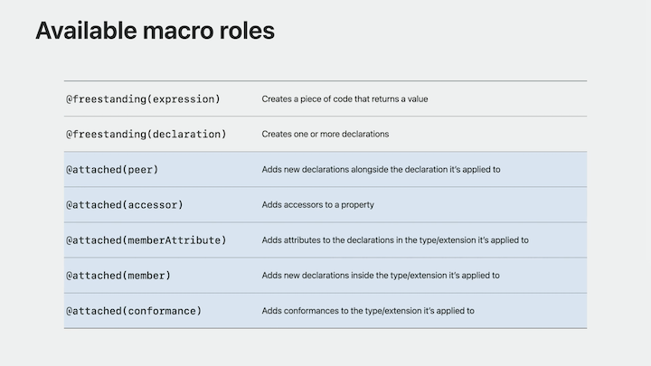

* Two roles that create freestanding macros: expression and declaration
* Five roles that create attached macros: Peer, accessor, member attribute, member, and conformance

#### Freestanding expression role

```swift
let numPixels = (x + width) * (y + height)
//              ^~~~~~~~~~~~~~~~~~~~~~~~~~ This is an expression
//               ^~~~~~~~~                 But so is this
//                   ^~~~~                 And this
```

* An example - force unwrap an optional
* Different ways to do this, each can be a bit too much ceremony

```swift
// Some teams are nervous about this:
let image = downloadedImage!

// Alternatives are super wordy:
guard let image = downloadedImage else {
    preconditionFailure("Unexpectedly found nil: downloadedImage was already checked")
}
```

Write a macro to create a balance between these approaches

* We write a macro that takes in an optional, but returns a non-optional
* Pass in a string that's part of the message printed if the unwrap fails
* We end up with a macro that we call just like a function, but it expands into an expression that contains a "guard let" wrapped in a closure
* The error message even includes the variable name, something that would be impossible with a normal function


```swift
/// Force-unwraps the optional value passed to `expr`.
/// - Parameter message: Failure message, followed by `expr` in single quotes
@freestanding(expression)
macro unwrap<Wrapped>(_ expr: Wrapped?, message: String) -> Wrapped


let image = #unwrap(downloadedImage, message: "was already checked")
    // Begin expansion for "#unwrap"
    { [downloadedImage] in
        guard let downloadedImage else {
            preconditionFailure(
                "Unexpectedly found nil: ‘downloadedImage’ " + "was already checked",
                file: "main/ImageLoader.swift",
                line: 42
            )
        }
        return downloadedImage
    }()
    // End expansion for "#unwrap"
```

#### Freestanding declaration role

* Expands into one or more declarations, like functions, variables, or types
* Example would be some kind of statistical analysis that needs a 2D array type
    * You want all of the rows in the array to have the same number of columns, so you don't want an array-of-arrays
    * Instead, you want to store the elements in a flat, one-dimensional array, and then compute a one-dimensional index from the two-dimensional indices passed in by the developer
* Could write code like the following:
    * You start with the Array2D function below, but then realize you need an Array3D function, and it doesn't scale well, so if you need more dimensions, you create many array types that are almost identical

```swift
public struct Array2D<Element>: Collection {
    public struct Index: Hashable, Comparable { var storageIndex: Int }
  
    var storage: [Element]
    var width1: Int
  
    public func makeIndex(_ i0: Int, _ i1: Int) -> Index {
        Index(storageIndex: i0 * width1 + i1)
    }
  
    public subscript (_ i0: Int, _ i1: Int) -> Element {
        get { self[makeIndex(i0, i1)] }
        set { self[makeIndex(i0, i1)] = newValue }
    }

    public subscript (_ i: Index) -> Element {
        get { storage[i.storageIndex] }
        set { storage[i.storageIndex] = newValue }
    }

    // Note: Omitted additional members needed for 'Collection' conformance
}

public struct Array3D<Element>: Collection {
    public struct Index: Hashable, Comparable { var storageIndex: Int }
  
    var storage: [Element]
    var width1, width2: Int
  
    public func makeIndex(_ i0: Int, _ i1: Int, _ i2: Int) -> Index {
        Index(storageIndex: (i0 * width1 + i1) * width2 + i2)
    }
  
    public subscript (_ i0: Int, _ i1: Int, _ i2: Int) -> Element {
        get { self[makeIndex(i0, i1, i2)] }
        set { self[makeIndex(i0, i1, i2)] = newValue }
    }
  
    public subscript (_ i: Index) -> Element {
        get { storage[i.storageIndex] }
        set { storage[i.storageIndex] = newValue }
    }
  
    // Note: Omitted additional members needed for 'Collection' conformance
}
```

* Each struct is a declaration, so we can use a declaration macro to create them
    * Pass the number of dimensions as an Int parameter
    * We won't declare a result type because this macro will add a declaration to our program, not compute a result that's used by other code
    * Each of the `makeArrayND(n: Int)` calls below will expand into an entire multi-dimensional array type with the right number of arguments and the right calculation for that size

```swift
/// Declares an `n`-dimensional array type named `Array<n>D`.
/// - Parameter n: The number of dimensions in the array.
@freestanding(declaration, names: arbitrary)
macro makeArrayND(n: Int)


#makeArrayND(n: 2)
// Begin expansion for "#makeArrayND"
public struct Array2D<Element>: Collection {
    public struct Index: Hashable, Comparable { var storageIndex: Int }
    var storage: [Element]
    var width1: Int
    public func makeIndex(_ i0: Int, _ i1: Int) -> Index {
        Index(storageIndex: i0 * width1 + i1)
    }
    public subscript (_ i0: Int, _ i1: Int) -> Element {
        get { self[makeIndex(i0, i1)] }
        set { self[makeIndex(i0, i1)] = newValue }
    }
    public subscript (_ i: Index) -> Element {
        get { storage[i.storageIndex] }
        set { storage[i.storageIndex] = newValue }
    }
}
// End expansion for "#makeArrayND"

#makeArrayND(n: 3)
#makeArrayND(n: 4)
#makeArrayND(n: 5)
```

#### **Attached Macros**

* Attached to a specific declaration
    * That means they have more information to work from
    * Freestanding macros are only given the arguments they're passed, but attached macros can also access the declaration they're attached to
    * Often inspect that declaration and pull out names, types, and other information from inside them

#### Attached peer role

* A peer macro can be attached to any declaration, not only variables, and functions, and types, but even things like import and operator declarations
    * Can insert new declarations alongside it
    * If used on a method or property, you end up creating members of the type
    * If used on a top-level function or type, you end up creating new top-level declarations
* An example would be if you needed to provide completion handler versions of async/await functions in an API

```swift
/// Fetch the avatar for the user with `username`.
func fetchAvatar(_ username: String) async -> Image? {
    ...
}

func fetchAvatar(_ username: String, onCompletion: @escaping (Image?) -> Void) {
    Task.detached { onCompletion(await fetchAvatar(username)) }
}
```

* Rather than writing each completion handler separately, we write a peer macro
    * Give it a parameter for the completion handler's argument label
    * Attach that macro to the async version of the method
    * The macro will create a completion handler-based signature equivalent to the original, write the method body, and even attach a documentation comment with extra text for the completion handler

```swift
/// Overload an `async` function to add a variant that takes a completion handler closure as
/// a parameter.
@attached(peer, names: overloaded)
macro AddCompletionHandler(parameterName: String = "completionHandler")

/// Fetch the avatar for the user with `username`.
@AddCompletionHandler(parameterName: "onCompletion")
func fetchAvatar(_ username: String) async -> Image? {
    ...
}

    // Begin expansion for "@AddCompletionHandler"

    /// Fetch the avatar for the user with `username`.
    /// Equivalent to ``fetchAvatar(username:)`` with
    /// a completion handler.
    func fetchAvatar(
        _ username: String,
        onCompletion: @escaping (Image?) -> Void
    ) {
        Task.detached {
            onCompletion(await fetchAvatar(username))
        }
    }

    // End expansion for "@AddCompletionHandler"
```

#### Attached accessor role

* Can be attached to variables and subscripts
* Can install accessors into them, like `get`, `set`, `willSet`, or `didSet`
* An example would be if you have a lot of types that basically wrap around dictionaries and let you access their contents with properties

```swift
struct Person: DictionaryRepresentable {
    init(dictionary: [String: Any]) { self.dictionary = dictionary }
    var dictionary: [String: Any]
  
    var name: String {
        get { dictionary["name"]! as! String }
        set { dictionary["name"] = newValue }
    }
    var height: Measurement<UnitLength> {
        get { dictionary["height"]! as! Measurement<UnitLength> }
        set { dictionary["height"] = newValue }
    }
    var birthDate: Date? {
        get { dictionary["birth_date"] as! Date? }
        set { dictionary["birth_date"] = newValue as Any? }
    }
}
```

* An accessor macro allows us to automatically create all the computed properties for us
    * Can pass an optional `key` into the macro to define a property name, or just default to the name of the key in the dictionary

```swift
/// Adds accessors to get and set the value of the specified property in a dictionary
/// property called `storage`.
@attached(accessor)
macro DictionaryStorage(key: String? = nil)


struct Person: DictionaryRepresentable {
    init(dictionary: [String: Any]) { self.dictionary = dictionary }
    var dictionary: [String: Any]
    
    @DictionaryStorage var name: String
        // Begin expansion for "@DictionaryStorage"
        {
            get { dictionary["name"]! as! String }
            set { dictionary["name"] = newValue }
        }
        // End expansion for "@DictionaryStorage"

    @DictionaryStorage var height: Measurement<UnitLength>
        // Begin expansion for "@DictionaryStorage"
        {
            get { dictionary["height"]! as! Measurement<UnitLength> }
            set { dictionary["height"] = newValue }
        }
        // End expansion for "@DictionaryStorage"

    @DictionaryStorage(key: "birth_date") var birthDate: Date?
        // Begin expansion for "@DictionaryStorage"
        {
            get { dictionary["birth_date"] as! Date? }
            set { dictionary["birth_date"] = newValue as Any? }
        }
        // End expansion for "@DictionaryStorage"
}
```

#### Attached memberAttribute role

* The above example still has boilerplate - the fact that we have to call `@DictionaryStorage` for each key
* The `memberAttribute` role helps with this
    * The macro gets attached to a type or extension, and it can add attributes to the members of whatever it's attached to
* To do this, rather than declaring a new macro, we add another role attribute to the `DictionaryStorage` macro, alongside the `accessor` role it already has
* Uses role composition:
    * A macro may have multiple attached roles
    * Swift will expand all roles applicable where the macro was used
    * At least one role must be applicable
* If you attach "DictionaryStorage" to a type, Swift will expand the `memberAttribute` role
* If you attach it to a property, Swift will expand the `accessor` role
* If you attach it to a function, you'll get a compilation error because `DictionaryStorage` doesn't have any roles that could attach to a function.
* Now we can attach `DictionaryStorage` to the entire type
* We can also still attach it to a property as well
* The macro will have logic to skip certain members, like the initializer, the `dictionary` property, and properties like `birth_date` that already have a `DictionaryStorage` attribute
    * It'll add a `DictionaryStorage` attribute to any other stored property, and then those attributes will expand into the accessors we already saw.

```swift
/// Adds accessors to get and set the value of the specified property in a dictionary
/// property called `storage`.
@attached(memberAttribute)
@attached(accessor)
macro DictionaryStorage(key: String? = nil)


@DictionaryStorage
struct Person: DictionaryRepresentable {
    init(dictionary: [String: Any]) { self.dictionary = dictionary }
    var dictionary: [String: Any]
    
        // Begin expansion for "@DictionaryStorage"
        @DictionaryStorage
        // End expansion for "@DictionaryStorage"
    var name: String
    
        // Begin expansion for "@DictionaryStorage"
        @DictionaryStorage
        // End expansion for "@DictionaryStorage"
    var height: Measurement<UnitLength>

    @DictionaryStorage(key: "birth_date") var birthDate: Date?
}
```

#### Attached member role

* We still have boilerplate in the above code, though - the init and the `dictionary` stored property
* We can use the attached `member` role to help with this
    * Can apply these macros to types and extensions, but instead of adding attributes to existing members, they add totally new members
    * Can add methods, properties, initializers, etc.
    * Can even add stored properties to classes and structs, or cases to enums
* The new role will add an `init` and a property called `dictionary`
* Macros cannot see each others expansions, so the order that they are applied doesn't really matter
    * Each one will see the original version of the declaration without expansions provided by the others

```swift
/// Adds accessors to get and set the value of the specified property in a dictionary
/// property called `storage`.
@attached(member, names: named(dictionary), named(init(dictionary:)))
@attached(memberAttribute)
@attached(accessor)
macro DictionaryStorage(key: String? = nil)


// The @DictionaryStorage member macro
@DictionaryStorage struct Person: DictionaryRepresentable {
        // Begin expansion for "@DictionaryStorage"
        init(dictionary: [String: Any]) {
            self.dictionary = dictionary
        }
        var dictionary: [String: Any]
        // End expansion for "@DictionaryStorage"
    
    var name: String
    var height: Measurement<UnitLength>
    @DictionaryStorage(key: "birth_date") var birthDate: Date?
}
```

#### Attached conformance role

* We can eliminate one last piece of boilerplate code with the attached `conformance` role
* It can add a conformance to a type or extension
* This new role will add a conformance to `DictionaryRepresentation`

```swift
/// Adds accessors to get and set the value of the specified property in a dictionary
/// property called `storage`.
@attached(conformance)
@attached(member, names: named(dictionary), named(init(dictionary:)))
@attached(memberAttribute)
@attached(accessor)
macro DictionaryStorage(key: String? = nil)


@DictionaryStorage struct Person
        // Begin expansion for "@DictionaryStorage"
        : DictionaryRepresentable
        // End expansion for "@DictionaryStorage"
{
    var name: String
    var height: Measurement<UnitLength>
    @DictionaryStorage(key: "birth_date") var birthDate: Date?
}
```

The final code looks like this:

```swift
// Without expansion
@DictionaryStorage
struct Person {
    var name: String
    var height: Measurement<UnitLength>

    @DictionaryStorage(key: "birth_date")
    var birthDate: Date?
}


// With expansion
@DictionaryStorage
struct Person
        // Begin expansion for "@DictionaryStorage"
        : DictionaryRepresentable
        // End expansion for "@DictionaryStorage"
{
        // Begin expansion for "@DictionaryStorage"
        init(dictionary: [String: Any]) { self.dictionary = dictionary }
        var dictionary: [String: Any]
        // End expansion for "@DictionaryStorage"

        // Begin expansion for "@DictionaryStorage"
        @DictionaryStorage
        // End expansion for "@DictionaryStorage"
    var name: String
        // Begin expansion for "@DictionaryStorage"
        {
            get { dictionary["name"]! as! String }
            set { dictionary["name"] = newValue }
        }
        // End expansion for "@DictionaryStorage"

        // Begin expansion for "@DictionaryStorage"
        @DictionaryStorage
        // End expansion for "@DictionaryStorage"
    var height: Measurement<UnitLength>
        // Begin expansion for "@DictionaryStorage"
        {
            get { dictionary["height"]! as! Measurement<UnitLength> }
            set { dictionary["height"] = newValue }
        }
        // End expansion for "@DictionaryStorage"

    @DictionaryStorage(key: "birth_date")
    var birthDate: Date?
        // Begin expansion for "@DictionaryStorage"
        {
            get { dictionary["birth_date"] as! Date? }
            set { dictionary["birth_date"] = newValue as Any? }
        }
        // End expansion for "@DictionaryStorage"
}
```

### **Macro implementation**

* In all the above examples, the macro declaration has left out the implementation
    * Always after an `=`, and it's always another macro
        * Sometimes another macro you've written, just with teh parameters rearranged or with extra parameters specified as literals
        * Usually an external macro - one that's implemented by a compiler plug-in
            * `#externalMacro` is what defines that relationship
            * Specifies the plug-in the compiler should launch and the name of a type inside that plug-in
            * When Swift expands this macro, it will launch a plug-in called `MyLibMacros` and ask a type called `StringifyMacro` to expand it
            * The macro declaration goes in your normal library alongside your other APIs, but the macro implementation goes in a separate compiler plug-in module
            * `#externalMacro` creates the link between the declaration and the type implementing it

| Expressive code | Codable implementation |
| --------------- | ---------------------- |
| 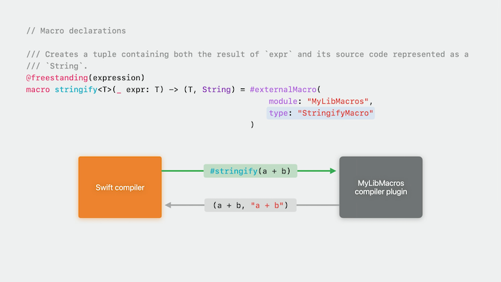 | 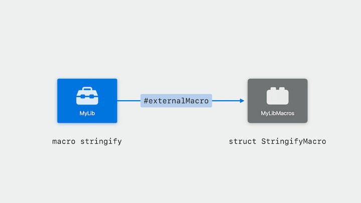 |

How might `DictionaryStorage` be implemented?

```swift
import SwiftSyntax
import SwiftSyntaxMacros
import SwiftSyntaxBuilder

struct DictionaryStorageMacro: MemberMacro {
    static func expansion(
        of attribute: AttributeSyntax,
        providingMembersOf declaration: some DeclGroupSyntax,
        in context: some MacroExpansionContext
    ) throws -> [DeclSyntax] {
        return [
           "init(dictionary: [String: Any]) { self.dictionary = dictionary }",
           "var dictionary: [String: Any]"
        ]
    }
}
```

* `SwiftSyntax` is a package maintained by the Swift project that helps you parse, inspect, manipulate, and generate Swift source code.
    * SwiftSyntax represents source code as a special tree structure
        * For instance, the `Person` struct above is represented as an instance of a type called `StructDeclSyntax`
        * Some of the syntax nodes in these properties are called "tokens."
            * Represent a specific piece of text in the source file, like a name, or a keyword, or a bit of punctuation, and they just contain that text and any surrounding trivia, like spaces and comments
    * For more on SwiftSyntax
        * [**Write Swift Macros**](./Write%20Swift%20macros.md) session
        * SwiftSyntax documentation (either online or use `Product -> Build Documentation` in Xcode)

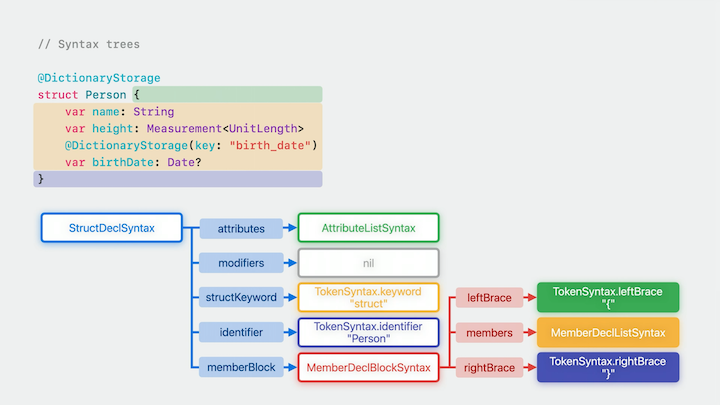

* `SwiftSyntaxMacros` - provides protocols and types necessary for writing macros
* `SwiftSyntaxBuilder` - provides convenience APIs for constructing syntax trees to represent newly-generated code
* A macro must conform to a protocol for each role that the protocol provides
    * Our macro needs to conform to four protocols, but we'll focus on `member` for now
    * `static func expansion(of:providingMembersOf:in:)` is required by the `MemberMacro` protocol
        * What the Swift compiler calls to expand the member role when the macro is used
        * All expansion methods are `static`
        * Each expansion method returns `SwiftSyntax` nodes that are inserted into the source code
            * A member macro expands into a list of declarations to add as members to the type, so the expansion method for a member macro returns an array of `DeclSyntax` nodes
            * Swift treats the string literals returned in the `DeclSyntax` array as a fragment of source code and asks the Swift parser to turn it into a DeclSyntax node

What happens when used incorrectly

* Try applying it to an enum
    * Swift will stop the code from compiling, but the error messaging is confusing

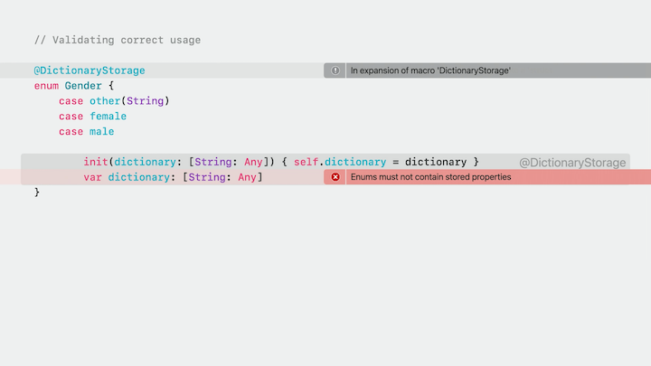

* Let's modify our macro's implementation to produce a much clearer error message for this: “@DictionaryStorage can only be applied to a struct."
    * The parameters to the expansion method will be the key to do this
        * The first is called `attribute`, and its type is AttributeSyntax
            * The actual DictionaryStorage attribute the developer wrote to use the macro
        * The second argument is called `declaration`, and is a type that conforms to `DeclGroupSyntax`
            * `DeclGroupSyntax` is a protocol that the nodes for structs, enums, classes, actors, protocols, and extensions all conform to
            * This parameter gives us the declaration that the developer attached the attribute to
            * The final parameter is called `context` and is of a type that conforms to `MacroExpansionContext`
                * The context object is used when the macro implementation wants to communicate with the compiler
                * Can do a few different things, including emitting errors and warnings
    * We'll check the type of the "declaration" parameter
        * Each kind of declaration has a different type, so if it's a struct, its type will be `StructDeclSyntax`, if it's an enum, it'll be `EnumDeclSyntax`, etc.
    * Use a `guard` to make sure the type is a struct, else throw an error
        * Use the `Diagnostic` type to throw a custom error. It contains two pieces of info:
            * The syntax node that the error occurred at, so the compiler knows which line to mark as incorrect
            * The second is the actual message you want the compiler to produce - we use the `MyLibDiagnostic` enum below to provide this information
            * Can add Fix-Its to a diagnostic, add highlights and attach notes pointing to other locations in the code

```swift
import SwiftSyntax
import SwiftSyntaxMacros
import SwiftSyntaxBuilder

struct DictionaryStorageMacro: MemberMacro {
    static func expansion(
        of attribute: AttributeSyntax,
        providingMembersOf declaration: some DeclGroupSyntax,
        in context: some MacroExpansionContext
    ) throws -> [DeclSyntax] {
        guard declaration.is(StructDeclSyntax.self) else {
            let structError = Diagnostic(
                node: attribute,
                message: MyLibDiagnostic.notAStruct
            )
            context.diagnose(structError)
            return []
        }
        return [
            "init(dictionary: [String: Any]) { self.dictionary = dictionary }",
            "var dictionary: [String: Any]"
        ]
    }
}

enum MyLibDiagnostic: String, DiagnosticMessage {
    case notAStruct

    var severity: DiagnosticSeverity { return .error }

    var message: String {
        switch self {
        case .notAStruct:
            return "'@DictionaryStorage' can only be applied to a 'struct'"
        }
    }

    var diagnosticID: MessageID {
        MessageID(domain: "MyLibMacros", id: rawValue)
    }
}
```

#### Building syntax trees

* Once the macro is being applied correctly, we still need to provide the expansion
    * SwiftSyntax provides several tools to do this
        * Syntax nodes are immutable, but they have lots of APIs that either create new nodes or return modified versions of existing nodes.
        * The SwiftSyntaxBuilder library adds SwiftUI-style syntax builders where some of the child nodes are specified by a trailing closure
        * The string literal feature also supports interpolations

```swift
// Multidimensional array macro can use a syntax builder to generate whatever number of parameters is appropriate for the type it's creating
FunctionParameterListSyntax {
    for dimension in 0 ..< numDimensions {
        FunctionParameterSyntax(
            firstName: .wildcardToken(),
            secondName: .identifier("i\(dimension)"),
            type: TypeSyntax("Int")
        )
    }
}
```

* The string literal feature is especially good at producing syntax trees for large amounts of code, and there's a bit to learn about its interpolation features
    * The `unwrap` macro takes an optional value and a message string and expands into a `guard let` wrapped in a closure

```swift
let image = #unwrap(downloadedImage, message: "was already checked")

            // Begin expansion for "#unwrap"
            { [downloadedImage] in
                guard let downloadedImage else {
                    preconditionFailure(
                        "Unexpectedly found nil: ‘downloadedImage’ " + "was already checked",
                        file: "main/ImageLoader.swift",
                        line: 42
                    )
                }
                return downloadedImage
            }()
            // End expansion for "#unwrap"
```

* To write just the `guard let` statement we write code like the following:
    * We pass in a `message` string as an `ExprSyntax`
        * An ordinary interpolation like this can add a syntax node to the code, but it can't add a plain String - that's a safety feature to keep you from inserting invalid code by accident
    * We also pass in the `guard let` parameter as a `TokenSyntax` (in this case, the downloadedImage we want to attempt to unwrap)
    * 

```swift
static func makeGuardStmt(wrapped: TokenSyntax, message: ExprSyntax) -> StmtSyntax {
    return """
        guard let \(wrapped) else {
            preconditionFailure(
                "Unexpectedly found nil: ‘downloadedImage’ " + \(message),
                file: "main/ImageLoader.swift",
                line: 42
            )
        }
    """
}
```

* We can take this even further if we want to print out the expression being unwrapped in our error message
    * we need to create a string literal that contains a stringified version of a syntax node
    * Start by pulling the prefix out of the Statement Syntax literal and into a `messagePrefix` variable that's just a plain string
        * Add an `originalWrapped: ExprSyntax` property to use in this string
    * Finally, we want to add the file/line numbers to the error message
        * We can pass in an `in context: some MacroExpansionContext` variable - allows us to generate special syntax nodes that the compiler will turn into literals with source location info
            * Returns an object that can produce syntax nodes for the location of whatever node you provide
            * Will return nil if the node is one that your macro created, rather than one that the compiler passed in to you

```swift
static func makeGuardStmt(wrapped: TokenSyntax,
                           originalWrapped: ExprSyntax,
                           message: ExprSyntax,
                           in context: some MacroExpansionContext) -> StmtSyntax {
    let messagePrefix = "Unexpectedly found nil: ‘\(originalWrapped.description)’ "
    let originalLoc = context.location(of: originalWrapped)!

    return """
        guard let \(wrapped) else {
            preconditionFailure(
                \(literal: messagePrefix) + \(message),
                file: \(originalLoc.file),
                line: \(originalLoc.line)
            )
        }
    """
}
```

### **Writing correct macros**

#### Name collisions

* When we looked at the "unwrap" macro before, we looked at an example where we unwrapped a simple variable name
* But if we try to unwrap a more complicated expression, the macro has to expand differently
    * It generates code which captures the expression's result into a variable called `wrappedValue` and then unwraps that
* If we try to use a variable called `wrappedValue` in the message, hen the compiler goes looking for `wrappedValue`, it'll end up finding the closer one, so it'll use that instead of the one you actually meant

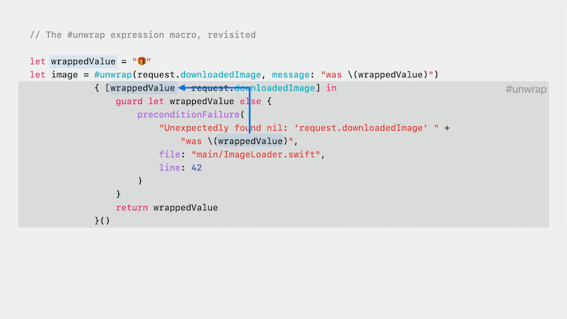

* The `.makeUniqueName()` function makes name collisions impossible
    * Returns a variable name that's guaranteed to not be used in user code or in any other macro expansion

```swift
let captureVar = context.makeUniqueName()

return  """
        { [\(captureVar) = \(originalWrapped)] in
            \(makeGuardStmt(wrapped: captureVar, …))
            \(makeReturnStmt(wrapped: captureVar))
        }
        """
```

Making names visible

* Swift macros don't prevent name conflicts
* Sometimes you want to access names from outside your macro
* Sometimes you even want to introduce new names that non-macro code can access
    * Peer macros, member macros, and declaration macros basicly exist to do this
    * But you need to declare the names you're adding
        * This happens inside the role attribute

```swift
@attached(conformance)
@attached(member, names: named(dictionary), named(init(dictionary:)))
@attached(memberAttribute)
@attached(accessor)
macro DictionaryStorage(key: String? = nil)


@attached(peer, names: overloaded)
macro AddCompletionHandler(parameterName: String = "completionHandler")


@freestanding(declaration, names: arbitrary)
macro makeArrayND(n: Int)
```

Name specifiers:

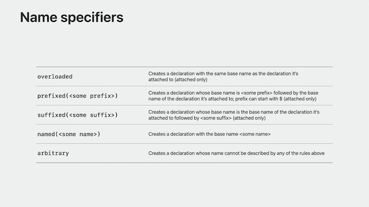

#### Don't use outside information

* Only use the information that the compiler provides
    * Otherwise, tools won't know when they need to re-expand a macro
* Macros don't have access to file systems or network
* Sandbox can't stop you, but you still shouldn't:
    * Insert API results lik current time, process ID, or random numbers
    * Save information in global variables between expansions

#### Testing your macros

* Test your macro implementations to see if they expand as you expect
* Use standard tools like XCTest
* Test driven development is highly recommended

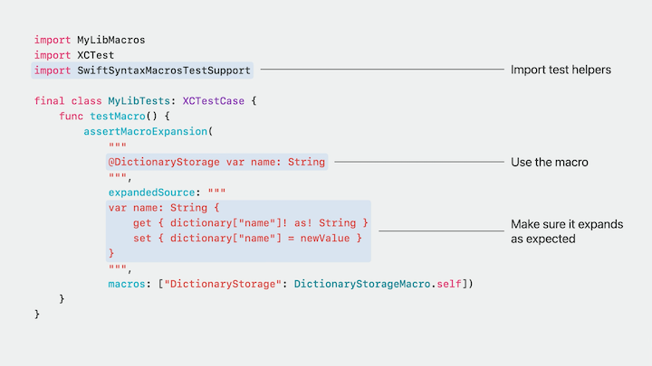
