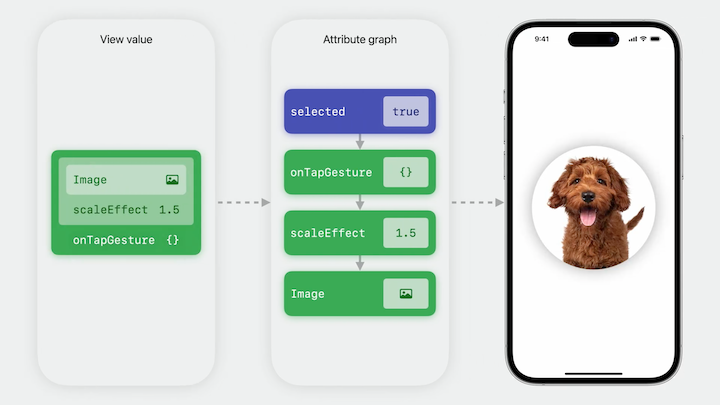
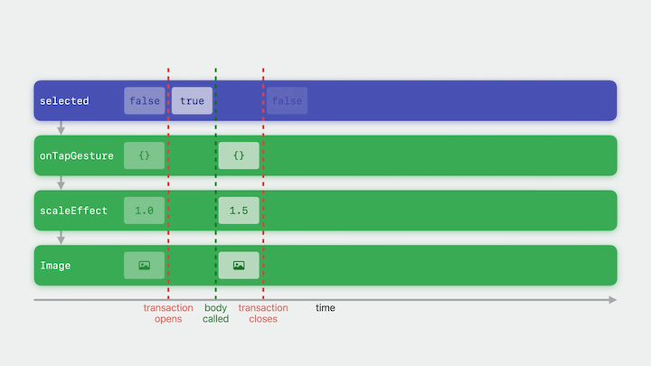
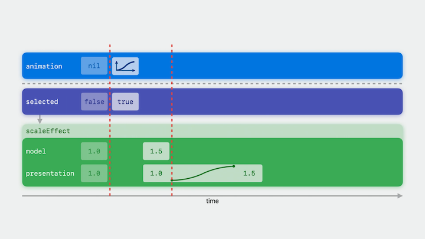
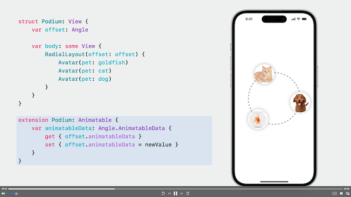
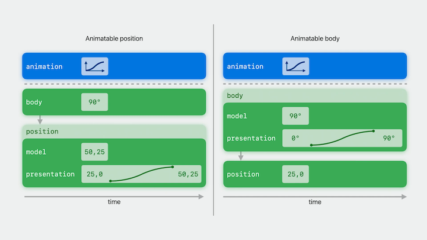
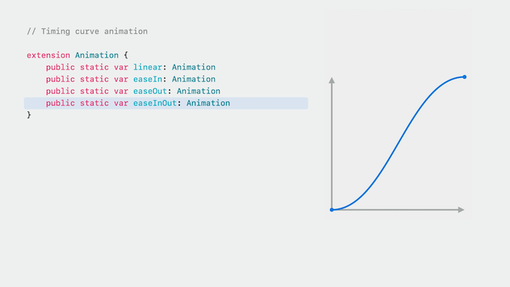
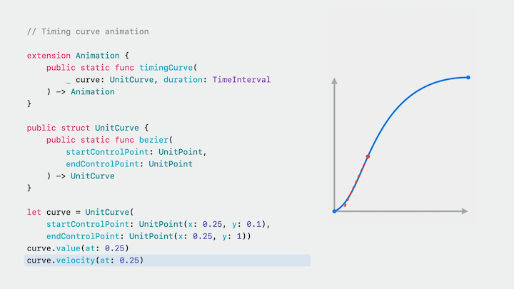
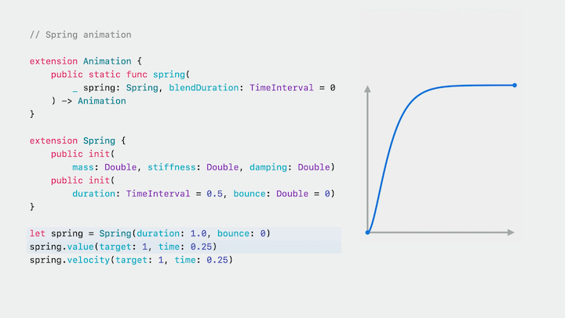
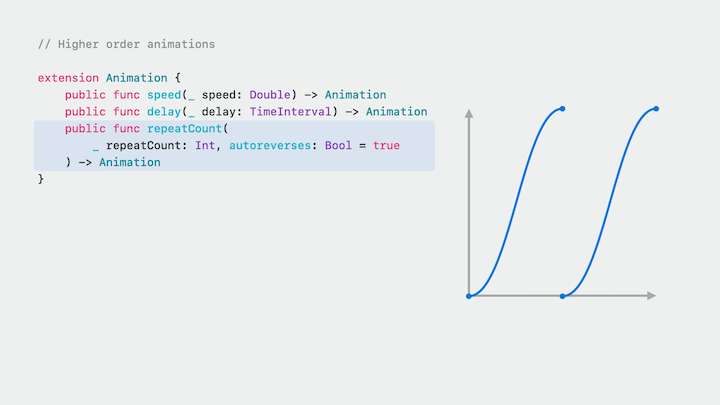
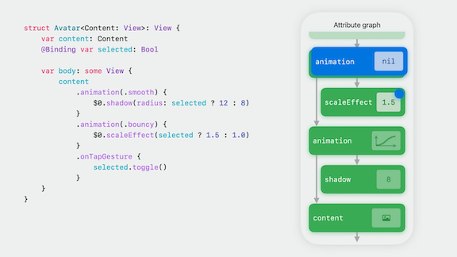

# [**Explore SwiftUI animation**](https://developer.apple.com/videos/play/wwdc2023/10156/)

---

### **Anatomy of an update**

* SwiftUI tracks a view's dependencies, like this selected state variable
    * When an event, like a tap, comes in, an update transaction is opened
    * If any of its dependencies change, the view is invalidated
    * At the close of the transaction, the framework calls body to produce a new value in order to refresh the rendering
    * The code below shows a view's body composed of a tap gesture, a scale effect, and an image
    * Behind the scenes, SwiftUI maintains a long-lived dependency graph that manages the lifetime of views and their data.
        * Each node in this graph, called an attribute, maps to a fine-grained piece of the UI
        * When the selected state changed to true, the value of each of these downstream attributes became stale
        * They're refreshed by unwrapping the new view value one layer at a time
        * Once the corresponding graph attributes have been updated, the view's body value is discarded.
        * Finally, the graph emits drawing commands on your behalf to update the rendering

```swift
struct Avatar: View {
    var pet: Pet
    @State private var selected: Bool = false

    var body: some View {
        Image(pet.type)
            .scaleEffect(selected ? 1.5 : 1.0)
            .onTapGesture {
                selected.toggle()
            }
    }
}
```

| Dependency Graph | Attribute Lifetime |
| ---------------- | ------------------ |
|  |  |

* If we wrap `withAnimation { ... }` around the state change, when the tap gesture closure fires, the animation is set for the transaction
    * Then selected is toggled, and the downstream attributes are invalidated
    * Then body is called to provide new attribute values
* `.scaleEffect` is a special attribute, an "animatable attribute"
    * When the value of an animatable attribute changes, it checks if an animation is set for the transaction
    * If so, it makes a copy and uses the animation to interpolate from the old value to the new value as time passes

```swift
struct Avatar: View {
    var pet: Pet
    @State private var selected: Bool = false

    var body: some View {
        Image(pet.type)
            .scaleEffect(selected ? 1.5 : 1.0)
            .onTapGesture {
                withAnimation {
                    selected.toggle()
                }
            }
    }
}
```



### **Animatable**

* SwiftUI builds an animatable attribute for any view conforming to the Animatable protocol
    * The only requirement is that the view define a read/write vector of the data it wants to animate
        * The data must conform to VectorArithmetic
        * VectorArithmetic matches the textbook definition of a vector, and supports vector addition and scalar multiplication

```swift
public protocol Animatable {
    associatedtype AnimatableData: VectorArithmetic
    var animatableData: AnimatableData { get set }
}

public protocol VectorArithmetic: AdditiveArithmetic {
    mutating func scale(by rhs: Double)
    var magnitudeSquared: Double { get }
}
```

* `.scaleEffect` allows you to independently configure the width, height, and relative anchor point of the transformation - all animatable
    * So `.scaleEffect` actually defines a four-dimensional vector for its animatable data, a CGSize for the width and height scale, paired with a UnitPoint for the relative anchor
    * `AnimatablePair` fuses the two vectors together into a single, larger vector

```swift
extension View {
    public func scaleEffect(_ scale: CGSize, anchor: UnitPoint = .center) -> some View
}

extension ScaleEffect: Animatable {
    var animatableData: AnimatablePair<CGSize.AnimatableData, UnitPoint.AnimatableData> {
        get { AnimatablePair(scale.animatableData, anchor.animatableData) }
        set {
            scale.animatableData = newValue.first
            anchor.animatableData = newValue.second
        }
    }
}
```

* Though not needed most of the time, an advanced use case may call for conforming one of your own views to `Animatable`
    * Without conforming to `Animatable`, the images below would move in a straight line when animated
        * The view position is the animatable data
    * By conforming to `Animatable`, the body becomes the active animatable attribute, with the offset angle as its animatable data
        * For every frame of the animation, the view body is going to be called by SwiftUI with a new offset angle, and the layout will be rerun
    * A custom `Animatable` conformance can be much more expensive to animate than a built-in effect because it'll run body for every frame of the animation

| Animatable Conformance | Animatable Position and Body |
| ---------------------- | ---------------------------- |
|  |  |

### **Animation**

`.withAnimation()` can be customized by passing an argument, like `.withAnimation(.bouncy)` to simulate a bouncy spring

#### Animation taxonomy

* Timing curve
* Spring animations
* Higher order (modify a base animation)

#### Timing curve

* All timing curve animations take a curve, which defines the speed of the animation, and a duration
* A timing curve can be created using bezier control points. By adjusting the start and end control points, you change the initial and final velocity of the animation
* The UnitCurve type can be used standalone to calculate the value and the velocity at a relative point between 0 and 1
* SwiftUI comes with a number of timing curve presets, such as Linear, EaseIn, EaseOut, and EaseInOut
* All timing curve animations can also specify a custom duration

| Timing Curves | Timing Curve Animation |
| ---------------------- | ---------------------------- |
|  |  |

#### Spring animation

* Determine the value at a given point in time by running a spring simulation
* Can specify a spring using mass, stiffness, and damping
* Can now specify with duration and bounce
* Three built-in springs:
    * Smooth - no bounce
    * Snappy - small bounce
    * Bouncy - medium bounce
    * Each preset can be tuned to adjust the duration or add extraBounce



#### Higher order animations

* Modify a base animation
    * Can slow it down, speed it up, add a delay, or repeat it



#### Custom animations

* New is custom animations, using the `CustomAnimation` protocol
* Gives you access to the same low-level generic entry points Apple uses to implement all the animations that come built into SwiftUI
* `CustomAnimation` has three requirements:
    * `animate`
        * Passed the vector to animate towards, the amount of time that has elapsed since the animation began, and the context, which includes additional animation state
        * Returns the current value of the animation, or nil if the animation has finished
    * `shouldMerge` (optional)
    * `velocity` (optional)

```swift
public protocol CustomAnimation: Hashable {
    func animate<V: VectorArithmetic>(
        value: V, time: TimeInterval, context: inout AnimationContext<V>
    ) -> V?

    func shouldMerge<V: VectorArithmetic>(
        previous: Animation,
        value: V,
        time: TimeInterval,
        context: inout AnimationContext<V>
    ) -> Bool

    func velocity<V: VectorArithmetic> (
        value: V, time: TimeInterval, context: AnimationContext<V>
    ) -> V?
}
```

* Will implement a linear timing curve animation configured by a duration to interpolate over
    * Animate is passed the delta vector to animate towards
    * Can use scalar multiplication to scale the vector by the proportion of the duration that has elapsed
    * Once the full duration has elapsed, return nil to indicate that the animation has finished and can be removed
    * Because the implementation is generic, it works with animatable data of any number of dimensions

```swift
struct MyLinearAnimation: CustomAnimation {
    var duration: TimeInterval

    func animate<V: VectorArithmetic>(
        value: V, time: TimeInterval, context: inout AnimationContext<V>
    ) -> V? {
        if time <= duration {
            value.scaled(by: time / duration)
        } else {
            nil // animation has finished
        }
    }

    func velocity<V: VectorArithmetic>(
        value: V, time: TimeInterval, context: AnimationContext<V>
    ) -> V? {
        value.scaled(by: 1.0 / duration)
    }
}
```

* `shouldMerge` defines whether multiple animations should merge
    * The default implementation returns false, in which case both animations will be run together, and their results will be combined by the system
    * Spring animations override shouldMerge to return true and incorporate the state of the previous animation
        * This allows them to preserve velocity and re-target to the new value, which can feel more natural than combining additively
* `velocity` is used by `shouldMerge` to allow velocity to be preserved when a running animation is merged with a new one

### **Transaction**

* Transaction refers to a data-flow construct and family of APIs
    * Transaction is an implicit data flow construct, like Environment and Preferences
* A more in-depth look at the animation process of the below code:
    * When the tap gesture closure fires, withAnimation sets an animation in the root transaction dictionary
    * Body is called to update the attribute values
    * The transaction dictionary is propagated across the attribute graph
    * When it reaches an animatable attribute, the attribute checks if an animation is set
        * If so, it makes a copy to drive its presentation value
    * The Transaction is only relevant for a specific update, so once the stale attributes have been refreshed, it's discarded.

```swift
struct Avatar: View {
    var pet: Pet
    @State private var selected: Bool

    var body: some View {
        Image(pet.type)
            .scaleEffect(selected ? 1.5 : 1.0)
            .animation(.bouncy, value: selected)
            .onTapGesture {
                selected.toggle()
            }
    }
}
```

* If we set the `selected` variable to be `@Binding`, we can access it programmatically
    * by using the `.transaction` modifier, whenever body is called, even if there is no animation or a different animation in the transaction, the attribute will override the animation
        * When it reaches the scale effect, this animation will be used to interpolate the scale factor.

```swift
struct Avatar: View {
    var pet: Pet
    @Binding var selected: Bool

    var body: some View {
        Image(pet.type)
            .scaleEffect(selected ? 1.5 : 1.0)
            .transaction {
                $0.animation = .bouncy
            }
            .onTapGesture {
                withAnimation(.bouncy) {
                    selected.toggle()
                }
            }
    }
}
```

* Problem with the above pattern: Indiscriminately overriding the animation for all descendants whenever SwiftUI refreshes a view can lead to accidental animations
* Instead, SwiftUI provides an animation view modifier
    * It takes an additional value argument, which allows you to scope the effect much more precisely
    * It will only write the animation into the transaction if the value has changed.
* We also no longer need the `withAnimation` inside the `onTapGesture`

```swift
struct Avatar: View {
    var pet: Pet
    @Binding var selected: Bool

    var body: some View {
        Image(pet.type)
            .scaleEffect(selected ? 1.5 : 1.0)
            .animation(.bouncy, value: selected)
            .onTapGesture {
                selected.toggle()
            }
    }
}
```

* Animation view modifier is also a powerful tool for situations where you want to apply different animations to different parts of a view
    * Putting multiple `.animation` modifiers will change how each portion animates - as the shadow below will animate with a `.smooth` spring, and the scale will animate with a `.bouncy` spring

```swift
struct Avatar: View {
    var pet: Pet
    @Binding var selected: Bool

    var body: some View {
        Image(pet.type)
            .shadow(radius: selected ? 12 : 8)
            .animation(.smooth, value: selected)
            .scaleEffect(selected ? 1.5 : 1.0)
            .animation(.bouncy, value: selected)
            .onTapGesture {
                selected.toggle()
            }
    }
}
```

* The above approach can result in accidental animations when we don't have control over every element in the hierarchy
    * A new version of the animation view modifier specifically designed for use cases like this
    * It narrowly scopes the animation to the animatable attributes specified in its body closure
    * When the transaction reaches the animation view modifier's attribute, a copy is made that's populated with the specified animation
        * The copy is propagated downstream, but only to the scoped animatable attributes
        * Once it's done its job, the copy is discarded, and the original transaction picks up where it left off
        * When the transaction reaches the child content, because the original transaction is unaffected by any of the intermediate animation view modifiers, there's no risk of accidental animations

```swift
struct Avatar<Content: View>: View {
    var content: Content
    @Binding var selected: Bool

    var body: some View {
        content
            .animation(.smooth) {
                $0.shadow(radius: selected ? 12 : 8)
            }
            .animation(.bouncy) {
                $0.scaleEffect(selected ? 1.5 : 1.0)
            }
            .onTapGesture {
                selected.toggle()
            }
    }
}
```



* Custom transaction keys are now available to leverage the transaction dictionary to implicitly propagate your own -update-specific data
    * The pattern is to create a unique type that conforms to the `TransactionKey` protocol
        * The only requirement is to provide a defaultValue
    * Declare a computed property as an extension on `Transaction` that reads and writes from the transaction dictionary using your key
    * Can set a value in the transaction dictionary for the given update by wrapping `withTransaction` around a state change
        * `withAnimation` is just a thin wrapper around `withTransaction`
        * The arguments passed to `withTransaction` are a keypath to a computed property on the `Transaction`, and the value to set

```swift
struct Avatar: View {
    var pet: Pet
    @Binding var selected: Bool

    var body: some View {
        Image(pet.type)
            .scaleEffect(selected ? 1.5 : 1.0)
            .transaction {
                $0.animation = $0.avatarTapped
                    ? .bouncy : .smooth
            }
            .onTapGesture {
                withTransaction(\.avatarTapped, true) {
                    selected.toggle()
                }
            }
    }
}

private struct AvatarTappedKey: TransactionKey {
    static let defaultValue = false
}

extension Transaction {
    var avatarTapped: Bool {
        get { self[AvatarTappedKey.self] }
        set { self[AvatarTappedKey.self] = newValue }
    }
}
```

* The above example can still result in accidental animation
    * Two new variants of the `.transaction` modifier are being introduced
        * One lets you scope using a value argument
        * The other lets you scope to a sub-hierarchy defined in a body closure

```swift
struct Avatar<Content: View>: View {
    var content: Content
    @Binding var selected: Bool

    var body: some View {
        content
            // Option 1
//            .transaction(value: selected) {
//                $0.animation = $0.avatarTapped
//                    ? .bouncy : .smooth
//            }
            // Option 2
            .transaction {
                $0.animation = $0.avatarTapped
                    ? .bouncy : .smooth
            } body: {
                $0.scaleEffect(selected ? 1.5 : 1.0)
            }
            .onTapGesture {
                withTransaction(\.avatarTapped, true) {
                    selected.toggle()
                }
            }
    }
}

private struct AvatarTappedKey: TransactionKey {
    static let defaultValue = false
}

extension Transaction {
    var avatarTapped: Bool {
        get { self[AvatarTappedKey.self] }
        set { self[AvatarTappedKey.self] = newValue }
    }
}
```

* Next steps:
    * [**Animate with springs**](./Animate%20with%20springs.md) session
    * [**Wind your way through advanced animations in SwiftUI**](./Wind%20your%20way%20through%20advanced%20animations%20in%20SwiftUI.md) session