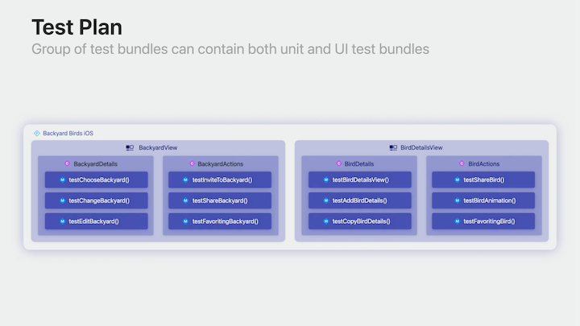
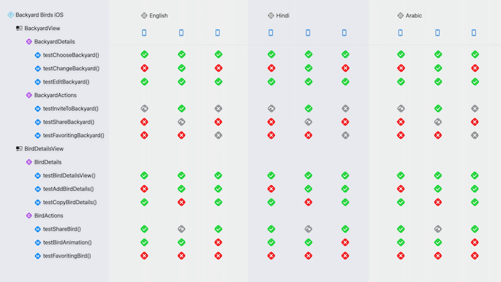
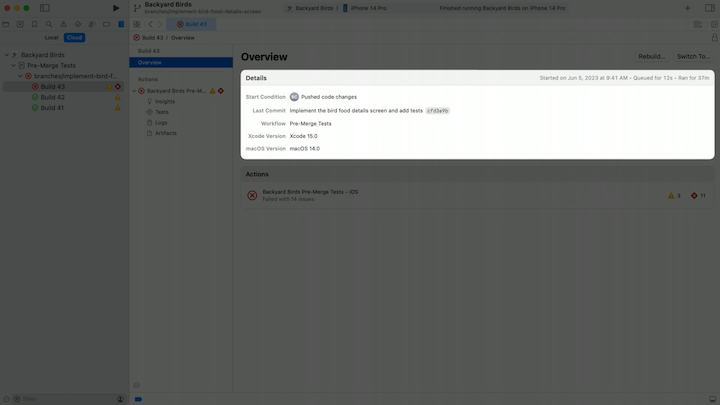
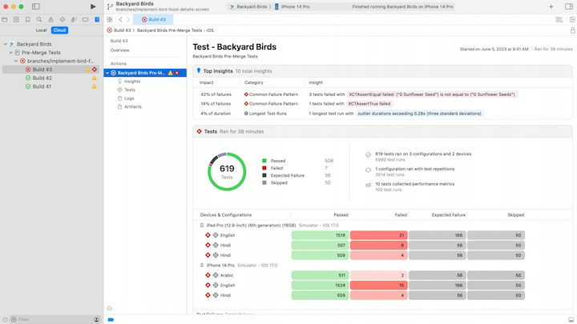
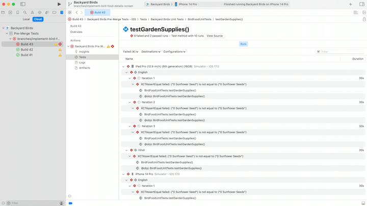
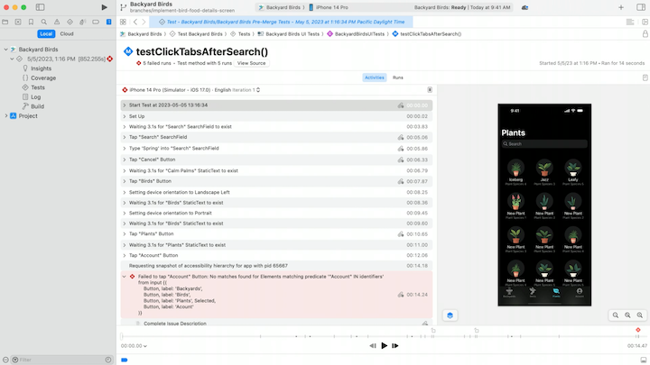
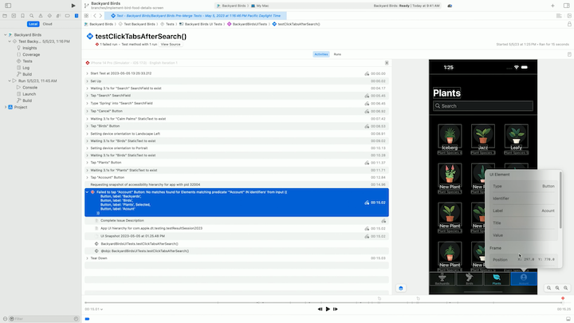

# [**Fix failures faster with Xcode test reports**](https://developer.apple.com/videos/play/wwdc2023/10175/)

---

### **Structuring tests**

* Test methods are the individual tests or methods which validate your source code and produce test results
* Test classes are groups of test methods and are usually grouped based on the area that's being tested
* Test bundles are composed of one or more test classes
    * Each bundle houses a single type of test, either Unit or UI
    * Unit tests help verify a single piece of code, generally a function
        * Short, simple, and run very quickly
    * UI tests observe the user-facing behavior of your app
* Test plans contain one or more test bundles
    * A test plan can contain both Unit and UI tests

#### Configurations

* With test plans, you can set up configurations to run your tests under several conditions
* Tell Xcode how to setup the runtime environment for your tests
* Can setup tests with:
    * Your app in varying Languages and Locations
    * Code coverage, so you can keep track of the quality and coverage of your code over time
    * A number of times to run, so you can test reliability on first or the hundredth run of the app

#### Run destinations

* The devices on which your tests will run
* In Xcode's IDE, you can have a single run destination
* With Xcode Cloud and xcodebuild command, your tests can have multiple run destinations

Test Structure, Configurations, and Run Destinations work together to produce a test report

* For example, we can run a test plan on three destinations, in three different languages
* Every test method, configuration, and run destination combination produces a test method run.
    * Test runs range from a single test you're running while working on a piece of code to an entire suite with thousands of tests running multiple configurations on multiple destinations

### **Explore the test report**

The new test report:

* Provides a high level summary of your test run, so you can see the big picture before digging into the details
* Highlights important patterns, so you quickly know where to start investigating
* Gives you a single place to see test activity, failure information, screenshots, and more
* Improved UI test debugging tools, giving you richer failure information

#### Build Overview

* Can quickly understand what started the workflow, what code changes were built, and the workflow this build came from
* Can also find out how my actions performed in this build

#### Test Summary

* Gives an overall understanding of what happened in this test run
* Can quickly understand the testing environment
* Can also explore any notable patterns found in test results using Insights
    * The patterns Xcode found while analyzing my results across all configurations and run destinations
    * It groups results based on certain criteria
        * Common Failure Patterns and Longest Test Runs are examples of these criteria
* In the `Tests` section:
    * Can understand how tests performed during this run
    * Can also get more details about the test plan
    * Can understand what special traits the test plan has, like test repetitions or performance metrics
    * The heat map can see how the tests did on each device and configuration
    * If there are any test failures, you have quick access to them on the test summary

#### Test Details

* You can select a specific Insight in the Test Summary (e.g. Common Failure Pattern) and learn more about it on the Test Details View
    * This shows the failure message found in all the test, and see all the tests that failed
    * Can see which configurations and run destinations produced these unit test failures
* From here, you can drill down into a test method run
    * The test details view creates a dedicated space to focus on the results of a single test method, like test details and failure information
    * The header shows full context of what happened across all configurations and run destinations
    * In the runs view, you can explore how this method performed on each configuration and run destination
    * Can also find the failure message and call stack for the selected test method run
    * The call stack also gives entry points back into my source code, to continue investigating the failure

#### UI Tests

* Test Summary works the same as for Unit Tests
* For a UI test, navigating to the test details lands you on the Activities tab
* The activities tab contains three major sections:
    * The test activity lays out the test in a timeline format, where the top-most row is the start of the test, and the bottom row is the end, and each row in between is an event which took place in the test.
    * The automation explorer is where you can find moments of video playback related to the selected test activity
        * Allows you to see a full replay of the test
    * The scrubber is a linear representation of the test run
        * Can use the scrubber to locate test events, like taps, swipes, and clicks
        * The scrubber even highlights when the device-under-test changes orientation
        * The failure icon above the scrubber notes where in the test the failure occurred

* Clicking on an event in the activities pane updates the automation explorer with the corresponding frame from video playback
    * It also moves the scrubber to the right spot
* Clicking on the bounding box of an item in the automation explorer gives more information about the UI element, like identifier and hierarchy information

