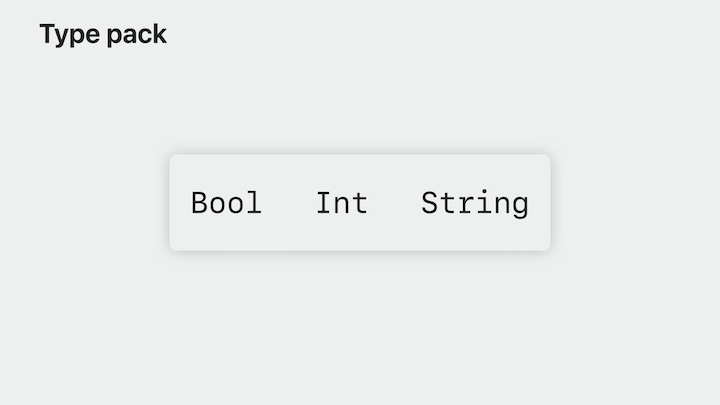
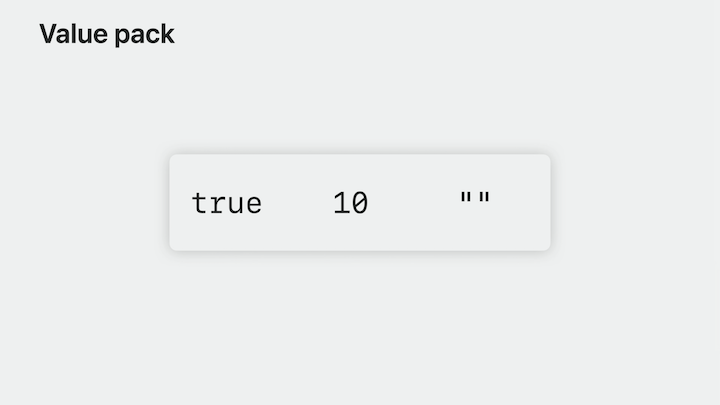

# [**Generalize APIs using parameter packs**](https://developer.apple.com/videos/play/wwdc2023/10168/)

---

Watch [**Embrace Swift Generics**](../2022/Embrace Swift Generics.md) session if you have not yet

### **What parameter packs solve**

* The code you write is fundamentally composed of two categories: values and types
    * You can abstract over values by writing functions that accept different values as parameters
        * e.g `func radians(from degrees: Double) -> Double` function that as input will accept any Double value representing degrees and for output will return a new Double value representing radians
    * You can abstract over types by writing generic code that accepts varying types as parameters
        * e.g. `struct Array<Element>`
* Most generic code abstracts over both types and values
    * e.g. `func query<Payload>(_ item: Request<Payload>) -> Payload`
* Variadic parameters allow for a function to flexibly accept any number of arguments of a single type
    * e.g. `func query(_ item: Request...)`
    * No way to declare a return type that is based on the argument length
    * No way for variadic parameters to accept varying types without using type erasure, and therefore no way to preserve the specific static type information of each argument
* What we lack with the generics system and variadic parameters is the ability to both preserve type information and vary the number of arguments
    * The only way to do this is with overloading, which forces you to choose an upper bound of the number of arguments you support

```swift
func query<Payload>(
    _ item: Request<Payload>
) -> Payload

func query<Payload1, Payload2>(
    _ item1: Request<Payload1>,
    _ item2: Request<Payload2>
) -> (Payload1, Payload2)

func query<Payload1, Payload2, Payload3>(
    _ item1: Request<Payload1>,
    _ item2: Request<Payload2>,
    _ item3: Request<Payload3>
) -> (Payload1, Payload2, Payload3)

func query<Payload1, Payload2, Payload3, Payload4>(
    _ item1: Request<Payload1>,
    _ item2: Request<Payload2>,
    _ item3: Request<Payload3>,
    _ item4: Request<Payload4>
) -> (Payload1, Payload2, Payload3, Payload4)

let _ = query(r1, r2, r3, r4, r5) // Will give a compiler error "Extra argument in call"
```

#### Parameter packs solve these problems

### **How to read parameter packs**

In Swift 5.9, the generics system is gaining first class support for abstraction over argument length with a new construct called "parameter packs."

* A parameter pack can hold any quantity of types or values and pack them together to pass them as an argument to a function
    * A pack that holds individual types is called a `type pack`
    * A pack that holds individual values is called a `value pack`
    * Type packs and value packs are used together
        * A type pack provides each individual type for each individual value in a value pack
        * The corresponding type and value are at the same position in their respective packs

| Type pack | Value pack |
| ------------- | -------------- |
|  |  |

* Parameter packs allow you to write one piece of generic code that works with every individual element in a pack
    * This is similar to how iteration works (a for-in loop operates on each individual element of an array)

```swift
for request in requests {
    evaluate(request)
}
```

* What makes parameter packs different from collections is that each element in the pack has a different static type, and you can work with packs at the type-level
    * You can declare a pack of type parameters with the keyword `each`
    * Instead of having a single type parameter, the function accepts each Payload type that you want to query (type parameter pack)
    * Generic code that uses parameter packs can operate on each Payload individually using repetition patterns
        * Expressed using the `repeat` keyword, followed by a type called the pattern type, e.g. `repeat Request<each Payload>`
        * Would result in code like `Request<Bool>, Request<Int>, Request<String>`
    * Because repetition patterns produce comma-separated lists of types, they can only be used in positions that naturally accept comma-separated lists
        * types wrapped in parentheses (which are either a tuple type or a single type)
        * Function parameter lists
        * Generic argument lists
    * Using a repetition pattern as the type of a function parameter turns that function parameter into a value parameter pack
    * Enables the caller to pass in an arbitrary number of Request instances, and the argument values will be collected into a pack and passed to the function

#### Replacing our overloads

Here's the overload code from earlier:

```swift
func query<Payload>(
    _ item: Request<Payload>
) -> Payload

func query<Payload1, Payload2>(
    _ item1: Request<Payload1>,
    _ item2: Request<Payload2>
) -> (Payload1, Payload2)

func query<Payload1, Payload2, Payload3>(
    _ item1: Request<Payload1>,
    _ item2: Request<Payload2>,
    _ item3: Request<Payload3>
) -> (Payload1, Payload2, Payload3)

func query<Payload1, Payload2, Payload3, Payload4>(
    _ item1: Request<Payload1>,
    _ item2: Request<Payload2>,
    _ item3: Request<Payload3>,
    _ item4: Request<Payload4>
) -> (Payload1, Payload2, Payload3, Payload4)
```

* Each overload declaration has 1, 2, 3, and 4 type parameters
* Each overload maps each type parameter to a Request over that type in the parameter list
* Each overload contains a list of each type parameter in the return type

These 4 overloads can be collapsed down into a single function. Let's first consider the type parameter declarations, then the function parameter list, and finally the return type.

* Each type parameter can be collapsed down into a type parameter pack
* Each individual Request parameter can be collapsed down to a value parameter pack
* The return type can be collapsed down into a tuple constructed by repeating each Payload type
* This single query function can handle any number of return arguments

```swift
func query<each Payload>(_ item: repeat Request<each Payload>) -> (repeat each Payload)

let result = query(Request<Int>())

let results = query(Request<Int>(), Request<String>(), Request<Bool>())
```

#### Parameter pack constraints

* Add `Equatable` conformance by changing the query declaration to `func query<each Payload: Equatable>`
* More general requirements can be applied with a `where` clause

```swift
func query<each Payload>(
    _ item: repeat Request<each Payload>
) -> (repeat each Payload)
    where repeat each Payload: Equatable
```

* If you want to require at least one arguement in the parameter pack, add a regular type parameter preceding the type parameter pack and a corresponding value parameter preceding the value parameter pack
    * Any constraints on the type parameter pack should be applied to the new type parameter as well

```swift
func query<FirstPayload, each Payload>(
    _ first: Request<FirstPayload>, _ item: repeat Request<each Payload>
) -> (FirstPayload, repeat each Payload) 
    where FirstPayload: Equatable, repeat each Payload: Equatable
```

### **Using parameter packs**

We'll build out the query function using parameter packs

* The query function accepts a value pack where every individual element is a Request over every element in the type pack
* The Request struct has a single type parameter called Payload and an evaluate method that returns an instance of Payload
* The body of the query function will operate on the `item` value pack
    * Inside the body of query, we'll call the evaluate method for every item in the value pack, using repetition patterns
        * Use the same syntax at the type-level and at the value-level (`repeat`)

```swift
struct Request<Payload> {
    func evaluate() -> Payload
}

func query<each Payload>(_ item: repeat Request<each Payload>) -> (repeat each Payload) {
    return (repeat (each item).evaluate())
}
```

#### Enhancing the query

* Add stored state for the query
* Allow different input and output types for each request evaluation
* Manage control flow during parameter pack iteration

To make these changes, we do the following:

* Move the `query` function inside an `Evaluator` struct and lift the type parameter pack from the query method to the Evaluator type
    * The Evaluator struct stores the request pack in a stored property by wrapping it in parentheses to make it a tuple value.
* Change Request from a struct to a protocol that has an associated type named `Output`
    * Add another associated type to the `Request` protocol named `Input`
    * Update the evaluate method in `Request` to make its argument the protocol's `Input` type.
* Update the `Evaluator` to require all `Payload` types to conform to `Request`
    * Update the `item` stored property to now be simply of type `each Payload`
* Change the name of `Payload` to be `Request` and the name of the protocol to be `RequestProtocol` so the naming makes more sense

```swift
protocol RequestProtocol {
    associatedtype Input
    associatedtype Output
    func evaluate(_ input: Input) -> Output
}

struct Evaluator<each Request: RequestProtocol> {
    var item: (repeat each Request)

    func query(_ input: repeat (each Request).Input) -> (repeat (each Request).Output) {
        return (repeat (each item).evaluate(each input))
    }
}
```

* Finally, to manage control flow, we can throw errors to exit early from the iteration if a query is not successful

```swift
protocol RequestProtocol {
    associatedtype Input
    associatedtype Output
    func evaluate(_ input: Input) throws -> Output
}

struct Evaluator<each Request: RequestProtocol> {
    var item: (repeat each Request)

    func query(_ input: repeat (each Request).Input) -> (repeat (each Request).Output)? {
        do {
            return (repeat try (each item).evaluate(each input))
        } catch {
            return nil
        }
    }
}
```

To learn more about Generics and Protocols/Type Erasure

* [**Embrace Swift Generics**](../2022/Embrace Swift generics.md)
* [**Design protocol interfaces in Swift**](../2022/Design protocol interfaces in Swift.md)
