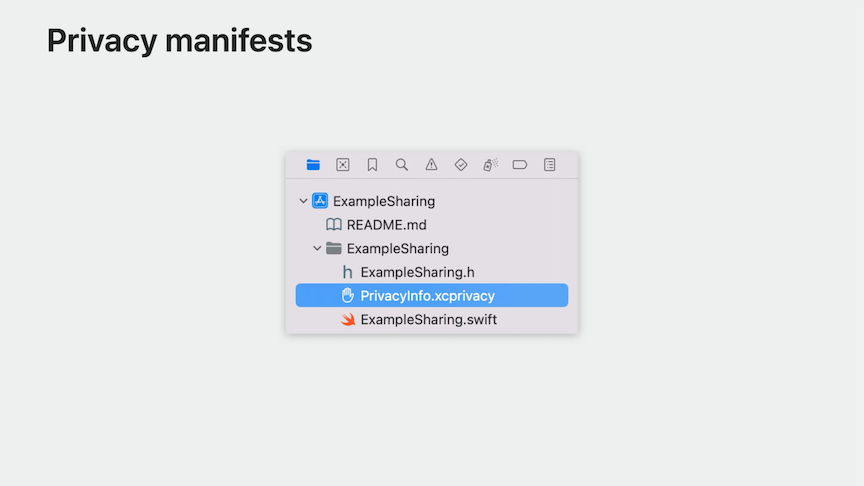
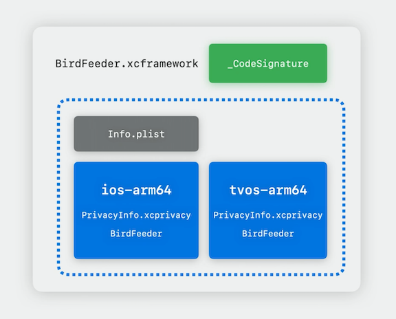

# [**Get started with privacy manifests**](https://developer.apple.com/videos/play/wwdc2023/10060/)

---

### **Privacy manifests**

* Third-party SDK developers can include a privacy manifest in their SDK. They can create a new privacy manifest right from the Xcode navigator, by creating a file named `PrivacyInfo.xcprivacy`.
    * A property list that declares what data types the SDK collects, how each data type is used, whether they are linked to the user, and whether they're used for tracking as defined by the App Tracking Transparency policy

### **Privacy report**

* New privacy report can be generated within Xcode
    * Aggregates all the privacy manifests in tha app's project to produce a privacy report
    * Right click on archive and select `Generate Privacy Report`
    * Creates a PDF, organized similarly to the Privacy Nutrition Labels
    * [**Create your Privacy Nutrition Label**](../2022/Create%20your%20Privacy%20Nutrition%20Label.md) session from WWDC 2022

### **Tracking domains**

* Privacy manifests that declare tracking include tracking domains
* iOS 17 automatically blocks connections to tracking domains that have been specified in any privacy manifest until the user provides permission
* You can create a manifest for your app, and include privacy tracking domains
* [**Explore App Tracking Transparency**](https://developer.apple.com/videos/play/wwdc2022/10166/) session from WWDC 2022
* Domains may be used for both tracking and non-tracking functionality
    * Separate tracking and non-tracking functionality
* The **Points of Interest** instrument can help with showing what connections happen to what domains. It shows connections to domains that may be following people across multiple apps and websites to combine their activity into a profile.
* Tracking is allowed with user permission. Fingerprinting is never allowed, though.

### **Required reason APIs**

* Platform APIs with high potential for misuse
* List of approved reasons for access
    * Example: `NSFileSystemFreeSize` has an approved reason to check if there is sufficient disk space before writing files to disk
* Listed in [developer documentation](https://developer.apple.com/documentation/bundleresources/privacy_manifest_files/describing_use_of_required_reason_api)
* Used for Apps and SDKs
    * May only access for approved reasons
    * Must declare reasons in respective privacy manifest
* Privacy-impacting SDKs
    * Identified third party SDKs
    * High impact on user privacy
    * Listed in [developer documentation](https://developer.apple.com/support/third-party-SDK-requirements/)
    * To be included in apps:
        * Apps that include a privacy-impacting SDK will be required to include a copy of that SDK with a privacy manifest
        * Xcode 15 also supports SDK signatures, which help you protect your app and verify the integrity of third-party SDKs
        * [**Verify app dependencies with digital signatures**](./Verify%20app%20dependencies%20with%20digital%20signatures.md) session

* Starting in Fall 2023:
    * App Store will check if new and updated apps include a library from a privacy-impacting SDK. If the privacy-impacting SDK does not include a signature and privacy manifest, Apple will send an informational email to the app developer.
    * Apple will also send informational emails for apps that access Required Reason APIs without declaring approved reasons.
* Starting in Spring 2024:
    * These will be expected and become part of App Review
    * You'll need to address any issues before you can submit new and updated apps to the App Store
