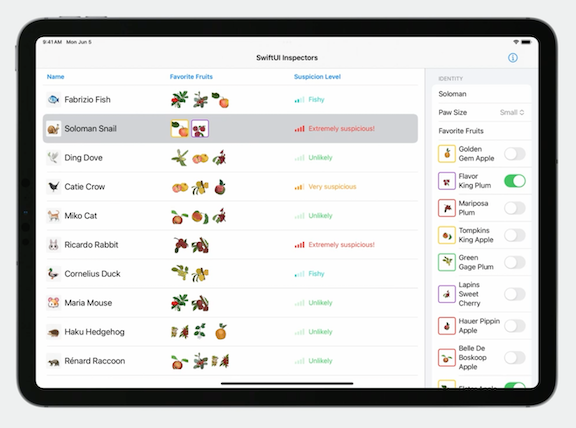

# [**- Inspectors in SwiftUI: Discover the details**](https://developer.apple.com/videos/play/wwdc2023/10161/)

---

### **Inspector**

* Views that show further detail of selected content
    * May show details formatting details for a selection, or show content that supplements an app's main content


* Available in SwiftUI for macOS, iPadOS, and iOS
* The inspector API includes programmatic control over column width, allowing you to tune the width of the trailing column
* The API includes programmatic control over presented state, allowing hiding and showing of the inspector as needed
* Inspector is a higher level abstraction than just a trailing sidebar
    * In compact size classes, it adapts to a resizable sheet
    * Inspector will automatically overlay in split screen on larger iPads
* Fits in alongside other SwiftUI Structural APIs (e.g. NavigationSplitView, .sheet, etc.)
    * Has characteristics of both navigational components and presentations
    * Similar to `NavigationSplitView` and `NavigationStack`, inspector is used to build the scaffolding of your scene
    * Similar to `.sheet`, `.popover`, `.alert`, and `.confirmationDialog`, inspector is a presentation, dismissing and presenting as needed


#### Using the inspector

* The first step is to use the `.inspector(isPresented:content:)` modifier
    * Like some other presentations, this takes a `Bool` presented binding
* Inspector contexts use the grouped list style by default
* Can interact with the inspector in the preview's canvas
* While inspectors can collapse by default, they aren't resizable by default
    * Can change that with the `.inspectorColumnWidth(...)` modifier
    * Resized size will persist across app launches

```swift
public struct ContentView: View {
    @State private var state = AppState()
    @State private var presented = true

    public var body: some View {
        AnimalTable(state: $state)
            .inspector(isPresented: $presented) {
                AnimalInspectorForm(animal: $state.binding())
                    .inspectorColumnWidth(
                        min: 200, ideal: 300, max: 400)
                    .toolbar {
                        Spacer()
                        Button {
                            presented.toggle()
                        } label: {
                            Label("Toggle Inspector", systemImage: "info.circle")
                        }
                    }
            }
    }
}
```

* When declaring a toolbar to toggle the presented state of the inspector, it will appear in the section of the toolbar above the inspector because it's declared within the inspector's view builder
* The inspector modifier has different behaviors depending on the context of where it is applied
    * The placement decides whether:
        * The full height style is used, where there is no separation between toolbar and content
        * The under toolbar style is used, where the inspector is nested under the toolbar
* Toolbar content will be placed in the main content's toolbar - or in the inspector's toolbar, depending on where the `.toolbar` modifier is used

| Full Height Toolbar | Under Toolbar |
| ------------------- | ------------- |
|  |  |

* There are two things to consider when using the inspector API:
    * Is the inspector going to be placed inside or outside of a navigation structure like a NavigationStack or NavigationSplitView
    * Should the toolbar content be inside or outside of the inspector's view builder


* Placing inspector inside a navigation structure, with toolbar content outside the inspector
    * When an inspector is contained within a NavigationStack, the inspector is underneath the navigation stack's toolbar
    * The toolbar content is declared outside of the inspector on the main content and is rendered in the navigation stack's toolbar

```swift
struct Example1: View {
    @State private var state = AppState()

    var body: some View {
        NavigationStack {
            AnimalTable(state: $state)
                .inspector(isPresented: $state.inspectorPresented) {
                    AnimalInspectorForm(animal: $state.binding())
                }
                .toolbar {
                    Button {
                        state.inspectorPresented.toggle()
                    } label: {
                        Label("Toggle Inspector", systemImage: "info.circle")
                    }
                }
        }
    }
}
```

| Regular Width | Compact Width |
| ------------------- | ------------- |
|  |  |

* Placing the inspector outside of a navigation structure, with toolbar content inside the inspector view builder
    * When the inspector modifier is placed outside of a navigation structure, the inspector is given the full height of the trailing column to lay out
    * If the inspector has toolbar content, that content will be placed in a toolbar section specifically for the inspector
        * The toolbar items are positioned with the principal placement, centered in the navigation toolbar above the inspector
        * Because the toolbar content is inside the inspector's view builder, when the inspector presents as a sheet, the toolbar content is in the sheet

```swift
struct Example2: View {
    @State private var state = AppState()
    
    var body: some View {
        NavigationStack {
            AnimalTable(state: $state)
        }
        .inspector(isPresented: $state.inspectorPresented) {
            AnimalInspectorForm(animal: $state.binding())
                .toolbar {
                    ToolbarItem(placement: .principal) {
                        HStack {
                            Button {
                            } label: {
                                Image(systemName: "rectangle.and.pencil.and.ellipsis")
                            }
                            Button {
                            } label: {
                                Image(systemName: "pawprint.circle")
                            }
                        }
                    }
                }
        }
    }
}
```

| Regular Width | Compact Width |
| ------------------- | ------------- |
|  |  |

* These principles extend to macOS, except inspector does not present as a sheet on macOS
    * This simplifies the options, so the only axis to worry about is inside or outside a navigation structure


* If you are using an inspector inside a `NavigationSplitView`, the inspector should be placed in the detail column's view builder, or it can also be placed entirely outside the navigation structure

```swift
// On the detail column
NavigationSplitView {
  Sidebar()
} detail: {
  AnimalTable()
    .inspector(presented: $isPresented) {
      AnimalInspectorForm()
    }
}


// Outside the navigation structure
NavigationSplitView {
  Sidebar()
} detail: {
  AnimalTable()
}
.inspector(presented: $isPresented) {
  AnimalInspectorForm()
}
```

### **Presentation customizations**

* SwiftUI released presentation customizations with iOS 16.4
    * Presentation modifiers allow deep customization of sheets and other presentations like popovers
    * The `.presentationBackground` modifier will set the background of a presentation
        * Unlike the `.background` modifier, the presentation specific modifier will fill the entire presentation and allow underlying content to show through
    * The `.presentationBackgroundInteraction` modifier allows interaction with content behind the sheet
        * The dimming view is removed, and you cna interact with background content
        * Takes an `upThrough` parameter that allows interaction through certain presentation detents
            * The dimming view will only be shown at detents greater than the `upThrough` parameter
        * Used in conjunction with the `presentationDetents` modifier to define detents

```swift
.sheet(item: $nibbledFruit) { fruit in
  FruitNibbleBulletin(fruit: fruit)
    .presentationBackground(.thinMaterial)
    .presentationDetents([.height(200), .medium, .large])
    .presentationBackgroundInteraction(.enabled(upThrough: .height(200)))
}
```

* There are more customizations available, and many of them effects on other presentations as well (not just sheets)


* The same modifiers compose with Inspector when Inspector is presenting as a sheet

```swift
.inspector(presented: $state.inspectorPresented) {
  AnimalInspectorForm(animal: $state.binding())
    .presentationDetents([.height(200), .medium, .large])
    .presentationBackgroundInteraction(.enabled(upThrough: .height(200)))
}
```

#### Full code example

```swift
// Copy+Paste the below into an Xcode project to support building and running the session's code snippets

import SwiftUI

@main
struct SwiftUIInspectors: App {
    var body: some Scene {
        WindowGroup {
            ContentView()
                .environmentObject(AnimalStore())
        }
    }
}

struct AnimalInspectorForm: View {
    var animal: Binding<Animal>?
    @EnvironmentObject private var animalStore: AnimalStore

    var body: some View {
        Form {
            if let animal = animal {
                SelectedAnimalInspector(animal: animal, animalStore: animalStore)
            } else {
                ContentUnavailableView {
                    Image(systemName: "magnifyingglass.circle")
                } description: {
                    Text("Select a suspect to inspect")
                } actions: {
                    Text("Fill out details from the interview")
                }
            }
        }
        #if os(iOS)
        .navigationBarTitleDisplayMode(.inline)
        #endif
    }
}

struct SelectedAnimalInspector: View {
    @Binding var animal: Animal
    @ObservedObject var animalStore: AnimalStore

    var body: some View {
            Section("Identity") {
                TextField("Name", text: $animal.name)
                Picker("Paw Size", selection: $animal.pawSize) {
                    Text("Small").tag(PawSize.small)
                    Text("Medium").tag(PawSize.medium)
                    Text("Large").tag(PawSize.large)
                }
                FruitList(selectedFruits: $animal.favoriteFruits, fruits: allFruits)
            }

            Section {
                TextField(text: animalStore(\.alibi, for: animal), prompt: Text("What was \(animal.name) doing at the time of nibbling?"), axis: .vertical) {
                    Text("Alibi")
                }
                .lineLimit(4, reservesSpace: true)
                if let schedule = Binding(animalStore(\.sleepSchedule, for: animal)) {
                    SleepScheduleView(schedule: schedule)
                } else {
                    Button("Add Sleep Schedule") {
                        animalStore.write(\.sleepSchedule, value: Animal.Storage.newSleepSchedule, for: animal)
                    }
                }
                Slider(
                    value: animalStore(\.suspiciousLevel, for: animal), in: 0...1) {
                        Text("Suspicion Level")
                    } minimumValueLabel: {
                        Image(systemName: "questionmark")
                    } maximumValueLabel: {
                        Image(systemName: "exclamationmark.3")
                    }
            } header: {
                Text("Interview")
            }
            .presentationDetents([.medium, .large])
    }
}

private struct FruitList: View {
    @Binding var selectedFruits: [Fruit]
    var fruits: [Fruit]

    var body: some View {
        Section("Favorite Fruits") {
                ForEach(allFruits) { fruit in
                    Toggle(isOn: .init(get: {
                        selectedFruits.contains(fruit)
                    }, set: { newValue in
                        if newValue && !selectedFruits.contains(fruit) {
                            selectedFruits.append(fruit)
                        } else {
                            _ = selectedFruits.firstIndex(of: fruit).map {
                                selectedFruits.remove(at: $0)
                            }
                        }
                    })) {
                        HStack {
                            FruitImage(fruit: fruit, size: .init(width: 40, height: 40), bordered: true)
                            Text(fruit.name).font(.body)
                        }
                    }
                }
        }
    }

    @ViewBuilder
    private func selectionBackground(isSelected: Bool) -> some View {
        if isSelected {
            RoundedRectangle(cornerRadius: 2).inset(by: -2)
                .fill(.selection)
        }
    }
}

private struct SleepScheduleView: View {
    @Binding var schedule: Animal.Storage.SleepSchedule
    var body: some View {
        DatePicker(selection: .init(get: {
            Calendar.current.date(from: schedule.sleepTime) ?? Date()
        }, set: { newDate in
            schedule.sleepTime = Calendar.current.dateComponents([.hour, .minute], from: newDate)
        }), displayedComponents: [.hourAndMinute]) {
            Text("Sleep at: ")
        }

        DatePicker(selection: .init(get: {
            Calendar.current.date(from: schedule.wakeTime) ?? Date()
        }, set: { newDate in
            schedule.wakeTime = Calendar.current.dateComponents([.hour, .minute], from: newDate)
        }), displayedComponents: [.hourAndMinute]) {
            Text("Awake at: ")
        }
    }
}

struct AppState {
    var selection: String? = "Snail"
    var animals: [Animal] = allAnimals
    var inspectorPresented: Bool = true
    var inspectorWidth: CGFloat = 270
    var cornerRadius: CGFloat? = nil
}

extension Binding where Value == AppState {
    func binding() -> Binding<Animal>? {
        self.projectedValue.animals.first {
            $0.wrappedValue.id == self.selection.wrappedValue
        }
    }
}

extension Animal {
    struct Storage: Codable {
        var alibi: String = ""
        var sleepSchedule: SleepSchedule? = nil

        /// Value between 0 and 1 representing how suspicious the animal is.
        /// 1 is guilty.
        var suspiciousLevel: Double = 0.0

        struct SleepSchedule: Codable {
            var sleepTime: DateComponents
            var wakeTime: DateComponents
        }

        static let newSleepSchedule: SleepSchedule = {
            // Asleep at 10:30, awake at 6:30
            .init(
                sleepTime: DateComponents(hour: 22, minute: 30),
                wakeTime: DateComponents(hour: 6, minute: 30))
        }()
    }

}

final class AnimalStore: ObservableObject {

    var storage: [Animal.ID: Animal.Storage] = [:]

    /// Getter for properties of an animal stored in self
    func callAsFunction<Result>(_ keyPath: WritableKeyPath<Animal.Storage, Result>, for animal: Animal) -> Binding<Result> {
        Binding { [self] in
            storage[animal.id, default: .init()][keyPath: keyPath]
        } set: { [self] newValue in
            self.objectWillChange.send()
            var animalStore = storage[animal.id, default: .init()]
            animalStore[keyPath: keyPath] = newValue
            storage[animal.id] = animalStore
        }
    }

    func write<Value>(_ keyPath: WritableKeyPath<Animal.Storage, Value>, value: Value, for animal: Animal) {
        objectWillChange.send()
        var animalStore = storage[animal.id, default: .init()]
        animalStore[keyPath: keyPath] = value
        storage[animal.id] = animalStore
    }

    func read<Value>(_ keyPath: WritableKeyPath<Animal.Storage, Value>, for animal: Animal) -> Value {
        storage[animal.id, default: .init()][keyPath: keyPath]
    }
}

struct AnimalTable: View {
    @Binding var state: AppState
    @EnvironmentObject private var animalStore: AnimalStore
    @Environment(\.horizontalSizeClass) private var sizeClass: UserInterfaceSizeClass?


    var fruitWidth: CGFloat {
        #if os(iOS)
        40.0
        #else
        25.0
        #endif
    }

    var body: some View {
        Table(state.animals, selection: $state.selection) {
            TableColumn("Name") { animal in
                HStack {
                    Text(animal.emoji).font(.title)
                        .padding(2)
                        .background(.thickMaterial, in: RoundedRectangle(cornerRadius: 3))
                    Text(animal.name + " " + animal.species).font(.title3)
                }
            }
            TableColumn("Favorite Fruits") { animal in
                HStack {
                    ForEach(animal.favoriteFruits.prefix(3)) { fruit in
                        FruitImage(fruit: fruit, size: .init(width: fruitWidth, height: fruitWidth), scale: 2.0, bordered: state.selection == animal.id)
                    }
                }
                .padding(3.5)
            }
            TableColumn("Suspicion Level") { animal in
                SuspicionTableCell(animal: animal)
            }
        }
        #if os(macOS)
        .alternatingRowBackgrounds(.disabled)
        #endif
        .tableStyle(.inset)
    }
}

private struct SuspicionTableCell: View {
    var animal: Animal
    @Environment(\.backgroundProminence) private var backgroundProminence
    @EnvironmentObject private var animalStore: AnimalStore

    var body: some View {
        let color = SuspiciousText.model(for: animalStore.read(\.suspiciousLevel, for: animal)).1
        HStack {
            Image(
                systemName: "cellularbars",
                variableValue: animalStore.read(\.suspiciousLevel, for: animal)
            )
            .symbolRenderingMode(.hierarchical)
            SuspiciousText(
                suspiciousLevel:
                    animalStore.read(\.suspiciousLevel, for: animal),
                selected: backgroundProminence == .increased)
        }
        .foregroundStyle(backgroundProminence == .increased ? AnyShapeStyle(.white) : AnyShapeStyle(color))
    }
}

private struct SuspiciousText: View {
    var suspiciousLevel: Double
    var selected: Bool

    static fileprivate func model(for level: Double) -> (String, Color) {
        switch level {
        case 0..<0.2:
            return ("Unlikely", .green)
        case 0.2..<0.5:
            return ("Fishy", .mint)
        case 0.5..<0.9:
            return ("Very suspicious", .orange)
        case 0.9...1:
            return ("Extremely suspicious!", .red)
        default:
            return ("Suspiciously Unsuspicious", .blue)
        }
    }

    var body: some View {
        let model = Self.model(for: suspiciousLevel)
        Text(model.0)
            .font(.callout)
    }
}

struct Animal: Identifiable {
    var name: String
    var species: String
    var pawSize: PawSize
    var favoriteFruits: [Fruit]
    var emoji: String

    var id: String { species }
}

var allAnimals: [Animal] = [
    .init(name: "Fabrizio", species: "Fish", pawSize: .small, favoriteFruits: [.arbutusUnedo, .bigBerry, .elstar], emoji: "🐟"),
    .init(name: "Soloman", species: "Snail", pawSize: .small, favoriteFruits: [.elstar, .flavorKing], emoji: "🐌"),
    .init(name: "Ding", species: "Dove", pawSize: .small, favoriteFruits: [.quercusTomentella, .pinkPearlApple, .lapins], emoji: "🕊️"),
    .init(name: "Catie", species: "Crow", pawSize: .small, favoriteFruits: [.pinkPearlApple, .goldenNectar, .hauerPippin], emoji: "🐦‍⬛"),
    .init(name: "Miko", species: "Cat", pawSize: .small, favoriteFruits: [.belleDeBoskoop, .tompkinsKing, .lapins], emoji: "🐈"),
    .init(name: "Ricardo", species: "Rabbit", pawSize: .small, favoriteFruits: [.mariposa, .elephantHeart], emoji: "🐰"),
    .init(name: "Cornelius", species: "Duck", pawSize: .medium, favoriteFruits: [.greenGage, .goldenNectar], emoji: "🦆"),
    .init(name: "Maria", species: "Mouse", pawSize: .small, favoriteFruits: [.arbutusUnedo, .elephantHeart], emoji: "🐹"),
    .init(name: "Haku", species: "Hedgehog", pawSize: .small, favoriteFruits: [.christmasBerry, .creepingSnowberry, .goldenGem], emoji: "🦔"),
    .init(name: "Rénard", species: "Raccoon", pawSize: .medium, favoriteFruits: [.belleDeBoskoop, .bigBerry, .christmasBerry, .kakiFuyu], emoji: "🦝")
]

enum PawSize: Hashable {
    case small
    case medium
    case large
}

struct Fruit: Identifiable, Hashable {
    var name: String
    var color: Color
    var id: String { name }
}

struct FruitImage: View {
    var fruit: Fruit
    var size: CGSize? = .init(width: 50, height: 50)
    var scale: CGFloat = 1.0
    var bordered = false

    var body: some View {
        fruit.color // Actual assets replaced with Color
            .scaleEffect(scale)
            .scaledToFill()
            .frame(width: size?.width, height: size?.height)
            .mask { RoundedRectangle(cornerRadius: 4) }
            .overlay {
                if bordered {
                    RoundedRectangle(cornerRadius: 4)
                        .stroke(fruit.color, lineWidth: 2)
                }
            }
    }
}

extension Fruit {
    static let goldenGem = Fruit(name: "Golden Gem Apple", color: .yellow)
    static let flavorKing = Fruit(name: "Flavor King Plum", color: .purple)
    static let mariposa = Fruit(name: "Mariposa Plum", color: .red)
    static let tompkinsKing = Fruit(name: "Tompkins King Apple", color: .yellow)
    static let greenGage = Fruit(name: "Green Gage Plum", color: .green)
    static let lapins = Fruit(name: "Lapins Sweet Cherry", color: .purple)
    static let hauerPippin = Fruit(name: "Hauer Pippin Apple", color: .red)
    static let belleDeBoskoop = Fruit(name: "Belle De Boskoop Apple", color: .red)
    static let elstar = Fruit(name: "Elstar Apple", color: .yellow)
    static let goldenDeliciousApple = Fruit(name: "Golden Delicious Apple", color: .yellow)
    static let creepingSnowberry = Fruit(name: "Creeping Snowberry", color: .white)
    static let quercusTomentella = Fruit(name: "Channel Island Oak Acorn", color: .brown)
    static let elephantHeart = Fruit(name: "Elephant Heart Plum", color: .red)
    static let goldenNectar = Fruit(name: "Golden Nectar Plum", color: .yellow)
    static let pinkPearlApple = Fruit(name: "Pink Pearl Apple", color: .pink)
    static let christmasBerry = Fruit(name: "Christmas Berry", color: .red)
    static let kakiFuyu = Fruit(name: "Kaki Fuyu Persimmon", color: .orange)
    static let bigBerry = Fruit(name: "Big Berry Manzanita", color: .red)
    static let arbutusUnedo = Fruit(name: "Strawberry Tree", color: .red)
}

extension Array where Element == Fruit {
    var groupID: Fruit.ID {
        reduce("") { result, next in
            result.appending(next.id)
        }
    }
}

var allFruits: [Fruit] = [
    .goldenGem,
    .flavorKing,
    .mariposa,
    .tompkinsKing,
    .greenGage,
    .lapins,
    .hauerPippin,
    .belleDeBoskoop,
    .elstar,
    .goldenDeliciousApple,
    .creepingSnowberry,
    .quercusTomentella,
    .elephantHeart,
    .goldenNectar,
    .kakiFuyu,
    .bigBerry,
    .arbutusUnedo,
    .pinkPearlApple,
]
```
