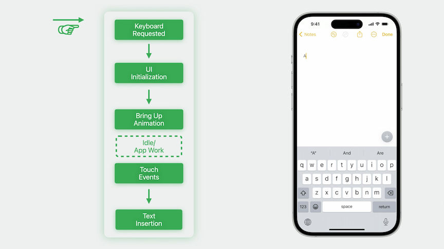
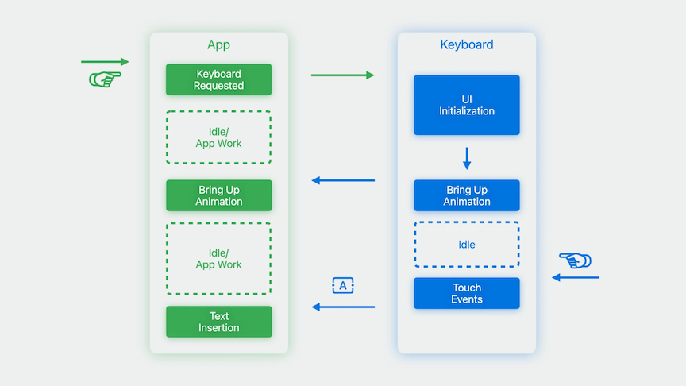
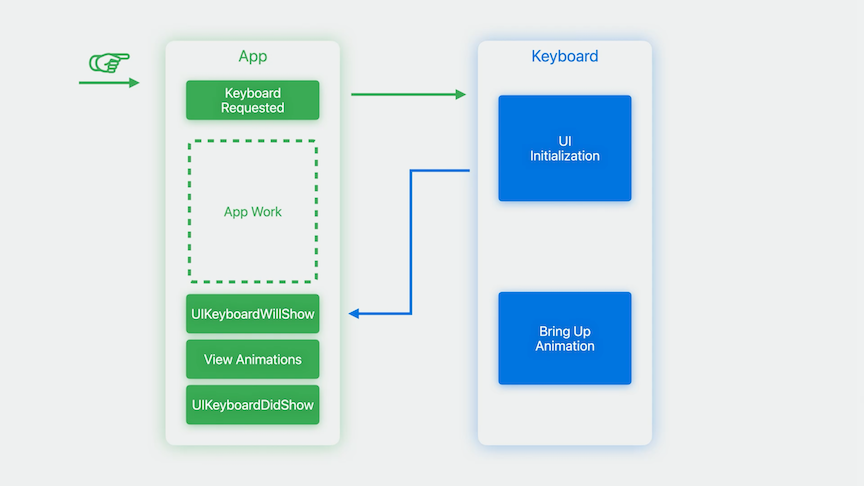

# [**Keep up with the keyboard**](https://developer.apple.com/videos/play/wwdc2023/10281/)

---

### **Out of process keyboard**

* Taking the keyboard out of the app process:
    * Allows improvements to privacy and security
    * Frees up memory in apps and throughout the system (only one keyboard now)
    * Provides system flexibility
* Previous to iOS 17, the keyboard executed within the app's process
    * Now runs in its own process, running almost completely outside the app

| Previous Flow | iOS 17 Flow |
| ------------- | ----------- |
|  |  |

### **Design for the keyboard**

Special scenarios:

* With Stage Manager, the system is moving away from that model, apps aren't necessarily full screen. That means when the keyboard comes up, the keyboard's scene and the app's scene no longer line up.
    * Extra transformations need to take place to adjust the app appropriately for its context
        * Needs to adjust by the intersection of the keyboard and your app
    * May have multiple scenes on screen, each with different calculations and adjustments necessary
    * When the hardware keyboard is attached, the system will present an assistant toolbar in the center of the screen, acting as part of the keyboard, so your views should be adjusted out of its way
        * Using a flick gesture, this toolbar can also be minimized
        * When outside of Stage Manager, we're preserving existing behavior where this mini toolbar does not act as part of the keyboard and will overlap your views
        * When in Stage Manager, the mini toolbar does act as part of the keyboard

#### Keyboard Layout Guide

* Layout guide that matches the keyboard
* Recommended approach for integrating they keyboard with UIKit
* Adopting can be as simple as `view.keyboardLayoutGuide.topAnchor.constraint(equalTo: textView.bottomAnchor).isActive = true`

Default behaviors

* Follows the keyboard when onscreen and docked
* Uses bottom safe area when offscreen or undocked
* Follows dismiss gestures when it intersects
* [**Your Guide to Keyboard Layout**](https://developer.apple.com/videos/play/wwdc2021/10259/) session from WWDC 2021

Customizing the guide

* `followsUndockedKeyboard`
    * Defaults to false
    * Set to `true` to always follow the keyboard when undocked from the bottom
* `usesBottomSafeArea`
    * Defaults to true
    * Set to `false` to avoid using the bottom safe area when undocked or offscreen
    * Allows you to extend your background to cover the bottom of the screen when the keyboard is dismissed and also adjust for when the keyboard is brought up
        * Behaves similar to an `InputAccessoryView`
* `keyboardDismissPadding`
    * Used to add padding above the keyboard for the _scroll to dismiss_ gesture

```swift
// Example of using usesBottomSafeArea to create keyboard and text view aligned with safe area

view.keyboardLayoutGuide.usesBottomSafeArea = false

textField.topAnchor.constraint(equalToSystemSpacingBelow: backdrop.topAnchor, multiplier: 1.0).isActive = true

view.keyboardLayoutGuide.topAnchor.constraint(greaterThanOrEqualToSystemSpacingBelow: textField.bottomAnchor, multiplier: 1.0).isActive = true

view.keyboardLayoutGuide.topAnchor.constraint(equalTo: backdrop.bottomAnchor).isActive = true

view.safeAreaLayoutGuide.bottomAnchor.constraint(greaterThanOrEqualTo: textField.bottomAnchor).isActive = true
```

```swift
// Using keyboardDismissPadding
var dismissPadding = aboveKeyboardView.bounds.size.height

view.keyboardLayoutGuide.keyboardDismissPadding = dismissPadding
```

* SwiftUI automatically handles the common keyboard cases for you
* The keyboard is included as part of the safe area, which when the keyboard is dismissed, will track the small home affordance at the bottom of the screen
* When the keyboard is brought up, the system will animate and adjust the safe area for you, resizing your views automatically, so there's not really any keyboard code to write at all
    * May need to do some work on your layouts to make sure that your views are resizing or repositioning in the way you want

#### Notifications

The code below should handle keyboard notifications properly

```swift
func handleWillShowOrHideKeyboardNotification(notification: NSNotification) {
    // Retrieve the UIScreen object from the notification (Added iOS 16.1)
    guard let screen = notification.object as? UIScreen else { return }

    // Determine if the notification’s screen corresponds to your view’s screen
    guard(screen.isEqual(view.window?.screen)) else { return }

    // Calculate intersection with keyboard
    let endFrameKey = UIResponder.keyboardFrameEndUserInfoKey

    // Get the ending screen position of the keyboard
    guard let keyboardFrameEnd = userInfo[endFrameKey] as? CGRect else { return }

    let fromCoordinateSpace: UICoordinateSpace = screen.coordinateSpace
    let toCoordinateSpace: UICoordinateSpace = view

    // Convert from the screen coordinate space to your local coordinate space
    let convertedKeyboardFrameEnd = fromCoordinateSpace.convert(keyboardFrameEnd, to: toCoordinateSpace)

    // Calculate offset for view adjustment
    var bottomOffset = view.safeAreaInsets.bottom
            
    // Get the intersection between the keyboard's frame and the view's bounds
    let viewIntersection = view.bounds.intersection(convertedKeyboardFrameEnd)
            
    // Check whether the keyboard intersects your view before adjusting your offset.
    if !viewIntersection.isEmpty {
        // Set the offset to the height of the intersection
        bottomOffset = viewIntersection.size.height
    }

    // Use the new offset to adjust your UI
    movingBottomConstraint.constant = bottomOffset
  
    // Adjust view layouts and animate using information in notification
  
    ...
  
}
```

* With the new out of process architecture, when your app requests the keyboard, the system will asynchronously initialize the keyboard UI and then asynchronously post the notifications and perform the animations
* This introduces some slight differences in timing
    * If your app is relying on the timing of the notifications as some sort of "callback" from invoking becomeFirstResponder, or perhaps performing significant work on the main thread which could cause the handling of the notifications to be delayed, you should keep this new model in mind



### **New text entry APIs**

#### Inline predictions

* English language keyboard will suggest text inline
* Generated using contextual information in the text field
* By default, inline predictions will be active in most text input fields
    * Automatically disabled in search and password fields
    * Can customize this by setting `.inlinePredictionType` to `.yes` or `.no`
* [**What's new with text and text interactions**](./What's%20new%20with%20text%20and%20text%20interactions.md) session from WWDC 2021

```swift
@MainActor public protocol UITextInputTraits : NSObjectProtocol {
    // Controls whether inline text prediction is enabled or disabled during typing
    @available(iOS, introduced: 17.0)
    optional var inlinePredictionType: UITextInlinePredictionType { get set }
}

public enum UITextInlinePredictionType : Int, @unchecked Sendable {
    case `default` = 0
    case no = 1
    case yes = 2
}

let textView = UITextView(frame: frame)
textView.inlinePredictionType = .yes
```
