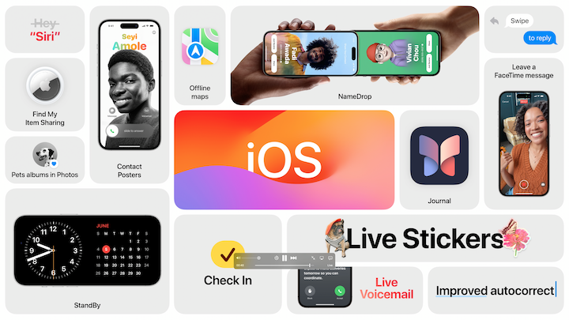
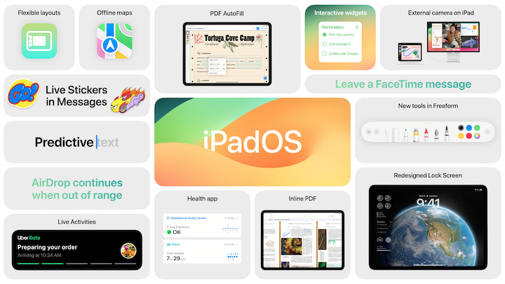
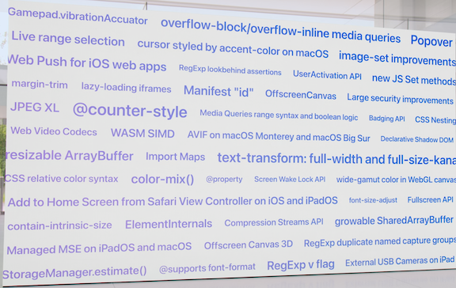
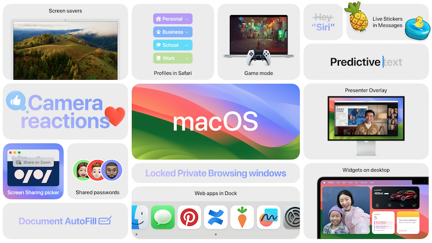
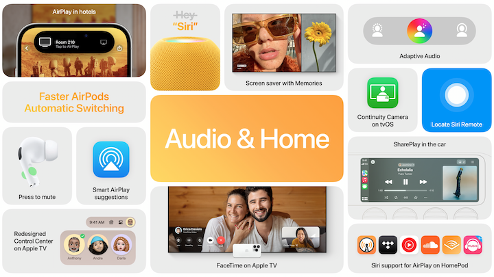
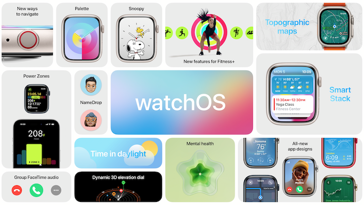

# [**Keynote**](https://developer.apple.com/videos/play/wwdc2022/10062/)

---

### **Mac**

* 15" Macbook Air - M2
* Mac Studio updated to M2 family
    * with M2 Ultra
* Mac Pro announced, just like the old one, but with M2 Ultra (and no external memory/graphics cards)

### **iOS 17**

* Personalized contact posters
    * full screen photos or memoji on lock screen when call comes in/contact card 
    * designed by you, show up on other's devices
    * works with CallKit (via VOIP)
* Live Voice mail
    * See live transcriptions while person is leaving voicemail
    * Can answer the call while the voicemail is transcribing
* FaceTime
    * Can now leave a video message when calling via FaceTime and the other party cannot answer
* Messages
    * Search filters can make searches more precise
    * New catchup arrow lets you jump up to oldest unread message
    * swipe to replay on specific messages
    * audio messages transcribed
    * inline location sharing
    * Check In
        * Used to automatically let someone know you have arrived at your destination
        * Allows pushing back of check-in time
        * Shares other critical information
    * Message apps now under a `+` button instead of in a row across the bottom
        * New stickers experience
            * All emoji are now stickers
            * Kept in a drawer by category, most used, etc.
            * Sticker drop is now dead - users can grab an object out of a photo and turn it into a sticker
            * Can send stickers inline or drag and drop onto a message
            * stickers in tapback message now
            * Can add effects to stickers
            * Stickers can be found system wide (including 3rd party apps)
* AirDrop
    * NameDrop allows you to bring phones close together to share contact information
        * Can choose which email addresses/phone numbers you want to share
        * Works with Apple Watch as well
    * Content now continues to download outside of AirDrop range via the internet
    * Can kickoff shared experiences via AirDrop
* Keyboard
    * Intelligence updates to autocorrect (I'll believe it when I see it)
    * Now uses a transformer language model for keyboard prediction
    * Model runs every time you tap a key
    * Sentence level autocorrect can fix more grammatical mistakes
    * Keyboard will learn words (included special four letter words)
    * Inline predictions for words and sentences.
    * Dictation is now more accurate as well
* Journal App
    * Simple to add images to an entry, and you can add a writing prompt
    * Lots of other stuff, probably
* Standby
    * Turning iPhone on its side while charging, you get a new mode
    * Similar to nightstand mode for the Apple Watch
    * Can show widgets (possibly only in smart stacks?)
    * Remembers preferred views
* Just `Siri` activates Siri
* Can make back to back requests with context
* Offline maps in Maps
* Pets albums in Photos
* Find My item sharing

### **iPadOS 17**

* Widgets and the Lock Screen
    * Widgets are now interactive, can take action directly in the widget (e.g. complete reminders)
        * Can control home controls from widget
        * Play music, etc.
        * Developers can make interactive widgets as well
    * iOS lockscreen customization behaviors brought to iPad
* Live Activities
    * Multiple timers!!!
* Health app added to iPad
* PDF
    * Fields can now be auto-detected
    * Even works on camera-scanned documents
    * Can sign with a saved signature or Apple Pencil
    * Notes app can now help you annotate, collaborate, and view PDFs
    * Works from anywhere, including on a FaceTime call
* Can now use external display camera for video calls, etc.

### **macOS**

* macOS Sonoma
* Gets many of the same iOS/iPadOS features already mentions
* New screensavers (similar to tvOS screensavers)
* Imagery settles into the desktop background image
* Widgets
    * Available outside of notification center
    * Can put them anywhere
    * Widgets in the background fade out so they are visible, but not full alpha
        * Tinted based on background color
    * Continuity allows you to access widgets on other devices
        * Device just needs to be nearby or on same wi-fi network
    * Widgets are now interactive here as well
* Gaming
    * Apparently a thing on the Mac?
    * New mode: Game mode
        * Assures a game gets highest CPU/GPU priority
        * Lowers audio latency
        * Doubles bluetooth sampling rate with controllers
    * New Game Porting Toolkit
        * Lets devs evaluate effort to port game to make
        * Simpler conversion process for shaders, etc.
        * Shorter development time
* Video conferencing
    * Presenter overlay - includes you on top of content you are sharing
        * Either a chat bubble on your content, or your content in a large window behind you
    * Reactions video effect
        * balloons, hearts, etc. 
        * Usable with FaceTime, Zoom, Webex, etc.
* Safari
    * Private browser mode locks browser window when you aren't using them
        * blocks trackers
        * Removes URL trackers
    * Passwords and Passkeys can now be shared
    * Profiles
        * Can now separate cookies, favorites, tabs, etc. between different profiles
    * Web apps on Mac
        * Can add a website to the Dock
        * No work needed by developers
        * Works with all 78 different multitasking pardigms on macOS
    * New WebKit additions

### **Audio & Home**

* AirPods
    * Adaptive Audio
        * Combines noise cancellation and transparency modes
        * Personalized volume uses ML to give you personalized listening experiences
        * Speaking will duck the audio so you can converse with the audio in the background
* AirPlay
    * Use on-device learning to learn where you listen to specific audio types
    * AirPlay in hotels
        * Scan QR code and tap confirmation to get wi-fi and watch on hotel TVs
    * Shareplay in the car
        * Can share music and control playback together
* tvOS
    * Control center redesigned
        * Access airpod settings, cameras, system controls, profiles
        * Can now use iPhone to locate Siri remote
    * Select memories as screen savers
    * FaceTime on Apple TV
        * Can place call on phone or Apple TV, and move between
        * Uses camera on iPhone/iPad
    * Added continuity camera APIs
        * Zoom, webex, etc. coming to Apple TV

### **watchOS**

* From any watch face, turn the digital crown to reveal widgets in a smart stack
    * Uses ML to show timely relevant info
    * New widgets that hold complications
* New watch face behaviors
    * world clock
* New activity app
    * corner icons for awards, summary, etc.
    * Rotating the digital crown shows full screen views for move/exercise/stand
* New watch faces
    * Palette
    * Snoopy & Woodstock
* New cycling features
    * workouts show up on your iPhone automatically
* New high accuracy motion data
* Mental Health
    * Can log momentary emotions in the watchOS mindfulness app
        * Can identify what's making you feel that way
        * Can describe feelings further
        * Can use health app on iPhone/iPad to log this as well
    * Can take standardized assessments right in the health app
* Vision Health
    * Apple Watch can measure time spent outside with ambient light sensors
    * Screen distance
        * Measures if someone is holding their device too closely for an extended period of time

### **Vision Pro**

* AR
* Control with eyes, hands, voice
    * No controllers
* Can place apps anywhere in a space
* Launching new apps occupy new spaces centered around you
* "Environments" extend and transform spaces to turn AR into VR
* Displays your eyes when people are around you
    * Let's others know if you are immersed in an experience
    * When someone is nearby, they appear in your view
* Can arrange apps however (above, beside, layered)
* Content not limited to 2D
* Works with bluetooth accessories (keyboard/mouse/trackpad)
* Can use your Mac by looking at it, the mac connects wirelessly to the headset
* Realtime collaboration on documents
* FaceTime
* Game controller support
* Developers can use current technologies (ARKit/RealityKit/SwiftUI/Xcode)
* Same frameworks used for iOS/iPadOS are available in visionOS
* Unity-based games/apps can get full access to system level things like gesture recognition
* App store for Vision Pro with Vision Pro apps as well as compatible iOS/iPadOS apps
* Uses Optic ID for authentication (App Store purchases, etc.)
* Eye input is private, not sent to website, etc. Only where you "tap"
* _Starts_ at $3,499, early next year