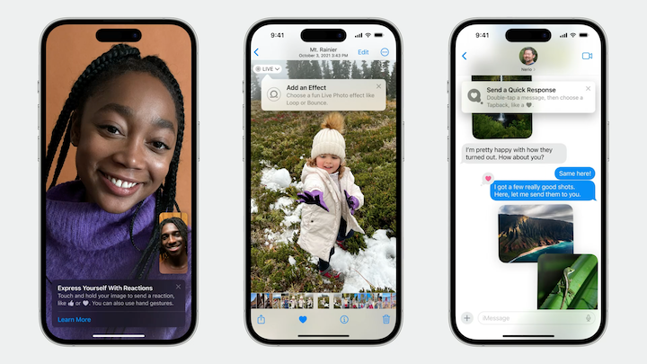
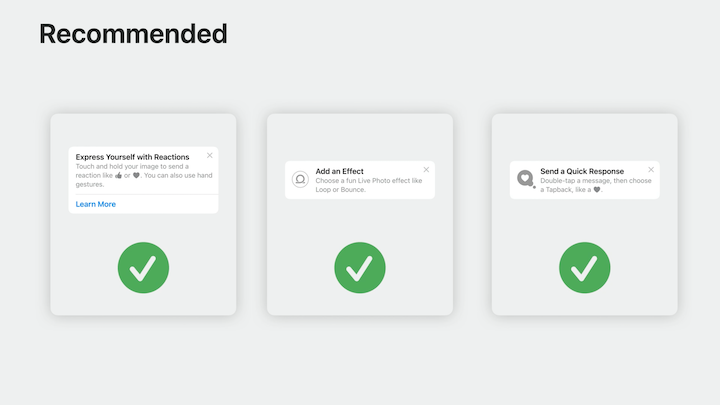
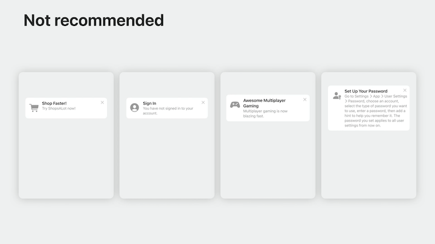

# [**Make features discoverable with TipKit**](https://developer.apple.com/videos/play/wwdc2023/10229/)

---

TipKit is a new framework that makes it easy to show tips in your app

* TipKit can teach someone about a brand-new feature, help with discovery of a hidden feature, or show a faster way to accomplish a task
* Available across iPhone, iPad, Mac, Apple Watch, and Apple TV



### **Create a tip**

* Tips are made up of a title and message
    * Useful tips have direct action phrases as titles that say what the feature is and messages with easy to remember benefit info or instructions so users know why they'd want to use the feature and are later able to accomplish the task on their own
    * Tips should be actionable, instructional, and easy to remember
    * Not recommended for:
        * Promotional messages
        * Error messages
        * Non-actionable messages
        * Long, complicated messages

```swift
struct FavoriteBackyardTip: Tip {

    var title: Text {
        Text("Save as a Favorite")
    }
    
    var message: Text {
        Text("Your favorite backyards always appear at the top of the list.")
    }
}
```

| Recommended | Not Recommended |
| ---------------------- | ------------------- |
|  |  |

* TipsCenter enables key TipKit functionality, including having tips and their associated events persist between app launches and makes it easier to test tips
    * A default shared instance of TipsCenter is provided

```swift
@main
struct BackyardBirdsApp: App {
    var body: some Scene {
        WindowGroup {
            ContentView()
        }
    }

    // ...

    init() {
        TipsCenter.shared.configure()
    }
}
```

* Text is fully customizable in Tips
* Icons can be added to draw attention and associate the tip with a feature
* Action buttons can be added to take people directly to settings that can be customized for a feature, additional resources, etc.

```swift
struct FavoriteBackyardTip: Tip {

    var title: Text {
        Text("Save as a Favorite").foregroundColor(.indigo)
    }
    
    var message: Text {
        Text("Your favorite backyards always appear at the top of the list.")
    }
    
    var asset: Image {
        Image(systemName: "star")
    }
    
    var actions: [Action] {
        [
            Tip.Action(
                id: "learn-more", 
                title: "Learn More"
            )
        ]
    }
}
```

* Two types of tip views:
    * Popover view - allows the tip to appear over your app's UI
        * Can point directly to a button or other element and is particularly useful for directing users without changing the current app screen
        * On tvOS, the popover view is exclusively used
        * uses the `.popoverMiniTip(tip: ...)` modifier
    * In-line view - adjusts the app's UI to temporarily fit around it so no UI is blocked
* When using either view, it's helpful to have the tip appear close to the relevant button or element you're calling out

```swift
private let favoriteBackyardTip = FavoriteBackyardTip()

// ...

.toolbar {
    ToolbarItem {
        Button {
            backyard.isFavorite.toggle()
        } label: {
            Label("Favorite", systemImage: "star")
                .symbolVariant(
                    backyard.isFavorite ? .fill : .none
                )
        }
        .popoverMiniTip(tip: favoriteBackyardTip)
    }
}
```

### **Eligibility Rules**

Rule types:

* Parameter-based rules
    * Persistent and best suited for showing tips based on a Swift value type that you want to write an expression around
* Event-based rules
    * Allow you to define an action that must be performed before a person becomes eligible for a tip
* For the code below, we'll use a parameter-based rule
    * Require a user to be logged in to see the tip (set `isLoggedIn` value initially to `false`)
    * Require a user to visit the view at least three times (set `enteredBackyardDetailView` value initially to `0`)
    * Finally, `donate()` the event any time the `FavoriteBackyardTip` view appears

```swift
struct FavoriteBackyardTip: Tip {
    @Parameter
    static var isLoggedIn: Bool = false
  
    static let enteredBackyardDetailView: Event = Event<DetailViewDonation>(
        id: "entered-backyard-detail-view"
    )

    // ...
    
    var rules: Predicate<RuleInput...> {
        // User is logged in
        #Rule(Self.$isLoggedIn) { $0 == true }
            
        // User has entered any backyard detail view at least 3 times
        #Rule(Self.enteredBackyardDetailView) { $0.count >= 3 }
    }
}

struct BackyardDetailView: View {
    var body: some View {
        ...
    }
}
.onAppear {
     FavoriteBackyardTip.enteredBackyardDetailView.donate()
}
```

* We can narrow the scope even more by only showing the tip to individuals who regularly use the app
* We'll add a date query modifier to my event-based rule that will ensure it will only ever evaluate to true if someone has gone to the Backyard Detail View three times in the past five days

```swift
// User has entered any backyard detail view at least 3 times in the past 5 days
#Rule(Self.enteredBackyardDetailView) { 
    $0.donations.filter { 
        $0.date > Date.now.addingTimeInterval(-5 * 60 * 60 * 24)
    }
    .count >= 3
}
```

* Using associated types, we can further refine the event-based rule, so it matches only when someone has gone to a _specific_ Backyard Detail View
    * Create the `DetailViewDonation` struct and supply the ID of the specific backyard view
    * In the donation, include the ID of the backyard view a person is currently in
    * Finally, update the rule to query for events based on a unique backyard ID
        * Keep in mind the size of the data being stored - the larger the size, the slower the query will execute

```swift
// Create the associated type
extension BackyardDetailTip {
    struct DetailViewDonation: DonationValue {
        let backyardID: Int
    }
}

// Donate the unique id of the backyard detail being viewed
.onAppear {
     BackyardFavoriteTip.enteredBackyardDetailView.donate(
         with: .init(backyardID: backyard.id)
     )
}

struct FavoriteBackyardTip: Tip {

    // ...

    var rules: Predicate<RuleInput...> {
        // Update the rule to specify a backyardID
        #Rule(Self.enteredBackyardDetailView) {
            $0.donations.filter {
                $0.date > Date.now.addingTimeInterval(-5 * 60 * 60 * 24) 
            }
            .largestSubset(by: \.backyardID)
            .count >= 3
        }
    }
}
```

### **Display and dismissal**

* You can use TipsCenter to specify the length of time that must pass before another tip can appear
    * Can use frequencies like daily, hourly, a custom TimeInterval, or set no frequency control at all

```swift
// One tip per day.
TipsCenter.shared.configure {
    DisplayFrequency(.daily)
}

// One tip per hour.
TipsCenter.shared.configure {
    DisplayFrequency(.hourly)
}

// Custom configuration. Only show one tip every five days.
let fiveDays: TimeInterval = 5 * 24 * 60 * 60
TipsCenter.shared.configure {
    DisplayFrequency(fiveDays)
}

// No frequency control. Show all tips as soon as eligible.
TipsCenter.shared.configure {
    DisplayFrequency(.immediate)
}
```

* Instead of ignoring display frequency at the TipsCenter level, it may be more useful to ignore it on a one-off, per-tip basis
    * Add the `.ignoresDisplayFrequency` option to the specific tip
    * The reset of the tips will still follow the frequency schedule, while the specific tip will not

```swift
struct FavoriteBackyardTip: Tip {

    // ...
  
    var options: [Option] {
        [.ignoresDisplayFrequency(true)]
    }
}
```

* Use the `.invalidate(reason:)` method to dismiss a tip if a user uses the action that the tip is related to
    * Can specify a reason of `.userPerformedAction` in this case

```swift
Button {
    backyard.isFavorite.toggle()

    // When user taps the favorite button, dismiss the tip
    favoriteBackyardTip.invalidate(reason: .userPerformedAction)
} label: {
    Label("Favorite", systemImage: "star")
        .symbolVariant(backyard.isFavorite ? .fill : .none)
}
.popoverMiniTip(tip: favoriteBackyardTip)
```

* A tip can also be dismissed if it has been displayed more than a defined `.maxDisplayCount`
    * Once the tip displays the max number of times, it should not display again even if all other requirements are met

```swift
struct FavoriteBackyardTip: Tip {

    // ...

    var options: [Option] {
        [.maxDisplayCount(5)]
    }
}
```

* The invalidate method can be used to dismiss a tip based on any interaction or criteria that the developer sees fit
* TipKit can also sync tip status via iCloud to ensure that tips seen on one device won't be seen on the other

### **Test tips**

* TipKit comes with APIs that can be used to work around eligibility rules to show or hide tips as needed
    * Use `.showAllTips()` to `TipsCenter`'s configuration to inspect all tips in the app regardless of whether rules have been satisfied
    * Use `.showTips` and pass in the specific tip IDs to show specific tips
    * Use `.hideTips` to prevent specific tips from showing
    * Use `.hideAllTips()` to assure no tips will show
    * Use `.resetDatastore` to purge all info in the TipKit data store, setting a clean state at each build of the app


```swift
// Show all defined tips in the app
TipsCenter.showAllTips()

// Show some tips, but not all
TipsCenter.showTips([tip1, tip2, tip3])

// Hide some tips, but not all
TipsCenter.hideTips([tip1, tip2, tip3])

// Hide all tips defined in the app
TipsCenter.hideAllTips()

// Purge all TipKit related data
TipsCenter.resetDatastore()
```

* All of the same testing options are available as launch arguments that can be added to a project's scheme

```swift
// Show all defined tips in the app
com.apple.TipKit.ShowAllTips 1

// Show some tips, but not all
com.apple.TipKit.ShowTips tipID,otherTipID

// Hide some tips, but not all
com.apple.TipKit.HideAllTips 1

// Hide all tips defined in the app
com.apple.TipKit.HideTips tipID,otherTipID

// Purge all TipKit related data
com.apple.TipKit.ResetDatastore 1
```
