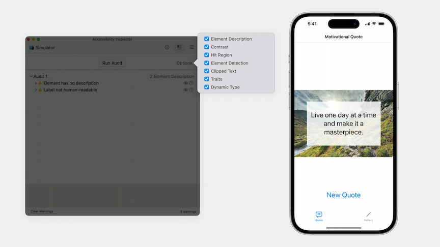
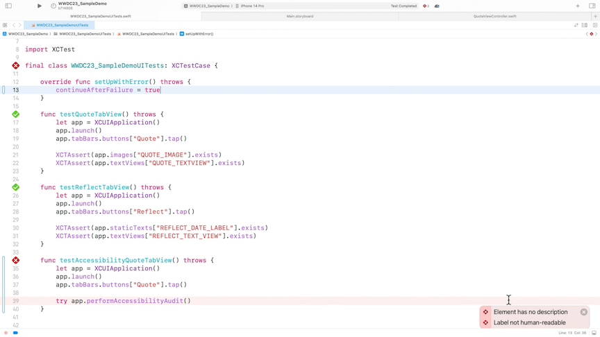
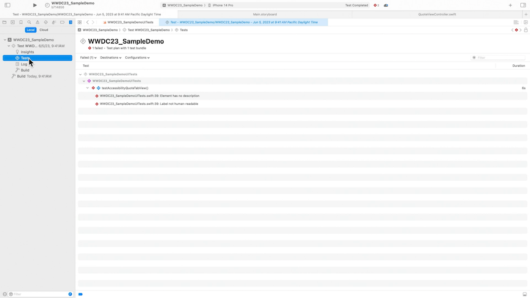
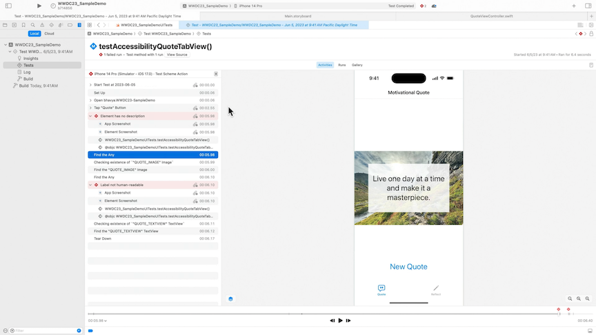

# [**Perform accessibility audits for your app**](https://developer.apple.com/videos/play/wwdc2023/10035/)

---

### **Accessibility audits**

The Accessibility Inspector provides an easy way to find, diagnose, and fix accessibility issues within your app

* The Inspector can audit individual views in your app for common accessibility issues
* The Inspector checks for all kinds of issues, like providing sufficient element descriptions and ensuring proper contrast
    * The issues it finds are displayed in a table with detailed descriptions about each issue



* Accessiblity audits are now automatible within UI tests with `app.performAccessibilityAudit()`
    * No need for assertions: if any issues are found, your test automatically fails
    * Can set `continueAfterFailure = true` in `override func setupWithError() throws` to allow the audit to report multiple issues
    * Issues are reported inline within the Xcode source editor

```swift
func testAccessibility() throws {
    let app = XCUIApplication()
    app.launch()
    
    try app.performAccessibilityAudit()
}
```



* You can dig deeper into accessibility test failures by clicking on the disclosure triangle for a failed test in the Test results
    * This view shows a detailed breakdown of the test run and the issues
    * You can double-click the `Element Screenshot` line to see the image view has failed the test

| Test Results | Test Failure Details |
| ------------ | -------------------- |
|  |  |

#### Handling audit issues

* It's important to explore each issue individually and fix it
* It's also important to acknowledge that you may run into issues which should be filtered out and ignored
    * False positive or expected behavior
* For best practices in accessibility, watch the [**Deliver an Exceptional Accessibility Experience**](https://developer.apple.com/videos/play/wwdc2018/230/) session from WWDC 2018
* Use the accessibility identifier instead of the accessibility label when you need to identify a system element but not have VoiceOver read the identifier
* If you have an image that is decorative and not part of the content (e.g. background image), you can exclude the image from VoiceOver by overriding the accessibility elements of the page:

```swift
view.accessibilityElements = [quoteTextView, newQuoteButton]
```

* When you have an issue that is failing the accessibility audit, but is a false positive (or needs to be ignored for some other reason), you can use the `performAccessibilityAudit` function to filter out issues
    * The first parameter allows you to specify an option set of the categories of audits that you want to run
    * The second parameter allows you to specify a closure, called on all the issues found by the audit and lets you choose which issues to ignore and which issues to report

```swift
try app.performAccessibilityAudit(for: [.dynamicType, .contrast]) { issue in
    var shouldIgnore = false
          
    // ignore contrast issue on "My Label"
    if let element = issue.element, 
       element.label == "My Label",
       issue.auditType == .contrast {
           shouldIgnore = true
    }
    return shouldIgnore
}
```

#### Running audits

* An audit is limited to elements on the screen
    * Run accessibility audit tests for all the different views your app may show
* A quick way to immediately add audits for multiple tests is to override and perform the audit in teardown
* Use test plans to group audit-specific tests in your project
* Audits shouldn't substitute real testing with assistive technologies

### **Automation elements**

Automation elements allow you to expose elements specifically for the purpose of automation without affecting the accessibility of those elements

* In UIKit, you'll be able to leverage this API to expose exactly the elements you need for automation, while still being able to customize the accessibility for these elements at the same time
* If views are excluded from accessibility, you can still include them in tests by overriding the view's `automationElements`

```swift
view.automationElements = [imageView, quoteTextView, newQuoteButton]
```
