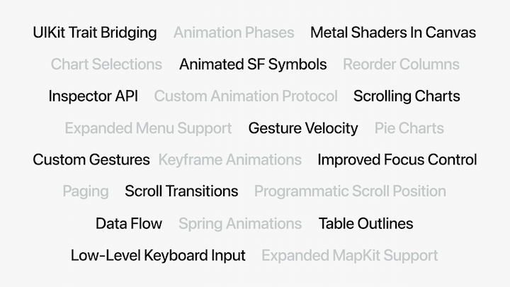
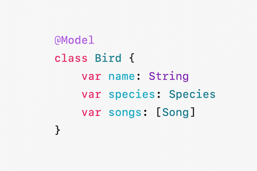
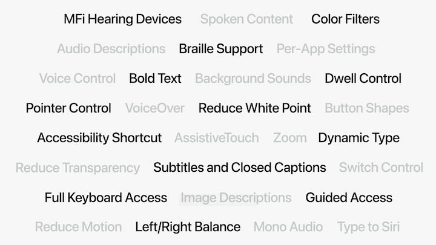
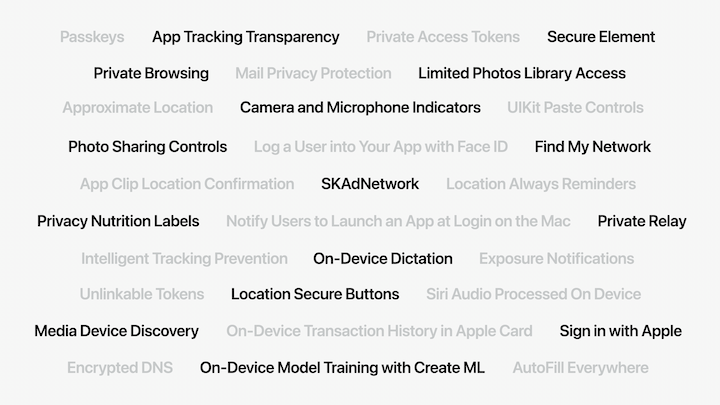
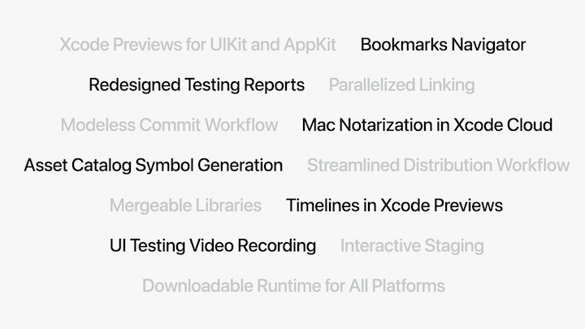
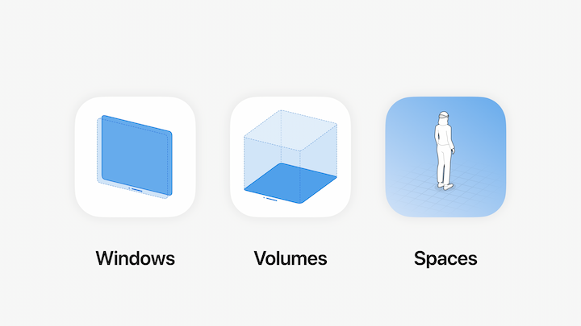
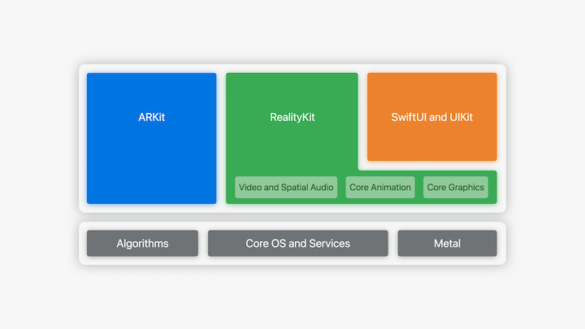

# [**State of the Union**](https://developer.apple.com/videos/play/wwdc2023/102/)

---

### **Swift**

* Swift Macros
    * Reduces need for boilerplate code
    * Annotation (e.g. @MacroName)
    * Attached macros (@MacroName) or FreeStanding (#MacroName)
    * Allows for more compile time checks
        * Example shown is a URL checker - using the macro shows a compile time error with a space in the URL string. Not using the macro would only have generated a runtime error.
* Swift C++ Interoperability added (in same way we already had Obj-C interoperability)

### **SwiftUI**

* Animation improvements
* Gesture velocity can be transferred to animations
    * Default to spring based motion
    * New animated effects in SF Symbols
    * AnimationPhase API for multi-stage animations
    * Full support for key framing
* Data Flow
    * Now down to just @State and @Environment
        * @Observable replaces @ObservableObject
        * No need to use @State or @Published anymore
* SwiftData
    * Framework for Data Management, built on top of CoreData
    * @Model macro adds:
        * Persistence
        * Schema modeling
        * Lightweight migration
        * Relationship management
        * iCloud synchronization
        * Spotlight search
        * Undo/Redo

        

* WidgetKit
    * With iOS 17, a few small changes will give a new appearance
    * Also available on the lock screen on iPad
    * Available on the desktop in macOS Sonoma
    * Support for interactivity in the widget
        * Identify the background of the widget by using `.containerBackground(for: .widget)`
        * Use an App Intent to specify an action
* App Intents
    * App Intents show up in Siri search
* TipKit
    * Customize a template, and show users tips
    * Sync across devices
* AirDrop
    * Share sheet can be skipped and things can be shared nearby

### **Hardware**

* Gaming
    * Game porting toolkit
        * Use emulation environment to evaluate performance
        * Compile/convert shaders
        * Convert graphics code and optimize
* Camera
    * Zero shutter lag
    * Overlapping captures
    * Deferred processing
    * HDR updates
        * New specification for HDR photos: ISO HDR API
* Video Conferencing
    * ScreenCaptureKit
    * New video effects
    * New screen sharing picker for single window/multiple windows/multiple apps
    * tvOS uses continuity camera to integrate video/audio
        * Use Center Stage
        * Games can use camera/audio feeds
        * Creative apps can stream or record video

### **watchOS**

* New focus on pagination, with variable page sizes
* New `.containerBackground` for backgrounds
* New toolbar item placements make use of the corners
* `NavigationSplitView` more useful
* New system space in watchOS 10
    * shows widgets that are surfaced based on timeliness

### **Accessibility**

* Pause Animated Images
    * Can show a static image in place of an animated one if a user has this turned on
* Dim Flashing Lights
    * Use the API or get by default when using native video tools

### **Privacy**

* New "Add Only" Permission
* New access permissions for Photos (selected or all)
* New photo picker to embed into the app
* App privacy
    * Updates to privacy labels
        * Privacy manifests that outline privacy practices of 3rd party libraries
        * Signatures for 3rd party SDKs
* Communication Safety
    * Sensitive Content Analysis framework
        * NSFW detection on device
        * Uses same framework contained in Communication Safety feature (used in Messages)
        * Allows developers to blur possibly sensitive content for a user based on their settings

### **App Store**

* StoreKit
    * New collection of views to show purchasable items in your app
    * For all platforms
    * Created with accessibility/localization in mind
    * Subscription store view shows correct option based on user state (e.g. sign in)
    * SKAdNetwork adds support for engagement

### **Tools**

* Code completion uses surrounding code for context to prioritize completion
* Automatically generates symbols for asset catalogs
* Previews are easier to use and available in more places now
    * Simpler syntax due to Macros
    * Can use them across all UI frameworks
* Git staging is integrated into Xcode now without leaving code
    * Shows unpushed commits as well

* Testing
    * New redesign of the test report
        * Common failure patterns
        * Comprehensive report of how tests performed across devices
        * UI tests have a full video recording of the test
        * Can view accessibility frames in the recording as well

* Xcode Cloud
    * 2x faster workflows
    * Can now create/share tester notes when sharing to TestFlight
    * Supports macOS notarization

* Xcode Performance
    * 5x faster linking
    * 30% lower debug binary size
    * Mergeable libraries
    * Simulators available on demand

### **visionOS**

* Fundamentals
    * By default, apps launch into the shared space for apps
    * Apps can open one or more window (SwiftUI scenes)
    * Can contain 3D content to sit along 2D content
    * 3D volumes can showcase 3D objects (like a game or globe)

* Existing iPhone/iPad apps exist as a single scaleable window
* Use visionOS to present your code as a collection of windows, spaces, and volumes to expand your app on Vision Pro

* With SwiftUI, you can now add depth to separate your views with a 3D feel
* Can mix SwiftUI and RealityKit APIs
* RealityKit
    * Automatically adjusts to physical conditions
    * Rendering uses dynamic foveation to reduce rendering costs in visionOS
    * MaterialX adopted for shaders, etc.
    * Attachments now allow putting 2D SwiftUI views in 3D environments
* ARKit
    * visionOS leverages plane estimation, scene reconstruction, image anchoring, world tracking, and hand tracking
* Accessibility
    * Users can interact with their device entirely with their voice and/or eyes
    * Can use alternative body parts (e.g. head) as an alternative pointer for visionOS
* Mac virtual display lets you put a 4K view of your Mac on Vision Pro just by looking at your Mac
* Reality Composer Pro
    * Lets you preview and prepare 3D content for your visionOS app
* TestFlight ready from the start
* Unity integrated with Vision Pro