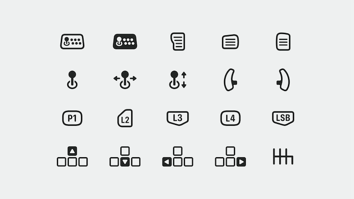

# [**What's new in SF Symbols 5**](https://developer.apple.com/videos/play/wwdc2023/10197/)

---

* Check out [last years talk](../2022/What's new in SF Symbols 4.md)

* Initially, SF Symbols just had monochrome symbols
* Hierarchical, Palette, and Multi-color added in 2021
* In 2022, Variable color was introduced
* Now, Animation added in 2023

### **Animation**

* Choose from a collection of different configurable animation presets, each with its own unique characteristics
* Work on all symbols, in all scales, and all rendering modes
* Basic concepts:
    * The notion of the relationship between symbol layers and animation
        * By default, symbol will animate by layer
            * Each layer will animate one at a time, based on order
        * Can also choose to animate the entire symbol at once
    * Concept of space in animation
        * Refers to the dimensionality the symbols use to create a sense of depth when movement is applied to them
        * These planes are not visible, but they help us understand how symbols move and interact
        * The middle plane sits in the center of the three-dimensional space, and is a reference point for positioning and moving symbols.
        * The front plane is the plane is closest to the viewer. Symbols positioned in this plane will appear larger.
        * The back plane is farthest from the viewer. This plane defines the extent of the dimensions in which the symbol interacts. Symbols in this plane will appear smaller.

* New Animation Library consists of unique, configurable presets:
    * Appear & Disappear
        * Used when adding or removing a symbol from the interface
    * Bounce
        * A fast, elastic-like movement that simulates an object bouncing
        * Communicates that an action has occurred or that an action needs to take place
    * Scale
        * Provides visual feedback by changing the size of a symbol, either by increasing or decreasing its size
        * Scaling down to mimic pressing of a physical button is an example use case
        * Provides focus or feedback when an item is selected.
        * This effect is also stateful, meaning the scaled state persists until the effect is removed
    * Pulse
        * Conveys ongoing activity by changing its opacity
        * Takes advantage of the use of a layer in a symbol
    * Variable Color
        * Conveys varying levels of strength and relies on color to communicate a state of a symbol changing over time.
        * Part of the animation library in two different ways:
            * Cumulative - highlights the layers one after the other while keeping its previous state
                * e.g. representing the Wi-Fi symbol enabling a wireless connection
            * Iterative - highlights the layers in a sequence, but one at a time
                * e.g. representing the Wi-Fi symbol searching for available networks
        * Has a reversing option - making the highlighted layers reverse to its original point, immediately starting the sequence once again, until the action is interrupted
    * Replace
        * One symbol is swapped with another
        * Used to communicate changes in the state of a symbol, indicating a shift in functionality
        * Replace can animate a symbol by layer, which is the default, or with the whole symbol
        * Directionality:
            * Down/Up - a symbol moves downward, disappearing from view, followed by a new symbol appearing with an upward motion
            * Up/Up - a symbol moves upward, disappearing from view, followed by a new symbol that appears in a steady upward motion

### **Drawing for animation**

* Define the design of the symbol by drawing a path as a completely enclosed shape
* Draw other shapes and some offset paths to use as erase layers
    * Putting these in the foreground as separate layers, we can add some depth to the animation, making the symbol more dynamic
* Bring it to the SF Symbols app
    * Annotate the layers with either Draw or Erase.
        * With Draw, selected layers draw paths
        * With Erase removes paths in the chosen layer
* [**Create animated symbols**](Create animated symbols.md) session
* Erase layers help give the shape depth in animation

### **New symbols**

[Over 700 new symbols](https://developer.apple.com/sf-symbols)

Automotive

Gaming

EV Plugs

New and redesigned Weather symbols

Many new objects

