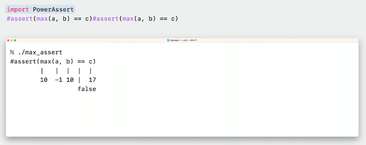
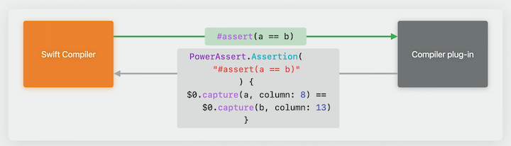
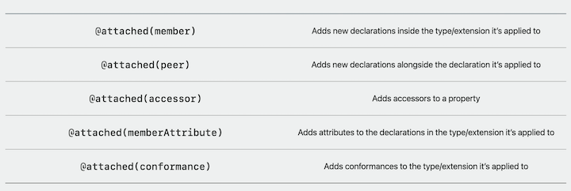
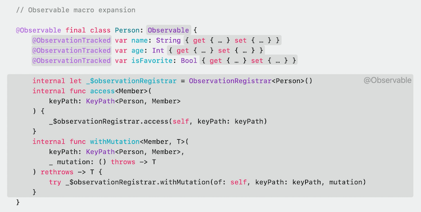
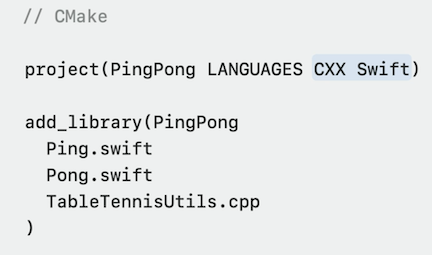

# [**What's new in Swift**](https://developer.apple.com/videos/play/wwdc2023/10164/)

---

### **Swift Project Update**

* One year ago the project was restructured
    * Language steering group was created
* 40 new language proposals overseen since then
    * Some proposals merge together (concurrency came from 10 proposals)
* New way of tying together proposals via vision documents
    * Swift Macros was the first to be accepted in this process
* An ecosystem steering group has now been created to provide support for the growing developer ecosystem


### **Expressive Code**

Swift 5.9 adds ability to let if/else and switch statements to be used as expressions

```swift
// The old way
let bullet =
  isRoot && (count == 0 || !willExpand) ? ""
    : count == 0    ? "- "
    : maxDepth <= 0 ? "▹ " : "▿ "

// The new way
let bullet =
    if isRoot && (count == 0 || !willExpand) { "" }
    else if count == 0 { "- " }
    else if maxDepth <= 0 { "▹ " }
    else { "▿ " }
```

* Another example:

```swift
// Old code
let attributedName = {
  if let displayName, !displayName.isEmpty {
            AttributedString(markdown: displayName)
        } else {
            "Untitled"
        }
}()

// New code
let attributedName = 
  if let displayName, !displayName.isEmpty {
            AttributedString(markdown: displayName)
        } else {
            "Untitled"
        }
```

Result builders

* Faster type checking
* Improved code completion
* More accurate error messages

```swift
// Previously invalid code would show misleading errors on the wrong line
struct ContentView: View {
    enum Destination { case one, two }

    var body: some View {
        List {
            NavigationLink(value: .one) {
                Text("one")
            }
            NavigationLink(value: .two) {
                Text("two")
            }
        }.navigationDestination(for: Destination.self) {
            $0.view // Error: value of type 'ContentView.Destination' has no member 'view'
        }
    }
}

//In 5.9, Errors provide a more accurate diagnostic
struct ContentView: View {
    enum Destination { case one, two }

    var body: some View {
        List {
            NavigationLink(value: .one) { // Error: cannot infer contextual base in reference to member 'one'
                Text("one")
            }
            NavigationLink(value: .two) {
                Text("two")
            }
        }.navigationDestination(for: Destination.self) {
            $0.view
        }
    }
}
```

#### Additions to Generics system

* Most code uses generics behind the scenes
* Below is an example from the Swift code base. An API that takes a request type and evaluates it to produce a strongly typed value. So you can make a request for a Boolean value and get back a Boolean result.

```swift
struct Request<Result> { ... }

struct RequestEvaluator {
  func evaluate<Result>(_ request: Request<Result>) -> Result
}

func evaluate(_ request: Request<Bool>) -> Bool {
  return RequestEvaluator().evaluate(request)
}
```

* Some APIs want to abstract not only over concrete types, but also the number of arguments that you pass in. So a function might take one request and return one result or two requests and return two results, or three and return three results.
    * To support this, the generics system has to be used together with a mechanism to handle multiple argument lengths so that all of the types that you pass in are linked to the types that you get out.

```swift
let value = RequestEvaluator().evaluate(request)

let (x, y) = RequestEvaluator().evaluate(r1, r2)

let (x, y, z) = RequestEvaluator().evaluate(r1, r2, r3)
```

* Before Swift 5.9, you had to provide an overload for each specific argument length that the API supported:

```swift
func evaluate<Result>(_:) -> (Result)

func evaluate<R1, R2>(_:_:) -> (R1, R2)

func evaluate<R1, R2, R3>(_:_:_:) -> (R1, R2, R3)

func evaluate<R1, R2, R3, R4>(_:_:_:_:)-> (R1, R2, R3, R4)

func evaluate<R1, R2, R3, R4, R5>(_:_:_:_:_:) -> (R1, R2, R3, R4, R5)

func evaluate<R1, R2, R3, R4, R5, R6>(_:_:_:_:_:_:) -> (R1, R2, R3, R4, R5, R6)

// This will cause a compiler error "Extra argument in call"
let results = evaluator.evaluate(r1, r2, r3, r4, r5, r6, r7)
```

* Swift 5.9 the generics system is gaining first-class support for this API pattern by enabling generic abstraction over argument length
    * `<each Result>`
    * This concept is called a `Type parameter pack`
    * Check out [**Generalize APIs using parameter packs**](./Generalize%20APIs%20using%20parameter%20packs.md) session

```swift
struct Request<Result> { ... }

struct RequestEvaluator {
    // All of the above functions can be collapsed into a singular function
    func evaluate<each Result>(_: repeat Request<each Result>) -> (repeat each Result)
}

let results = RequestEvaluator.evaluate(r1, r2, r3)
```

#### New Macro system

* assert is example of where macros help
    * throwing an assert gives very little information of what went wrong without other logging, other than where the assertion happened
    * XCTest provides an assertequal option, which provides more information, but we still don't know which value is wrong

```swift
// throws "assert.swift:5: Assertion failed"
assert(max(a, b) == c)

// throws "XCTAssertEqual failed: ("10") is not equal to ("17")
XCAssertEqual(max(a, b), c) //XCTAssertEqual failed: ("10") is not equal to ("17")
```

* With macros, now we can do more
    * The "hash-assert" syntax is expanding the macro called `assert`
    * Now the program will show the code for the failing assertion, along with each of the values that contributed to the result
    * macros are APIs like type or function. You can access them by importing the module that defines them



```swift
// Macro declarations
public macro assert(_ condition: Bool)

import PowerAssert
#assert(max(a, b)) //Type 'Int' cannot be a used as a boolean; test for '!= 0' instead
```

* Macros are separate programs
* Macro declarations have one additional piece of information, their role.
    * Freestanding macros use the "hash syntax"

```swift
@freestanding(expression)
public macro assert(_ condition: Bool) = #externalMacro(
  module: “PowerAssertPlugin”,
  type: “PowerAssertMacro"
)
```



* The new Foundation Predicate APIs provide a great example of an expression macro.
* The predicate macro allows one to write predicates in a type-safe manner using closures.
* The resulting predicate values can then be used with a number of other APIs

```swift
// Predicate expression macro

@freestanding(expression) 
public macro Predicate<each Input>(
  _ body: (repeat each Input) -> Bool
) -> Predicate<repeat each Input>

let pred = #Predicate<Person> {
  $0.favoriteColor == .blue
}

let blueLovers = people.filter(pred)
```

* There is more to macros because a lot of the boilerplate we end up writing is because we need to augment code we have written with something else derived from it.
    * Many of our special cases end up having us write a lot of extensions/functions/variables to reach our edge cases, especially with enums, like the old code below
    * `@CaseDetection` can help here
        * An attached macro, written like a property wrapper
        * Attached macros take as input the syntax of the declaration they apply to
        * Macro-expanded code is normal Swift code, which the compiler integrates into your program.
            * You can inspect the macro-generated code in your editor, debug into it, copy it out if you want to customize it further, etc.

```swift
// Old code
enum Path {
  case relative(String)
  case absolute(String)
}

let absPaths = paths.filter { $0.isAbsolute }

extension Path {
  var isAbsolute: Bool {
    if case .absolute = self { true }
    else { false }
  }
}

extension Path {
  var isRelative: Bool {
    if case .relative = self { true }
    else { false }
  }
}

// New code
@CaseDetection
enum Path {
  case relative(String)
  case absolute(String)
}

let absPaths = paths.filter { $0.isAbsolute }

// Expanded @CaseDetection macro integrated into the program. We don't need to write this, @CaseDetection does it for us
  var isAbsolute: Bool {
    if case .absolute = self { true }
    else { false }
  }

  var isRelative: Bool {
    if case .relative = self { true }
    else { false }
  }
```

Attached macro roles:



* Several attached macro roles can be composed together to achieve useful effects
* Swift Observation is an example of this
* Attaching the Observable macro to a class provides observation for all of its stored properties.
    * There is no need to annotate each stored property or worry about what happens if you don't because the Observable macro handles it all.

```swift
// Observation in SwiftUI prior to 5.9
final class Person: ObservableObject {
    @Published var name: String
    @Published var age: Int
    @Published var isFavorite: Bool
}

struct ContentView: View {
    @ObservedObject var person: Person
    
    var body: some View {
        Text("Hello, \(person.name)")
    }
}

// Observation in SwiftUI now
@Observable final class Person {
    var name: String
    var age: Int
    var isFavorite: Bool
}

struct ContentView: View {
    var person: Person
    
    var body: some View {
        Text("Hello, \(person.name)")
    }
}
```

* The Observable macro works through composition of three macro roles
    * The member role introduces new properties and methods
    * The member attribute role will add the @ObservableTracked macro to stored properties of the observed class
        * This in turn expands to getters and setters to trigger observation events
    * The conformance role introduces the conformance to the Observable protocol
    * Use the `Expand Macro` jump menu item to view expanded macro source code
        * Error messages within macro-generated code will automatically show the expanded code
        * You can step into and out of it with your debugger.

```swift
@attached(member, names: ...)
@attached(memberAttribute)
@attached(conformance)
public macro Observable() = #externalMacro(...).
```



* In summary
    * Macros enable expressive APIs and eliminate boilerplate
    * Macros integrate seamlessly into the development experience
    * [**Expand on Swift macros**](./Expand%20on%20Swift%20macros.md) session
    * [**Write Swift macros**](./Write%20Swift%20macros.md) session


### **Swift Everywhere**

* Recently open-sourced a start of a rewrite of the Foundation framework in Swift
    * Will lead to a single shared implementation of Foundation on both Apple and non-Apple platforms
    * As of macOS Sonoma and iOS 17, there are new Swift-backed implementations of several essential types:
        * Calendar calculations: up to 20% faster
        * Date formatting: up to 150% faster
        * JSON coding/decoding: 200-500% faster

* When operating at lower levels of the system, you need more fine-grained control to achieve a necessary level of performance.
    * Swift 5.9 introduces some new opt-in capabilities to help achieve this level of control.
    * These capabilities focus on what part of the code "owns" a value as it passes around your application.
    * Below is an example of a FileDescriptor that shows off these features
        * A pitfall in the original could would be that someone might try to call `write` after calling `close`
            * One way to handle this would be to make it a `class`, and add a `deinit` that calls `close`
            * This has drawbacks, like more memory allocation, or race conditions/storing of the instance across threads
        * This struct also behaves like a reference type - it holds an integer that references the true value, which is an open file
            * Making a copy of this type could also lead to unintentional sharing of mutable state across your app
            * We need to suppress the ability to make a copy of this struct
            * We can add the `~Copyable` conformance to the struct, which will prohibit copying and allow addition of a deinit to the struct, like in the updated code below
            * Non-copyable types can also have functions with the `consuming` type (see the updated `close()` function below), which give up ownership of the struct after it is run
                * This means you can no longer use the value at all, and thus cannot call its `write` function


```swift
// Original code
struct FileDescriptor {
  private var fd: CInt
  
  init(descriptor: CInt) { self.fd = descriptor }

  func write(buffer: [UInt8]) throws {
    let written = buffer.withUnsafeBufferPointer {
      Darwin.write(fd, $0.baseAddress, $0.count)
    }
    // ...
  }
  
  func close() {
    Darwin.close(fd)
  }
}

// Updated code
struct FileDescriptor: ~Copyable {
  private var fd: CInt
  
  init(descriptor: CInt) { self.fd = descriptor }

  func write(buffer: [UInt8]) throws {
    let written = buffer.withUnsafeBufferPointer {
      Darwin.write(fd, $0.baseAddress, $0.count)
    }
    // ...
  }
  
  consuming func close() {
    Darwin.close(fd)
  }
  
  deinit {
    Darwin.close(fd)
  }
}
```

* Updated workflows using our new FileDescriptor

```swift
// This works great
let file = FileDescriptor(fd: descriptor)
file.write(buffer: data)
file.close()

// This throws an error
let file = FileDescriptor(fd: descriptor)
file.close() // Compiler will indicate where the consuming use is
file.write(buffer: data) // Compiler error: 'file' used after consuming
```

* Non-copyable types are still at an early point in their evolution.
    * Later versions of Swift will expand on non-copyable types in generic code.


#### C++ Interoperability

* C++ interoperability works just like Objective-C interoperability has, mapping C++ APIs into their Swift equivalents that you can use directly from Swift code
    * The Swift compiler treats the `Person` type below as a value type and will automatically call the right special member function at the right time.
    * C++ containers like vectors and maps are accessible as Swift collections.

```c++
// C++ Code
struct Person {
  Person(const Person &);
  Person(Person &&);
  Person &operator=(const Person &);
  Person &operator=(Person &&);
  ~Person();
  
  std::string name;
  unsigned getAge() const;
};
std::vector<Person> everyone();

// Client.swift
func greetAdults() {
  for person in everyone().filter { $0.getAge() >= 18 } {
    print("Hello, \(person.name)!")
  }
}
```

* Using Swift code from C++ is also possible
    * The Swift compiler will produce a "generated header" that contains a C++ view on the Swift APIs
    * Unlike with Objective-C, you don't need to restrict yourself to only using Swift classes annotated with the objc attribute.
        * C++ can directly use most Swift types and their full APIs, including properties, methods, and initializers, without any bridging overhead

```swift
// Geometry.swift
struct LabeledPoint {
  var x = 0.0, y = 0.0
  var label: String = “origin”
  mutating func moveBy(x deltaX: Double, y deltaY: Double) { … }
  var magnitude: Double { … }
}

// C++ client
#include <Geometry-Swift.h>

void test() {
  Point origin = Point()
  Point unit = Point::init(1.0, 1.0, “unit”)
  unit.moveBy(2, -2)
  std::cout << unit.label << “ moved to “ << unit.magnitude() << std::endl;
}
```

* Use C++ APIs directly from Swift
* Expose most Swift APIs directly to C++
* [**Mix Swift and C++**](https://developer.apple.com/videos/play/wwdc2023/10172/) session
* CMake support added to be able to use Swift in cross-platform C++ projects



#### Actors and concurrency

* Abstact concurrency model
    * Tasks - sequential unit of work that can be run anywhere
    * Actors - mutually exclusive access to isolated state
* Tasks in different environments
    * Global concurrency pool determines scheduling:
        * Dispatch on Apple platforms
        * Single-threaded cooperative queue in restricted environments
    * Checked continuations provide interoperability with callback-based systems
* Actors
    * Actors can be implemented in different ways
    * With Swift 5.9, custom actor executors allow a particular actor to implement its own synchronization mechanism
        * Makes actors more flexible and adaptable to existing environments
        * Example:

```swift
// Original Code
actor MyConnection {
  private var database: UnsafeMutablePointer<sqlite3>
  
  init(filename: String) throws { … }
  
  func pruneOldEntries() { … }
  func fetchEntry<Entry>(named: String, type: Entry.Type) -> Entry? { … }
}

await connection.pruneOldEntries()
```

* We can add a serial dispatch queue to our actor and an implementation of the unowned executor property that produces the executor corresponding to that dispatch queue.
    * With this change, all of the synchronization for our actor instances will happen through that queue.
    * Calling `await` on the call to pruneOldEntries from outside the actor, this will now perform a dispatch-async on the corresponding queue.
        * Gives you more control over how individual actors provide synchronization
        * Lets you synchronize an actor with other code that isn't using actors yet (Including code written in Objective-C or C++)

```swift
// Updated code
actor MyConnection {
  private var database: UnsafeMutablePointer<sqlite3>
  private let queue: DispatchSerialQueue
  
  nonisolated var unownedExecutor: UnownedSerialExecutor { queue.asUnownedSerialExecutor() }

  init(filename: String, queue: DispatchSerialQueue) throws { … }
  
  func pruneOldEntries() { … }
  func fetchEntry<Entry>(named: String, type: Entry.Type) -> Entry? { … }
}

await connection.pruneOldEntries()
```

* The synchronization of actors via dispatch queues is made possible because dispatch queue conforms to the new SerialExecutor protocol

```swift
// Executor protocols
protocol Executor: AnyObject, Sendable {
  func enqueue(_ job: consuming ExecutorJob)
}

protocol SerialExecutor: Executor {
  func asUnownedSerialExecutor() -> UnownedSerialExecutor
  func isSameExclusiveExecutionContext(other executor: Self) -> Bool
}

extension DispatchSerialQueue: SerialExecutor { … }
```

* Tasks and Actors form the abstract model for Swift concurrency
* Abstract model can be adapted to different execution environments
* Abstract model provides customization pointes for tasks and actors
* [**Swift Concurrency: Behind the Scenes**](https://developer.apple.com/videos/play/wwdc2021/10254/) session from WWDC 2021

[**FoundationDB**](https://www.foundationdb.org)

* Large, cross-platform C++ code base
* Heavy use of async programming based on C++ futures
* Distributed actor runtime providing deterministic simulation
* They were looking to modernize their code base and found Swift to be a good match for its performance, safety, and code clarity
* Leveraged Swift's interoperability to integrate into the existing code base

```c++
// C++ implementation of FoundationDB’s “master data” actor
ACTOR Future<Void> getVersion(Reference<MasterData> self, GetCommitVersionRequest req) {
   state std::map<UID, CommitProxyVersionReplies>::iterator proxyItr = 
        self->lastCommitProxyVersionReplies.find(req.requestingProxy);
   ++self->getCommitVersionRequests;

   if (proxyItr == self->lastCommitProxyVersionReplies.end()) {
       req.reply.send(Never());
     return Void();
 }
   wait(proxyItr->second.latestRequestNum.whenAtLeast(req.requestNum - 1));
  
 auto itr = proxyItr->second.replies.find(req.requestNum);
 if (itr != proxyItr->second.replies.end()) {
  req.reply.send(itr->second);
  return Void();
 }

 // ...
}
```

```swift
// Swift implementation of FoundationDB’s “master data” actor
func getVersion(
    myself: MasterData, req: GetCommitVersionRequest
) async -> GetCommitVersionReply? {
    myself.getCommitVersionRequests += 1

    guard let lastVersionReplies = lastCommitProxyVersionReplies[req.requestingProxy] else {
      return nil
    }

    // ...
    var latestRequestNum = try await lastVersionReplies.latestRequestNum
          .atLeast(VersionMetricHandle.ValueType(req.requestNum - UInt64(1)))

    if let lastReply = lastVersionReplies.replies[req.requestNum] {
      return lastReply
    }
}
```
