# [**What's new in SwiftUI**](https://developer.apple.com/videos/play/wwdc2023/10148/)

---

### **SwiftUI in more places**

* New data flow types dramatically simplify modeling your domain
* The Inspector and Table improvements, provide new ways to display your data
* Improved animation APIs
* Scroll View improvements
* Refinements to Focus and keyboard input
* Deeper customization of controls like buttons and menus
* Spatial Computing in visionOS
    * `WindowGroup` for 2D scenes
        * Use `.windowStyle(.volumetric)` to load 3D experiences
    * `ImmersiveSpace` for AR/VR immersion
    * [**Meet SwiftUI for spatial computing**](https://developer.apple.com/videos/play/wwdc2023/10109/) session

#### watchOS 10

* NavigationSplitView and NavigationStack get beautiful new transitions.
* TabView gets a new vertical paging style driven by the Digital Crown.
* New `.containerBackground(for: .navigation) { ... }` lets you configure these subtle background washes that animate when you push and pop content.
    * You can also configure backgrounds for tab views on watchOS.
* New multi-platform toolbar placements - `.topBarLeading` and `.topBarTrailing`, along with the existing `.bottomBar` let you place these small detail views in your Apple Watch apps

Container Background | Toolbar placements
-------------------- | ------------------
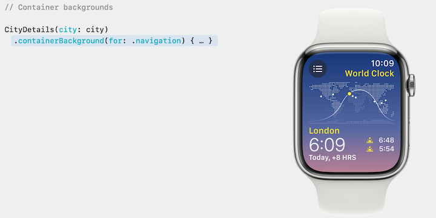 | 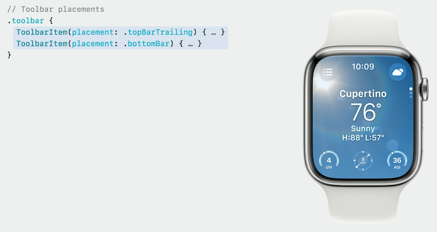

* Some existing API brought to Apple Watch for the first time
    * DatePicker
    * Selection in list
* [**Design and build apps for watchOS 10**](Design and build apps for watchOS 10.md) session
* [**Update your app for watchOS 10**](https://developer.apple.com/videos/play/wwdc2023/10031/) session

#### Widgets

* Widgets for the Smart Stack on watchOS 10
* Lock screen on iPadOS 17
* iPHone Always-On display with Standby Mode
* macOS Sonoma desktop widgets
* Widgets can now activate code defined in your own app bundle using App Intents.
* You can animate your widgets using SwiftUI transition and animation modifiers.
* [**Bring widgets to new places**](Bring widgets to new places.md) session
* [**Bring widgets to life**](Bring widgets to life.md) session

#### Previews

* Previews are useful for developing and refining widgets

```swift
#Preview(as: .systemSmall) {
    CaffeineTrackerWidget()
} timeline: {
    CaffeineLogEntry.log1
    CaffeineLogEntry.log2
    CaffeineLogEntry.log3
    CaffeineLogEntry.log4
}
```

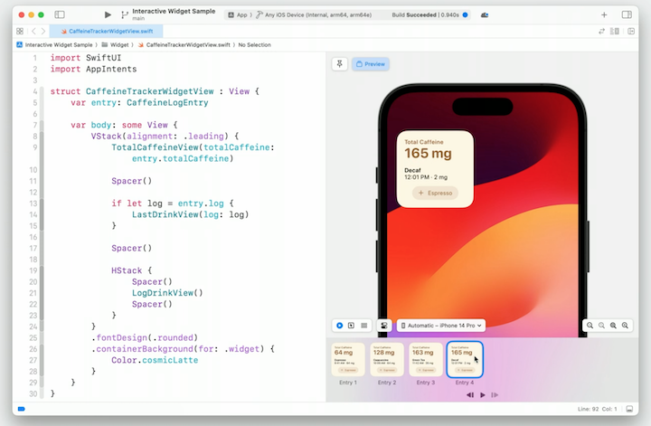

* Work with regular SwiftUI views as well

```swift
#Preview("good dog") {
    ZStack(alignment: .bottom) {
        Rectangle()
            .fill(Color.blue.gradient)
        Text("Riley")
            .font(.largeTitle)
            .padding()
            .background(.thinMaterial, in: .capsule)
            .padding()
    }
    .ignoresSafeArea()
}
```

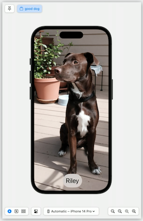

* Can interact with previews of Mac apps right inside Xcode

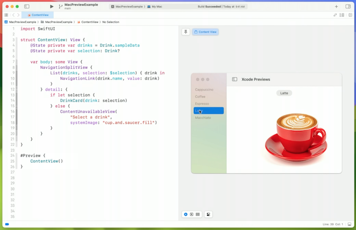

* [**Build programmatic UI with Xcode Previews**](Build programmatic UI with Xcode Previews.md) session
* [**What's new in Swift**](What's new in Swift.md) session

#### SwiftUI extensions to other Apple frameworks

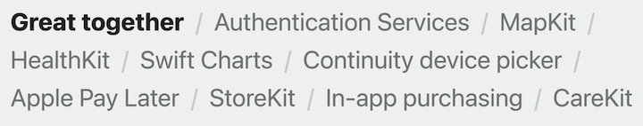

* MapKit
    * [**Meet MapKit for SwiftUI**](https://developer.apple.com/videos/play/wwdc2023/10043) session

```swift
import SwiftUI
import MapKit

struct Maps_Snippet: View {
    private let location = CLLocationCoordinate2D(
        latitude: CLLocationDegrees(floatLiteral: 37.3353),
        longitude: CLLocationDegrees(floatLiteral: -122.0097))

    var body: some View {
        Map {
            Marker("Pond", coordinate: location)
            UserAnnotation()
        }
        .mapControls {
            MapUserLocationButton()
            MapCompass()
        }
    }
}

#Preview {
    Maps_Snippet()
}
```

* Swift Charts
    * Scrolling Charts
    * Built in support for selection
    * Donut and pie charts
    * [**Explore pie charts and interactivity in Swift Charts**](https://developer.apple.com/videos/play/wwdc2023/10037/) session

```swift
import SwiftUI
import Charts

struct ScrollingChart_Snippet: View {
    @State private var scrollPosition = SalesData.last365Days.first!
    @State private var selection: SalesData?

    var body: some View {
        VStack(alignment: .leading) {
            VStack(alignment: .leading) {
                Text("""
                    Scrolled to: \
                    \(scrollPosition.day,
                        format: .dateTime.day().month().year())
                    """)
                Text("""
                    Selected: \
                    \(selection?.day ?? .now,
                        format: .dateTime.day().month().year())
                    """)
                .opacity(selection != nil ? 1.0 : 0.0)
            }
            .padding([.leading, .trailing])
            Chart {
                ForEach(SalesData.last365Days, id: \.day) {
                    BarMark(
                        x: .value("Day", $0.day, unit: .day),
                        y: .value("Sales", $0.sales))
                }
                .foregroundStyle(.blue)
            }
            .chartScrollableAxes(.horizontal)
            .chartXVisibleDomain(length: 3600 * 24 * 30)
            .chartScrollPosition(x: $scrollPosition)
            .chartXSelection(value: $selection)
        }
    }
}

struct SalesData: Plottable {
    var day: Date
    var sales: Int

    var primitivePlottable: Date { day }

    init?(primitivePlottable: Date) {
        self.day = primitivePlottable
        self.sales = 0
    }

    init(day: Date, sales: Int) {
        self.day = day
        self.sales = sales
    }

    static let last365Days: [SalesData] = buildSalesData()

    private static func buildSalesData() -> [SalesData] {
        var result: [SalesData] = []
        var date = Date.now
        for _ in 0..<365 {
            result.append(SalesData(day: date, sales: Int.random(in: 150...250)))
            date = Calendar.current.date(
                byAdding: .day, value: -1, to: date)!
        }
        return result.reversed()
    }
}

#Preview {
    ScrollingChart_Snippet()
}
```

```swift
import SwiftUI
import Charts

struct DonutChart_Snippet: View {
    var sales = Bagel.salesData

    var body: some View {
        NavigationStack {
            Chart(sales, id: \.name) { element in
                SectorMark(
                    angle: .value("Sales", element.sales),
                    innerRadius: .ratio(0.6),
                    angularInset: 1.5)
                .cornerRadius(5)
                .foregroundStyle(by: .value("Name", element.name))
            }
            .padding()
            .navigationTitle("Bagel Sales")
            .toolbarTitleDisplayMode(.inlineLarge)
        }
    }
}

struct Bagel {
    var name: String
    var sales: Int

    static var salesData: [Bagel] = buildSalesData()

    static func buildSalesData() -> [Bagel] {
        [
            Bagel(name: "Blueberry", sales: 60),
            Bagel(name: "Everything", sales: 120),
            Bagel(name: "Choc. Chip", sales: 40),
            Bagel(name: "Cin. Raisin", sales: 100),
            Bagel(name: "Plain", sales: 140),
            Bagel(name: "Onion", sales: 70),
            Bagel(name: "Sesame Seed", sales: 110),
        ]
    }
}

#Preview {
    DonutChart_Snippet()
}
```

* StoreKit
    * Present a subscription store view with your custom marketing content.
    * Configure a full-bleed background to match your branding and choose from a variety of control options.
    * [**Meet StoreKit for SwiftUI**](Meet StoreKit for SwiftUI.md) session

```swift
import SwiftUI
import StoreKit

struct SubscriptionStore_Snippet {
    var body: some View {
        SubscriptionStoreView(groupID: passGroupID) {
            PassMarketingContent()
                .lightMarketingContentStyle()
                .containerBackground(for: .subscriptionStoreFullHeight) {
                    SkyBackground()
                }
        }
        .backgroundStyle(.clear)
        .subscriptionStoreButtonLabel(.multiline)
        .subscriptionStorePickerItemBackground(.thinMaterial)
        .storeButton(.visible, for: .redeemCode)
    }
}
```

### **Simplified data flow**

* New `@Observable` macro
    * No need to mark properties as `@Published`
    * SwiftUI will automatically establish dependencies on properties you read.
    * No need to use a property wrapper when reading

```swift
import Foundation
import SwiftUI

@Observable
class Dog: Identifiable {
    var id = UUID()
    var name = ""
    var age = 1
    var breed = DogBreed.mutt
    var owner: Person? = nil
}

class Person: Identifiable {
    var id = UUID()
    var name = ""
}

enum DogBreed {
    case mutt
}
```

* Below view is reading the isFavorite property, so when that changes, it will get reevaluated.
    * Invalidation only happens for properties which are read, so you can pass your model through intermediate views without triggering any unnecessary updates.

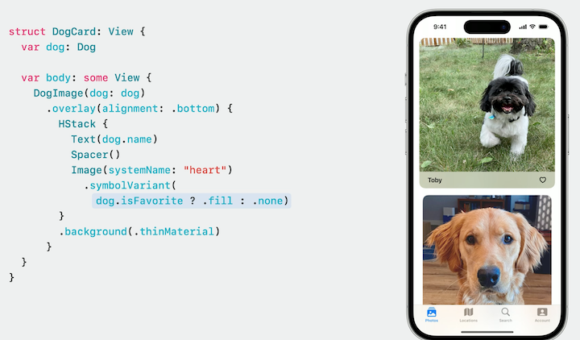

* When using @Observable, you only need `@State` and `@Environment` dynamic properties
    * Below code uses the `User` type as the environment key, but custom keys are also supported.

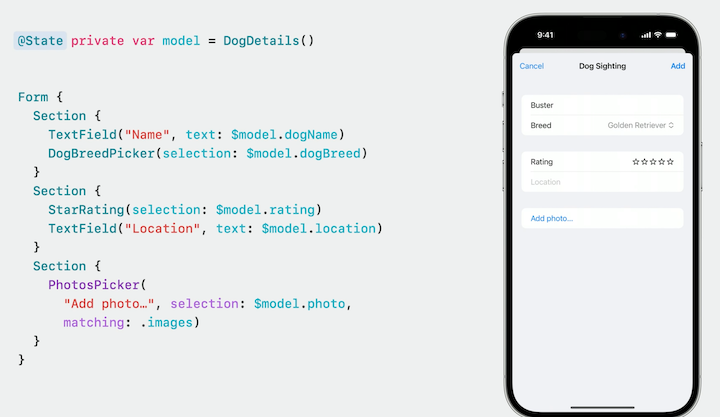

```swift
import SwiftUI

@main
private struct WhatsNew2023: App {
    @State private var currentUser: User?
    
    var body: some Scene {
        WindowGroup {
            ContentView()
                .environment(currentUser)
        }
    }
    
    struct ContentView: View {
        var body: some View {
            Color.clear
        }
    }

    struct ProfileView: View {
        @Environment(User.self) private var currentUser: User?

        var body: some View {
            if let currentUser {
                UserDetails(user: currentUser)
            } else {
                Button("Log In") { }
            }
        }
    }

    struct UserDetails: View {
        var user: User

        var body: some View {
            Text("Hello, \(user.name)")
        }
    }

    @Observable
    class User: Identifiable {
        var id = UUID()
        var name = ""
    }
}
```

* [**Discover Observation in SwiftUI**](Discover Observation in SwiftUI.md) session

#### SwiftData

* Models are represented entirely by their code
    * Switch from using `@Observable` to `@Model` to leverage SwiftData
    * Use the `@Query` dynamic property to tell SwiftData to fetch the model values from the underlying database
        * When data changes, the view will be invalidated
        * Use `@Query(sort: \.keyName)` to specify sorting

| Default sorting | Custom sorting |
| --------------- | -------------- |
| 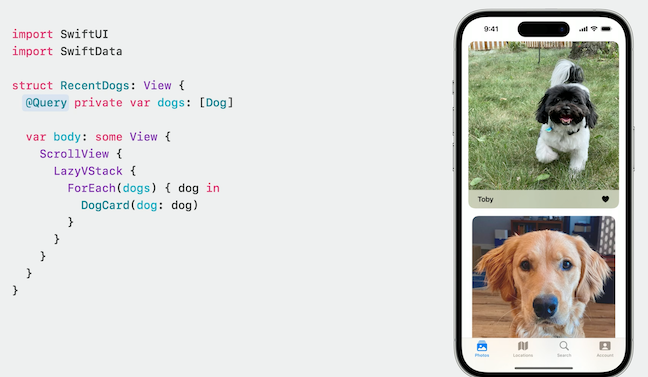 | 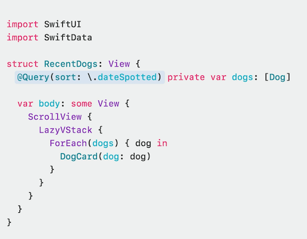 |

* Document Based apps can use SwiftData with a new initializer
    * SwiftUI will use SwiftData for the underlying storage of each document, and automatically set up a model container

```swift
import SwiftUI
import SwiftData
import UniformTypeIdentifiers

@main
private struct WhatsNew2023: App {
    var body: some Scene {
        DocumentGroup(editing: DogTag.self, contentType: .dogTag) {
            ContentView()
        }
    }
    
    struct ContentView: View {
        var body: some View {
            Color.clear
        }
    }

    @Model
    class DogTag {
        var text = ""
    }
}

extension UTType {
    static var dogTag: UTType {
        UTType(exportedAs: "com.apple.SwiftUI.dogTag")
    }
}
```

* [**Meet SwiftData**](Meet SwiftData.md) session
* [**Build an app with SwiftData**](Build an app with SwiftData.md) session

#### DocumentGroup

* DocumentGroup also gains a number of new platform affordances when running on iOS 17 or iPadOS 17
    * Automatic sharing
    * Document renaming support
    * Undo controls in the toolbar

#### Inspector

* New modifier for displaying details about the current selection or context
    * Presented as a distinct section in your interface.
        * On macOS, Inspector presents as a trailing sidebar, as well as on iPadOS in a regular size class.
        * In compact size classes, it will present itself as a sheet.
    * [**Inspectors in SwiftUI: discover the details**](Inspectors in SwiftUI.md) session

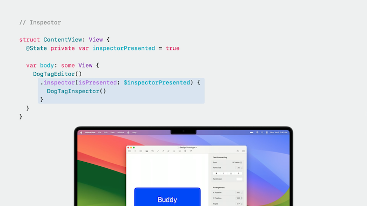

#### Dialogs

* New customization APIs in iOS 17 and macOS Sonoma

| Labels | Severity and suppression |
| ----- | ------ |
| 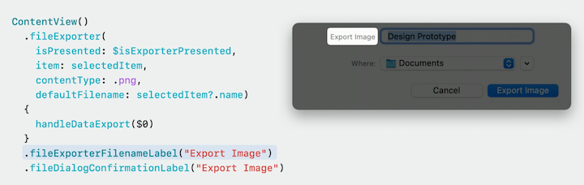 | 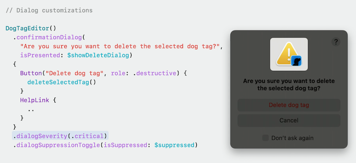 |

#### Lists and Tables

* Tables support customization of their column ordering and visibility.
    * When coupled with the SceneStorage dynamic property, these preferences can be persisted across runs of your app.
    * You provide the table with a value representing the customization state and give each column a unique stable identifier.

```swift
import SwiftUI

struct DogSightingsTable: View {
    private var dogSightings: [DogSighting] = (1..<50).map {
        .init(
            name: "Sighting \($0)",
            date: .now + Double((Int.random(in: -5..<5) * 86400)))
    }

    @SceneStorage("columnCustomization")
    private var columnCustomization: TableColumnCustomization<DogSighting>
    @State private var selectedSighting: DogSighting.ID?
    
    var body: some View {
        Table(
            dogSightings, selection: $selectedSighting,
            columnCustomization: $columnCustomization)
        {
            TableColumn("Dog Name", value: \.name)
                .customizationID("name")
            
            TableColumn("Date") {
                Text($0.date, style: .date)
            }
            .customizationID("date")
        }
    }
    
    struct DogSighting: Identifiable {
        var id = UUID()
        var name: String
        var date: Date
    }
}
```

* Tables now have OutlineGroup built in

```swift
import SwiftUI

struct DogGenealogyTable: View {
    private static let dogToys = ["🦴", "🧸", "👟", "🎾", "🥏"]

    private var dogs: [DogGenealogy] = (1..<10).map {
        .init(
            name: "Parent \($0)", age: Int.random(in: 8..<12) * 7,
            favoriteToy: dogToys[Int.random(in: 0..<5)],
            children: (1..<10).map {
                .init(
                    name: "Child \($0)", age: Int.random(in: 1..<5) * 7,
                    favoriteToy: dogToys[Int.random(in: 0..<5)])
            }
        )
    }

    var body: some View {
        Table(of: DogGenealogy.self) {
            TableColumn("Dog Name", value: \.name)
            TableColumn("Age (Dog Years)") {
                Text($0.age, format: .number)
            }
            TableColumn("Favorite Toy", value: \.favoriteToy)
        } rows: {
            ForEach(dogs) { dog in
                DisclosureTableRow(dog) {
                    ForEach(dog.children) { child in
                        TableRow(child)
                    }
                }
            }
        }
    }

    struct DogGenealogy: Identifiable {
        var id = UUID()
        var name: String
        var age: Int
        var favoriteToy: String
        var children: [DogGenealogy] = []
    }
}
```

* Sections within a list or table have gained support for programmatic expansion.
    * New initializer takes a binding to a value which reflects the current expansion state of the section

```swift
import SwiftUI

struct ExpandableSectionsView: View {
    @State private var selection: Int?

    var body: some View {
        NavigationSplitView {
            Sidebar(selection: $selection)
        } detail: {
            Detail(selection: selection)
        }
    }

    struct Sidebar: View {
        @Binding var selection: Int?
        @State private var isSection1Expanded = true
        @State private var isSection2Expanded = false

        var body: some View {
            List(selection: $selection) {
                Section("First Section", isExpanded: $isSection1Expanded) {
                    ForEach(1..<6, id: \.self) {
                        Text("Item \($0)")
                    }
                }
                Section("Second Section", isExpanded: $isSection2Expanded) {
                    ForEach(6..<11, id: \.self) {
                        Text("Item \($0)")
                    }
                }
            }
        }
    }

    struct Detail: View {
        var selection: Int?

        var body: some View {
            Text(selection.map { "Selection: \($0)" } ?? "No Selection")
        }
    }
}
```

* For smaller data sets, tables have also gained a few new styling affordances
    * How row backgrounds and column headers are displayed
        * Alternating backgrounds
        * Column headers display
    * New background prominence environment property

```swift
import SwiftUI

struct TableDisplayCustomizationView: View {
    private var dogSightings: [DogSighting] = (1..<10).map {
        .init(
            name: "Dog Breed \($0)", sightings: Int.random(in: 1..<5),
            rating: Int.random(in: 1..<6))
    }

    @State private var selection: DogSighting.ID?

    var body: some View {
        Table(dogSightings, selection: $selection) {
            TableColumn("Name", value: \.name)
            TableColumn("Sightings") {
                Text($0.sightings, format: .number)
            }
            TableColumn("Rating") {
                StarRating(rating: $0.rating)
                    .foregroundStyle(.starRatingForeground)
            }
        }
        .alternatingRowBackgrounds(.disabled)
        .tableColumnHeaders(.hidden)
    }

    struct StarRating: View {
        var rating: Int

        var body: some View {
            HStack(spacing: 1) {
                ForEach(1...5, id: \.self) { n in
                    Image(systemName: "star")
                        .symbolVariant(n <= rating ? .fill : .none)
                }
            }
            .imageScale(.small)
        }
    }

    struct StarRatingForegroundStyle: ShapeStyle {
        func resolve(in environment: EnvironmentValues) -> some ShapeStyle {
            if environment.backgroundProminence == .increased {
                return AnyShapeStyle(.secondary)
            } else {
                return AnyShapeStyle(.yellow)
            }
        }
    }

    struct DogSighting: Identifiable {
        var id = UUID()
        var name: String
        var sightings: Int
        var rating: Int
    }
}

extension ShapeStyle where Self ==
    TableDisplayCustomizationView.StarRatingForegroundStyle
{
    static var starRatingForeground: TableDisplayCustomizationView.StarRatingForegroundStyle {
        .init()
    }
}
```

* Large performance gains
    * [**Demystify SwiftUI performance**](Demystify SwiftUI performance.md) session


### **Extraordinary animations**

* New `KeyFrameAnimator` API
    * Allow animating multiple properties in parallel
    * An animation can have multiple tracks
    * [**Wind your way through advanced animations in SwiftUI**](Wind your way through advanced animations in SwiftUI.md) session

```swift
import SwiftUI

struct KeyframeAnimator_Snippet: View {
    var body: some View {
        Logo(color: .blue)
        Text("Tap the shape")
    }
}

struct Logo: View {
    var color: Color
    @State private var runPlan = 0

    var body: some View {
        VStack(spacing: 100) {
            KeyframeAnimator(
                initialValue: AnimationValues(), trigger: runPlan
            ) { values in
                LogoField(color: color)
                    .scaleEffect(values.scale)
                    .rotationEffect(values.rotation, anchor: .bottom)
                    .offset(y: values.verticalTranslation)
                    .frame(width: 240, height: 240)
            } keyframes: { _ in
                KeyframeTrack(\.verticalTranslation) {
                    SpringKeyframe(30, duration: 0.25, spring: .smooth)
                    CubicKeyframe(-120, duration: 0.3)
                    CubicKeyframe(-120, duration: 0.5)
                    CubicKeyframe(10, duration: 0.3)
                    SpringKeyframe(0, spring: .bouncy)
                }

                KeyframeTrack(\.scale) {
                    SpringKeyframe(0.98, duration: 0.25, spring: .smooth)
                    SpringKeyframe(1.2, duration: 0.5, spring: .smooth)
                    SpringKeyframe(1.0, spring: .bouncy)
                }

                KeyframeTrack(\.rotation) {
                    LinearKeyframe(Angle(degrees:0), duration: 0.45)
                    CubicKeyframe(Angle(degrees: 0), duration: 0.1)
                    CubicKeyframe(Angle(degrees: -15), duration: 0.1)
                    CubicKeyframe(Angle(degrees: 15), duration: 0.1)
                    CubicKeyframe(Angle(degrees: -15), duration: 0.1)
                    SpringKeyframe(Angle(degrees: 0), spring: .bouncy)
                }
            }
            .onTapGesture {
                runPlan += 1
            }
        }
    }

    struct AnimationValues {
        var scale = 1.0
        var verticalTranslation = 0.0
        var rotation = Angle(degrees: 0.0)
    }

    struct LogoField: View {
        var color: Color

        var body: some View {
            ZStack(alignment: .bottom) {
                RoundedRectangle(cornerRadius: 48)
                    .fill(.shadow(.drop(radius: 5)))
                    .fill(color.gradient)
            }
        }
    }
}

#Preview {
    KeyframeAnimator_Snippet()
}
```

* There is also a new `.phaseAnimator`
    * Instead of parallel tracks, a single sequence of phases is stepped through
    * Lets you start one animation when the previous animation finishes
    * Two closures:
        * In the first, set the properties for rotation/scale/etc. for the current phase
        * In the second, tell SwiftUI how to animate into each phase
    * New spring animations in SwiftUI
        * They match the velocity of any previous animation and settle to their final value with realistic friction
        * Default animation for apps built on or after iOS 17 and aligned releases
    * New sensory feedback API
        * use `.sensoryFeedback(.increase, trigger: sightingCount)` to play haptic feedback
        * <https://developer.apple.com/design/human-interface-guidelines/playing-haptics>

```swift
import SwiftUI

struct PhaseAnimator_Snippet: View {
    @State private var sightingCount = 0

    var body: some View {
        VStack {
            Spacer()
            HappyDog()
                .phaseAnimator(
                    SightingPhases.allCases, trigger: sightingCount
                ) { content, phase in
                    content
                        .rotationEffect(phase.rotation)
                        .scaleEffect(phase.scale)
                } animation: { phase in
                    switch phase {
                    case .shrink: .snappy(duration: 0.1)
                    case .spin: .bouncy
                    case .grow: .spring(
                        duration: 0.2, bounce: 0.1, blendDuration: 0.1)
                    case .reset: .linear(duration: 0.0)
                    }
                }
                .sensoryFeedback(.increase, trigger: sightingCount)
            Spacer()
            Button("There’s One!", action: recordSighting)
                .zIndex(-1.0)
        }
    }

    func recordSighting() {
        sightingCount += 1
    }

    enum SightingPhases: CaseIterable {
        case reset
        case shrink
        case spin
        case grow

        var rotation: Angle {
            switch self {
            case .spin, .grow: Angle(degrees: 360)
            default: Angle(degrees: 0)
            }
        }

        var scale: Double {
            switch self {
            case .reset: 1.0
            case .shrink: 0.75
            case .spin: 0.85
            case .grow: 1.0
            }
        }
    }
}

struct HappyDog: View {
    var body: some View {
        ZStack(alignment: .center) {
            Rectangle()
                .fill(.blue.gradient)
            Text("🐶")
                .font(.system(size: 58))
        }
        .clipShape(.rect(cornerRadius: 12))
        .frame(width: 96, height: 96)
    }
}

#Preview {
    PhaseAnimator_Snippet()
}
```

* Visual Effects modifier
    * Allows you to update objects based on their position, without a GeometryReader
        * Create a focalPoint `CGPoint`
        * Associate a coordinate space with a grid
        * Inside each object in the grid, add a `.visualEffect`
            * The closure gets my content to modify and a geometry proxy
    * Automatically adapts to different sizes

```swift
import SwiftUI

struct VisualEffects_Snippet: View {
    @State private var dogs: [Dog] = manySampleDogs
    @StateObject private var simulation = Simulation()
    @State private var showFocalPoint = false

    var body: some View {
        ScrollView {
            LazyVGrid(columns: columns, spacing: itemSpacing) {
                ForEach(dogs) { dog in
                    DogCircle(dog: dog, focalPoint: simulation.point)
                }
            }
            .opacity(showFocalPoint ? 0.3 : 1.0)
            .overlay(alignment: .topLeading) {
                DebugDot(focalPoint: simulation.point)
                    .opacity(showFocalPoint ? 1.0 : 0.0)
            }
            .compositingGroup()
        }
        .coordinateSpace(.dogGrid)
        .onTapGesture {
            withAnimation {
                showFocalPoint.toggle()
            }
        }
    }

    var columns: [GridItem] {
        [GridItem(
            .adaptive(
                minimum: imageLength,
                maximum: imageLength
            ),
            spacing: itemSpacing
        )]
    }

    struct DebugDot: View {
        var focalPoint: CGPoint

        var body: some View {
            Circle()
                .fill(.red)
                .frame(width: 10, height: 10)
                .visualEffect { content, proxy in
                    content.offset(position(in: proxy))
                }
        }

        func position(in proxy: GeometryProxy) -> CGSize {
            guard let backgroundSize = proxy.bounds(of: .dogGrid)?.size else {
                return .zero
            }
            let frame = proxy.frame(in: .dogGrid)
            let center = CGPoint(
                x: (frame.minX + frame.maxX) / 2.0,
                y: (frame.minY + frame.maxY) / 2.0
            )
            let xOffset = focalPoint.x * backgroundSize.width - center.x
            let yOffset = focalPoint.y * backgroundSize.height - center.y
            return CGSize(width: xOffset, height: yOffset)
        }
    }

    /// A self-updating simulation of a point bouncing inside a unit square.
    @MainActor
    class Simulation: ObservableObject {
        @Published var point = CGPoint(
            x: Double.random(in: 0.001..<1.0),
            y: Double.random(in: 0.001..<1.0)
        )

        private var velocity = CGVector(dx: 0.0048, dy: 0.0028)
        private var updateTask: Task<Void, Never>?
        private var isUpdating = true

        init() {
            updateTask = Task.detached {
                do {
                    while true {
                        try await Task.sleep(for: .milliseconds(16))
                        await self.updateLocation()
                    }
                } catch {
                    // fallthrough and exit
                }
            }
        }

        func toggle() {
            isUpdating.toggle()
        }

        private func updateLocation() {
            guard isUpdating else { return }
            point.x += velocity.dx
            point.y += velocity.dy
            if point.x < 0 || point.x >= 1.0 {
                velocity.dx *= -1
                point.x += 2 * velocity.dx
            }
            if point.y < 0 || point.y >= 1.0 {
                velocity.dy *= -1
                point.y += 2 * velocity.dy
            }
        }
    }
}

extension CoordinateSpaceProtocol where Self == NamedCoordinateSpace {
    fileprivate static var dogGrid: Self { .named("dogGrid") }
}

private func magnitude(dx: Double, dy: Double) -> Double {
    sqrt(dx * dx + dy * dy)
}

private struct DogCircle: View {
    var dog: Dog
    var focalPoint: CGPoint

    var body: some View {
        ZStack {
            DogImage(dog: dog)
                .visualEffect { content, geometry in
                    content
                        .scaleEffect(contentScale(in: geometry))
                        .saturation(contentSaturation(in: geometry))
                        .opacity(contentOpacity(in: geometry))
                }
        }
    }
}

private struct DogImage: View {
    var dog: Dog

    var body: some View {
        Circle()
            .fill(.shadow(.drop(
                color: .black.opacity(0.4),
                radius: 4,
                x: 0, y: 2)))
            .fill(dog.color)
            .strokeBorder(.secondary, lineWidth: 3)
            .frame(width: imageLength, height: imageLength)
    }
}

extension DogCircle {
    func contentScale(in geometry: GeometryProxy) -> Double {
        guard let gridSize = geometry.bounds(of: .dogGrid)?.size else { return 0 }
        let frame = geometry.frame(in: .dogGrid)
        let center = CGPoint(x: (frame.minX + frame.maxX) / 2.0, y: (frame.minY + frame.maxY) / 2.0)
        let xOffset = focalPoint.x * gridSize.width - center.x
        let yOffset = focalPoint.y * gridSize.height - center.y
        let unitMagnitude =
            magnitude(dx: xOffset, dy: yOffset) / magnitude(dx: gridSize.width, dy: gridSize.height)
        if unitMagnitude < 0.2 {
            let d = 3 * (unitMagnitude - 0.2)
            return 1.0 + 1.2 * d * d * (1 + d)
        } else {
            return 1.0
        }
    }

    func contentOpacity(in geometry: GeometryProxy) -> Double {
        opacity(for: displacement(in: geometry))
    }

    func contentSaturation(in geometry: GeometryProxy) -> Double {
        opacity(for: displacement(in: geometry))
    }

    func opacity(for displacement: Double) -> Double {
        if displacement < 0.3 {
            return 1.0
        } else {
            return 1.0 - (displacement - 0.3) * 1.43
        }
    }

    func displacement(in proxy: GeometryProxy) -> Double {
        guard let backgroundSize
            = proxy.bounds(of: .dogGrid)?.size
        else {
            return 0
        }
        let frame = proxy.frame(in: .dogGrid)
        let center = CGPoint(
            x: (frame.minX + frame.maxX) / 2.0,
            y: (frame.minY + frame.maxY) / 2.0
        )
        let xOffset = focalPoint.x * backgroundSize.width - center.x
        let yOffset = focalPoint.y * backgroundSize.height - center.y
        return magnitude(dx: xOffset, dy: yOffset)
            / magnitude(
                dx: backgroundSize.width,
                dy: backgroundSize.height)
    }
}

private struct Dog: Identifiable {
    let id = UUID()
    var color: Color
}

private let imageLength = 100.0
private let itemSpacing = 20.0
private let possibleColors: [Color] =
    [.red, .orange, .yellow, .green, .blue, .indigo, .purple]
private let manySampleDogs: [Dog] =
    (0..<100).map {
        Dog(color: possibleColors[$0 % possibleColors.count])
    }

#Preview {
    VisualEffects_Snippet()
}
```

* New `ShaderLibrary`
    * Turn Metal shader functions directly into SwiftUI shape styles

```swift
import SwiftUI

struct ShaderUse_Snippet: View {
    @State private var stripeSpacing: Float = 10.0
    @State private var stripeAngle: Float = 0.0

    var body: some View {
        VStack {
            Text(
                """
                \(
                    Text("Furdinand")
                        .foregroundStyle(stripes)
                        .fontWidth(.expanded)
                ) \
                is a good dog!
                """
            )
            .font(.system(size: 56, weight: .heavy).width(.condensed))
            .lineLimit(...4)
            .multilineTextAlignment(.center)
            Spacer()
            controls
            Spacer()
        }
        .padding()
    }

    var stripes: Shader {
        ShaderLibrary.angledFill(
            .float(stripeSpacing),
            .float(stripeAngle),
            .color(.blue)
        )
    }

    @ViewBuilder
    var controls: some View {
        Grid(alignment: .trailing) {
            GridRow {
                spacingSlider
                ZStack(alignment: .trailing) {
                    Text("50.0 PX").hidden() // maintains size
                    Text("""
                        \(stripeSpacing,
                        format: .number.precision(.fractionLength(1))) \
                        \(Text("PX").textScale(.secondary))
                        """)
                        .foregroundStyle(.secondary)
                }
            }
            GridRow {
                angleSlider
                ZStack(alignment: .trailing) {
                    Text("-0.09π RAD").hidden() // maintains size
                    Text("""
                        \(stripeAngle / .pi,
                        format: .number.precision(.fractionLength(2)))π \
                        \(Text("RAD").textScale(.secondary))
                        """)
                        .foregroundStyle(.secondary)
                }
            }
        }
        .labelsHidden()
    }

    @ViewBuilder
    var spacingSlider: some View {
        Slider(
            value: $stripeSpacing, in: Float(10.0)...50.0) {
                Text("Spacing")
            } minimumValueLabel: {
                Image(
                    systemName:
                        "arrow.down.forward.and.arrow.up.backward")
            } maximumValueLabel: {
                Image(
                    systemName:
                        "arrow.up.backward.and.arrow.down.forward")
            }
    }

    @ViewBuilder
    var angleSlider: some View {
        Slider(
            value: $stripeAngle, in: (-.pi / 2)...(.pi / 2)) {
                Text("Angle")
            } minimumValueLabel: {
                Image(
                    systemName: "arrow.clockwise")
            } maximumValueLabel: {
                Image(
                    systemName: "arrow.counterclockwise")
            }
    }
}

// NOTE: create a .metal file in your project and add the following to it:

/*

#include <metal_stdlib>
using namespace metal;

[[ stitchable ]] half4
angledFill(float2 position, float width, float angle, half4 color)
{
    float pMagnitude = sqrt(position.x * position.x + position.y * position.y);
    float pAngle = angle +
        (position.x == 0.0f ? (M_PI_F / 2.0f) : atan(position.y / position.x));
    float rotatedX = pMagnitude * cos(pAngle);
    float rotatedY = pMagnitude * sin(pAngle);
    return (color + color * fmod(abs(rotatedX + rotatedY), width) / width) / 2;
}

 */

#Preview {
    ShaderUse_Snippet()
}
```

* New effect built into sliders when you reach the end of a slider
    * Icon has bounce effect to it
    * Can build this into your own symbols with `.symbolEffect(...)`
    * Supports multiple effects
        * Continuous animations with pulse and variable color
        * State changes with scale, appear/disappear, and replace
        * Event notifications with bounce
    * [**Animate symbols in your app**](Animate symbols in your app.md) session

```swift
import SwiftUI

struct SymbolEffect_Snippet: View {
    @State private var downloadCount = -2
    @State private var isPaused = false

    var scaleUpActive: Bool {
        (downloadCount % 2) == 0
    }
    var isHidden: Bool { scaleUpActive }
    var isShown: Bool { scaleUpActive }
    var isPlaying: Bool { scaleUpActive }

    var body: some View {
        ScrollView {
            VStack(spacing: 48) {
                Image(systemName: "rectangle.inset.filled.and.person.filled")
                    .symbolEffect(.pulse)
                    .frame(maxWidth: .infinity)
                Image(systemName: "arrow.down.circle")
                    .symbolEffect(.bounce, value: downloadCount)
                Image(systemName: "wifi")
                    .symbolEffect(.variableColor.iterative.reversing)
                Image(systemName: "bubble.left.and.bubble.right.fill")
                    .symbolEffect(.scale.up, isActive: scaleUpActive)
                Image(systemName: "cloud.sun.rain.fill")
                    .symbolEffect(.disappear, isActive: isHidden)
                Image(systemName: isPlaying ? "play.fill" : "pause.fill")
                    .contentTransition(.symbolEffect(.replace.downUp))
            }
            .padding()
        }
        .font(.system(size: 64))
        .frame(maxWidth: .infinity)
        .symbolRenderingMode(.multicolor)
        .preferredColorScheme(.dark)
        .task {
            do {
                while true {
                    try await Task.sleep(for: .milliseconds(1500))
                    if !isPaused {
                        downloadCount += 1
                    }
                }
            } catch {
                print("exiting")
            }
        }
    }
}

#Preview {
    SymbolEffect_Snippet()
}
```

* `.textScale(...)` modifier allows you to set text scale properly
* `.typesettingLanguage(...)` modifier lets SwiftUI know that text might need more space.

```swift
import SwiftUI

struct TypesettingLanguage_Snippet: View {
    var dog = Dog(
        name: "ไมโล",
        language: .init(languageCode: .thai),
        imageName: "Puppy_Pitbull")

    func phrase(for name: Text) -> Text {
        Text(
            "Who's a good dog, \(name)?"
        )
    }

    var body: some View {
        HStack(spacing: 54) {
            VStack {
                phrase(for: Text("Milo"))
            }
            VStack {
                phrase(for: Text(dog.name))
            }
            VStack {
                phrase(for: dog.nameText)
            }
        }
        .font(.title)
        .lineLimit(...5)
        .multilineTextAlignment(.leading)
        .padding()
    }

    struct Dog {
        var name: String
        var language: Locale.Language
        var imageName: String

        var nameText: Text {
            Text(name).typesettingLanguage(language)
        }
    }
}

#Preview {
    TypesettingLanguage_Snippet()
}
```

* [**Explore SwiftUI animation**](Explore SwiftUI animation.md) session
* [**Animate with springs**](Animate with springs.md) session

### **Enhanced interactions**

* ScrollView layout enhancements
    * scroll transition modifier `.scrollTransition { ... }` lets you apply effects to items in your scroll view
        * Fade/scale items in and out as they come into/out of view in your scroll view
    * `.containerRelativeFrame(...)` can be used to size items in a scroll view relative to the size of the scrollview
    * `.scrollTargetLayout()` makes items snap into place in a scrollview
        * `.scrollTargetBehavior(.viewAligned)` tells the scrollview to align to views in the targeted layout
            * Can also be used to create a paging behavior
            * Can define your own behavior using the `scrollTargetBehavior` protocol
    * `.scrollPosition(id: ...)` modifier takes a binding to the top-most item's id, and is updated as the view is scrolled
    * [**Beyond scroll views**](Beyond scroll views.md) session

```swift
import SwiftUI

struct ScrollingRecentDogsView: View {
    private static let colors: [Color] = [.red, .blue, .brown, .yellow, .purple]

    private var dogs: [Dog] = (1..<10).map {
        .init(
            name: "Dog \($0)", color: colors[Int.random(in: 0..<5)],
            isFavorite: false)
    }

    private var parks: [Park] = (1..<10).map { .init(name: "Park \($0)") }

    @State private var scrolledID: Dog.ID?

    var body: some View {
        ScrollView {
            LazyVStack {
                ForEach(dogs) { dog in
                    DogCard(dog: dog, isTop: scrolledID == dog.id)
                        .scrollTransition { content, phase in
                            content
                                .scaleEffect(phase.isIdentity ? 1 : 0.8)
                                .opacity(phase.isIdentity ? 1 : 0)
                        }
                }
            }
        }
        .scrollPosition(id: $scrolledID)
        .safeAreaInset(edge: .top) {
            ScrollView(.horizontal) {
                LazyHStack {
                    ForEach(parks) { park in
                        ParkCard(park: park)
                            .aspectRatio(3.0 / 2.0, contentMode: .fill)
                            .containerRelativeFrame(
                                .horizontal, count: 5, span: 2, spacing: 8)
                    }
                }
                .scrollTargetLayout()
            }
            .scrollTargetBehavior(.viewAligned)
            .padding(.vertical, 8)
            .fixedSize(horizontal: false, vertical: true)
            .background(.thinMaterial)
        }
        .safeAreaPadding(.horizontal, 16.0)
    }
    
    struct DogCard: View {
        var dog: Dog
        var isTop: Bool

        var body: some View {
            DogImage(dog: dog)
                .overlay(alignment: .bottom) {
                    HStack {
                        Text(dog.name)
                        Spacer()
                        if isTop {
                            TopDog()
                        }
                        Spacer()
                        Image(systemName: "heart")
                            .symbolVariant(dog.isFavorite ? .fill : .none)
                    }
                    .font(.headline)
                    .padding(.horizontal, 22)
                    .padding(.vertical, 12)
                    .background(.thinMaterial)
                }
                .clipShape(.rect(cornerRadius: 16))
        }
    }

    struct DogImage: View {
        var dog: Dog

        var body: some View {
            Rectangle()
                .fill(dog.color.gradient)
                .frame(height: 400)
        }
    }

    struct TopDog: View {
        var body: some View {
            HStack {
                Image(systemName: "trophy.fill")
                Text("Top Dog")
                Image(systemName: "trophy.fill")
            }
        }
    }

    struct ParkCard: View {
        var park: Park

        var body: some View {
            RoundedRectangle(cornerRadius: 8)
                .fill(.green.gradient)
                .overlay {
                    Text(park.name)
                        .padding()
                }
        }
    }

    struct Dog: Identifiable {
        var id = UUID()
        var name: String
        var color: Color
        var isFavorite: Bool
    }

    struct Park: Identifiable {
        var id = UUID()
        var name: String
    }
}
```

* Image enhancements
    * Image now supports rendering content with high dynamic range.
        * `.allowedDynamicRange(...)` modifier makes images show with their full fidelity

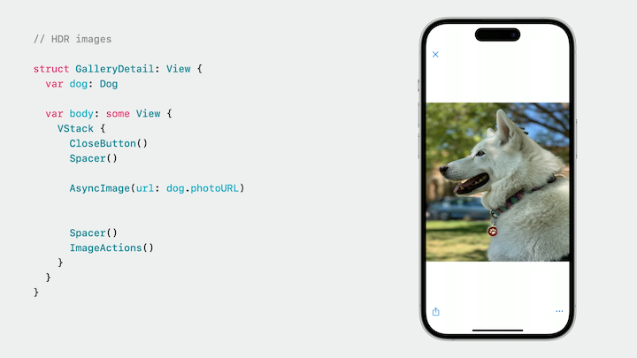

* Accessibility APIs
    * magnification gesture to allow zooming in
    * `.accessibilityZoomAction { ... }` allows VoiceOver to access zooming functionality without using the gesture
    * [**Build accessible apps with SwiftUI and UIKit**](Build accessible apps with SwiftUI and UIKit.md) session

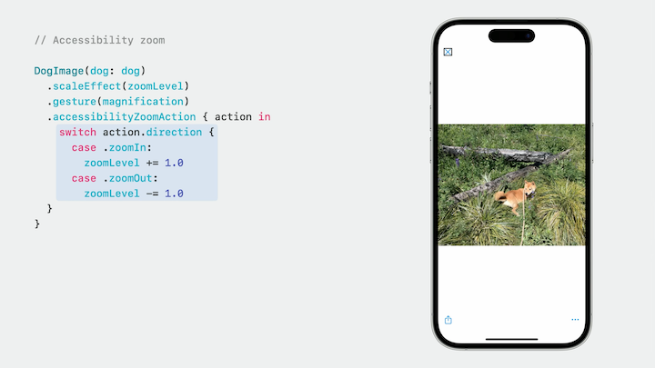

* Color now supports static member syntax
    * Look up custom colors defined in the asset catalog
    * Gives compile-time safety

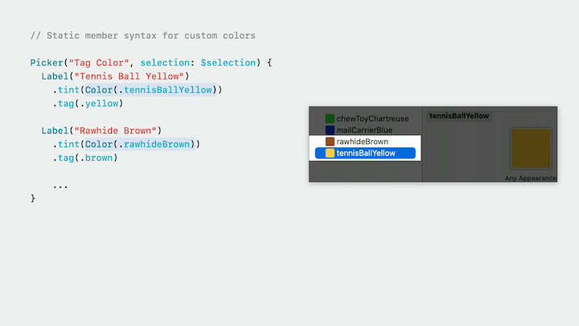

* Menu Enhancements
    * `.controlGroupStyle(.compactMenu)` will show `ControlGroup` items in a horizontal stack
    * Picker has new `.pickerStyle(.palette)` modifier to display the picker as a horizontal stack of icons
    * `.paletteSelectionEffect(...)` modifier allows us to use a symbol variant to represent the selected item in the picker

```swift
import SwiftUI

struct DogTagEditMenu: View {
    @State private var selectedColor = TagColor.blue

    var body: some View {
        Menu {
            ControlGroup {
                Button {
                } label: {
                    Label("Cut", systemImage: "scissors")
                }
                Button {
                } label: {
                    Label("Copy", systemImage: "doc.on.doc")
                }
                Button {
                } label: {
                    Label("Paste", systemImage: "doc.on.clipboard.fill")
                }
                Button {
                } label: {
                    Label("Duplicate", systemImage: "plus.square.on.square")
                }
            }
            .controlGroupStyle(.compactMenu)

            Picker("Tag Color", selection: $selectedColor) {
                ForEach(TagColor.allCases) {
                    Label($0.rawValue.capitalized, systemImage: "tag")
                        .tint($0.color)
                        .tag($0)
                }
            }
            .paletteSelectionEffect(.symbolVariant(.fill))
            .pickerStyle(.palette)
        } label: {
            Label("Edit", systemImage: "ellipsis.circle")
        }
        .menuStyle(.button)
    }

    enum TagColor: String, CaseIterable, Identifiable {
        case blue
        case brown
        case green
        case yellow

        var id: Self { self }

        var color: Color {
            switch self {
            case .blue: return .blue
            case .brown: return .brown
            case .green: return .green
            case .yellow: return .yellow
            }
        }
    }
}
```

* Bordered buttons can now be defined with new built-in shapes
    * circle, round rect, etc.
    * `.buttonBorderShape(.roundedRectangle)`
    * Work on watchOS, iOS, and macOS
* Buttons can now react to drag actions
    * Triggered when a drag pauses over it, or when force clicking on macOS
* tvOS can make use of new highlight hover effect `.hoverEffect(.highlight)`
    * tvOS now can use `.buttonStyle(.borderless)`

| Button Shape | Drag Actions |
| ------------ | ------------ |
| 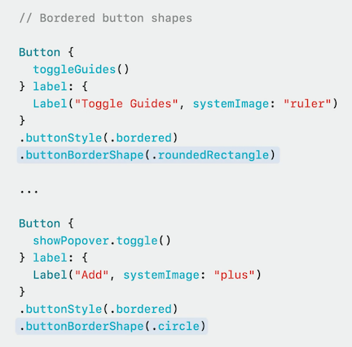 | 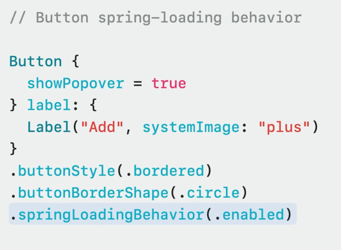 |

* Focusable views on platforms with hardware keyboard support can now use the `onKeyPress(...) { ... }` modifier to directly react to any keyboard input
    * Modifier takes a set of keys to match against, and an action to perform for the event
    * [**The SwiftUI cookbook for focus**](The SwiftUI cookbook for focus.md) session

```swift
DogTagEditor()
    .focusable (true, interactions: .edit)
    .focusEffectDisabled()
    .onKeyPress (characters: •letters, phases: •down) { press in
        ...
    }
```
