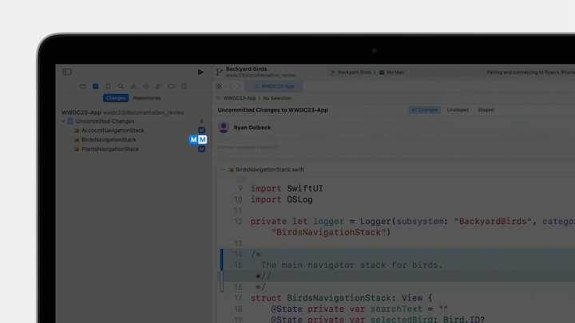
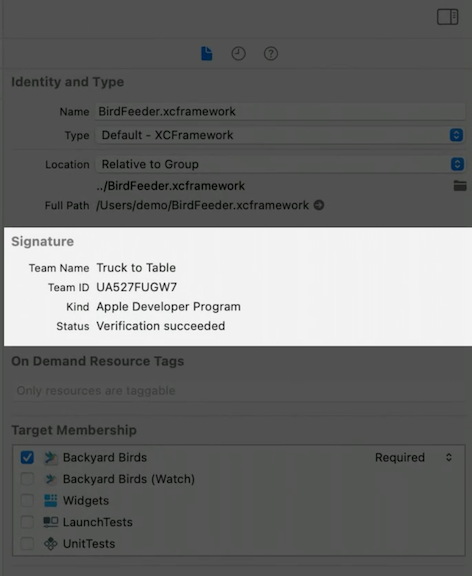

# [**What's new in Xcode 15**](https://developer.apple.com/videos/play/wwdc2023/10191/)

---

* All simulators are now downloadable, including iOS and spatial computing
    * Makes the download smaller
* When downloading from the website, you can choose which simulators to download up front

### **Editing**

#### Code Completion

* Take advantage of new sources of information
    * Uses file name for completion
* The way some completions are presented has improved
    * When you're calling a function that has default arguments, press the right arrow to see all possible permutations
* More context awareness
    * Floats up more frequently used modifiers for a view
    * Suggests items commonly used together (e.g. longitude and latitude)


* Color and Image assets are now backed by Swift symbols
    * Can now be code completed by a static symbol generated by Xcode
    * Gives compile time errors when color/image symbols are not found

* String catalogs bring localizations into a single place
    * `Edit -> Convert to string catalog` to convert a project to use String catalogs
    * Translations are organized into a single editor
    * [**Discover string catalogs**](./Discover%20string%20catalogs.md) session


#### Documentation

* New styling and spacing in documentation
* New assistant with real-time preview of documentation
    * Choose `Assistant` from the windowing menu, and then `Documentation Preview` in the jump bar
* [**Create rich documentation with Swift-DocC**](https://developer.apple.com/videos/play/wwdc2023/10244/) session

| Menu | Jump Bar |
| ---- | -------- |
|  |  |


#### Swift macros

* Can create your own macro package to share with others
    * Use quick actions, a new feature that lets me access all of Xcode's menu options just by pressing `Command-Shift-A` and selecting `New > Package`
    * Can also choose `Expand Macro` from this menu to expand the macro
    * Can put breakpoints inside expanded macros
    * [**Expand on Swift macros**](./Expand%20on%20Swift%20macros.md) session
    * [**Write Swift macros**](./Write%20Swift%20macros.md) session


#### Previews

* New `#Preview` macro syntax to show previews
* Can have multiple previews that you can switch between
    * Can give previews a title to disambiguate them better

```swift
// SwiftUI Preview
#Preview {
    AppDetailColumn(screen: .account)
        .backyardBirdsDataContainer()
}

#Preview("Placeholder View") {
    AppDetailColumn()
        .backyardBirdsDataContainer()
}
```


* Previews also work with UIKit now

```swift
// UIKit Preview
#Preview {
    let controller = DetailedMapViewController()

    controller.mapView.camera = MKMapCamera(
        lookingAtCenter: CLLocation(latitude: 37.335_690, longitude: -122.013_330).coordinate,
        fromDistance: 0,
        pitch: 0,
        heading: 0
    )
    return controller
}
```

* New workflows added for building time-based widgets
    * The canvas has a new area that shows all of the entries
    * As you navigate through them, you can see how the widget's transitions animate
    * [**Build programmatic UI with Xcode Previews**](./Build%20programmatic%20UI%20with%20Xcode%20Previews.md) session


### **Navigating**

#### Bookmarks Navigator

* A bookmark icon near the File Navigator icon
    * Can add bookmarks to code to have it show up here
    * Right click on code and select `Bookmark ...`
    * by default bookmark shows up in view with a preview, but you can add a custom description
        * Annotates the line of code with your description
    * Can group bookmarks together with a custom group name
    * Can be used as a todo list, with the ability to check off items when they are complete
    * Can be deleted by right clicking and selecting `Delete Bookmark`
    * Can also bookmark Find Queries in addition to lines of code

| Bookmarks View | Bookmark Find Query |
| -------------- | ------------------- |
|  |  |

### **Sharing**

* Xcode 15 introduces a new changes navigator and commit editor
    * Improved reporting and presentation of each file's status
    * Can view all uncommitted changes in a single scrolling view
        * Can use the drag handle to expose more of the file if you want to see more than just the diff
        * Can make edits directly in this view
        * Shows staged and un-staged changes
    * Can commit and push directly from the source control view




### **Testing**

* Updated test navigator re-written in Swift
    * 45% faster running and reporting tests
    * Can filter test results on result type (like expected failure)
* New Test Results to help explore the results
    * Includes Insights, a pattern-based analysis of the results
    * Within the Test section, you can understand how the test performed.
        * Shows results across different devices and configurations
    * Insights analyze test results to identify potentially related failures that might have been difficult to see before.
        * Also alerts us to test runs that may cause the entire suite to take longer to return results.


* The Test list shows all of the test runs
    * Has filters for result type, run destination, and test plan configuration


* The Test Details view contains tabs for different ways of exploring the results data, including a breakdown of all runs and a dedicated performance metrics tab


* New automation explorer for debugging UI test failures
    * Interactive - can watch test playback or scrub through timeline
    * Touch/mouse events are overlaid on the timeline
    * At the point of failure, you can inspect the UI hierarchy of the app
    * [**Fix failures faster with Xcode test reports**](./Fix%20failures%20faster%20with%20Xcode%20test%20reports.md) session

### **Debugging**

* OSLog integration into Xcode
    * New console support
        * Includes the ability to perform complex filtering on log data, like subsystem category and severity.
    * Cleaner log output
    * Metadata fields are hidden by default, but you can choose the fields you want to see
    * Can filter on the metadata or on the full text of the log
    * You can jump from a log entry directly back to the line of code that created it (right click, `Jump To Source`)
    * [**Debug with structured logging**](./Debug%20with%20structured%20logging.md) session


```swift
import OSLog

let logger = Logger(subsystem: "BackyardBirdsData", category: "Account")

func login(password: String) -> Error? {
    var error: Error? = nil
    logger.info("Logging in user '\(username)'...")

    // ...

    if let error {
        logger.error("User '\(username)' failed to log in. Error: \(error)")
    } else {
        loggedIn = true
        logger.notice("User '\(username)' logged in successfully.")
    }
    return error
}
```

### **Distributing**

#### Xcode Cloud

* Now handles TestFlight test details
* Supports notarization

#### Signature Verification

* Authors can digitally sign the contents of their frameworks, and you can verify these signatures right in Xcode
    * Xcode remembers identities, and gives a warning if the identity changes
* Authors can now include a privacy manifest in their framework
    * Details exactly how the framework uses and protects sensitive data
    * Can summarize all of the manifests into a complete privacy report for your app
* [**Verify app dependencies with digital signatures**](./Verify%20app%20dependencies%20with%20digital%20signatures.md) session
* [**Get started with privacy manifests**](./Get%20started%20with%20privacy%20manifests.md) session



* Xcode 15 now supports the TestFlight internal testing distribution option
    * Just select the "TestFlight internal testing" option when distributing your app through App Store Connect
    * Xcode now bundles a set of the most common distribution methods and recommended settings
    * If you're distributing through App Store Connect, you will also now get desktop notifications about your build status
    * [**Simplify distribution with Xcode and Xcode Cloud**](./Simplify%20distribution%20with%20Xcode%20and%20Xcode%20Cloud.md) session


