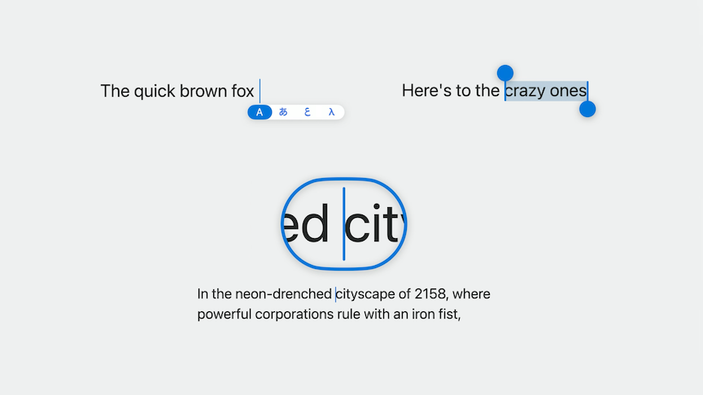
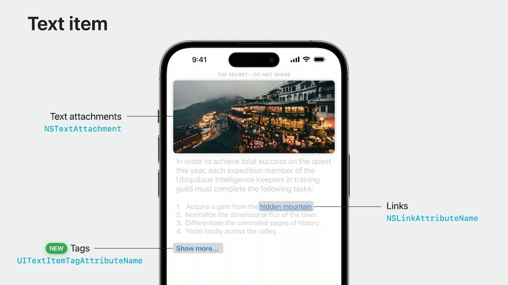
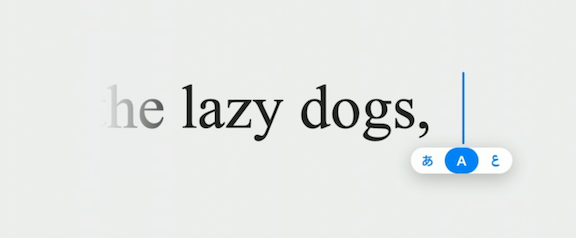
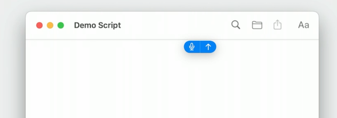

# [**What's new with text and text interactions**](https://developer.apple.com/videos/play/wwdc2023/10258/)

---

### **Changes in selection UI**

* Now display an inline, interactive switcher when changing input languages
* More ergonomic selection handles when doing range selection
* Completely new loupe to make it easier to place the cursor in large bodies of text
* When using `UITextView` or `UITextField`, get these automatically
    * Also get it when using `UITextInteraction`



#### UITextSelectionDisplayInteraction

* iOS 17 adds `UITextSelectionDisplayInteraction`, which provides the selection UI without the gestures included with `UITextInteraction`
* A new type of `UIInteraction` that can be installed on any UIView
* Must adopt `UITextInput` protocol
* Provides cursor view and accessories, as well as the range highlight and selection handles
    * These views are replaceable and the behavior is customizable

```swift
// Add selection display interaction
let selectionDisplayInteraction = UITextSelectionDisplayInteraction(textInput: document,
delegate: self)
view.addInteraction (selectionDisplayInteraction)
// Call this whenever selection changes in your document
selectionDisplayInteraction.setNeedsSelectionUpdate()
```

#### Text Loupe

* New `UITextLoupeSession` object for displaying loupe
* Can be used on any view
* Recommended to use a gesture recognizer to drive the loupe's updates

```swift
// Showing a loupe with a pan gesture recognizer
var loupeSession: UITextLoupeSession?

func didRecognizePanGesture(_ gesture: UIPanGestureRecognizer) {
    let location = gesture.location(in: view)
    let cursorView = selectionDisplayInteraction.cursorView
    switch gesture.state {
    case .began:
        loupeSession = UITextLoupeSession.begin(at: location,
                                                fromSelectionWidgetView: cursorView,
                                                in: view)
    case .changed:
        loupeSession?.move(to: location, withCaretRect: cursorView.frame,
                            trackingCaret: true)
    case •ended, .failed, •cancelled:
        loupeSession?.invalidate ()
        loupeSession = nil
    }
}
```

### **Text item actions and menus**

* New APIs on `UITextViewDelegate`
* In iOS 17, can customize the primary action or menu content
* New methods on `UITextViewDelegate`

```swift
func textView(_ textView: UITextView,
    primaryActionFor textItem: UITextItem,
    defaultAction: UIAction) -> UIAction?

func textView(_ textView: UITextView,
    menuConfigurationFor textItem: UITextItem,
    defaultMenu: UIMenu) -> UITextItem.MenuConfiguration?
```

* `UITextItem` now supports tagging custom ranges of text for interaction
* To tag a range for interaction, use the `UITextItemTagAttributeName` on the attributed string representing the range of text you wish to make interactive
* To continue to suppress or disable the primary action or menu, simply return nil for the `menuConfiguration` or `primaryAction` delegate methods
* You may also provide a preview as part of the menu configuration to show inline with the rest of the context menu



```swift
// Text item menu for tags
func textView(_ textView: UITextView,
    menuConfigurationFor textItem: UITextItem,
    defaultMenu: UIMenu) -> UITextItem.MenuConfiguration? {
    guard case tag(let identifier) = textItem.content else {
        return UITextItem.MenuConfiguration(menu: defaultMenu)
    }

    let menu = tagItemMenu (for: identifier)
    return UITextItem.MenuConfiguration(menu: menu)
}
```

### **Lists and bullets**

* List and bullet support have been added to TextKit 2
* Supports several different kinds of bullets
* Automatic numbering of items
* Localized for every language

```swift
// Using text lists with Textkit 2
let textList = NSTextList (markerFormat: •circle, options: 0)

let mutableParagraphStyle = NSMutableParagraphStyle ()
mutableParagraphStyle.textLists = [textList]

textStorage.addAttribute(.paragraphStyle,
    value: mutableParagraphStyle,
    range: NSRange (location: 0, length: textStorage.length))
```

### **Dictation**

* Big dictation changes on macOS Sonoma
* Like on iOS, dictation has a trailing glow effect while speaking, and a microphone indicator appears when at rest
* After scrolling, the indicator next to the cursor will stick to the edge of the scroll view, and offer a button to return to the current position in the document
* Get this for free when using a standard text control in AppKit like NSTextView
* When using a customized implementation for showing the insertion point, requires work to support the new behavior
    * Use `NSTextInsertionIndicator` instead of drawing your own cursor
        * Appearance is customizable, you can change color/size, and by default uses the current accent color
        * Supports dictation effects
    * Use `insertionIndicator.automaticModeOptions.remove(.showEffectsView)` to disable the glow effect
    * When the user changes input modes, an effect view is displayed beneath the cursor in horizontal text to show the language selection UI
        * Use `var preferredTextAccessoryPlacement: NSTextCursorAccessoryPlacement { .forward }` to override the placement of this UI


```swift
// Code example to add NSTextInsertionIndicator
let insertionIndicator = NSTextInsertionIndicator (frame: •zero)
documentView.addSubview(insertionIndicator)

/ Block to handle effect views added by system
insertionIndicator.effectsViewInserter= { view in
    documentView.addSubview(view, positioned: .below, relativeTo: insertionIndicator)
}

func didLoseFocus. {
    // When resigning first responder, make sure to hide cursor.
    insertionIndicator.displayMode = .hidden
}
```



* When the text cursor is scrolled offscreen during dictation, the system will display a scroll-away indicator to indicate the relative position of the cursor and offer an affordance to get back to the dictation point
* To make sure this behavior is supported in your custom text view, make sure to adopt `NSTextInputClient` and implement the `selectionRect` and `documentVisibleRect` properties
* Notify the system about scrolling beginning and ending by calling `textInputClientWillStartScrollingOrZooming` and `willEndScrollingOrZooming`



### **Internationalization**

* Improvements made to UITextField, UILabel, and other text elements to address problems automatically with text clipping with dynamic line-height adjustments
    * Dependent on preferred languages in Language & Region settings
    * Independent of actual language of content
        * Affects the entire user interface, increasing line heights for all text elements, even those that display scripts with fixed line heights
    * Only affects text elements that use text styles - custom fonts will continue to use their fixed line heights
    * To take advantage of this behavior, adopt Text Styles by creating a `UIFont` explicitly with the `preferredFont(forTextStyle:)` method and assign it to a text element, like UILabel
    * Avoid setting `clipsToBounds` on text elements
    * Ensure UI's are responsive to changes in height
* Also made changes to line-breaking behavior
    * Improved line breaking for Chinese, German, Japanese, and Korean
    * Optimized for text style and language
    * Adopt text styles
        * Previously, a word within Korean text might have been split between lines; now UIKit prevents such splitting for title text styles
