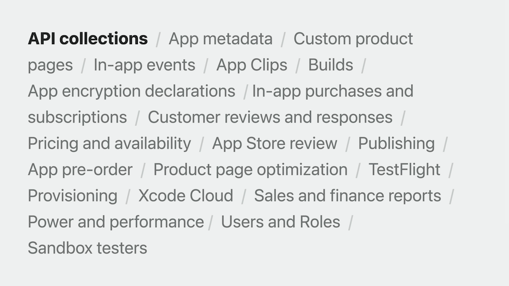

# [**What’s new in App Store Connect**](https://developer.apple.com/videos/play/wwdc2023/10117/)

---

### **Monetize your app**

* StoreKit for SwiftUI
    * New capability that allows you to quickly and easily offer in-app purchases and subscriptions in your app
    * After you set up products in App Store Connect, you can go into Xcode and add a few lines of code to generate views in your app to offer in-app purchases.
    * Fully accessible and localize your project strings into all App Store languages
    * Can customize elements like backgrounds, buttons, and styles
    * If you promote your in-app purchases on the App Store, you have the option to use the App Store promotion image in the product view in your app
* Pricing update
    * Choose from more price points
    * Select a base region - choose one region to automatically generate prices across other regions and currencies
    * Manage international pricing - allows the App Store to adjust your prices as currencies or taxes change or manage them manually on your own
    * Set the availability of in-app purchases and subscriptions by region
* [**Meet StoreKit for SwiftUI**](https://developer.apple.com/videos/play/wwdc2023/10013/) session
* [**What's new in App Store pricing**](https://developer.apple.com/videos/play/wwdc2023/10014/) session

### **Manage testers**

* TestFlight provides data about your testers
    * Data includes whether a tester has been invited/accepted/installed a build, number of sessions the tester has had, number of crashes, and amount of TestFlight feedback they have provided
    * Adding an additional column for devices which will show the most recent device and OS on which the beta app was installed
    * Adding the ability to filter by tester data in order to view and manage segments of testers
    * Will be able to bulk select groups of testers in order to resend invitations, add to a group, or remove testers altogether
    * All of this data will be available through the App Store Connect API
* Adding a `TestFlight Internal Only` selection to the new distribution workflow in Xcode
    * Ensures that these builds can't be released for External TestFlight and can't be submitted for App Store review
    * These builds will be clearly marked so you can easily see which builds can be distributed where
* Xcode Cloud adds the ability to upload `TestFlight What to Test information` alongside a build
    * You can add a plain text file to a TestFlight folder located in the same folder as your Xcode project or workspace
    * Or you pull from commit messages with a custom build script
* Family Sharing allows your customers to share your subscriptions and in-app purchases with their Family Group
    * To enable you to test this feature before you release, adding the ability to combine sandbox test accounts into a Family Group (up to six test accounts in a group)
    * Can configure these accounts in App Store Connect
* Adding sandbox on-device enhancements on iOS on-device
    * View Family Group - start/stop sharing auto-renewable subscription or non-consumable with a family
    * Renewal Rate - modify rate of a subscription
    * Test interrupted purchases
    * Clear purchase history
* [**Simplify distribution with Xcode and Xcode Cloud**](https://developer.apple.com/videos/play/wwdc2023/10224/) session
* [**Explore testing in-app purchases**](https://developer.apple.com/videos/play/wwdc2023/10142/) session

### **Build your store presence**

* New privacy nutrition label question data types for visionOS
    * Environment scanning, hand structure/movement, head movement
* Pre-orders can now be used on a regional basis
    * Redesigned availability page where you can manage the state of your app across regions
* Tests will continue to run until you choose to stop them, and won't be affected by new versions
    * Can view and monitor a currently running test while pushing updates to your app as needed
* [**Explore App Store Connect for spatial computing**](https://developer.apple.com/videos/play/wwdc2023/10012/) session
* [**What's new in privacy**](https://developer.apple.com/videos/play/wwdc2023/10053) session
* [**What's new in App pre-order**](https://developer.apple.com/videos/play/wwdc2023/10015/) session

### **Automate with APIs**

* This year, launched in-app purchases and subscriptions, customer reviews and responses, and the ability to manage sandbox testers
* Support for Game Center coming this year
    * Create, configure and archive leaderboards and achievements
    * Submit scores and achievement unlock events via a server-to-server API
    * Remove scores and players from your leaderboards to automate management of fraudulent activity
    * Match players using custom rules like skill level or region (an upgrade to current matchmaking capabilities)
* Updates to API authentication
    * Can generate marketing and customer service API keys if you'd like to limit keys to manage your marketing metadata or respond to App Store reviews
    * Can create a user-based key, which is an API key that has the same permissions as you do, regardless of what role you have
        * Do this from your user profile in App Store Connect
