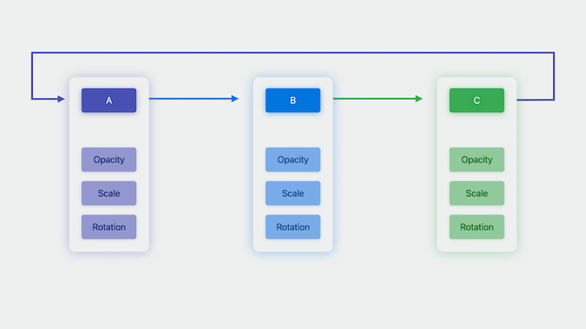
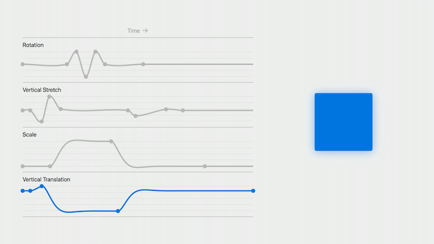

# [**Wind your way through advanced animations in SwiftUI**](https://developer.apple.com/videos/play/wwdc2023/10157/)

---

* Adding animation is as easy as adding `withAnimation` or an `.animation` modifier

```swift
struct Avatar: View {
    var petImage: Image
    @State private var selected: Bool = false

    var body: some View {
        petImage
            .scaleEffect(selected ? 1.5 : 1.0)
            .onTapGesture {
                withAnimation {
                    selected.toggle()
                }
            }
    }
}
```

This session will focus on complex, multi-step animations

* Will go over animations that define multiple steps and happen in sequence
* Especially great in two situations:
    * Repeating animations that loop continuously while a view is visible
    * Event-driven animations, such as a view that pulses when an event occurs

### **Animation phases**

* We want to give a view an animated highlight effect to make it extra visible
    * To make the view animate, we apply the `.phaseAnimator` modifier
        * To use this, you provide a sequence of states that define the individual steps in a multipart animation, and SwiftUI then animates between the states automatically
    * We’ll apply some modifiers to change the appearance of the view depending on the current phase.
        * Start with an `opacity` modifier - we’ll make the view fully opaque when highlighted, and 50% transparent otherwise

```swift
OverdueReminderView()
            .phaseAnimator([false, true]) { content, value in
                content
                    .opacity(phase ? 1.0 : 0.5)
            }
```

* You can define animations that include any number of phases, and any number of additional view modifiers



* We can change from animating `opacity` to animating the `foregroundStyle` to change the highlight color with the animation
* By default, SwiftUI uses a spring animation
    * We can change to a smoother, more consistent `.easeInOut` animation by using a trailing `animation` closure

```swift
OverdueReminderView()
            .phaseAnimator([false, true]) { content, value in
                content
                    .foregroundStyle(value ? .red : .primary)
            } animation: { _ in
                .easeInOut(duration: 1.0)
            }
```

* We can create a more complex animation by defining a list of steps for animation
* The `Phase` enum provides three cases: `initial`, `move`, and `scale`
    * We will add computed properties to this enum that define the different effects that we will apply
        * To make the view jump up during the animation, we've a computed vertical offset property
        * A scale property has also been added
* We add the `phaseAnimator` modifier to the view, but this time give it a `trigger` value
    * When the value changes, the animation will begin
* We can customize the `animation` closure to get the effect we want for each phase

```swift
ReactionView()
    .phaseAnimator(
        Phase.allCases, 
        trigger: reactionCount
    ) { content, phase in
        content
            .scaleEffect(phase.scale)
            .offset(y: phase.verticalOffset)
    } animation: { phase in
        switch phase {
        case .initial: .smooth
        case .move: .easeInOut(duration: 0.3)
        case .scale: .spring(
            duration: 0.3, bounce: 0.7)
        } 
    }

enum Phase: CaseIterable {
    case initial
    case move
    case scale

    var verticalOffset: Double {
        switch self {
        case .initial: 0
        case .move, .scale: -64
        }
    }

    var scale: Double {
        switch self {
        case .initial: 1.0
        case .move: 1.1
        case .scale: 1.8
        }
    }
}
```

### **Keyframes**

* When you need even more control, keyframes are an even more powerful tool
* Phases:
    * Define discrete states that are provided to your view one at a time
    * SwiftUI animates between those states, using the same animation types that you already know
    * When a state transition occurs, all of the properties are animated at the same time
    * When that animation is finished, SwiftUI animates to the next state
    * Continues across all of the phases of the animation
* Keyframes:
    * Let you define values at specific times within an animation
    * In the image below, the dots indicate keyframes: angles to use at each point during the animation
    * When the animation plays back, SwiftUI interpolates values in between these keyframes, which we can then use to apply modifiers to the view
    * Keyframes allow you to independently animate multiple effects at the same time by defining separate tracks, each with their own unique timing



* To create the animation in the image above, we start by defining an `AnimationValues` struct containing all the different properties that wil be independently animated
    * Several of these properties are of type `Double`, which now conforms to `Animatable`
    * Unlike phases, in which you model separate, discrete states, keyframes generate interpolated values of the type that you specify
    * While an animation is in progress, SwiftUI will provide you with a value of this type on every frame so that you can update the view
* We add the `.keyframeAnimator` modifier to our view
    * Similar to the `.phaseAnimator` modifier, but accepts keyframes as a parameter
    * We provide an instance of the `AnimationValues` struct as the initial value
        * The provided keyframes will apply animations to this value
* Next, we apply modifiers to each of the properties on the struct
* Finally, we define the keyframes
    * Keyframes are organized into tracks
    * Each track controls a different property of the type that you are animating, which is specified by the key path that you provide when creating the track
    * We are adding keyframes for the `\.angle`, `\.verticalStretch`, `\.scale`, and `\.verticalTranslation` properties defined in `AnimationValues`
    * Multiple types of keyframes
        * LinearKeyframe interpolates linearly in vector space from the previous keyframe
        * SpringKeyframe uses a spring function to interpolate to the target value from the previous keyframe
        * CubicKeyframe uses a cubic Bézier curve to interpolate between keyframes
            * If you combine multiple cubic keyframes in sequence, the resulting curve is equivalent to a Catmull-Rom spline
        * MoveKeyframe immediately jumps to a value without interpolation
    * SwiftUI maintains velocity between keyframes

```swift
ReactionView()
    .keyframeAnimator(initialValue: AnimationValues()) { content, value in
        content
            .foregroundStyle(.red)
            .rotationEffect(value.angle)
            .scaleEffect(value.scale)
            .scaleEffect(y: value.verticalStretch)
            .offset(y: value.verticalTranslation)
        } keyframes: { _ in
            KeyframeTrack(\.angle) {
                CubicKeyframe(.zero, duration: 0.58)
                CubicKeyframe(.degrees(16), duration: 0.125)
                CubicKeyframe(.degrees(-16), duration: 0.125)
                CubicKeyframe(.degrees(16), duration: 0.125)
                CubicKeyframe(.zero, duration: 0.125)
            }

            KeyframeTrack(\.verticalStretch) {
                CubicKeyframe(1.0, duration: 0.1)
                CubicKeyframe(0.6, duration: 0.15)
                CubicKeyframe(1.5, duration: 0.1)
                CubicKeyframe(1.05, duration: 0.15)
                CubicKeyframe(1.0, duration: 0.88)
                CubicKeyframe(0.8, duration: 0.1)
                CubicKeyframe(1.04, duration: 0.4)
                CubicKeyframe(1.0, duration: 0.22)
            }
            
            KeyframeTrack(\.scale) {
                LinearKeyframe(1.0, duration: 0.36)
                SpringKeyframe(1.5, duration: 0.8, spring: .bouncy)
                SpringKeyframe(1.0, spring: .bouncy)
            }

            KeyframeTrack(\.verticalTranslation) {
                LinearKeyframe(0.0, duration: 0.1)
                SpringKeyframe(20.0, duration: 0.15, spring: .bouncy)
                SpringKeyframe(-60.0, duration: 1.0, spring: .bouncy)
                SpringKeyframe(0.0, spring: .bouncy)
            }
        }

struct AnimationValues {
    var scale = 1.0
    var verticalStretch = 1.0
    var verticalTranslation = 0.0
    var angle = Angle.zero
}
```

* Keyframes are predefined animations - they are not a replacement for normal SwiftUI animations in situations where the UI should be fluid and interactive
* Because you specify exactly how an animation should progress, keyframe animations can’t gracefully retarget the way that springs can, so it’s generally best to avoid changing keyframes mid-animation
* Keyframes animate a value of the type that you define, which you then use to apply modifiers to the view
    * You can use a single keyframe track to drive a single modifier, or a combination of different modifiers
* Because the animation happens in terms of the value that you define, updates happen on every frame -  so avoid performing any expensive operations while applying a keyframe animation to the view

### **Tips and tricks**

* MapKit now allows using keyframes to move the camera
* The `.mapCameraKeyframeAnimator(trigger:) { ... }` modifier animates the map position based on keyframes.
    * The final value of the keyframes determines the camera value that is used at the end of the animation
* If the user performs a gesture while animating, the animation will be removed and the user will have full control over the camera

```swift
struct RaceMap: View {
    let route: Route

    @State private var trigger = false

    var body: some View {
        Map(initialPosition: .rect(route.rect)) {
            MapPolyline(coordinates: route.coordinates)
                .stroke(.orange, lineWidth: 4.0)
            Marker("Start", coordinate: route.start)
                .tint(.green)
            Marker("End", coordinate: route.end)
                .tint(.red)
        }
        .toolbar {
            Button("Tour") { trigger.toggle() }
        }
        .mapCameraKeyframeAnimation(trigger: playTrigger) { initialCamera in
            KeyframeTrack(\MapCamera.centerCoordinate) {
                let points = route.points
                for point in points {
                    CubicKeyframe(point.coordinate, duration: 16.0 / Double(points.count))
                }
                CubicKeyframe(initialCamera.centerCoordinate, duration: 4.0)
            }
            KeyframeTrack(\.heading) {
                CubicKeyframe(heading(from: route.start.coordinate, to: route.end.coordinate), duration: 6.0)
                CubicKeyframe(heading(from: route.end.coordinate, to: route.end.coordinate), duration: 8.0)
                CubicKeyframe(initialCamera.heading, duration: 6.0)
            }
            KeyframeTrack(\.distance) {
                CubicKeyframe(24000, duration: 4)
                CubicKeyframe(18000, duration: 12)
                CubicKeyframe(initialCamera.distance, duration: 4)
            }
        }
    }
}
```

* Keyframes can be manually evaluated to drive any kind of effect
* You can use the `KeyframeTimeline` type to capture a set of keyframes and tracks
    * You initialize this type with an initial value, and the keyframe tracks that define your animation
    * `KeyframeTimeline` provides API that gives you the duration, which is equal to the duration of the longest track
    * You can calculate values for any time within the range of the animation
    * Means that you can use keyframe-defined curves however you want, or to creatively combine keyframes with other APIs

```swift
// Keyframes
let myKeyframes = KeyframeTimeline(initialValue: CGPoint.zero) {
    KeyframeTrack(\.x) {...}
    KeyframeTrack(\.y) {...}
}

// Duration in seconds
let duration: TimeInterval = myKeyframes.duration

// Value for time
let value = myKeyframes.value(time: 1.2)
```
