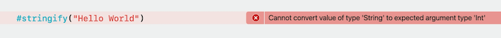
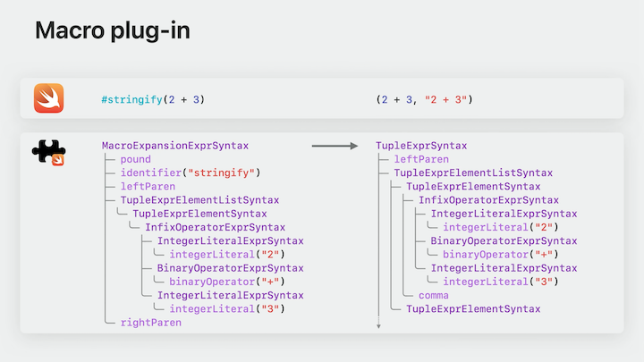
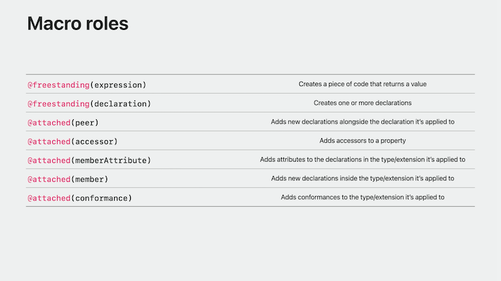
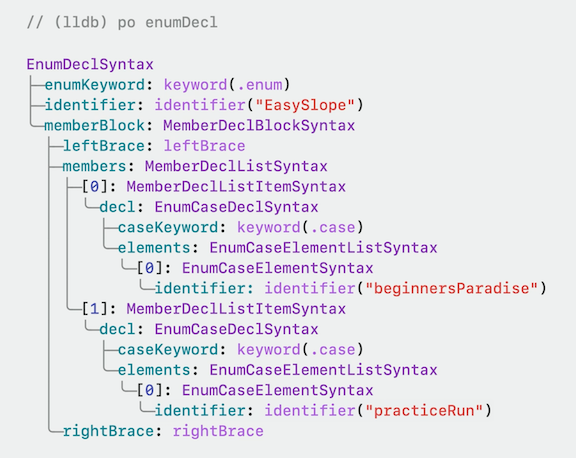
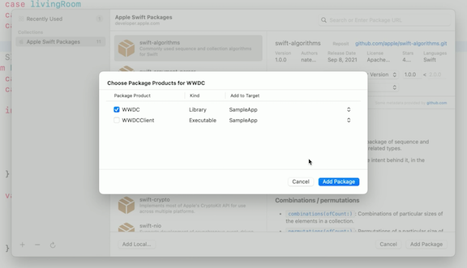
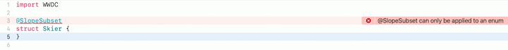

# [**Write Swift macros**](https://developer.apple.com/videos/play/wwdc2023/10166/)

---

### **Overview**

Want to create a macro to reduce the repetitive typing and error-proneness of the following code:

```swift
let calculations = [
    (1 + 1, "1 + 1"),
    (2 + 3, "12 + 3"),
    (7 - 3, "7- 3"),
    (5 - 2, "15 - 2"),
    (3 * 2, "'3 * 2"),
    (3 * 5, "3 * 5"),
]
```

Using a Swift macro, we can turn the code into:

```swift
let calculations = [
    #stringify(1 + 1),
    #stringify(2 + 3),
    #stringify(7 - 3),
    #stringify(5 - 2),
    #stringify(3 * 2),
    #stringify(3 * 5),
]
```

The definition of the macro looks like this:

```swift
@freestanding(expression)
public macro stringify(_ value: Int) -> (Int, String)
```

If the arguments of the macro expression don't match the macro's parameters, or don't type check by themselves, the compiler will emit an error without applying the macro expansion.

* Unlike C macros, which are evaluated at the pre-processor stage before type-checking



* This macro is declared with the freestanding expression macro role
    * his means that you can use the macro wherever you can use an expression
    * It will be indicated by the hash character (`#stringify`)
* Other kinds of macros are attached macros that can augment declarations (covered later)

#### Process

* After checking that all the arguments match the macro's parameters, the compiler performs the macro expansion
    * Each macro defines its implementation in a compiler plug-in
        * The compiler will send the source code of the entire macro expression to that plug-in
    * The first thing that the macro plug-in does, is to parse the source code of the macro into a SwiftSyntax tree
        * Source-accurate, structural representation of the macro
        * The basis on which the macro operates
        * The macro's implementation is itself a program written in Swift and can perform any transformation to the syntax tree
    * It will then serialize the generated syntax tree into source code again
    * Then sends it to the compiler, which will replace the macro expression by the expanded code



### **Create a macro**

To create a macro template, click `File -> New -> Package` and select the `Swift Macro` template

The template gives us an invocation of the `#stringify` macro...

```swift
import WWDC

let a = 17
let b = 25

let (result, code) = #stringify(a + b)

print("The value \(result) was produced by the code \"\(code)\"")
```

and the definition of the macro (a generic version, taking any type `T` instead of an `Int`)

```swift
@freestanding(expression)
public macro stringify<T>(_ value: T) -> (T, String) = #externalMacro(module: "WWDCMacros", type: "StringifyMacro")
```

* The macro is declared as an external macro
    * This tells the compiler that to perform the expansion, it needs to look at the `StringifyMacro` type in the `WWDCMacros` module (for this example)
    * Because `stringify` is declared as a freestanding expression macro, the `StringifyMacro` type needs to conform to the `ExpressionMacro` protocol
        * This protocol has a single requirement: The expansion function
        * It takes the syntax tree of the macro expression itself, as well as a context that can be used to communicate with the compiler.
        * The expansion function then returns the rewritten expression syntax.
            * The function is returning an expression syntax and not a string

```swift
public struct StringifyMacro: ExpressionMacro {
    public static func expansion(
        of node: some FreestandingMacroExpansionSyntax,
        in context: some MacroExpansionContext
    ) -> ExprSyntax {
        guard let argument = node.argumentList.first?.expression else {
            fatalError("compiler bug: the macro does not have any arguments")
        }

        return "(\(argument), \(literal: argument.description))"
    }
}
```

* Because macros don't have side effects and the source code of syntax trees is easy to compare, a great way to test them is to write unit tests
    * The macro template already comes with one
    * This test case uses the 'assertMacroExpansion' function from the SwiftSyntax package to verify that the 'stringify' macro expands correctly
    * It takes the `#stringify(a + b)` expression as input, and asserts that after the macro is expanded, it produces a tuple containing `a + b` and the string literal `"a + b"`
    * To tell the test case how to expand the macros, a 'testMacros' parameter is passed
        * Specifies that the macro `#stringify` should be expanded using the `StringifyMacro` type

```swift
final class WWDCTests: XCTestCase {
    func testMacro() {
        assertMacroExpansion(
            """
            #stringify(a + b)
            """,
            expandedSource: """
            (a + b, "a + b")
            """,
            macros: testMacros
        )
    }
}

let testMacros: [String: Macro.Type] = [
    "stringify": StringifyMacro.self
]
```

* Swift macro template
    * Macro declaration defines the macro's signature
    * Implementation operates on SwiftSyntax trees
    * Easy to test


### **Macro roles**



[**Expand on Swift macros**](Expand on Swift macros.md) session

* Example of building an app that will be able to track ski slopes, and also track easy slopes for beginners. Below is some of the original code
    * Two enums, the second being a subset of the first
    * Provides great type safety, but is repetitive
        * If you want to add an easy `easySlope` case, you have to add it to `Slope`, `EasySlope`, the `init`, and the `slope` computed property

```swift
/// Slopes in my favorite ski resort.
enum Slope {
    case beginnersParadise
    case practiceRun
    case livingRoom
    case olympicRun
    case blackBeauty
}

/// Slopes suitable for beginners. Subset of `Slopes`.
enum EasySlope {
    case beginnersParadise
    case practiceRun

    init?(_ slope: Slope) {
        switch slope {
        case .beginnersParadise: self = .beginnersParadise
        case .practiceRun: self = .practiceRun
        default: return nil
        }
    }

    var slope: Slope {
        switch self {
        case .beginnersParadise: return .beginnersParadise
        case .practiceRun: return .practiceRun
        }
    }
}
```

#### The Plan

1. Both the initializer and the computed property are members of the EasySlope type, so we need to declare an **attached member macro**
2. Create a compiler plug-in that contains the macro's implementation
3. Develop it in a test-driven way to make sure it behaves as expected
    * Leave the implementation empty until we write a test case for it
4. Write the implementation for the macro
5. Integrate the macro into the app
    * At that point, we will be able to remove the initializer and have the macro generate that for us

#### The Process

* Start with the template we created earlier
    * Remove the `#stringify` macro, since we don't need it
    * Declare a new **attached member macro** by using the `@attached(member)` attribute
    * The macro also defines the names of the members it introduces (in this case, `init`)

```swift
/// Defines a subset of the `Slope` enum
///
/// Generates two members:
///  - An initializer that converts a `Slope` to this type if the slope is
///    declared in this subset, otherwise returns `nil`
///  - A computed property `slope` to convert this type to a `Slope`
///
/// - Important: All enum cases declared in this macro must also exist in the
///              `Slope` enum.
@attached(member, names: named(init))
public macro SlopeSubset() = #externalMacro(module: "WWDCMacros", type: "SlopeSubsetMacro")
```

###### _In this demo, they will just be showing us how to generate the initializer. Generating the computed property is very similar, because it's also just a switch statement that switches over all the cases_

* Next we create the `SlopeSubsetMacro` expansion that it actually performs
    * Since we declared SlopeSubset as an attached member macro, the corresponding implementation needs to conform to the MemberMacro protocol
    * This protocol has a single requirement: The 'expansion' function, similar to ExpressionMacro
        * The `expansion` function takes the attribute with which we apply the macro to a declaration, as well as the `declaration` that the macro is being applied to
            * In this case, this will be the EasySlope enum declaration
            * The macro then returns the list of all the new members it wants to add to that declaration
                * For now, returning an empty array until we write the test case
    * Finally, we need to make SlopeSubset visible to the compiler, so we add it to the `providingMacros` property

```swift
/// Implementation of the `SlopeSubset` macro.
public struct SlopeSubsetMacro: MemberMacro {
    public static func expansion(
        of attribute: AttributeSyntax,
        providingMembersOf declaration: some DeclGroupSyntax,
        in context: some MacroExpansionContext
    ) throws -> [DeclSyntax] {
        return []
    }
}

@main
struct WWDCPlugin: CompilerPlugin {
    let providingMacros: [Macro.Type] = [
        SlopeSubsetMacro.self
    ]
}
```

* Now to the test case
    * Just like in the test case in the template, the 'assertMacroExpansion' function is used to verify the macro's behavior
    * We want to test what the macro generates when applied to the EasySlope type, so we use that as our test case's input
    * Since the macro's not doing anything yet, we just expect it to remove the attribute and not add any new members, so the expected expanded code is the same as the input, just without '@SlopeSubset'.
    * We need to let the test case know that it should expand the macro`SlopeSubset` using the `SlopeSubsetMacro` implementation
        * We map the macro name to its implementing type in the `testMacros` dictionary and pass that dictionary to the assertion function

```swift
let testMacros: [String: Macro.Type] = [
    "SlopeSubset" : SlopeSubsetMacro.self,
]

final class WWDCTests: XCTestCase {
    func testSlopeSubset() {
        assertMacroExpansion(
            """
            @SlopeSubset
            enum EasySlope {
                case beginnersParadise
                case practiceRun
            }
            """, 
            expandedSource: """

            enum EasySlope {
                case beginnersParadise
                case practiceRun
            }
            """, 
            macros: testMacros
        )
    }
}
```

* We really want to check that our macro actually generates the initializer, not just remove the attribute
    * We will update the Macro now to generate the initializer
    * The initializer switches over all the enum elements declared in the EasySlopes enum
        * So first we need to retrieve these enum elements from the declaration. Since enum elements can only be declared inside enum declarations, we start by casting `declaration` to an enum declaration
    * Next, we need to get all the elements that the enum declares
        * We inspect the syntactic structure of our enum in the SwiftSyntax tree, by setting a breakpoint inside the expansion function and run the test cases to hit that breakpoint
            * In the debugger, type `po enumDecl` to view the tree (see image below)
        * The innermost nodes of the syntax tree represent the enum elements, the `beginnersParadise`, and `practiceRun` slopes.
        * To retrieve them, we need to follow the structure that is outlined to us in the syntax tree.
            * The enum declaration has a child called `memberBlock`. This member block contains both the braces and the actual members. So to access the members, we start with `enumDecl.memberBlock.members`
            * These members contain the actual declaration, as well as an optional semicolon. We are interested in the declarations, in particular those declarations that actually declare enum cases.
                * We use compact map to get a list of all the member declarations that are enum cases.
                * Each case declaration can declare multiple elements
                    * This is because instead of declaring each slope on a new line after a separate case keyword, I could have written them on the same line as `case beginnersParadise, practiceRun`
                * To retrieve all of them, we can use 'flatMap'.



```swift
/// Implementation of the `SlopeSubset` macro.
public struct SlopeSubsetMacro: MemberMacro {
    public static func expansion(
        of attribute: AttributeSyntax,
        providingMembersOf declaration: some DeclGroupSyntax,
        in context: some MacroExpansionContext
    ) throws -> [DeclSyntax] {
        guard let enumDecl = declaration.as(EnumDeclSyntax.self) else {
            // TODO: Emit an error here
            return []
        }

        let members = enumDecl.memberBlock.members
        let caseDecls = members.compactMap { $0.decl.as(EnumCaseDeclSyntax.self) }
        let elements = caseDecls.flatMap { $0.elements }
        
        // Initializer construction

        return []
    }
}
```

* Now that we have retrieved all the elements, we can construct the initializer
    * The initializer declaration has a single switch expression
    * We need ot return each case as well as a default case that returns nil
    * We can either print the syntax tree like we did previously, or we can read SwiftSyntax's documentation
        * We'll do the latter, and start by constructing an `InitializerDeclSyntax`
            * Allows us to use a for loop inside the result builder to iterate over all the elements
        * Create a `SwitchExprSyntax` type to build the switch expression
            * Inside this, iterate over the elements we retrieved earlier
            * For each element, create a new case item, which we can construct using string interpolation just like we saw for `#stringify`
            * Add default case that returns nil
        * Return the initializer

```swift
/* Initializer to generate
init?(_ slope: Slope) {
    switch slope {
    case .beginnersParadise:
        self = beginnersParadise
    case .practiceRun:
        self = .practiceRun
    default:
        return nil
    }
}*/

let initializer = try InitializerDeclSyntax("init?(_ slope: Slope)") {
    try SwitchExprSyntax("switch slope") {
        for element in elements {
            SwitchCaseSyntax(
                """
                case .\(element.identifier):
                    self = .\(element.identifier)
                """
            )
        }
        SwitchCaseSyntax("default: return nil")
    }
}
```

<details>
<summary><b>Full macro at this point</b></summary>

```swift
/// Implementation of the `SlopeSubset` macro.
public struct SlopeSubsetMacro: MemberMacro {
    public static func expansion(
        of attribute: AttributeSyntax,
        providingMembersOf declaration: some DeclGroupSyntax,
        in context: some MacroExpansionContext
    ) throws -> [DeclSyntax] {
        guard let enumDecl = declaration.as(EnumDeclSyntax.self) else {
            // TODO: Emit an error here
            return []
        }

        let members = enumDecl.memberBlock.members
        let caseDecls = members.compactMap { $0.decl.as(EnumCaseDeclSyntax.self) }
        let elements = caseDecls.flatMap { $0.elements }

        let initializer = try InitializerDeclSyntax("init?(_ slope: Slope)") {
            try SwitchExprSyntax("switch slope") {
                for element in elements {
                    SwitchCaseSyntax(
                        """
                        case .\(element.identifier):
                            self = .\(element.identifier)
                        """
                    )
                }
                SwitchCaseSyntax("default: return nil")
            }
        }

        return [DeclSyntax(initializer)]
    }
}
```

</details>

* Next, we can update and run the test to assure we are generating the correct initializer

```swift
let testMacros: [String: Macro.Type] = [
    "SlopeSubset" : SlopeSubsetMacro.self,
]

final class WWDCTests: XCTestCase {
    func testSlopeSubset() {
        assertMacroExpansion(
            """
            @SlopeSubset
            enum EasySlope {
                case beginnersParadise
                case practiceRun
            }
            """, 
            expandedSource: """

            enum EasySlope {
                case beginnersParadise
                case practiceRun
                init?(_ slope: Slope) {
                    switch slope {
                    case .beginnersParadise:
                        self = .beginnersParadise
                    case .practiceRun:
                        self = .practiceRun
                    default:
                        return nil
                    }
                }
            }
            """, 
            macros: testMacros
        )
    }
}
```

#### Use the macro in the app

* To add our macro package to the Xcode project, right-click on it and select `Add Package Dependencies`, and select the local package that we just created
    * Add the WWDC target as a dependency of the app



* Now we can import the module, and apply the macro to the `EasySlope` type
* Next, we need to remove our `init` function, because we get a compiler error that it is an Invalid redeclaration (our macro is now creating it for us)
* You can right-click on `@SlopeSubset` and select `Expand Macro` to see the code generated for us
    * Option-clicking on it will show documentation

```swift
import WWDC

/// Slopes suitable for beginners. Subset of `Slopes`.
@SlopeSubset
enum EasySlope {
    case beginnersParadise
    case practiceRun

    var slope: Slope {
        switch self {
        case .beginnersParadise: return .beginnersParadise
        case .practiceRun: return .practiceRun
        }
    }
}
```

### **Diagnostics**

We also need to worry about what happens when the macro is used in situations that it does not support. We previously left a TODO, but we should emit an error saying that it is only applicable to enums.

* We'll start by adding a test case
    * We are applying the `@SlopeSubset` macro to a struct in this test

```swift
func testSlopeSubsetOnStruct() throws {
    assertMacroExpansion(
        """
        @SlopeSubset
        struct Skier {
        }
        """,
        expandedSource: """

        struct Skier {
        }
        """,
        diagnostics: [
            DiagnosticSpec(message: "@SlopeSubset can only be applied to an enum", line: 1, column: 1)
        ],
        macros: testMacros
    )
}
```

* We'll add an enum with a single case above our macro implementation, to describe the error message if `@SlopeSubset` is applied to a type that's not an enum
    * If we throw the error from the expansion function, it will be shown at the attribute that calls the macro expansion
    * We replace the TODO inside our macro's guard statement with `throw SlopeSubsetError.onlyApplicableToEnum` to throw the error
    * If you want to show the error message at a different location than the attribute, generate warnings, or even show Fix-Its in Xcode, there's an `addDiagnostic` method on the context parameter that allows you to generate rich diagnostics

```swift
enum SlopeSubsetError: CustomStringConvertible, Error {
    case onlyApplicableToEnum
    
    var description: String {
        switch self {
        case .onlyApplicableToEnum: return "@SlopeSubset can only be applied to an enum"
        }
    }
}

public enum SlopeSubsetMacro: MemberMacro {
    ...
}
```

* Now we can check in Xcode how the error looks if we attempt to apply the macro to a struct
    * Xcode shows the custom error message inline with all other compilation errors.



* At this point, we can generalize the macro so it can be useful for other developers specifying enum subsets
    * To specify the superset of the enum, that we have so far hard-coded as Slope, we add a generic `Superset> parameter to the macro declaration.
    * Since the macro is now no longer specific to slopes, let's rename it to `EnumSubset` by right clicking on `SlopeSubset` and selecting `Refactor -> Rename`
        * Can also choose to rename all occurrences inside string literals and comments by Command-clicking them

```swift
@attached(member, names: named(init))
public macro EnumSubset<Superset>() = #externalMacro(module: "WWDCMacros", type: "SlopeSubsetMacro")
```

* Now need to adjust our macro implementation to use the generic parameter, instead of the hard-coded Slopes type
    * If we print the attribute inside the debugger and inspect its layout, just like we did for `enumDecl`, we can see that we can retrieve the generic parameter by accessing the `argumentType` of the first argument in the `genericArgumentClause` of the attribute's name.
        * Now that we've retrieved the generic parameter, we can replace the so-far hardcoded `Slope` type by the variable `supersetType`

```swift
/// Implementation of the `SlopeSubset` macro.
public struct SlopeSubsetMacro: MemberMacro {
    public static func expansion(
        of attribute: AttributeSyntax,
        providingMembersOf declaration: some DeclGroupSyntax,
        in context: some MacroExpansionContext
    ) throws -> [DeclSyntax] {
        guard let enumDecl = declaration.as(EnumDeclSyntax.self) else {
            // TODO: Emit an error here
            return []
        }

        guard let supersetType = attribute
            .attributeName.as(SimpleTypeIdentifierSyntax.self)?
            .genericArgumentClause?
            .arguments.first?
            .argumentType else {
            // TODO: Handle error
            return []
        }

        let members = enumDecl.memberBlock.members
        let caseDecls = members.compactMap { $0.decl.as(EnumCaseDeclSyntax.self) }
        let elements = caseDecls.flatMap { $0.elements }

        let initializer = try InitializerDeclSyntax("init?(_ slope: \(supersetType))") {
            try SwitchExprSyntax("switch slope") {
                for element in elements {
                    SwitchCaseSyntax(
                        """
                        case .\(element.identifier):
                            self = .\(element.identifier)
                        """
                    )
                }
                SwitchCaseSyntax("default: return nil")
            }
        }

        return [DeclSyntax(initializer)]
    }
}
```

* Need to make a few small changes to the tests now

```swift
let testMacros: [String: Macro.Type] = [
    "SlopeSubset" : SlopeSubsetMacro.self,
]

final class WWDCTests: XCTestCase {
    func testSlopeSubset() {
        assertMacroExpansion(
            """
            @EnumSubset<Slope>
            enum EasySlope {
                case beginnersParadise
                case practiceRun
            }
            """, 
            expandedSource: """

            enum EasySlope {
                case beginnersParadise
                case practiceRun
                init?(_ slope: Slope) {
                    switch slope {
                    case .beginnersParadise:
                        self = .beginnersParadise
                    case .practiceRun:
                        self = .practiceRun
                    default:
                        return nil
                    }
                }
            }
            """, 
            macros: testMacros
        )
    }
}

func testSlopeSubsetOnStruct() throws {
    assertMacroExpansion(
        """
        @EnumSubset<Slope>
        struct Skier {
        }
        """,
        expandedSource: """

        struct Skier {
        }
        """,
        diagnostics: [
            DiagnosticSpec(message: "@SlopeSubset can only be applied to an enum", line: 1, column: 1)
        ],
        macros: testMacros
    )
}
```

[**Expand on Swift macros**](Expand on Swift macros.md) session
