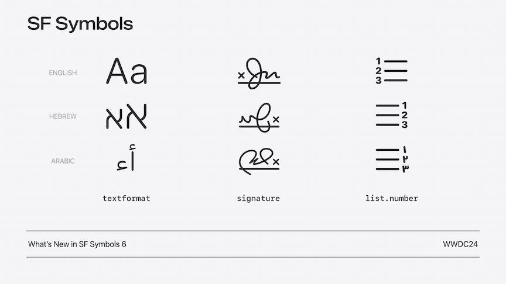

# [**Build multilingual-ready apps**](https://developer.apple.com/videos/play/wwdc2024-10185)

---


* Can type multiple languages without needing to manually switch languages
    * If you speak both Korean and English, with iOS 18, there is a new multiscript typing experience
* Live Text gains support for Arabic
* New scripts for numerals on watch faces
* Redesigned function row for Arabic on new Magic Keyboard for M4 iPad Pro
    * Volume and brightness keys are now mirrored exactly between hardware and software


### **Input**

* In Messages conversations, the keyboard remembers which language is used for each conversation
    * Specify `textInputContextIdentifier`, a unique identifier for each context or conversation, and the keyboard will automatically remember its last used language and layout

```swift
override var textInputContextIdentifier: String? {
    uniqueID
}
```

* To place a view directly above the keyboard, use `inputAccessoryView`
    * When a hardware keyboard is used, docks the view at the bottom of the screen
    * Can also use `keyboardLayoutGuide` to customize how an app's views respond when the keyboard's height or position changes
    * [**Your guide to keyboard layout**](https://developer.apple.com/videos/play/wwdc2021/10259/) session from WWDC 2021

```swift
textView.inputAccessoryView = viewAboveKeyboard

view.keyboardLayoutGuide.topAnchor.constraint(equalToSystemSpacingBelow: textView.bottomAnchor, multiplier: 1.0).isActive = true
```

* When you type in languages like Chinese or Japanese, the keyboard uses marked text
    * The temporary text before you've chosen a suggestion, and has an underlined appearance
    * Use `markedTextRange` to check for marked text before modifying text

```swift
if textView.markedTextRange.empty {
    // Perform actions involving editing text
}
```


* Each language has different rules for what are considered different and related spellings
    * Use `localizedStandardRange` to ensure matching text correctly and consistently
        * Respects locale-specific conventions
        * Can now match across different spelling styles used in scripts such as Assamese/Bangla, Devanagari, and Gujarati, and can also match numbers written in many different scripts

```swift
let range = text.localizedStandardRange(of: search)
```

* Connected scripts
    * In some languages, typing a new character doesn't always insert a new letter, in instead modifies an existing letter
    * Instead of using regular and bold weights to highlight text (technically different fonts), add a color attribute to an attributed string

```swift
attributedString[range].foregroundColor = highlightColor
```

* Use caution when using italics - many languages do not have the concept of italicization and will show no visual difference


### **Display**

* TextKit 2 ensures that all languages and scripts render correctly
    * [**Meet TextKit 2**](https://developer.apple.com/videos/play/wwdc2021/10061) session from WWDC 2021
    * Get by default when using a label or text view in SwiftUI, AppKit, or UIKit


* Using Text Styles accounts for the app's language as well as the user's language, so text renders correctly
    * `clipsToBounds` should remain false for any labels or text views, because text in many languages needs to render outside the view bounds

```swift
// Text Styles

// SwiftUI
Text("Hello, world!") // uses .body Text Style by default
Text("Hello, world!").font(.title)

// UIKit
let label = UILabel()
label.text = "Hello, world!"
label.font = UIFont.preferredFont(forTextStyle: .body)

// AppKit
let textField = NSTextField(labelWithString: "Hello, world!")
textField.font = NSFont.preferredFont(forTextStyle: .body)

// Keep clipsToBounds off
clipsToBounds = false
```

* You can also specify `typesettingLanguage` when you want to display content in a specific language for that language's best typesetting behavior
    * The image below shows:
        * The default when all preferred languages are taken into account (which includes Urdu in this example)
        * The same view with `typesettingLanguage` set to English on the right, which allows less interline spacing

```swift
// Typesetting language

// SwiftUI
Text(verbatim: "Hello, world!").typesettingLanguage(.init(languageCode: .english))

// UIKit
let label = UILabel()
label.text = "Hello, world!"
label.traitOverrides.typesettingLanguage = Locale.Language(languageCode: .english)
```


* Formatting names
    * Use the `PersonNameComponents` API to ensure that names in any language and script are shown correctly regardless of the language the app is in
    * [**Formatters: Make data human-friendly**](https://developer.apple.com/videos/play/wwdc2020/10160/) session from WWDC 2020

```swift
// Formatting names

let nameComponents = PersonNameComponents
  (givenName: "瑗珺", familyName: "汪", nickname: "珺珺")

// Short Name (respects settings like “Prefer Nicknames”)
let shortName = 
 nameComponents.formatted(.name(style: .short)) // 珺珺

// Abbreviated Name (can be used for monograms)
let monogram = 
 nameComponents.formatted(.name(style: .abbreviated)) // 汪
```

### **Localization**

* String Catalogs
    * Now detect common validation issues like mismatched format specifiers
        * Provides ability to fix with a single click
    * Can mark specific strings as "Don't Translate"
    * Can now easily jump back and forth between the code and the Catalog for a specific string
* Personalized and Inclusive
    * Personalize text that addresses the user
    * Personalize text that address other people
    * Can refer to people using their pronouns
    * The grammar engine provides ways to do ensure text is grammatically correct without creating extra strings
        * [**Unlock the power of grammatical agreement**](https://developer.apple.com/videos/play/wwdc2023/10153) session from WWDC 2023
        * Works with:
            * English
            * German
            * Spanish
            * French
            * Italian
            * Portuguese
            * Hindu
            * Korean
        * Use `(inflect: true)` for terms of address and particles

```swift
"^[Nuestro %@](inflect: true) está ^[hecho](agreeWithArgument: 1) de %@."
"अगर आप पहुँच नहीं ^[पाते हैं](inflect: true)"
"예: ‘^[%@을](inflect: true) 켤 때’"
```

* Numbers
    * Arabic numbers are popular, but not universal
    * 20+ number systems across different locales
    * Many locales use more than one kind
        * Users can choose their preferred numbers in Language & Region settings
    * Formatters automatically follow `Locale.current`
    * Can localize numbers in a few ways without using Formatters
        * Interpolation
            * Works well if the number will be determined at runtime, and if all languages will use a number in this string
        * Directly in strings
            * Uses localized attributed strings
            * Can format numbers within localized strings with zero code
            * Can also handle other aspects of number formatting such as decimal separators

```swift
// Interpolation
Text("\(numberOfDays)-day forecast")

// Directly in strings
AttributedString(localized: "10-day forecast")
AttributedString(localized: "0.5× zoom")
```

* For apps that support multiple localizations, if the user has more than one language in their Language & Region settings, the language setting is automatically shown and allows users to choose an app-specific language independently of the overall device language
    * Specify `UIPrefersShowingLanguageSettings` as `YES` in the InfoPlist to request that the "Language" setting always be shown for your app
    * Can provide a button to jump directly to the app's settings

```swift
// Launch to your app’s settings
if let url =
URL(string: UIApplication.openSettingsURLString) {
   await UIApplication.shared.open(url)
}
```

* SF Symbols are tailored to work with multiple languages, right-to-left languages, and different numbering systems
    * [**What's new in SF Symbols 6**](./What's%20new%20in%20SF%20Symbols%206.md) session


