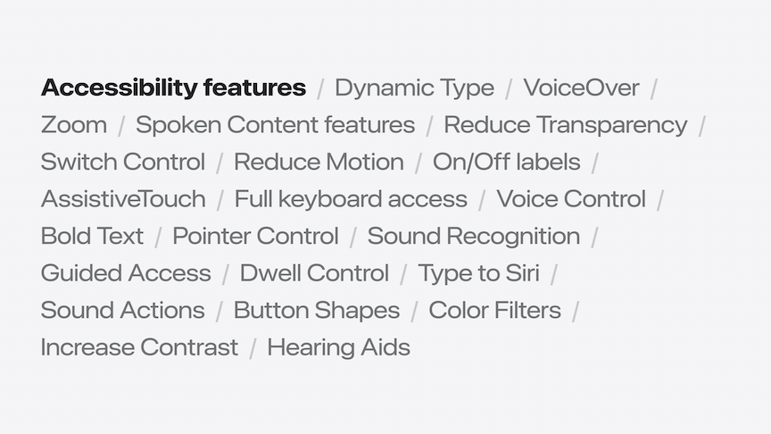
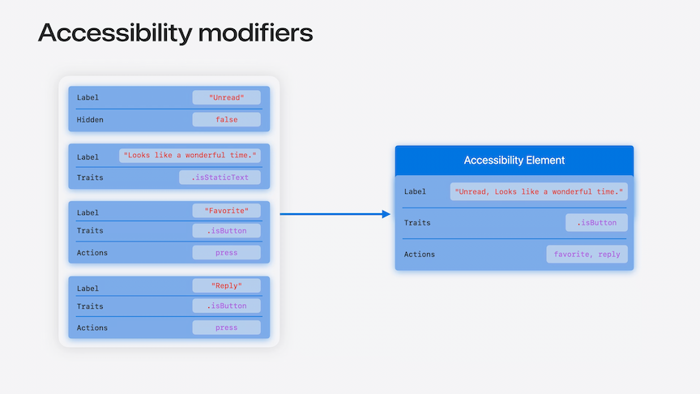

# [**Catch up on accessibility in SwiftUI**](https://developer.apple.com/videos/play/wwdc2024-10073)

---

### **Fundamentals**



* Accessibility elements
    * Represent one or more views
    * Provides attributes to describe the contents of a view, or
    * Actions which expose how a view can be interacted with from taps to complex gestures
    * Accessibility technologies like VoiceOver only interact with apps through their elements
        * Only content from views that are included in an element will be accessible to them
* View Styles
    * Attributes and actions are applied to a view even when changing a view's visual style
    * Supported across many different controls like button and toggle, groupings like label and labeled content, and indicators like progress view and gauge
    * Use the styling system over creating a custom view whenever possible
        * Otherwise, you’ll have to re-apply the same accessibility properties you could be getting automatically
* Accessibility modifiers
    * Let you customize how a view is represented by an accessibility element
    * Attributes like a label or a trait can be added to a view
    * Actions for interactivity like custom gestures can be exposed
    * Allow you to combine views together into a single element to improve navigation
* Using VoiceOver is a great way to understand how an app's accessibility experience can be improved
* Accessibility opportunities
    * Reduce swipes to access content
    * Clarify relationships between content and controls
    * Describe decorative views
    * The `.accessibilityLabel` modifier creates an element for the `UnreadIndicatorView` since it doesn't have one by default
        * When the view becomes hidden, it is also automatically hidden from accessibility technologies
    * Applying the `.accessibilityElement(children: .combine)` modifier, the attributes and actions of multiple elements are combined together
        * The label of the elements will be the combined labels of all the views
        * Important traits will be merged
        * Any actions from controls like buttons will be turned into custom actions

```swift
var body: some View {
    HStack {
        UnreadIndicatorView(isUnread: message.isUnread)
        MessageContentsView(message: message)
        Spacer()
        Button(action: favorite) { favoriteLabel }
        Button(action: reply) { replyLabel }
    }
    .accessibilityElement(children: .combine)
}

struct UnreadIndicatorView: View {
    var isUnread: Bool

    var body: some View {
        Circle()
            .foregroundStyle(.blue)
            .accessibilityLabel("Unread")
            .opacity(isUnread ? 1 : 0)
    }
}
```



### **View accessibility**

* Symbol accessibility
    * Many symbols provide labels
    * Labels fallback to symbol name
    * Always verify labels
    * iOS 18 adds `isEnabled` parameter to accessibility modifiers

```swift
var body: some View {
    Button(action: favorite) {
        Image(systemName: isSuperFavorite ? "sparkles" : "star.fill")
    }
    .accessibilityLabel("Super Favorite", isEnabled: isSuperFavorite)
}
```

* Hover
    * When hovering over an item makes a view appear, this takes longer to navigate with VoiceOver
    * This interaction can be simplified by appending the accessibility attributes/actions of the hoverable view to the main view
    * You can pass the same view for the `.accessibilityActions` modifier that you send to the overlay
        * Now VoiceOver can perform each attachment without having to present the overlay

```swift
var body: some View {
    TripView(trip: trip)
        .onHover { showAttachments = $0 }
        .overlay {
            MessageAttachments(attachments: trip.attachments)
                .opacity(showAttachments ? 1 : 0)
        }
        .accessibilityActions {
             MessageAttachments(attachments: trip.attachments)
        }
}
```

* Accessibility label
    * Append labels to simplify interactions
        * For when important information requires multiple interactions that don't include it visually
    * Provide labels for decorative views

```swift
var body: some View {
  TripView(trip: trip)
      .accessibilityLabel { label in
         if let rating = trip.rating {
            Text(rating)
         }
         label
      }
}
```

### **Enhanced interaction**

* Drag and drop
    * VoiceOver and Voice Control support accessible experiences using the `.onDrag` and `.onDrop` modifiers
    * Can support multiple drop points on a single view using the `.accessibilityDropPoint(...)` modifier
    * Tips:
        * Try drag and drop experiences with accessibility technologies
        * Consider providing alternative custom actions
        * Expose unique drag and drop points for interations

```swift
var body: some View {
    CommentAlertView(contact: contact)
        .onDrop(of: [.audio], delegate: delegate)
        .accessibilityDropPoint(.leading, description: "Set Sound 1")
        .accessibilityDropPoint(.center, description: "Set Sound 2")
        .accessibilityDropPoint(.trailing, description: "Set Sound 3")
}
```

* Widgets
    * Views don't update in real time, so accessibility modifiers won't work
    * Can still use custom actions to perform the most important functions of the widget
        * `.accessibilityAction` now accepts an `intent` parameter which will perform the intent and update the widget

```swift
var body: some View {
    ForEach(beaches) { beach in
        BeachView(beach)
            .accessibilityAction(
                named: "Favorite",
                intent: ToggleRatingIntent(beach: beach, rating: .fullStar))
            .accessibilityAction(
                .magicTap,
                intent: ComposeIntent(type: .photo))
    }
}
```
