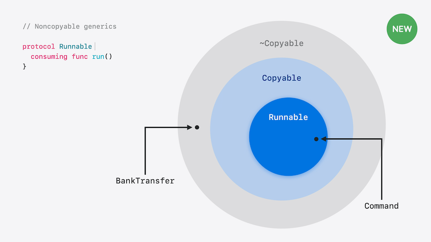
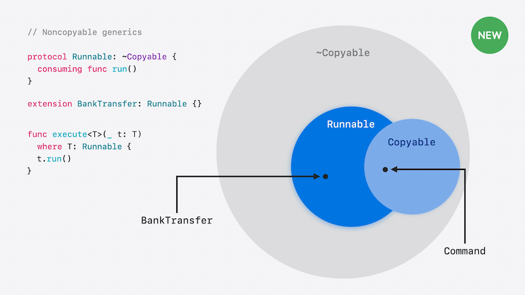
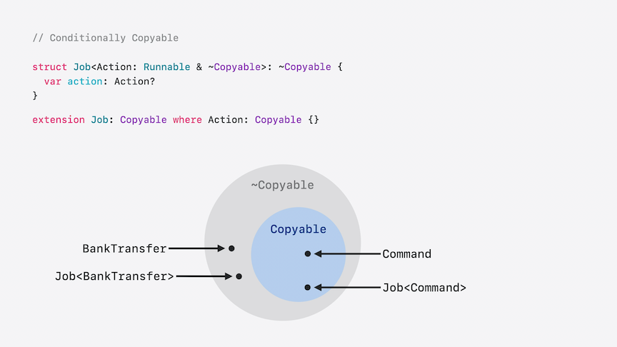

# [**Consume noncopyable types in Swift**](https://developer.apple.com/videos/play/wwdc2024-10170)

---

### **Copying**

* The code below creates two instances of `Player`
    * Changing one player's icon won't affect the other
    * Because `Player` is a struct, `var player2 = player1` will copy its contents
    * If we change `Player` to a class, the contents of `player1` are a reference to the content
        * So with the same code, creating `player2` would reference the same content as `player1`
            * This is called a shallow copy, which is very quick
        * Changing the icon for one player changes them for both

```swift
struct Player {
  var icon: String
}

func test() {
  let player1 = Player(icon: "🐸")
  var player2 = player1
  player2.icon = "🚚"
  assert(player1.icon == "🐸")
}
```

* You can make a reference type behave like a value type by defining an initializer to do a deep copy

```swift
class PlayerClass {
  var data: Icon
  init(_ icon: String) { self.data = Icon(icon) }

  init(from other: PlayerClass) {
    self.data = Icon(from: other.data)
  } 
}

func test() {
  let player1 = PlayerClass("🐸")
  var player2 = player1
  player2 = PlayerClass(from: player2)
  player2.data.icon = "🚚"
  assert(player1.data.icon == "🐸")
}

struct Icon {
  var icon: String
  init(_ icon: String) { self.icon = icon }
  init(from other: Icon) { self.icon = other.icon }
}
```

* `Copyable` is a new protocol that describes the ability for a type to be automatically copied
    * Like `Sendable`, it does not have member requirements
    * Everything is inferred to be `Copyable` in Swift by default
        * Types
        * Generic parameters
        * Protocols and associated types automatically require the concrete type to conform
        * Boxed protocol types are automatically composed with `Copyable`


* The code below is an example where copying makes code error prone
    * We don't want transfers to happen twice
    * Because the `schedule` code doesn't return if the delay is less than one second, we have a bug that we might not catch
    * Attempting to track the transfer with the `complete` variable is helpful, but doesn't actually solve the problem
    * If `startPayment` doesn't check for throws, then the transfer isn't cancelled if the sleeping task is cancelled
        * `deinit` tries to handle this, but is essentially useless because `startPayment` retains a copy of the transfer
    * Because of these issues, we have not control over how many copies of the transfer are in the program

```swift
class BankTransfer {
  var complete = false

  func run() {
    assert(!complete)
    // .. do it ..
    complete = true
  }

  deinit {
    if !complete { cancel() }
  }

  func cancel() { /* ... */ }
}

func schedule(_ transfer: BankTransfer,
              _ delay: Duration) async throws {

  if delay < .seconds(1) {
    transfer.run()
  }

  try await Task.sleep(for: delay)
  transfer.run()
}

func startPayment() async {
  let payment = BankTransfer()
  log.append(payment)
  try? await schedule(payment, .seconds(3))
}

let log = Log()

final class Log: Sendable {
  func append(_ transfer: BankTransfer) { /* ... */ }
}
```

### **Noncopyable types**

* Creating a noncopyable type is done by declaring `~Copyable`
    * Copying is not supported, so Swift will consume it instead
        * Can make the consuming explicit by writing `consume` before using it, but is not necessary in the code below
    * Consuming a variable takes its value, leaving that variable uninitialized
    * Reading the disk after it is consumed is an error (`load(system)` would throw the error)

```swift
struct FloppyDisk: ~Copyable {}

func copyFloppy() {
  let system = FloppyDisk()
  let backup = consume system
  load(system)
  // ...
}

func load(_ disk: borrowing FloppyDisk) {}
```

* In the code below, when `format(result)` is called, you must declare what ownership the function has over the value since we can't copy
    * `consuming` is the first option for declaring the ownership
        * It means the function will take the argument away from its caller
        * It will belong to the function, so it can even mutate it
        * Will not work in this instance, since `format` doesn't return anything
    * `borrowing` gives read access to the argument
        * Under the hood, this is how nearly all parameters work for Copyable types
        * Cannot consume or mutate an explicitly borrowed argument, you can only copy it
    * `inout` gives us temporary write-access to a variable in the caller, so you can consume the parameter
        * Have to reinitialize the inout parameter before the function ends

```swift
struct FloppyDisk: ~Copyable { }

func newDisk() -> FloppyDisk {
  let result = FloppyDisk()
  format(result)
  return result
}

// func format(_ disk: FloppyDisk) { <-- will not work, because FloppyDisk is noncopyable
// func format(_ disk: consuming FloppyDisk) { <-- will not work, because it does not return a value
// func format(_ disk: borrowing FloppyDisk) { <-- will not work, because we can't mutate a borrowed value
func format(_ disk: inout FloppyDisk) {
  var tempDisk = disk
  // ...
  disk = tempDisk
}
```

* We can fix our issues with our `BankTransfer` by marking it as a noncopyable struct
    * We mark the `run` methods as consuming
        * We don't need assertions anymore, because Swift guarantees that `run` can't be called twice on the same transfer
    * We can add a `deinit` that triggers an action if the struct is destroyed instead of being run
        * `discard self` will destroy the struct without calling `deinit`
    * In our `schedule` function, we have to add `consuming` ownership, since it will be the last use of the transfer
        * Without the `return` in teh first `if` block, the Swift compiler would throw an error saying that `'transfer' is consumed more than once`
    * Because `schedule` is the last owner of the transfer, we don't have to worry about what happens if `Task.sleep` throws, and that will cancel the transfer

```swift
struct BankTransfer: ~Copyable {
  consuming func run() {
    // .. do it ..
    discard self
  }

  deinit {
    cancel()
  }

  consuming func cancel() {
    // .. do the cancellation ..
    discard self
  }
}

func schedule(_ transfer: consuming BankTransfer,
              _ delay: Duration) async throws {

  if delay < .seconds(1) {
    transfer.run()
    return
  }

  try await Task.sleep(for: delay)
  transfer.run()
}
```

### **Generics**

* By default, generics conform to Copyable
    * In the code below, `Command` and `Runnable` both conform to `Copyable` by default
    * Anywhere in the code that `<T>` is, by default it is technically `<T: Copyable>`
    * Because everything that isn't marked as `~Copyable` is `Copyable` by default, all those things can be passed to the commented out `execute` function below
        * The generic parameter `T` does not exclude types that have an additional conformance
    * The second `execute` function is constrained to types that conform to Runnable by adding a `where` clause
    * `~Copyable` types do not conform to Runnable below, because `Runnable` is "inside" of `Copyable`

```swift
struct Command { }

protocol Runnable {
  consuming func run()
}

extension Command: Runnable {
  func run() { /* ... */ }
}

// func execute<T>(_ t: T) {}

func execute<T>(_ t: T) where T: Runnable {
  t.run()
}
```

* To remove a `Copyable` constraint, we can remove that constraint by adding `~Copyable`
    * `~Copyable` essentially means that we cannot guarantee it is `Copyable` with its conformance, but `Copyable` still lives "inside" of `~Copyable`

| Copyable Runnable | ~Copyable Runnable |
| ----------------- | ------------------ |
|  |  |

* We can get `BankTransfer` to conform to `Runnable` now that `Runnable` is marked as `~Copyable`
    * We can remove the default `Copyable` constraint on `execute` by using `~Copyable` in the `where` clause
        * This says that `T` *might not* be `Copyable`
        * A regular constraint narrows the types permitted by being more specific, whereas a `~` constraint broadens by being less specific

```swift
protocol Runnable: ~Copyable {
  consuming func run()
}

struct Command: Runnable {
  func run() { /* ... */ }
}

struct BankTransfer: ~Copyable, Runnable {
  consuming func run() { /* ... */ }
}

func execute<T>(_ t: consuming T)
  where T: Runnable,
        T: ~Copyable {
  t.run()
}
```

* Now we want to wrap all of the `Runnable` types inside a new struct called `Job`
    * If we only constrain the `Action` of `Job` to be `~Copyable`, we get an error
        * Job defaults to `Copyable`, so it can only contain `Copyable` data
    * There are two ways to store noncopyable values inside another
        * It either must be inside a class, since copying a class only copies a reference; or
        * You have to suppress `Copyable` on the containing type itself (which is what we do below)
    * Can still put the type `Command` in for the action, because `Command` does not prevent `Copyable` types from appearing
        * `Job` is promising that it does not need to copy an `Action`, so that noncopyable types work too
    * Can allow copying if the `Action` is `Copyable` by declaring `Job` as conditionally `Copyable`
        * Done with an extension, such as `extension Job: Copyable where Action: Copyable {}` below
        * Says that a `Job` is `Copyable` when its action is `Copyable`
    

```swift
// struct Job<Action: Runnable & ~Copyable> {
struct Job<Action: Runnable & ~Copyable>: ~Copyable {
  var action: Action?
}

func runEndlessly(_ job: consuming Job<Command>) {
  while true {
    let current = copy job
    current.action?.run()
  }
}

extension Job: Copyable where Action: Copyable {}
```



### **Extensions**

* If we want to provide a getter method of the action, we can add it using an ordinary extension of `Job`
    * This will give us a copy of the `Action` because it's only constrained to `Job`, where the `Action` is `Copyable`
    * Would error when trying to use it on `BankTransfer`, though, because it is noncopyable

```swift
extension Job {
  func getAction() -> Action? {
    return action
  }
}

func inspectCmd(_ cmdJob: Job<Command>) {
  let _ = cmdJob.getAction()
  let _ = cmdJob.getAction()
}

func inspectXfer(_ transferJob: borrowing Job<BankTransfer>) {
  let _ = transferJob.getAction() // expected error: method 'getAction' requires that 'BankTransfer' conform to 'Copyable'
}
```

* Any generic parameters in scope of the extended type are in scope of the extended type are constrained to `Copyable`
    * That includes `Self` in a protocol
* If we have a protocol to describe `Cancellable` types below that we want `Job` to conform to, that works fine with only `Copyable` types
    * The conformance of `Cancellable` conforms to being conditional on `Action` being `Copyable`
        * When `Action` is `Copyable`, so is the `Job`, meaning it conforms to `Cancellable`

```swift
protocol Cancellable {
  mutating func cancel()
}

extension Job: Cancellable { //<-- implicitly is `extension Job: Cancellable where Action: Copyable {`
  mutating func cancel() {
    action = nil
  }
}
```

* To make the `Cancellable` protocol conform whether the type is `Copyable` or not, we simply remove the constraint with `~Copyable`
    * `Job` now conforms to `Cancellable` without assuming `Action` is `Copyable`

```swift
protocol Cancellable: ~Copyable {
  mutating func cancel()
}

extension Job: Cancellable where Action: ~Copyable {
  mutating func cancel() {
    action = nil
  }
}
```

* To learn more about copy-on-write and best-practices for designing generic types, watch the [**Modern Swift API Design**](https://developer.apple.com/videos/play/wwdc2019/415/) session from WWDC 2019
