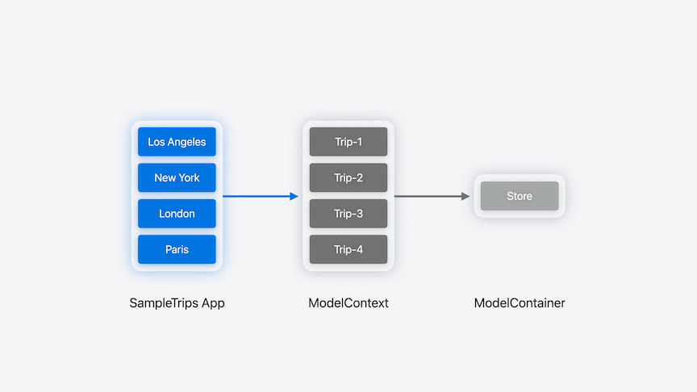
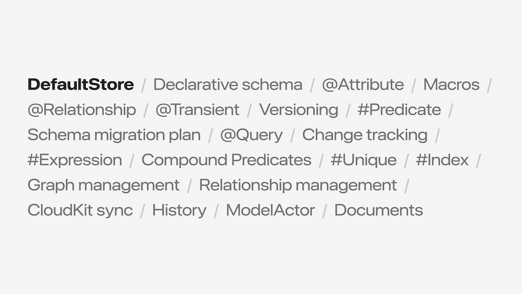

# [**Create a custom data store with SwiftData**](https://developer.apple.com/videos/play/wwdc2024/10138/)

---

### **Overview**

* The store is responsible for fetching/saving all of the data required to support the persistent models
* Apps typically composed of:
    * User Interface, provided by SwiftUI
    * Model, in a `ModelContext`
    * `ModelContainer`, which `ModelContext` uses to read and write data
        * This is the focus of this video



* If changes are made to the data shown in the image above, the following flow happens
    * Los Angeles trip is cancelled, and Tokyo trip is added
    * Tokyo model is inserted into the model context, and is identified by a temporary `PersistentIdentifier`
    * When the `ModelContext` saves, it tells the store to delete the LA trip and insert the new Tokyo trip
    * The store will then assign a permanent persistent identifier to the Tokyo model, and map it to its former identifier
        * This process is know as `remapping`
    * The store then responds to the `ModelContext` with the updated persistent identifier
    * The `ModelContext` finishes updated its state, and then the UI can update the view rendering
* Role of the store
    * Perform fetch and save
    * Persist model values
    * Communicate through `DataStoreSnapshot` instances
* Snapshots capture model values
    * When the `ModelContext` needs to communicate with a store, it creates a snapshot to hold the current state of the model
    * The snapshot is a sendable, codable container of the values in the model at that pont in time
        * Like persistent models, each is identified by a Personal Identifier
    * The store then consumes these snapshots and applies the values to its storage
    * When data is read by the `ModelContext` from the store, the reverse happens

### **Meet DataStore**

* Three key parts to a store:
    * Configuration conforms to `DataStoreConfiguration` (SwiftData default store provides `ModelConfiguration`)
    * Communication conforms to `DataStoreSnapshot` (SwiftData default store provides `DefaultSnapshot`)
    * Implementation conforms to `DataStore` (SwiftData default store provides `DefaultStore`)



* `DataStore` protocol
    * Defines all the functionality SwiftDAta needs for the store to be usable by `ModelContext`, including save, fetch, and caching
    * Additional protocols define optional data store features
        * e.g. History and Batch Deletes
    * The model context communicates with stores using requests and responses from the `DataStore` protocol
        * When fetching data from a store, the `ModelContext` sends the store a `DataStoreFetchRequest` containing the `FetchDescriptor` that describes the data the store should retrieve
        * Once the store retrieves the model values, it creates a snapshot for each model, and returns them in a `DataStoreFetchResult`
        * Then, the `ModelContext` creates a `PersistentModel` for each of the snapshot
        * In reverse:
            * The `ModelContext` creates a `DataStoreSaveChangeRequest` containing snapshots
            * The store applies the snapshots to its storage, and creates a `DataStoreSaveChangeResult` to sent back to the `ModelContext`, providing a map of the remapped identifiers so the context cna update the persistent identifiers
            * The context process the save result from the store and updates its state

### **Example store**

* Will implement a store that uses a JSON file to persist the models in the application
    * This store is an "archival store", meaning the entire file is loaded for reading or writing
    * Uses the JSON coders provided by Foundation and storing data as an array of snapshots in the file
* First step is to declare the configuration ans store types that conform toe the `DataStoreConfiguration` and `DataStore` protocols
    * Done in `final class JSONStoreConfiguration: DataStoreConfiguration` and `final class JSONStore: DataStore` below
    * These types reference each other using associated types
    * On the configuration, set the `Store` type as `JSONStore`
    * On the store, set the `Configuration` as `JSONStoreConfiguration`
        * Additionally, the JSONStore declares the type of snapshot it uses to communicate with the `ModelContext`, here it's set to `DefaultSnapshot` because we don't need to customize encoding or decoding of model data
* Next, `JSONStore` needs to implement the two required methods: `fetch` and `save`
    * For `fetch`, when the `ModelContext` sends a `DataStoreFetchRequest`, we need to load the data that's in the store, and instantiate a `DataStoreFetchResult`
        * Because the `DefaultSnapshot` is codable, we cna use the `JSONDecoder` to load the data for the store from the file URL provided by the configuration
        * Then we instantiate and return a `DataStoreFetchResult` with the snapshots from the file
        * This implementation doesn't process the predicate r sort comparators that are on a FetchDescriptor
            * Because translation of a Predicate or sort comparator can be an involved process, we can instead use the `ModelContext` to perform this work for us
                * Throw `.preferInMemoryFilter` or `.preferInMemorySort` errors when the request contains a predicate or sort descriptor
                * Works great for small data sets
    * For `save`, want to consider insertions, updates, and deletions
        * Start by reading in the current contents of the file, which is handled in a separate `read` method
            * Organize all of the snapshots into a dictionary keyed by their persistent identifier, which will be the working copy for the new JSON file that will be written to disk at the end
        * Process the snapshots of the `inserted` models within the save request
            * Involves assigning and remapping identifiers for each inserted snapshot
                * For each identifier that's not associated with any store, create a new permanent persistent identifier
                * Map it to the temporary one in the `remappedIdentifiers` dictionary to return to the `ModelContext` later in the save result
                * Add the inserted snapshots to the ones initially loaded from the file
        * Process `updated` models within the save request
            * Replace the snapshots from the file with the ones in the save request
        * Next, remove the deleted snapshots from those loaded from the file
        * Now have a complete and updated set of data in the `snapshotsByIdentifier` dictionary to write back to the file
            * Use `JSONEncoder` to write to disk to a single JSON file
        * Finally, return a `DataStoreSaveChangesREsult` with the results of the save
            * Includes the remapped `persistentIdentifiers` for the context to update

```swift
// Implement a JSON store

@available(swift 5.9) @available(macOS 15, iOS 18, tvOS 18, watchOS 11, visionOS 2, *)
final class JSONStoreConfiguration: DataStoreConfiguration {
    typealias StoreType = JSONStore
  
    var name: String
    var schema: Schema?
    var fileURL: URL

    init(name: String, schema: Schema? = nil, fileURL: URL) {
        self.name = name
        self.schema = schema
        self.fileURL = fileURL
    }

    static func == (lhs: JSONStoreConfiguration, rhs: JSONStoreConfiguration) -> Bool {
        return lhs.name == rhs.name
    }

    func hash(into hasher: inout Hasher) {
        hasher.combine(name)
    }
}

@available(swift 5.9) @available(macOS 15, iOS 18, tvOS 18, watchOS 11, visionOS 2, *)
final class JSONStore: DataStore {
    typealias Configuration = JSONStoreConfiguration
    typealias Snapshot = DefaultSnapshot

    var configuration: JSONStoreConfiguration
    var name: String
    var schema: Schema
    var identifier: String

    init(_ configuration: JSONStoreConfiguration, migrationPlan: (any SchemaMigrationPlan.Type)?) throws {
        self.configuration = configuration
        self.name = configuration.name
        self.schema = configuration.schema!
        self.identifier = configuration.fileURL.lastPathComponent
    }

    func save(_ request: DataStoreSaveChangesRequest<DefaultSnapshot>) throws -> DataStoreSaveChangesResult<DefaultSnapshot> {
        var remappedIdentifiers = [PersistentIdentifier: PersistentIdentifier]()
        var serializedTrips = try self.read()

        for snapshot in request.inserted {
            let permanentIdentifier = try PersistentIdentifier.identifier(for: identifier, 
                                                                          entityName: snapshot.persistentIdentifier.entityName,
                                                                          primaryKey: UUID())
            let permanentSnapshot = snapshot.copy(persistentIdentifier: permanentIdentifier)
            serializedTrips[permanentIdentifier] = permanentSnapshot
            remappedIdentifiers[snapshot.persistentIdentifier] = permanentIdentifier
        }

        for snapshot in request.updated {
            serializedTrips[snapshot.persistentIdentifier] = snapshot
        }

        for snapshot in request.deleted {
            serializedTrips[snapshot.persistentIdentifier] = nil
        }
      
        try self.write(serializedTrips)
        return DataStoreSaveChangesResult<DefaultSnapshot>(for: self.identifier,
                                                           remappedPersistentIdentifiers: remappedIdentifiers,
                                                           deletedIdentifiers: request.deleted.map({ $0.persistentIdentifier }))
    }

    func fetch<T>(_ request: DataStoreFetchRequest<T>) throws -> DataStoreFetchResult<T, DefaultSnapshot> where T : PersistentModel {
        if request.descriptor.predicate != nil {
            throw DataStoreError.preferInMemoryFilter
        } else if request.descriptor.sortBy.count > 0 {
            throw DataStoreError.preferInMemorySort
        }

        let objs = try self.read()
        let snapshots = objs.values.map({ $0 })
        return DataStoreFetchResult(descriptor: request.descriptor, fetchedSnapshots: snapshots, relatedSnapshots: objs)
    }

    func read() throws -> [PersistentIdentifier: DefaultSnapshot] {
        if FileManager.default.fileExists(atPath: configuration.fileURL.path(percentEncoded: false)) {
            let decoder = JSONDecoder()
            decoder.dateDecodingStrategy = .iso8601

            let trips = try decoder.decode([DefaultSnapshot].self, from: try Data(contentsOf: configuration.fileURL))
            var result = [PersistentIdentifier: DefaultSnapshot]()
            trips.forEach { s in
                result[s.persistentIdentifier] = s
            }
            return result
        } else {
            return [:]
        }
    }

    func write(_ trips: [PersistentIdentifier: DefaultSnapshot]) throws {
        let encoder = JSONEncoder()
        encoder.dateEncodingStrategy = .iso8601
        encoder.outputFormatting = [.prettyPrinted, .sortedKeys]
        let jsonData = try encoder.encode(trips.values.map({ $0 }))
        try jsonData.write(to: configuration.fileURL)
    }
}
```

* The custom data store from above can be adopted as shown below

```swift
// Use your own custom data store
import SwiftUI
import SwiftData

struct TripsApp: App {
    var container: ModelContainer = {
        do {
            // let configuration = ModelConfiguration (schema: Schema ([Trip.self]), url: fileURL) <-- original, non-custom, configuration
            let configuration = JSONStoreConfiguration (schema: Schema ([Trip.self]), url: fileURL)
            return try ModelContainer (for: Trip.self, configurations: configuration)
        }
        catch { .. }
    } ()

    var body: some Scene {
        WindowGroup {
            ContentView()
        }
        .modelContainer (container)
    }
}
```

* With DataStore, SwiftData can read and write data to any storage format or persistence backend
    * Document
    * Database
    * Cloud storage
* `ModelContext` helps reduce the complexity of simple store implementations by providing filtering and sorting for you
* Check out the [**What's new in SwiftData**](./What's%20new%20in%20SwiftData.md) session to learn about other new SwiftData features
* Watch the [**Track model changes with SwiftData history**](./Track%20model%20changes%20in%20SwiftData%20history.md) session to learn about how to examine the history of a store
