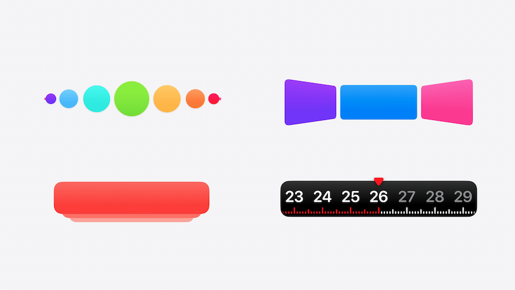
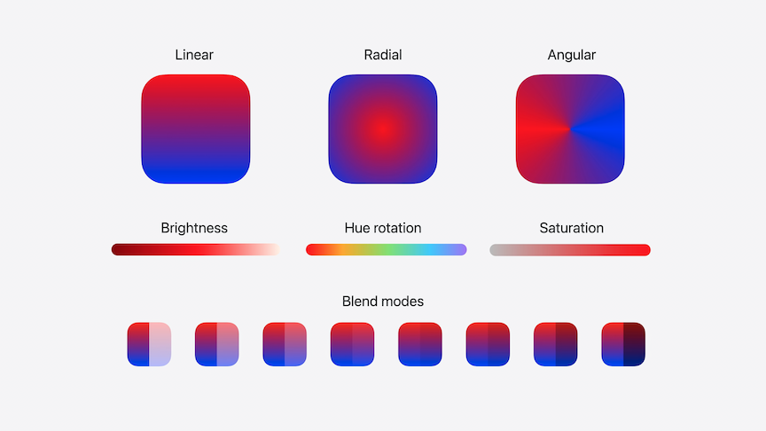
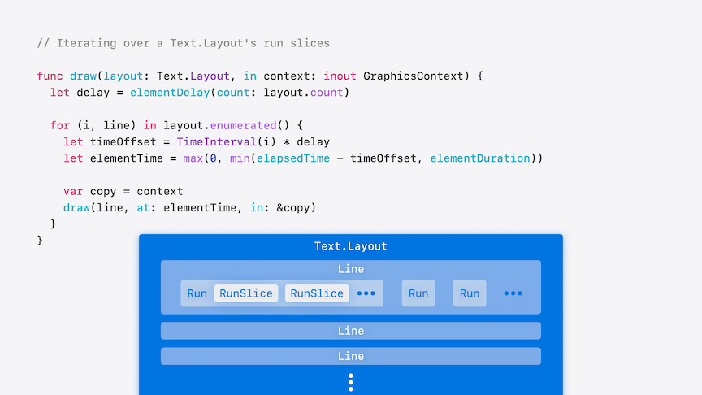

# [**Create custom visual effects with SwiftUI**](https://developer.apple.com/videos/play/wwdc2024-10151)

---

### **Scroll effects**

* A basic paging behavior can be added to get a pagination effect with `.scrollTargetBehavior(.paging)`

```swift
ScrollView(.horizontal) {
    LazyHStack(spacing: 22) {
        ForEach(animals, id: \.self) { animal in
            AnimalPhoto(image: animal)
        }
    }.scrollTargetLayout()
    
}
.contentMargins(.horizontal, 44)
.scrollTargetBehavior(.paging)
```

* `.scrollTransition` can be used to effect how individual items appear as they are scrolled
    * Scroll transition exposes the content as well as the scroll phase
    * In the example below, each photo is rotated as it scrolls in and out of the view
    * `phase.value` can be used to determine how far off screen an item is
    * If the view is fully on screen, then `phase.isIdentity` will be true

```swift
AnimalPhoto(image: animal)
    .scrollTransition(
        axis: .horizontal
    ) { content, phase in
        content
            .rotationEffect(.degrees(phase.value * 2.5))
            .offset(y: phase.isIdentity ? 0 : 8)
    }
```

* Parallax effect
    * Using `.scrollTransition` to update the xOffset of the image, but not the shape that's clipping it

```swift
ScrollView(.horizontal) {
    LazyHStack(spacing: 16) {
        ForEach(animals, id: \.self) { animal in
            VStack(spacing: 8) {
                ZStack {
                    AnimalPhoto(image: animal)
                        .scrollTransition(
                            axis: .horizontal
                        ) { content, phase in
                            return content
                                .offset(x: phase.value * -250)
                        }
                }
                .containerRelativeFrame(.horizontal)
                .clipShape(RoundedRectangle(cornerRadius: 32))
        }
        
    }.scrollTargetLayout()
}
.contentMargins(.horizontal, 32)
.scrollTargetBehavior(.paging)
```

* Can use `.visualEffect { content, proxy in ... }` to change the hue of a view to create a gradient effect
    * `.visualEffect` allows for changing visual properties based on the view position and size in a performant way
    * Can offset, scale, fade, blur elements as they get to scrollview edges

```swift
RoundedRectangle(cornerRadius: 24)
    .fill(.purple)
    .visualEffect({ content, proxy in
        content
            .hueRotation(Angle(degrees: proxy.frame(in: .global).origin.y / 10))
            
    })
```



### **Color treatments**



* New support for Mesh Gradients
    * Made from a grid of points, with a color associated to each point
    * SwiftUI interpolates between colors on the grid to create a color fill
    * Points can be moved, and colors blend together smoothly

```swift
MeshGradient(
    width: 3,
    height: 3,
    points: [
        [0.0, 0.0], [0.5, 0.0], [1.0, 0.0],
        [0.0, 0.5], [0.9, 0.3], [1.0, 0.5],
        [0.0, 1.0], [0.5, 1.0], [1.0, 1.0]
    ],
    colors: [
        .black,.black,.black,
        .blue, .blue, .blue,
        .green, .green, .green
    ]
)
```

### **View transitions**

* Conform to the `Transition` protocol
    * `body` function takes a content and phase parameter

```swift
struct Twirl: Transition {
    func body(content: Content, phase: TransitionPhase) -> some View {
        content
            .scaleEffect(phase.isIdentity ? 1 : 0.5)
            .opacity(phase.isIdentity ? 1 : 0)
            .blur(radius: phase.isIdentity ? 0 : 10)
            .rotationEffect(
                .degrees(
                    phase == .willAppear ? 360 :
                        phase == .didDisappear ? -360 : .zero
                )
            )
            .brightness(phase == .willAppear ? 1 : 0)
    }
}
```

### **Text transitions**

* New `TextRenderer` API allows customization to how Text is drawn for an entire view tree
    * Enables animation as well as other Text drawing capabilities
    * Has `Text.Layout` and `GraphicsContext` arguments
        * `Text.Layout` allows access to the individual components of the Text - lines, runs, and glyphs
        * `GraphicsContext` is the same type as used by the `Canvas` view
    * [**Add rich graphics to your SwiftUI app**](https://developer.apple.com/documentation/swiftui/add_rich_graphics_to_your_swiftui_app) session from WWDC 2021
    * The code below gives the default transition

```swift
// The Minimum Viable TextRenderer

struct AppearanceEffectRenderer: TextRenderer {
    func draw(layout: Text.Layout, in context: inout GraphicsContext) {
        for line in layout {
            context.draw(line)
        }
    }
}
```

* The code below is a more complex text transition
    * Most of the work is done in `func draw(_ slice: Text.Layout.Line, at time: TimeInterval, in context: inout GraphicsContext) { ... }`
        * The text will fade, blur, and change yOffset as it's drawn in
        * The new `.draw(line, options: .disablesSubpixelQuantization)` on context will avoid jitter as the spring animation settles
    * To use the Renderer to animate in Text, implement a custom `Transition` (`TextTransition` below)
        * Uses `content.transaction { ... }` body view modifier to override the animation when appropriate
    * `func draw(layout: Text.Layout, in context: inout GraphicsContext)` can be used to animate glyphs individually
        * Iterate over the `Text.Layout`'s run slices (the smallest units of layout)
        * `Text.Layout` is a Collection of lines. A line is a Collection of Runs, and a Run is a collection of RunSlices
        * `layout.flattenedRunSlices.enumerated()` allows iteration over each RunSlice
        * Need to refactor `func draw(_ slice: Text.Layout.Line, at time: TimeInterval, in context: inout GraphicsContext) { ... }` to `func draw(_ slice: Text.Layout.RunSlice, at time: TimeInterval, in context: inout GraphicsContext) { ... }`

```swift
import SwiftUI

#Preview("Text Transition") {
    @Previewable @State var isVisible: Bool = true

    VStack {
        GroupBox {
            Toggle("Visible", isOn: $isVisible.animation())
        }

        Spacer()

        if isVisible {
            let visualEffects = Text("Visual Effects")
                .customAttribute(EmphasisAttribute())
                .foregroundStyle(.pink)
                .bold()

            Text("Build \(visualEffects) with SwiftUI 🧑‍💻")
                .font(.system(.title, design: .rounded, weight: .semibold))
                .frame(width: 250)
                .transition(TextTransition())
        }

        Spacer()
    }
    .multilineTextAlignment(.center)
    .padding()
}

struct EmphasisAttribute: TextAttribute {}

/// A text renderer that animates its content.
struct AppearanceEffectRenderer: TextRenderer, Animatable {
    /// The amount of time that passes from the start of the animation.
    /// Animatable.
    var elapsedTime: TimeInterval

    /// The amount of time the app spends animating an individual element.
    var elementDuration: TimeInterval

    /// The amount of time the entire animation takes.
    var totalDuration: TimeInterval

    var spring: Spring {
        .snappy(duration: elementDuration - 0.05, extraBounce: 0.4)
    }

    var animatableData: Double {
        get { elapsedTime }
        set { elapsedTime = newValue }
    }

    init(elapsedTime: TimeInterval, elementDuration: Double = 0.4, totalDuration: TimeInterval) {
        self.elapsedTime = min(elapsedTime, totalDuration)
        self.elementDuration = min(elementDuration, totalDuration)
        self.totalDuration = totalDuration
    }

    func draw(layout: Text.Layout, in context: inout GraphicsContext) {
        for run in layout.flattenedRuns {
            if run[EmphasisAttribute.self] != nil {
                let delay = elementDelay(count: run.count)

                for (index, slice) in run.enumerated() {
                    // The time that the current element starts animating,
                    // relative to the start of the animation.
                    let timeOffset = TimeInterval(index) * delay

                    // The amount of time that passes for the current element.
                    let elementTime = max(0, min(elapsedTime - timeOffset, elementDuration))

                    // Make a copy of the context so that individual slices
                    // don't affect each other.
                    var copy = context
                    draw(slice, at: elementTime, in: &copy)
                }
            } else {
                // Make a copy of the context so that individual slices
                // don't affect each other.
                var copy = context
                // Runs that don't have a tag of `EmphasisAttribute` quickly
                // fade in.
                copy.opacity = UnitCurve.easeIn.value(at: elapsedTime / 0.2)
                copy.draw(run)
            }
        }
    }

    func draw(_ slice: Text.Layout.RunSlice, at time: TimeInterval, in context: inout GraphicsContext) {
        // Calculate a progress value in unit space for blur and
        // opacity, which derive from `UnitCurve`.
        let progress = time / elementDuration

        let opacity = UnitCurve.easeIn.value(at: 1.4 * progress)

        let blurRadius =
            slice.typographicBounds.rect.height / 16 *
            UnitCurve.easeIn.value(at: 1 - progress)

        // The y-translation derives from a spring, which requires a
        // time in seconds.
        let translationY = spring.value(
            fromValue: -slice.typographicBounds.descent,
            toValue: 0,
            initialVelocity: 0,
            time: time)

        context.translateBy(x: 0, y: translationY)
        context.addFilter(.blur(radius: blurRadius))
        context.opacity = opacity
        context.draw(slice, options: .disablesSubpixelQuantization)
    }

    /// Calculates how much time passes between the start of two consecutive
    /// element animations.
    ///
    /// For example, if there's a total duration of 1 s and an element
    /// duration of 0.5 s, the delay for two elements is 0.5 s.
    /// The first element starts at 0 s, and the second element starts at 0.5 s
    /// and finishes at 1 s.
    ///
    /// However, to animate three elements in the same duration,
    /// the delay is 0.25 s, with the elements starting at 0.0 s, 0.25 s,
    /// and 0.5 s, respectively.
    func elementDelay(count: Int) -> TimeInterval {
        let count = TimeInterval(count)
        let remainingTime = totalDuration - count * elementDuration

        return max(remainingTime / (count + 1), (totalDuration - elementDuration) / count)
    }
}

extension Text.Layout {
    /// A helper function for easier access to all runs in a layout.
    var flattenedRuns: some RandomAccessCollection<Text.Layout.Run> {
        self.flatMap { line in
            line
        }
    }

    /// A helper function for easier access to all run slices in a layout.
    var flattenedRunSlices: some RandomAccessCollection<Text.Layout.RunSlice> {
        flattenedRuns.flatMap(\.self)
    }
}

struct TextTransition: Transition {
    static var properties: TransitionProperties {
        TransitionProperties(hasMotion: true)
    }

    func body(content: Content, phase: TransitionPhase) -> some View {
        let duration = 0.9
        let elapsedTime = phase.isIdentity ? duration : 0
        let renderer = AppearanceEffectRenderer(
            elapsedTime: elapsedTime,
            totalDuration: duration
        )

        content.transaction { transaction in
            // Force the animation of `elapsedTime` to pace linearly and
            // drive per-glyph springs based on its value.
            if !transaction.disablesAnimations {
                transaction.animation = .linear(duration: duration)
            }
        } body: { view in
            view.textRenderer(renderer)
        }
    }
}
```



* If we only want to animate part of a test, we use the new `TextAttribute` protocol in iOS 18
    * Use to pass data from `Text` to a `TextRenderer`
    * use the `.customAttribute()` modifier to do this

### **Metal shaders**

* Shaders are small programs that calculate various rendering effects directly on the GPU
    * Instantiate by calling a function with its name on ShaderLibrary
    * Can pass additional parameters to the function, like colors, numbers, or an image
    * When using the `.layerEffect(...)` modifier, SwiftUI will call the shader function on every pixel of the view
    * Shaders are written in Metal

```swift
// Using a SwiftUI Shader
let colorMultiply = ShaderLibrary.ColorMultiply(
    .color(.pink)
)

myView.layerEffect(colorMultiply, maxSampleOffset: .zero)

// Metal Implementation

[[ stichable ]]
half4 ColorMultiply(float2 position, SwiftUI::Layer layer, half4 color) {
    return layer.sample(position) * color;
}
```

* In SwiftUI, shaders can be used for:
    * Custom fills
    * Color effects
    * Distortion effects
    * Layer effects (essentially a superset of the other effects)
* Ripple effect below
    * Adds a ripple effect to a view based on where it is tapped

```swift
// Insert #include <metal_stdlib>
#include <SwiftUI/SwiftUI.h>
using namespace metal;

[[ stitchable ]]
half4 Ripple(
    float2 position,
    SwiftUI::Layer layer,
    float2 origin,
    float time,
    float amplitude,
    float frequency,
    float decay,
    float speed
) {
    // The distance of the current pixel position from `origin`.
    float distance = length(position - origin);
    // The amount of time it takes for the ripple to arrive at the current pixel position.
    float delay = distance / speed;

    // Adjust for delay, clamp to 0.
    time -= delay;
    time = max(0.0, time);

    // The ripple is a sine wave that Metal scales by an exponential decay
    // function.
    float rippleAmount = amplitude * sin(frequency * time) * exp(-decay * time);

    // A vector of length `amplitude` that points away from position.
    float2 n = normalize(position - origin);

    // Scale `n` by the ripple amount at the current pixel position and add it
    // to the current pixel position.
    //
    // This new position moves toward or away from `origin` based on the
    // sign and magnitude of `rippleAmount`.
    float2 newPosition = position + rippleAmount * n;

    // Sample the layer at the new position.
    half4 color = layer.sample(newPosition);

    // Lighten or darken the color based on the ripple amount and its alpha
    // component.
    color.rgb += 0.3 * (rippleAmount / amplitude) * color.a;

    return color;
}
```

* Applying the above shader to a view
    * Shaders have no concept of time, so the animation needs to be driven from SwiftUI
    * `RippleEffect` ViewModifier written to drive the effect
        * `keyframeAnimator` runs on external changes, like gestures
        * At every step of the animation, `RippleModifier` is passed the current time and origin point at which the view was touched

```swift
import SwiftUI

#Preview("Ripple") {
    @Previewable @State var counter: Int = 0
    @Previewable @State var origin: CGPoint = .zero

    VStack {
        Spacer()

        Image("palm_tree")
            .resizable()
            .aspectRatio(contentMode: .fit)
            .clipShape(RoundedRectangle(cornerRadius: 24))
            .onPressingChanged { point in
                if let point {
                    origin = point
                    counter += 1
                }
            }
            .modifier(RippleEffect(at: origin, trigger: counter))
            .shadow(radius: 3, y: 2)

        Spacer()
    }
    .padding()
}

#Preview("Ripple Editor") {
    @Previewable @State var origin: CGPoint = .zero
    @Previewable @State var time: TimeInterval = 0.3
    @Previewable @State var amplitude: TimeInterval = 12
    @Previewable @State var frequency: TimeInterval = 15
    @Previewable @State var decay: TimeInterval = 8

    VStack {
        GroupBox {
            Grid {
                GridRow {
                    VStack(spacing: 4) {
                        Text("Time")
                        Slider(value: $time, in: 0 ... 2)
                    }
                    VStack(spacing: 4) {
                        Text("Amplitude")
                        Slider(value: $amplitude, in: 0 ... 100)
                    }
                }
                GridRow {
                    VStack(spacing: 4) {
                        Text("Frequency")
                        Slider(value: $frequency, in: 0 ... 30)
                    }
                    VStack(spacing: 4) {
                        Text("Decay")
                        Slider(value: $decay, in: 0 ... 20)
                    }
                }
            }
            .font(.subheadline)
        }

        Spacer()

        Image("palm_tree")
            .resizable()
            .aspectRatio(contentMode: .fit)
            .clipShape(RoundedRectangle(cornerRadius: 24))
            .modifier(RippleModifier(origin: origin, elapsedTime: time, duration: 2, amplitude: amplitude, frequency: frequency, decay: decay))
            .shadow(radius: 3, y: 2)
            .onTapGesture {
                origin = $0
            }

        Spacer()
    }
    .padding(.horizontal)
}

struct PushEffect<T: Equatable>: ViewModifier {
    var trigger: T

    func body(content: Content) -> some View {
        content.keyframeAnimator(
            initialValue: 1.0,
            trigger: trigger
        ) { view, value in
            view.visualEffect { view, _ in
                view.scaleEffect(value)
            }
        } keyframes: { _ in
            SpringKeyframe(0.95, duration: 0.2, spring: .snappy)
            SpringKeyframe(1.0, duration: 0.2, spring: .bouncy)
        }
    }
}

/// A modifer that performs a ripple effect to its content whenever its
/// trigger value changes.
struct RippleEffect<T: Equatable>: ViewModifier {
    var origin: CGPoint

    var trigger: T

    init(at origin: CGPoint, trigger: T) {
        self.origin = origin
        self.trigger = trigger
    }

    func body(content: Content) -> some View {
        let origin = origin
        let duration = duration

        content.keyframeAnimator(
            initialValue: 0,
            trigger: trigger
        ) { view, elapsedTime in
            view.modifier(RippleModifier(
                origin: origin,
                elapsedTime: elapsedTime,
                duration: duration
            ))
        } keyframes: { _ in
            MoveKeyframe(0)
            LinearKeyframe(duration, duration: duration)
        }
    }

    var duration: TimeInterval { 3 }
}

/// A modifier that applies a ripple effect to its content.
struct RippleModifier: ViewModifier {
    var origin: CGPoint

    var elapsedTime: TimeInterval

    var duration: TimeInterval

    var amplitude: Double = 12
    var frequency: Double = 15
    var decay: Double = 8
    var speed: Double = 1200

    func body(content: Content) -> some View {
        let shader = ShaderLibrary.Ripple(
            .float2(origin),
            .float(elapsedTime),

            // Parameters
            .float(amplitude),
            .float(frequency),
            .float(decay),
            .float(speed)
        )

        let maxSampleOffset = maxSampleOffset
        let elapsedTime = elapsedTime
        let duration = duration

        content.visualEffect { view, _ in
            view.layerEffect(
                shader,
                maxSampleOffset: maxSampleOffset,
                isEnabled: 0 < elapsedTime && elapsedTime < duration
            )
        }
    }

    var maxSampleOffset: CGSize {
        CGSize(width: amplitude, height: amplitude)
    }
}

extension View {
    func onPressingChanged(_ action: @escaping (CGPoint?) -> Void) -> some View {
        modifier(SpatialPressingGestureModifier(action: action))
    }
}

struct SpatialPressingGestureModifier: ViewModifier {
    var onPressingChanged: (CGPoint?) -> Void

    @State var currentLocation: CGPoint?

    init(action: @escaping (CGPoint?) -> Void) {
        self.onPressingChanged = action
    }

    func body(content: Content) -> some View {
        let gesture = SpatialPressingGesture(location: $currentLocation)

        content
            .gesture(gesture)
            .onChange(of: currentLocation, initial: false) { _, location in
                onPressingChanged(location)
            }
    }
}

struct SpatialPressingGesture: UIGestureRecognizerRepresentable {
    final class Coordinator: NSObject, UIGestureRecognizerDelegate {
        @objc
        func gestureRecognizer(
            _ gestureRecognizer: UIGestureRecognizer,
            shouldRecognizeSimultaneouslyWith other: UIGestureRecognizer
        ) -> Bool {
            true
        }
    }

    @Binding var location: CGPoint?

    func makeCoordinator(converter: CoordinateSpaceConverter) -> Coordinator {
        Coordinator()
    }

    func makeUIGestureRecognizer(context: Context) -> UILongPressGestureRecognizer {
        let recognizer = UILongPressGestureRecognizer()
        recognizer.minimumPressDuration = 0
        recognizer.delegate = context.coordinator

        return recognizer
    }

    func handleUIGestureRecognizerAction(
        _ recognizer: UIGestureRecognizerType, context: Context) {
            switch recognizer.state {
                case .began:
                    location = context.converter.localLocation
                case .ended, .cancelled, .failed:
                    location = nil
                default:
                    break
            }
        }
    }
```
