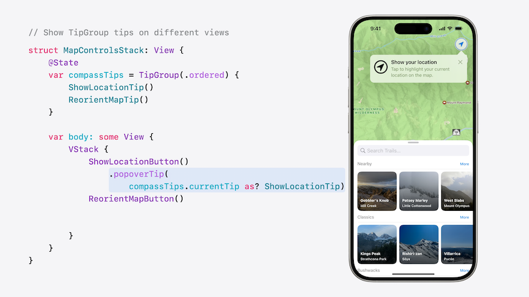

# [**Customize feature discovery with TipKit**](https://developer.apple.com/videos/play/wwdc2024-10070)

---

### **Build tip groups**

* Creating two tips that are associated with the same UI element, like the code below

```swift
// Create new tips
struct ShowLocationTip: Tip {
    var title: Text {
        Text("Show your location")
    }

    var message: Text? {
        Text("Tap the compass to highlight your current location on the map.")
    }

    var image: Image? {
        Image(systemName: "location.circle")
    }
}

struct RotateMapTip: Tip {
    var title: Text {
        Text("Reorient the map")
    }

    var message: Text? {
        Text("Tap and hold on the compass to rotate the map back to 0° North.")
    }

    var image: Image? {
        Image(systemName: "hand.tap")
    }
}

// Show popover tips
struct MapCompassControl: View {
    let showLocationTip = ShowLocationTip()
    let rotateMapTip = RotateMapTip()

    var body: some View {
        CompassDial()
            .popoverTip(showLocationTip)
            .popoverTip(rotateMapTip)
            .onTapGesture {
                showCurrentLocation()
            }
            .onLongPressGesture(minimumDuration: 0.1) {
                reorientMapHeading()
            }
    }
}
```

* The problem is that we have no control over the order the tips are presented in
    * We want to make sure that `showLocationTip` is shown before `rotateMapTip`
* `TipGroup` resolves this issue
    * Initialize the group with a `.ordered` priority to ensure they are shown in the order that we want


```swift
// Create a TipGroup

struct MapCompassControl: View {
    @State
    var compassTips: TipGroup(.ordered) {
        ShowLocationTip()
        RotateMapTip()
    }

    var body: some View {
        CompassDial()
            .popoverTip(compassTips.currentTip)
            .onTapGesture {
                showCurrentLocation()
            }
            .onLongPressGesture(minimumDuration: 0.1) {
                reorientMapHeading()
            }
    }
}
```

* Can also show `TipGroup` tips from separate views

```swift
// Show TipGroup tips on different views

struct MapControlsStack: View {
    @State
    var compassTips: TipGroup(.ordered) {
        ShowLocationTip()
        RotateMapTip()
    }

    var body: some View {
        VStack {
            ShowLocationButton()
                .popoverTip(compassTips.currentTip as? ShowLocationTip)
            RotateMapButton()
                .popoverTip(compassTips.currentTip as? RotateMapTip)
        }
    }
}
```

| Show Location Tip | Rotate Map Tip |
| ----------------- | -------------- |
|  |  |

* Still need to invalidate tips when the feature it describes is used
    * Invalidating a tip ensures that it will not be shown to someone that has already discovered its feature
    * For TipGroups that use an ordered priority, a tip can only be displayed when all of the preceding tips have been invalidated

```swift
// Invalidate tips

struct MapCompassControl: View {
    @State
    var compassTips: TipGroup(.ordered) {
        showLocationTip
        rotateMapTip
    }

    var body: some View {
        CompassDial()
            .popoverTip(compassTips.currentTip)
            .onTapGesture {
                showLocationTip.invalidate(reason: .actionPerformed)
                showCurrentLocation()
            }
            .onLongPressGesture(minimumDuration: 0.1) {
                rotateMapTip.invalidate(reason: .actionPerformed)
                reorientMapHeading()
            }
    }
}
```

* TipGroups can be created with either an `.ordered` or `.firstAvailable` priority
    * `.firstAvailable` displays the first tip that has its display rules satisfied
    * Ideal for when you have a view with multiple unrelated tips, but only want one to appear at a time

```swift
// Shows a tip when previous
// tip(s) are invalidated
let compassTips = TipGroup(.ordered) {
    ShowLocationTip()
    ReorientMapTip()
}

// Shows the first tip eligible for display
let trailTips = TipGroup(.firstAvailable) {
    FindTrailheadTip()
    ExposureRatingTip()
    SlopeProfileTip ()
}
```

* TipGroups also work with `.displayFrequency`
    * Allows users to discover features on their own before showing them tips about it.

```swift
#if DEBUG
// No display frequency when debugging
try Tips.configure([.displayFrequency(immediate)])
#else
// Only one new tip displayed per week
try Tips.configure([.displayFrequency(.weekly)])
#endif
```

### **Create reusable tips**

* A tip's status and rules are unique based on its identifier
    * Overriding a tip's default identifier allows you to reuse the same tip struct based on its content

```swift
// Show a TipView

struct ButlerForkTip: Tip {
    var title: Text {
        Text("Butler Fork is now available")
    }

    var message: Text? {
        Text("To see key trail info, tap Big Cottonwood Canyon on the map.")
    }
  
    var actions: [Action] {
        Action(title: "Go there now")
    }
  
    var rules: [Rule] {
        #Rule(Region.bigCottonwoodCanyon.didVisitEvent) {
            $0.donations.count > 3
        }
    }
}

struct TrailList: View {
    var trails: [Trail]

    var body: some View {
        ScrollView {
            let butlerForkTip = ButlerForkTip()
            TipView(butlerForkTip) { _ in
                highlightButlerForkTrail()
            }

            ListSection(title: "Trails", trails: trails)
        }
    }
}
```

* The code above works great if we only need to add one tip to an area, but falls down with repetitive code if we need several
    * Reusable tips resolve this
    * Use the custom id that the Tip relates to to give a custom id to the Tip itself
        * Allows the reusable tip to be used for a new item even if it's been invalidated for an old one

```swift
// Show a TipView

struct NewTrailTip: Tip {
    let newTrail: Trail

    var title: Text {
        Text("\(newTrail.name) is now available")
    }

    var message: Text? {
        Text("To see key trail info, tap \(newTrail.region) on the map.")
    }

    var actions: [Action] {
        Action(title: "Go there now")
    }
  
    var id: String {
        "NewTrailTip-\(newTrail.id)"
    }
  
    var rules: [Rule] {
        #Rule(newTrail.region.didVisitEvent) {
            $0.donations.count > 3
        }
    }
}

struct TrailList: View {
    var trails: [Trail]
    let newTrail: Trail

    var body: some View {
        ScrollView {
            let newTrailTip = NewTrailTip(newTrail: newTrail)
            TipView(newTrailTip) { _ in
                highlightTrail(newTrailTip)
            }

            ListSection(title: "Trails", trails: trails)
        }
    }
}
```

* Tip identifiers
    * Tips are unique based on their identifier
    * Custom identifiers should be based on concrete values
    * Type names are used as the default identifier

### **Match app styling**

* The custom presentation can be customized to better match an app's UI
    * Can customize the appearance and behavior using `TipViewStyle`
    * Can create a view inside the `.makeBody` function
        * The `Configuration` can be used to apply modifiers to the TipView
    * Apply the `.tipViewStyle(...)` modifier to apply a style to a Tip

```swift
// Apply a TipViewStyle

struct NewTrailTipViewStyle: TipViewStyle {
    func makeBody(configuration: Configuration) -> some View {
        let tip = configuration.tip as! NewTrailTip

        TrailImage(imageName: tip.newTrail.heroImage)
            .frame(maxHeight: 150)
            .overlay {
                VStack {
                    configuration.title.font(.title)
                    configuration.message.font(.subheadline)
                }
            }
    }
}

extension NewTrailTipViewStyle {
    struct TrailImage: View {
        let imageName: String

        var body: some View {
            Image(imageName)
                .resizable()
                .aspectRatio(contentMode: .fill)
        }
    }
}

struct TrailList: View {
    var trails: [Trail]
    let newTrail: Trail

    var body: some View {
        ScrollView {
            let newTrailTip = NewTrailTip(newTrail: newTrail)
            TipView(newTrailTip) { _ in
                highlightTrail(newTrailTip)
            }
            .tipViewStyle(NewTrailTipViewStyle())

            ListSection(title: "Trails", trails: trails)
        }
    }
}
```

* The entire tip view can be made tappable (instead of adding a button)
    * Get `config.actions.first` to get the Tip's action
    * Call that action's handler with `onTapGesture { ... }`

```swift
// Apply a TipViewStyle

struct NewTrailTipViewStyle: TipViewStyle {
    func makeBody(configuration: Configuration) -> some View {
        let tip = configuration.tip as! NewTrailTip
        let highlightTrailAction = configuration.actions.first!

        TrailImage(imageName: tip.newTrail.heroImage)
            .frame(maxHeight: 150)
            .onTapGesture { highlightTrailAction.handler() }
            .overlay {
                VStack {
                    configuration.title.font(.title)
                    HStack {
                        configuration.message.font(.subheadline)
                        Spacer()
                        Image(systemName: "chevron.forward.circle")
                            .foregroundStyle(.white)
                    }
                }
            }
    }
}

extension NewTrailTipViewStyle {
    struct TrailImage: View {
        let imageName: String

        var body: some View {
            Image(imageName)
                .resizable()
                .aspectRatio(contentMode: .fill)
        }
    }
}

struct TrailList: View {
    var trails: [Trail]
    let newTrail: Trail

    var body: some View {
        ScrollView {
            let newTrailTip = NewTrailTip(newTrail: newTrail)
            TipView(newTrailTip) { _ in
                highlightTrail(newTrailTip)
            }
            .tipViewStyle(NewTrailTipViewStyle())

            ListSection(title: "Trails", trails: trails)
        }
    }
}
```

* TipViewStyle
    * Use configuration values for title, message, and actions instead of the Tip's instance values when possible
        * Allows the closures and modifiers applied to the TipView to still be evaluated when using a custom style
    * Works with existing tip view modifiers like `.tipCornerRadius` and `.tipBackground`
    * `TipUIView` and `TipNSView` can be customized using `viewStyle`

### **Sync tips with CloudKit**

* Syncs display state for tips to ensure a user doesn't need to dismiss the same tips on multiple devices
    * Add iCloud under `Signing & Capabilities`, turn on `CloudKit` and create a new container
    * Turn on `Remote notifications` in `Background Modes`
    * Update Tips configuration call to include the `.cloudKitContainer` option and pass in the new container's ID

```swift
// Add CloudKit sync for tips

@main
struct TipKitTrails: App {
    var body: some Scene {
        WindowGroup {
            ContentView()
                .task {
                    await configureTips()
                }
        }
    }

    func configureTips() async {
        do {
            try Tips.configure([
                .cloudKitContainer(.named("iCloud.com.apple.TipKitTrails.tips")),
                .displayFrequency(.weekly)
            ])
        }
        catch {
            print("Unable to configure tips: \(error)")
        }
    }
}
```

* CloudKit syncing
    * Shared tip display status and invalidation state
    * Syncs event donations and parameter values
    * Display count and display duration are added between devices
* CloudKit behaviors
    * `UIDevice` to create platform specific tips to allow the same tip to be re-displayed on multiple devices
    * For testing, `Tips.resetDatastore()` clears local and remote TipKit records
* [**Make features discoverable with TipKit**](../2023/Make%20features%20discoverable%20with%20TipKit.md) session from WWDC 2023
